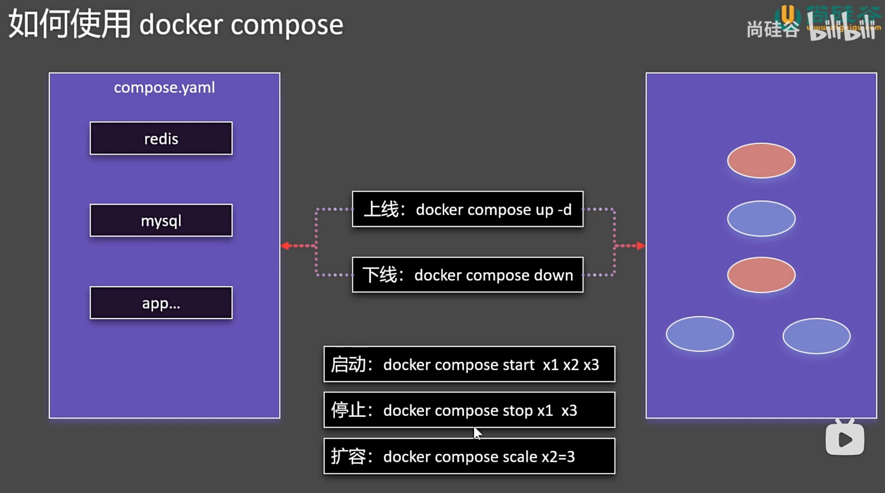
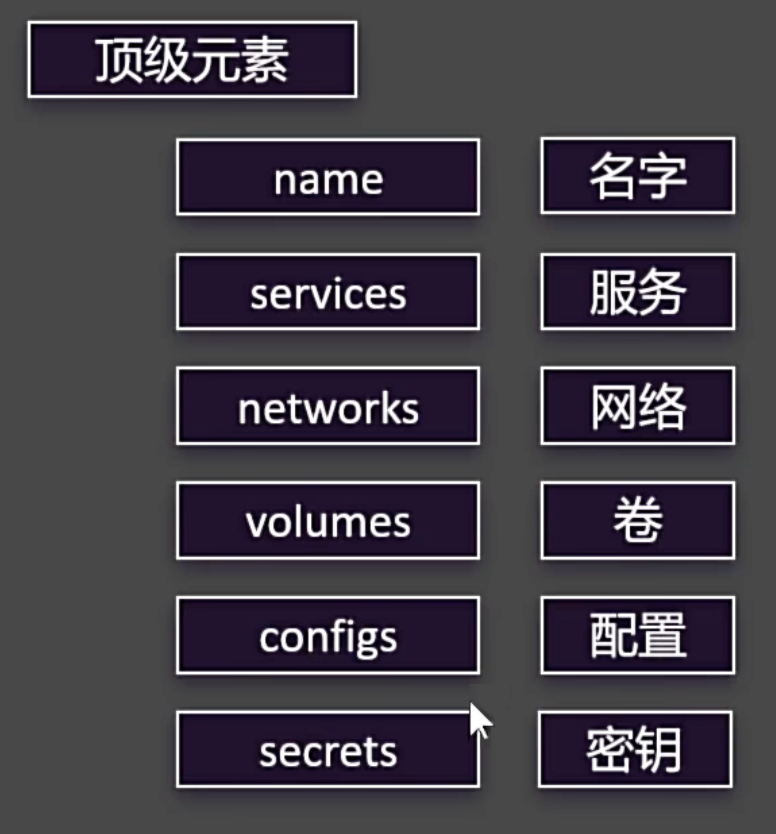

# compose

管理容器技巧



## 博客系统

### 命令式安装


```shell
#创建网络
docker network create blog

#启动mysql
[root@docker_12-17 ~]# docker run -d -p 3306:3306 \
> -e MYSQL_ROOT_PASSWORD=123456 \
> -e MYSQL_DATABASE=wordpress \
> -v mysql-data:/var/lib/mysql \
> -v /app/myconf:/etc/mysql/conf.d \
> --restart always --name mysql \
> --network blog \
> mysql:8.0
ff719c998cbcfb99ab073253ecbe057f1ed6e9bf2f4a8d33c993b1144b188788
[root@docker_12-17 ~]# docker ps
CONTAINER ID   IMAGE       COMMAND                   CREATED         STATUS         PORTS                                                  NAMES
ff719c998cbc   mysql:8.0   "docker-entrypoint.s…"   9 seconds ago   Up 8 seconds   0.0.0.0:3306->3306/tcp, :::3306->3306/tcp, 33060/tcp   mysql

#启动wordpress
[root@docker_12-17 ~]# docker run -d -p 8080:80 \
> -e WORDPRESS_DB_HOST=mysql \
> -e WORDPRESS_DB_USER=root \
> -e WORDPRESS_DB_PASSWORD=123456 \
> -e WORDPRESS_DB_NAME=wordpress \
> -v wordpress:/var/www/html \
> --restart always --name wordpress-app \
> --network blog \
> wordpress:latest
070998c1eab4e30bd587f88f1d76a087a74088894c0b8b589e1037edb7e0b100
[root@docker_12-17 ~]# docker psCONTAINER ID   IMAGE              COMMAND                   CREATED          STATUS          PORTS                                                  NAMES
070998c1eab4   wordpress:latest   "docker-entrypoint.s…"   2 seconds ago    Up 1 second     0.0.0.0:8080->80/tcp, :::8080->80/tcp                  wordpress-app
ff719c998cbc   mysql:8.0          "docker-entrypoint.s…"   17 seconds ago   Up 16 seconds   0.0.0.0:3306->3306/tcp, :::3306->3306/tcp, 33060/tcp   mysql
```

然后访问主机的 8080 端口就可以正常访问了

## yaml 安装

[说明文档](https://docs.docker.com/reference/compose-file/)

- 顶级元素

{width="50%"}

::: code-group

```yaml
name: myblog
services:
  mysql:
    container_name: mysql
    image: mysql:8.0
    ports:
      - '3306:3306'
    environment:
      - MYSQL_ROOT_PASSWORD=123456
      - MYSQL_DATABASE=wordpress
    volumes:
      - mysql-data:/var/lib/mysql
      - /app/myconf:/etc/mysql/conf.d
    restart: always
    networks:
      - blog

  wordpress:
    image: wordpress
    ports:
      - '8080:80'
    environment:
      WORDPRESS_DB_HOST: mysql
      WORDPRESS_DB_USER: root
      WORDPRESS_DB_PASSWORD: 123456
      WORDPRESS_DB_NAME: wordpress
    volumes:
      - wordpress:/var/www/html
    restart: always
    networks:
      - blog
    depends_on:
      - mysql
volumes:
  mysql-data:
  wordpress:

networks:
  blog:
```

```shell [启动]
[root@docker_12-17 ~]# docker compose -f compose.yaml up -d
[+] Running 4/4
 ✔ Volume "myblog_wordpress"     Created                                                                                                                                                                                        0.0s
 ✔ Volume "myblog_mysql-data"    Created                                                                                                                                                                                        0.0s
 ✔ Container mysql               Started                                                                                                                                                                                        0.2s
 ✔ Container myblog-wordpress-1  Started
                                                                                                                                                                                        0.6s
[root@docker_12-17 ~]# docker volume ls
DRIVER    VOLUME NAME
local     myblog_mysql-data
local     myblog_wordpress

[root@docker_12-17 ~]# docker ps
CONTAINER ID   IMAGE       COMMAND                   CREATED          STATUS          PORTS                                                  NAMES
326b8639b5ca   wordpress   "docker-entrypoint.s…"   17 seconds ago   Up 15 seconds   0.0.0.0:8080->80/tcp, :::8080->80/tcp                  myblog-wordpress-1
275f5a5f1f71   mysql:8.0   "docker-entrypoint.s…"   17 seconds ago   Up 16 seconds   0.0.0.0:3306->3306/tcp, :::3306->3306/tcp, 33060/tcp   mysql
[root@docker_12-17 ~]#
```

```shell [删除]
# 删除的同时删除数据卷
[root@docker_12-17 ~]# docker compose -f compose.yaml down --rmi all -v
[+] Running 7/7
 ✔ Container myblog-wordpress-1  Removed                                                                                                                                                                                        1.3s
 ✔ Container mysql               Removed                                                                                                                                                                                        0.9s
 ✔ Volume myblog_wordpress       Removed                                                                                                                                                                                        0.1s
 ✔ Image mysql:8.0               Removed                                                                                                                                                                                        0.3s
 ✔ Image wordpress:latest        Removed                                                                                                                                                                                        0.4s
 ✔ Volume myblog_mysql-data      Removed                                                                                                                                                                                        0.0s
 ✔ Network myblog_blog           Removed
                                                                                                                                                                                      0.2s
[root@docker_12-17 ~]# docker ps
CONTAINER ID   IMAGE     COMMAND   CREATED   STATUS    PORTS     NAMES

[root@docker_12-17 ~]# docker volume ls
DRIVER    VOLUME NAME
```

:::
