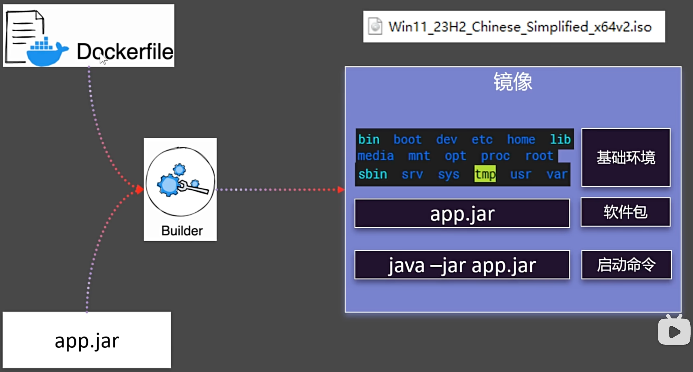
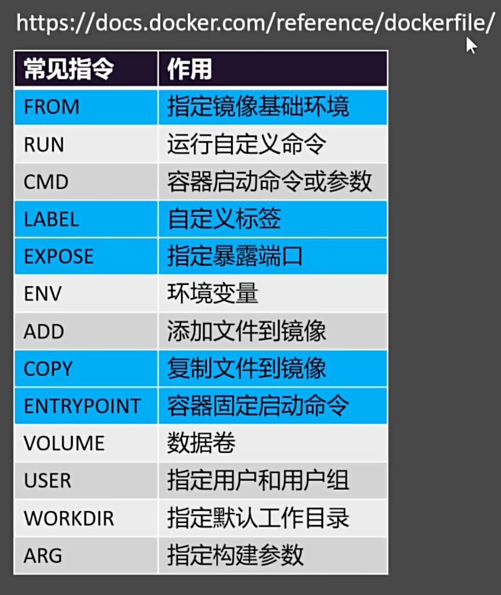
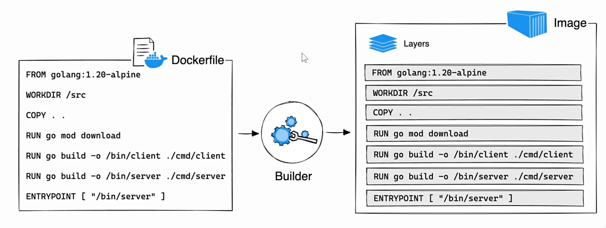
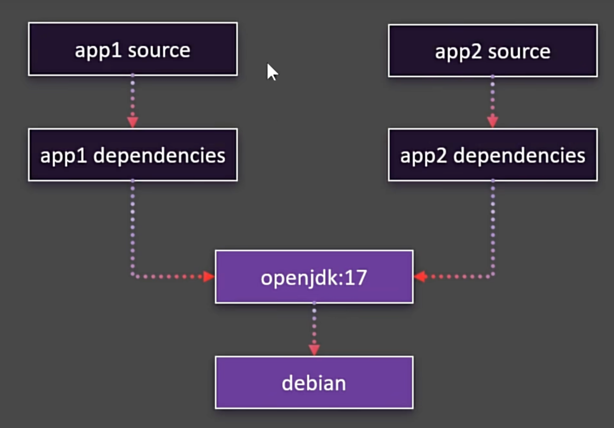
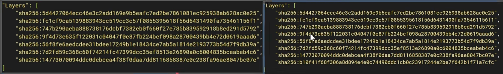
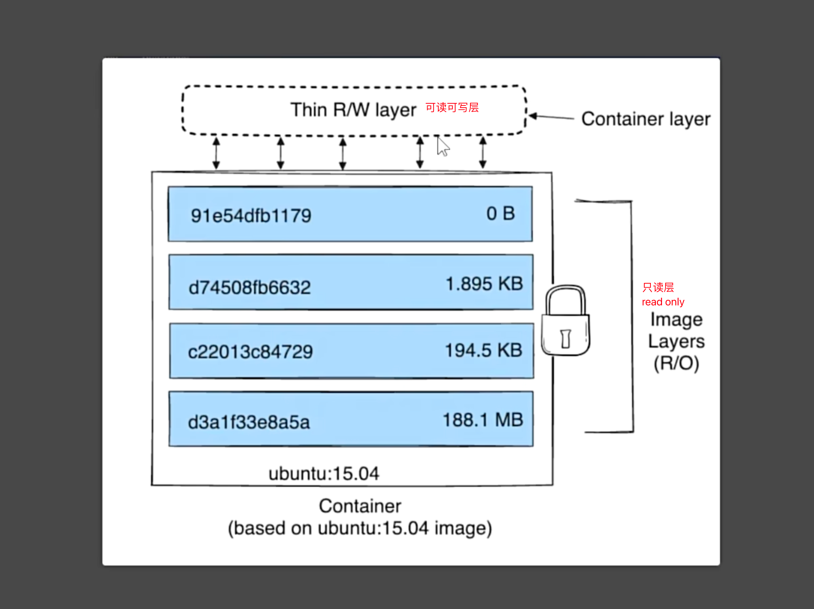
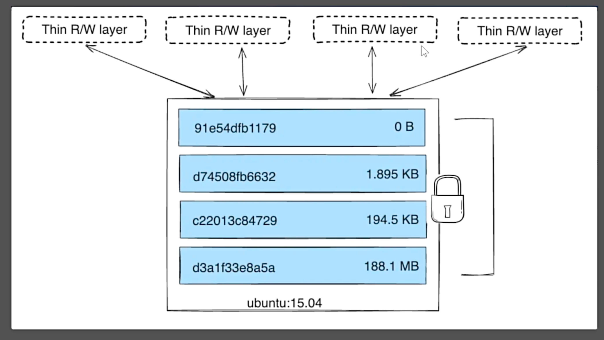

# file

构建自定义镜像

这里的场景是，开发好的 jar 包，需要构建成镜像，然后部署到服务器上

## dockerfile

构建绘图如下所示

{width=50%}

常用指令：

{width=50%}

[dockerfile 编写文档](https://docs.docker.com/reference/dockerfile/){width=50%}

```shell
# 编写 Dockerfile 文件
[root@docker_12-17 ~]# vim dockerfile
[root@docker_12-17 ~]# cat dockerfile
FROM openjdk:17

LABEL author=chenwei

COPY app.jar /app.jar

EXPOSE 8080

ENTRYPOINT ["java","-jar","/app.jar"]


# 构建镜像 这里的 . 代表的是当前目录
[root@docker_12-17 ~]# docker build -f dockerfile -t myjavaapp:v1.0 .

# docker build：这是 Docker 的一个命令，用于根据 Dockerfile 构建一个新的镜像
# -f dockerfile：指定 Dockerfile 文件
# -t myjavaapp:v1.0：指定镜像名称和版本
# .：指定构建上下文，这里是指当前目录

[+] Building 244.9s (7/7) FINISHED                                                                                                                                                                                                                                                            docker:default
 => [internal] load build definition from dockerfile                                                                                                                                                                                                                                                    0.0s
 => => transferring dockerfile: 211B                                                                                                                                                                                                                                                                    0.0s
 => [internal] load metadata for docker.io/library/openjdk:17                                                                                                                                                                                                                                         103.4s
 => [internal] load .dockerignore                                                                                                                                                                                                                                                                       0.0s
 => => transferring context: 2B                                                                                                                                                                                                                                                                         0.0s
 => [internal] load build context                                                                                                                                                                                                                                                                       0.1s
 => => transferring context: 19.77MB                                                                                                                                                                                                                                                                    0.1s
 => [1/2] FROM docker.io/library/openjdk:17@sha256:528707081fdb9562eb819128a9f85ae7fe000e2fbaeaf9f87662e7b3f38cb7d8                                                                                                                                                                                   141.4s
 => => resolve docker.io/library/openjdk:17@sha256:528707081fdb9562eb819128a9f85ae7fe000e2fbaeaf9f87662e7b3f38cb7d8                                                                                                                                                                                     0.0s
 => => sha256:fe66142579ff5bb0bb5cf989222e2bc77a97dcbd0283887dec04d5b9dfd48cfa 14.29MB / 14.29MB                                                                                                                                                                                                       26.1s
 => => sha256:1250d2aa493e8744c8f6cb528c8a882c14b6d7ff0af6862bbbfe676f60ea979e 186.36MB / 186.36MB                                                                                                                                                                                                    139.2s
 => => sha256:528707081fdb9562eb819128a9f85ae7fe000e2fbaeaf9f87662e7b3f38cb7d8 1.04kB / 1.04kB                                                                                                                                                                                                          0.0s
 => => sha256:2fd12c42c12bf707f7ac0f5fa630ff9c59868dfc4428daaf34df9d82a0c5b101 954B / 954B                                                                                                                                                                                                              0.0s
 => => sha256:4717374ea615130b05563033606c237efe452e58018595092592ed35a1fb8d5e 4.46kB / 4.46kB                                                                                                                                                                                                          0.0s
 => => sha256:416105dc84fc8cf66df5d2c9f81570a2cc36a6cae58aedd4d58792f041f7a2f5 42.02MB / 42.02MB                                                                                                                                                                                                       46.7s
 => => extracting sha256:416105dc84fc8cf66df5d2c9f81570a2cc36a6cae58aedd4d58792f041f7a2f5                                                                                                                                                                                                               1.1s
 => => extracting sha256:fe66142579ff5bb0bb5cf989222e2bc77a97dcbd0283887dec04d5b9dfd48cfa                                                                                                                                                                                                               0.3s
 => => extracting sha256:1250d2aa493e8744c8f6cb528c8a882c14b6d7ff0af6862bbbfe676f60ea979e                                                                                                                                                                                                               2.1s
 => [2/2] COPY app.jar /app.jar                                                                                                                                                                                                                                                                         0.1s
 => exporting to image                                                                                                                                                                                                                                                                                  0.0s
 => => exporting layers                                                                                                                                                                                                                                                                                 0.0s
 => => writing image sha256:acb5475d009be4d37ed2ddf539ae80b4e888a21a5dd428f748f46a39cfabd920                                                                                                                                                                                                            0.0s
 => => naming to docker.io/library/myjavaapp:v1.0

# 然后跑这个镜像                                                                                                                                                                                                                                                  0.0s
[root@docker_12-17 ~]# docker run -d -p 8888:8080 myjavaapp:v1.0
79a9b549b68cc4714dfccc2c27d8dd83f60080dd238c24675137cc0a9a92f7a1

# 查看是否运行
[root@docker_12-17 ~]# docker ps
CONTAINER ID   IMAGE            COMMAND                CREATED         STATUS         PORTS                                       NAMES
79a9b549b68c   myjavaapp:v1.0   "java -jar /app.jar"   5 seconds ago   Up 4 seconds   0.0.0.0:8888->8080/tcp, :::8888->8080/tcp   vibrant_aryabhata
```

然后访问这个端口

{width=50%}

## 镜像分层存储

- 概念图：

存储层概念：

{width=50%}

分层存储概念：

{width=50%}

就好像 git, 下方共用的部分存在主分支，app 1/2 不同的增量部分存在不同的分支，共用主分支的部分

查看方式是：`docker image insect xxx` 查看 layers, 可以看到不同的层

{width=50%}

比如最开始自己做的 mynginx 对比官方的 nginx， 就多了一层

所以， 查看镜像的时候， 有官方 nginx 镜像 188m 和自己做的镜像 188m

按理说应该是 188m + 188m 存储，但实际根据分层存储来说， 是 188m + 几 kb 存储

有了分层机制，那么容器与镜像的关系就如下所示, 容器相对镜像里面的内容有所修改，要单独开一层存储(可读可写层)

::: warning 问题
为什么容器删掉后数据就丢失了？

因为容器是基于镜像的，镜像是只读的，容器是可读写的，所以容器删掉后，数据就丢失了

镜像是 readonly 的，镜像只要不删掉，基础数据就还在里面，容器删掉后，数据就丢失了
:::

{width=50%}

假设一个 nginx 镜像启动了多个容器

{width=50%}

每个容器都有自己的读写层，各不相干，这也是容器隔离机制的一种

```shell
[root@docker_12-17 ~]# docker ps -s
CONTAINER ID   IMAGE            COMMAND                CREATED          STATUS          PORTS                                       NAMES               SIZE
79a9b549b68c   myjavaapp:v1.0   "java -jar /app.jar"   56 minutes ago   Up 56 minutes   0.0.0.0:8888->8080/tcp, :::8888->8080/tcp   vibrant_aryabhata   32.8kB (virtual 521MB)

# 可以看到这里的 32.8kB (virtual 521MB)
# 代表的是 32.8kB 是容器的读写层，521MB 是镜像的只读层
```

## 一键启动多组件

先删除容器和卷

```shell
[root@docker_12-17 ~]# docker rm -f $(docker ps -aq)
79a9b549b68c
[root@docker_12-17 ~]# docker volume rm $(docker volume ls)
```

然后做前置准备

```shell
# 关闭内存分页
sudo swapoff -a

# 编辑 /etc/sysctl.conf 文件
sudo vi /etc/sysctl.conf

# 把下面这一行写入 sysctl.conf 文件
vm.max_map_count=262144

[root@docker_12-17 ~]# sudo sysctl -p
vm.max_map_count = 262144
[root@docker_12-17 ~]# cat /proc/sys/vm/max_map_count
262144
```

在 ～ 创建 compose.yaml 文件，然后写入以下内容

> kafka 的 ip 换成主机的 ip 地址

```shell
name: devsoft
services:
  redis:
    image: bitnami/redis:latest
    restart: always
    container_name: redis
    environment:
      - REDIS_PASSWORD=123456
    ports:
      - '6379:6379'
    volumes:
      - redis-data:/bitnami/redis/data
      - redis-conf:/opt/bitnami/redis/mounted-etc
      - /etc/localtime:/etc/localtime:ro

  mysql:
    image: mysql:8.0.31
    restart: always
    container_name: mysql
    environment:
      - MYSQL_ROOT_PASSWORD=123456
    ports:
      - '3306:3306'
      - '33060:33060'
    volumes:
      - mysql-conf:/etc/mysql/conf.d
      - mysql-data:/var/lib/mysql
      - /etc/localtime:/etc/localtime:ro

  rabbit:
    image: rabbitmq:3-management
    restart: always
    container_name: rabbitmq
    ports:
      - "5672:5672"
      - "15672:15672"
    environment:
      - RABBITMQ_DEFAULT_USER=rabbit
      - RABBITMQ_DEFAULT_PASS=rabbit
      - RABBITMQ_DEFAULT_VHOST=dev
    volumes:
      - rabbit-data:/var/lib/rabbitmq
      - rabbit-app:/etc/rabbitmq
      - /etc/localtime:/etc/localtime:ro
  opensearch-node1:
    image: opensearchproject/opensearch:2.13.0
    container_name: opensearch-node1
    environment:
      - cluster.name=opensearch-cluster # Name the cluster
      - node.name=opensearch-node1 # Name the node that will run in this container
      - discovery.seed_hosts=opensearch-node1,opensearch-node2 # Nodes to look for when discovering the cluster
      - cluster.initial_cluster_manager_nodes=opensearch-node1,opensearch-node2 # Nodes eligibile to serve as cluster manager
      - bootstrap.memory_lock=true # Disable JVM heap memory swapping
      - "OPENSEARCH_JAVA_OPTS=-Xms512m -Xmx512m" # Set min and max JVM heap sizes to at least 50% of system RAM
      - "DISABLE_INSTALL_DEMO_CONFIG=true" # Prevents execution of bundled demo script which installs demo certificates and security configurations to OpenSearch
      - "DISABLE_SECURITY_PLUGIN=true" # Disables Security plugin
    ulimits:
      memlock:
        soft: -1 # Set memlock to unlimited (no soft or hard limit)
        hard: -1
      nofile:
        soft: 65536 # Maximum number of open files for the opensearch user - set to at least 65536
        hard: 65536
    volumes:
      - opensearch-data1:/usr/share/opensearch/data # Creates volume called opensearch-data1 and mounts it to the container
      - /etc/localtime:/etc/localtime:ro
    ports:
      - 9200:9200 # REST API
      - 9600:9600 # Performance Analyzer

  opensearch-node2:
    image: opensearchproject/opensearch:2.13.0
    container_name: opensearch-node2
    environment:
      - cluster.name=opensearch-cluster # Name the cluster
      - node.name=opensearch-node2 # Name the node that will run in this container
      - discovery.seed_hosts=opensearch-node1,opensearch-node2 # Nodes to look for when discovering the cluster
      - cluster.initial_cluster_manager_nodes=opensearch-node1,opensearch-node2 # Nodes eligibile to serve as cluster manager
      - bootstrap.memory_lock=true # Disable JVM heap memory swapping
      - "OPENSEARCH_JAVA_OPTS=-Xms512m -Xmx512m" # Set min and max JVM heap sizes to at least 50% of system RAM
      - "DISABLE_INSTALL_DEMO_CONFIG=true" # Prevents execution of bundled demo script which installs demo certificates and security configurations to OpenSearch
      - "DISABLE_SECURITY_PLUGIN=true" # Disables Security plugin
    ulimits:
      memlock:
        soft: -1 # Set memlock to unlimited (no soft or hard limit)
        hard: -1
      nofile:
        soft: 65536 # Maximum number of open files for the opensearch user - set to at least 65536
        hard: 65536
    volumes:
      - /etc/localtime:/etc/localtime:ro
      - opensearch-data2:/usr/share/opensearch/data # Creates volume called opensearch-data2 and mounts it to the container

  opensearch-dashboards:
    image: opensearchproject/opensearch-dashboards:2.13.0
    container_name: opensearch-dashboards
    ports:
      - 5601:5601 # Map host port 5601 to container port 5601
    expose:
      - "5601" # Expose port 5601 for web access to OpenSearch Dashboards
    environment:
      - 'OPENSEARCH_HOSTS=["http://opensearch-node1:9200","http://opensearch-node2:9200"]'
      - "DISABLE_SECURITY_DASHBOARDS_PLUGIN=true" # disables security dashboards plugin in OpenSearch Dashboards
    volumes:
      - /etc/localtime:/etc/localtime:ro
  zookeeper:
    image: bitnami/zookeeper:3.9
    container_name: zookeeper
    restart: always
    ports:
      - "2181:2181"
    volumes:
      - "zookeeper_data:/bitnami"
      - /etc/localtime:/etc/localtime:ro
    environment:
      - ALLOW_ANONYMOUS_LOGIN=yes

  kafka:
    image: 'bitnami/kafka:3.4'
    container_name: kafka
    restart: always
    hostname: kafka
    ports:
      - '9092:9092'
      - '9094:9094'
    environment:
      - KAFKA_CFG_NODE_ID=0
      - KAFKA_CFG_PROCESS_ROLES=controller,broker
      - KAFKA_CFG_LISTENERS=PLAINTEXT://:9092,CONTROLLER://:9093,EXTERNAL://0.0.0.0:9094
      - KAFKA_CFG_ADVERTISED_LISTENERS=PLAINTEXT://kafka:9092,EXTERNAL://119.45.147.122:9094
      - KAFKA_CFG_LISTENER_SECURITY_PROTOCOL_MAP=CONTROLLER:PLAINTEXT,EXTERNAL:PLAINTEXT,PLAINTEXT:PLAINTEXT
      - KAFKA_CFG_CONTROLLER_QUORUM_VOTERS=0@kafka:9093
      - KAFKA_CFG_CONTROLLER_LISTENER_NAMES=CONTROLLER
      - ALLOW_PLAINTEXT_LISTENER=yes
      - "KAFKA_HEAP_OPTS=-Xmx512m -Xms512m"
    volumes:
      - kafka-conf:/bitnami/kafka/config
      - kafka-data:/bitnami/kafka/data
      - /etc/localtime:/etc/localtime:ro
  kafka-ui:
    container_name: kafka-ui
    image: provectuslabs/kafka-ui:latest
    restart: always
    ports:
      - 8080:8080
    environment:
      DYNAMIC_CONFIG_ENABLED: true
      KAFKA_CLUSTERS_0_NAME: kafka-dev
      KAFKA_CLUSTERS_0_BOOTSTRAPSERVERS: kafka:9092
    volumes:
      - kafkaui-app:/etc/kafkaui
      - /etc/localtime:/etc/localtime:ro

  nacos:
    image: nacos/nacos-server:v2.3.1
    container_name: nacos
    ports:
      - 8848:8848
      - 9848:9848
    environment:
      - PREFER_HOST_MODE=hostname
      - MODE=standalone
      - JVM_XMX=512m
      - JVM_XMS=512m
      - SPRING_DATASOURCE_PLATFORM=mysql
      - MYSQL_SERVICE_HOST=nacos-mysql
      - MYSQL_SERVICE_DB_NAME=nacos_devtest
      - MYSQL_SERVICE_PORT=3306
      - MYSQL_SERVICE_USER=nacos
      - MYSQL_SERVICE_PASSWORD=nacos
      - MYSQL_SERVICE_DB_PARAM=characterEncoding=utf8&connectTimeout=1000&socketTimeout=3000&autoReconnect=true&useUnicode=true&useSSL=false&serverTimezone=Asia/Shanghai&allowPublicKeyRetrieval=true
      - NACOS_AUTH_IDENTITY_KEY=2222
      - NACOS_AUTH_IDENTITY_VALUE=2xxx
      - NACOS_AUTH_TOKEN=SecretKey012345678901234567890123456789012345678901234567890123456789
      - NACOS_AUTH_ENABLE=true
    volumes:
      - /app/nacos/standalone-logs/:/home/nacos/logs
      - /etc/localtime:/etc/localtime:ro
    depends_on:
      nacos-mysql:
        condition: service_healthy
  nacos-mysql:
    container_name: nacos-mysql
    build:
      context: .
      dockerfile_inline: |
        FROM mysql:8.0.31
        ADD https://raw.githubusercontent.com/alibaba/nacos/2.3.2/distribution/conf/mysql-schema.sql /docker-entrypoint-initdb.d/nacos-mysql.sql
        RUN chown -R mysql:mysql /docker-entrypoint-initdb.d/nacos-mysql.sql
        EXPOSE 3306
        CMD ["mysqld", "--character-set-server=utf8mb4", "--collation-server=utf8mb4_unicode_ci"]
    image: nacos/mysql:8.0.30
    environment:
      - MYSQL_ROOT_PASSWORD=root
      - MYSQL_DATABASE=nacos_devtest
      - MYSQL_USER=nacos
      - MYSQL_PASSWORD=nacos
      - LANG=C.UTF-8
    volumes:
      - nacos-mysqldata:/var/lib/mysql
      - /etc/localtime:/etc/localtime:ro
    ports:
      - "13306:3306"
    healthcheck:
      test: [ "CMD", "mysqladmin" ,"ping", "-h", "localhost" ]
      interval: 5s
      timeout: 10s
      retries: 10
  prometheus:
    image: prom/prometheus:v2.52.0
    container_name: prometheus
    restart: always
    ports:
      - 9090:9090
    volumes:
      - prometheus-data:/prometheus
      - prometheus-conf:/etc/prometheus
      - /etc/localtime:/etc/localtime:ro

  grafana:
    image: grafana/grafana:10.4.2
    container_name: grafana
    restart: always
    ports:
      - 3000:3000
    volumes:
      - grafana-data:/var/lib/grafana
      - /etc/localtime:/etc/localtime:ro

volumes:
  redis-data:
  redis-conf:
  mysql-conf:
  mysql-data:
  rabbit-data:
  rabbit-app:
  opensearch-data1:
  opensearch-data2:
  nacos-mysqldata:
  zookeeper_data:
  kafka-conf:
  kafka-data:
  kafkaui-app:
  prometheus-data:
  prometheus-conf:
  grafana-data:
```

执行下面指令， 会挨个下载镜像启动

```shell
docker compose -f compose.yaml up -d
```

::: danger
然而我并跑步不起来...
:::
