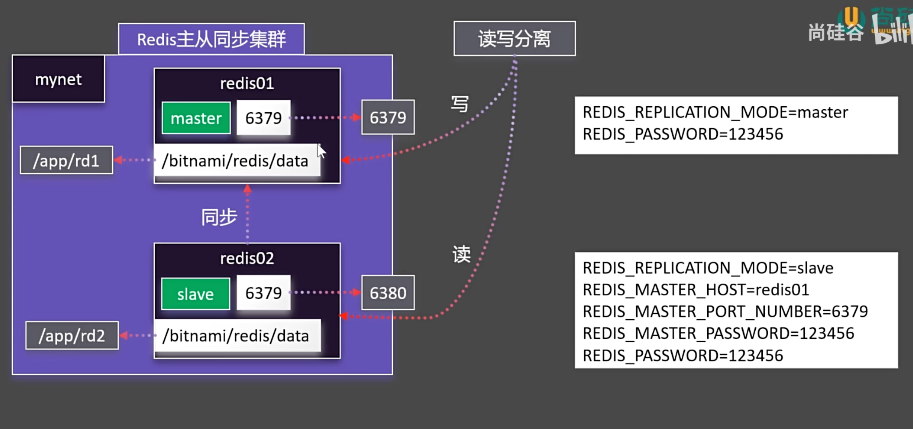

# 网络

掌握网络机制，轻松构建集群

## 自定义网络

先清除之前所有的容器

```shell
[root@docker_12-17 ~]# docker rm -f $(docker ps -aq)
e5a4498267a3
ea485d527f4d
```

两个容器之间通信

::: code-group

```shell [使用主机端口]
[root@docker_12-17 ~]# docker run -d -p 88:80 --name app1 nginx
074412b036f296cb154739b4a5c35bea527ec51f86969a017f764739464dda18
[root@docker_12-17 ~]# docker run -d -p 99:80 --name app2 nginx
11c73d340931a9458f05056ce69e0a255092e22ece87e636605707db7bd8b2e0

[root@docker_12-17 ~]# docker exec -it app1 bash

root@074412b036f2:/# curl http://192.168.17.200:99/
<!DOCTYPE html>
<html>
<head>

...
```

```shell [查看docker默认网络，网卡信息]
# docker 所起的每一个容器都处于 docker0 网络环境，docker 都会为其分配ip地址
[root@docker_12-17 ~]# ip a
1: lo: <LOOPBACK,UP,LOWER_UP> mtu 65536 qdisc noqueue state UNKNOWN group default qlen 1000
    link/loopback 00:00:00:00:00:00 brd 00:00:00:00:00:00
    inet 127.0.0.1/8 scope host lo
       valid_lft forever preferred_lft forever
    inet6 ::1/128 scope host
       valid_lft forever preferred_lft forever
2: ens160: <BROADCAST,MULTICAST,UP,LOWER_UP> mtu 1500 qdisc fq_codel state UP group default qlen 1000
    link/ether 00:0c:29:ff:56:85 brd ff:ff:ff:ff:ff:ff
    inet 192.168.17.200/24 brd 192.168.17.255 scope global noprefixroute ens160
       valid_lft forever preferred_lft forever
    inet6 fe80::20c:29ff:feff:5685/64 scope link noprefixroute
       valid_lft forever preferred_lft forever

# 就是这个
3: docker0: <BROADCAST,MULTICAST,UP,LOWER_UP> mtu 1500 qdisc noqueue state UP group default
    link/ether 02:42:0d:65:6e:58 brd ff:ff:ff:ff:ff:ff
    inet 172.17.0.1/16 brd 172.17.255.255 scope global docker0
       valid_lft forever preferred_lft forever
    inet6 fe80::42:dff:fe65:6e58/64 scope link
       valid_lft forever preferred_lft forever

```

```shell [查看容器细节]
[root@docker_12-17 ~]# docker container inspect app1
# 可以看到 app1 容器的网络信息，此处只展示网络信息
```

```json [容器网络信息]
"Networks": {
    "bridge": {
        "IPAMConfig": null,
        "Links": null,
        "Aliases": null,
        "MacAddress": "02:42:ac:11:00:02",
        "NetworkID": "bf9487e94d64f555df9fa4ca852497f88cba28348b673ba2ffd88133bc36cb70",
        "EndpointID": "69b933fa68575559333cca2605e83e30271449fbd50937156e3870e1d8af1687",
        "Gateway": "172.17.0.1", # 网关地址
        "IPAddress": "172.17.0.2", # 容器的ip地址
        "IPPrefixLen": 16,
        "IPv6Gateway": "",
        "GlobalIPv6Address": "",
        "GlobalIPv6PrefixLen": 0,
        "DriverOpts": null,
        "DNSNames": null
    }
}

```

```shell [使用 docker 网络请求]
[root@docker_12-17 ~]# docker exec -it app1 bash
root@074412b036f2:/# curl 172.17.0.3
<!DOCTYPE html>
<html>

...
```

:::

- 自定义网络解释

  

### 创建网络

先删除所有的容器

```shell
[root@docker_12-17 ~]# docker rm -f $(docker ps -aq)
11c73d340931
074412b036f2
```

查看 network 指令

```shell
[root@docker_12-17 ~]# docker network --help

Usage:  docker network COMMAND

Manage networks

Commands:
  connect     Connect a container to a network
  create      Create a network
  disconnect  Disconnect a container from a network
  inspect     Display detailed information on one or more networks
  ls          List networks
  prune       Remove all unused networks
  rm          Remove one or more networks

Run 'docker network COMMAND --help' for more information on a command.
```

创建并查看

```shell
[root@docker_12-17 ~]# docker network create mynet
21188aaf4de6306e3752b183b591bdb549953cc83934cd5146d261433ae67f7f
[root@docker_12-17 ~]# docker network ls
NETWORK ID     NAME      DRIVER    SCOPE
bf9487e94d64   bridge    bridge    local # 默认网络，也就是我们上面看到的 docker0 网络
cfc272c01eb8   host      host      local # 主机网络，也就是我们上面看到的 ens160 网络
21188aaf4de6   mynet     bridge    local # 我们自己创建的网络
3761d90c7eb7   none      null      local # 无网络
```

创建两个容器, 并指定网络为 mynet

```shell
[root@docker_12-17 ~]# docker run -d -p 88:80 --name app1 --network mynet nginx
9d68c4ac24e702183a36de36ecb5f81fb9cd28992e9dda58d8bce11ca552e35e
[root@docker_12-17 ~]# docker run -d -p 99:80 --name app2 --network mynet nginx
09e7881a3ad788ed16a13958e5296b4e9771f61c3ad2e8bd68633f0338dff5b5
```

使用指定网络域名访问, 容器名为域名

```shell
[root@docker_12-17 ~]# docker exec -it app1 bash
root@9d68c4ac24e7:/# curl http://app2:80
<!DOCTYPE html>
<html>
<head>

...

root@9d68c4ac24e7:/# curl app2:80
<!DOCTYPE html>
<html>
<head>

...
```

### redis 主从同步集群

{width="600px"}

官方的镜像需要修改配置文件才能实现，这里为了举例，使用 bitnami 镜像

[bitnami/redis](https://hub.docker.com/r/bitnami/redis/tags)

::: code-group

```shell [安装]
docker pull bitnami/redis:latest

#自定义网络
docker network create mynet
#主节点
# -e REDIS_REPLICATION_MODE=master 的意思是写入环境变量

docker run -d -p 6379:6379 \
-v /app/rd1:/bitnami/redis/data \
-e REDIS_REPLICATION_MODE=master \
-e REDIS_PASSWORD=123456 \
--network mynet --name redis01 \
bitnami/redis
```

```shell [排查异常]
# 会发现没有运行中的容器
[root@docker_12-17 ~]# docker ps
CONTAINER ID   IMAGE     COMMAND   CREATED   STATUS    PORTS     NAMES

# 发现是因为没有写入的权限，需要去修改权限
[root@docker_12-17 ~]# docker ps -a
CONTAINER ID   IMAGE           COMMAND                   CREATED         STATUS                     PORTS     NAMES
f4d94128fba0   bitnami/redis   "/opt/bitnami/script…"   2 minutes ago   Exited (1) 2 minutes ago             redis01
[root@docker_12-17 ~]# docker logs f4d
redis 23:18:54.59 INFO  ==>
redis 23:18:54.59 INFO  ==> Welcome to the Bitnami redis container
redis 23:18:54.59 INFO  ==> Subscribe to project updates by watching https://github.com/bitnami/containers
redis 23:18:54.59 INFO  ==> Submit issues and feature requests at https://github.com/bitnami/containers/issues
redis 23:18:54.59 INFO  ==> Upgrade to Tanzu Application Catalog for production environments to access custom-configured and pre-packaged software components. Gain enhanced features, including Software Bill of Materials (SBOM), CVE scan result reports, and VEX documents. To learn more, visit https://bitnami.com/enterprise
redis 23:18:54.60 INFO  ==>
redis 23:18:54.60 INFO  ==> ** Starting Redis setup **
redis 23:18:54.60 INFO  ==> Initializing Redis
redis 23:18:54.61 INFO  ==> Setting Redis config file
redis 23:18:54.61 INFO  ==> Configuring replication mode

redis 23:18:54.62 INFO  ==> ** Redis setup finished! **
redis 23:18:54.62 INFO  ==> ** Starting Redis **
1:C 17 Dec 2024 23:18:54.633 # WARNING Memory overcommit must be enabled! Without it, a background save or replication may fail under low memory condition. Being disabled, it can also cause failures without low memory condition, see https://github.com/jemalloc/jemalloc/issues/1328. To fix this issue add 'vm.overcommit_memory = 1' to /etc/sysctl.conf and then reboot or run the command 'sysctl vm.overcommit_memory=1' for this to take effect.
1:C 17 Dec 2024 23:18:54.633 * oO0OoO0OoO0Oo Redis is starting oO0OoO0OoO0Oo
1:C 17 Dec 2024 23:18:54.633 * Redis version=7.4.1, bits=64, commit=00000000, modified=1, pid=1, just started
1:C 17 Dec 2024 23:18:54.633 * Configuration loaded
1:M 17 Dec 2024 23:18:54.633 * monotonic clock: POSIX clock_gettime
1:M 17 Dec 2024 23:18:54.634 * Running mode=standalone, port=6379.
1:M 17 Dec 2024 23:18:54.634 * Server initialized
1:M 17 Dec 2024 23:18:54.634 # Can't open or create append-only dir appendonlydir: Permission denied
```

```shell [修改异常]
# 修改权限
[root@docker_12-17 app]# cd /app/
[root@docker_12-17 app]# ls -ll
总用量 0
drwxr-xr-x. 2 root root  6 12月 18 05:59 ngconf
drwxr-xr-x. 2 root root 24 12月 18 05:22 nghtml
drwxr-xr-x. 2 root root  6 12月 18 07:18 rd1
[root@docker_12-17 app]# chmod -R 777 rd1/
[root@docker_12-17 app]# ls -ll
总用量 0
drwxr-xr-x. 2 root root  6 12月 18 05:59 ngconf
drwxr-xr-x. 2 root root 24 12月 18 05:22 nghtml
drwxrwxrwx. 2 root root  6 12月 18 07:18 rd1

# 重新启动容器
[root@docker_12-17 app]# docker ps -a
CONTAINER ID   IMAGE           COMMAND                   CREATED         STATUS                     PORTS     NAMES
f4d94128fba0   bitnami/redis   "/opt/bitnami/script…"   4 minutes ago   Exited (1) 4 minutes ago             redis01
[root@docker_12-17 app]# docker start f4d
f4d
[root@docker_12-17 app]# docker ps
CONTAINER ID   IMAGE           COMMAND                   CREATED         STATUS         PORTS                                       NAMES
f4d94128fba0   bitnami/redis   "/opt/bitnami/script…"   4 minutes ago   Up 3 seconds   0.0.0.0:6379->6379/tcp, :::6379->6379/tcp   redis01
```

```shell [创建子]
[root@docker_12-17 app]# mkdir rd2
[root@docker_12-17 app]# chmod -R 777 rd2
[root@docker_12-17 app]# ls -ll
总用量 0
drwxr-xr-x. 2 root root  6 12月 18 05:59 ngconf
drwxr-xr-x. 2 root root 24 12月 18 05:22 nghtml
drwxrwxrwx. 3 root root 27 12月 18 07:23 rd1
drwxrwxrwx. 2 root root  6 12月 18 07:25 rd2

#从节点
docker run -d -p 6380:6379 \
-v /app/rd2:/bitnami/redis/data \
-e REDIS_REPLICATION_MODE=slave \
-e REDIS_MASTER_HOST=redis01 \
-e REDIS_MASTER_PORT_NUMBER=6379 \
-e REDIS_MASTER_PASSWORD=123456 \
-e REDIS_PASSWORD=123456 \
--network mynet --name redis02 \
bitnami/redis

```

:::

跑起来以后使用 navicat 连接这两个 redis 服务

在 master 里面创建数据，在从节点里面可以看到数据
