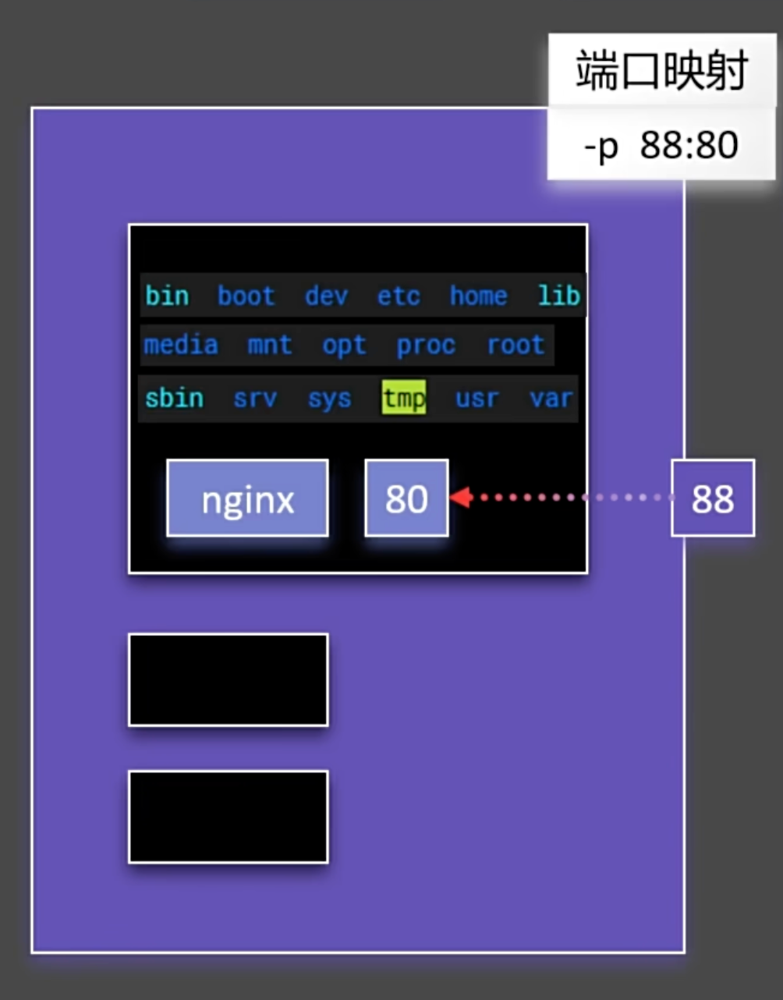

# 命令

## 实验

::: info 说明
启动一个 nginx，并将它的首页改成自己的页面，发布出去，让所有人都能使用
:::

### 下载镜像


- 查找镜像

其中 official 是官方的，所以我们可以直接使用官方的镜像


- 下载然后查看镜像


::: warning 下载指定版本
比如下载 nginx 别的版本，进入地址： [nginx](https://hub.docker.com/_/nginx/tags)

执行指令： docker pull nginx:stable-perl

stable-perl 就是 tag 版本


```shell
# 下载指定版本
[root@docker_12-17 ~]# docker pull nginx:1.27-perl
1.27-perl: Pulling from library/nginx
bb3f2b52e6af: Already exists
e4bc5c1a6721: Already exists
e93f7200eab8: Already exists
1bd52ec2c0cb: Already exists
411a98463f95: Already exists
ad5932596f78: Already exists
df25b2e5edb3: Already exists
14b1c3e53508: Pull complete
Digest: sha256:5ec6b7f08eca9f2a453861eab1852bddd57590dfb72487c90b35c1f9302181e7
Status: Downloaded newer image for nginx:1.27-perl
docker.io/library/nginx:1.27-perl

# 查看镜像
[root@docker_12-17 ~]# docker images
REPOSITORY   TAG         IMAGE ID       CREATED       SIZE
nginx        latest      bdf62fd3a32f   3 weeks ago   197MB
nginx        1.27-perl   95342e0fcd45   3 weeks ago   247MB

# 移除镜像，或者 docker rmi nginx:1.27-perl
[root@docker_12-17 ~]# docker rmi 95342e0fcd45
Untagged: nginx:1.27-perl
Untagged: nginx@sha256:5ec6b7f08eca9f2a453861eab1852bddd57590dfb72487c90b35c1f9302181e7
Deleted: sha256:95342e0fcd45e9ea4c7b6a286b9ca2f5c88b267cba50039b3b206d935b5f7b2b
Deleted: sha256:f316a1acd673e0281339c830b96c8635482fc39d226467d9a37ed76b2832abcc

# 查看镜像
[root@docker_12-17 ~]# docker images
REPOSITORY   TAG       IMAGE ID       CREATED       SIZE
nginx        latest    bdf62fd3a32f   3 weeks ago   197MB
```

:::

### 启动容器

{width="50%"}

比如启动一个容器，但是不知道怎么使用指令，这时可以使用 help 指令

```shell
[root@docker_12-17 ~]# docker run --help

# 这里就是用法
Usage:  docker run [OPTIONS] IMAGE [COMMAND] [ARG...]

Create and run a new container from an image

Aliases:
  docker container run, docker run

Options:
      --add-host list                    Add a custom host-to-IP mapping (host:ip)
      --annotation map                   Add an annotation to the container (passed through to the OCI runtime) (default map[])
  -a, --attach list                      Attach to STDIN, STDOUT or STDERR
      --blkio-weight uint16              Block IO (relative weight), between 10 and 1000, or 0 to disable (default 0)
      --blkio-weight-device list         Block IO weight (relative device weight) (default [])
      --cap-add list                     Add Linux capabilities

...
```

运行镜像,这样会阻塞控制台

```shell
[root@docker_12-17 ~]# docker run nginx
/docker-entrypoint.sh: /docker-entrypoint.d/ is not empty, will attempt to perform configuration
/docker-entrypoint.sh: Looking for shell scripts in /docker-entrypoint.d/
/docker-entrypoint.sh: Launching /docker-entrypoint.d/10-listen-on-ipv6-by-default.sh
10-listen-on-ipv6-by-default.sh: info: Getting the checksum of /etc/nginx/conf.d/default.conf
10-listen-on-ipv6-by-default.sh: info: Enabled listen on IPv6 in /etc/nginx/conf.d/default.conf
/docker-entrypoint.sh: Sourcing /docker-entrypoint.d/15-local-resolvers.envsh
/docker-entrypoint.sh: Launching /docker-entrypoint.d/20-envsubst-on-templates.sh
/docker-entrypoint.sh: Launching /docker-entrypoint.d/30-tune-worker-processes.sh
/docker-entrypoint.sh: Configuration complete; ready for start up
2024/12/17 18:45:56 [notice] 1#1: using the "epoll" event method
2024/12/17 18:45:56 [notice] 1#1: nginx/1.27.3
2024/12/17 18:45:56 [notice] 1#1: built by gcc 12.2.0 (Debian 12.2.0-14)
2024/12/17 18:45:56 [notice] 1#1: OS: Linux 5.11.12-300.el7.aarch64
2024/12/17 18:45:56 [notice] 1#1: getrlimit(RLIMIT_NOFILE): 1048576:1048576
2024/12/17 18:45:56 [notice] 1#1: start worker processes
2024/12/17 18:45:56 [notice] 1#1: start worker process 29
2024/12/17 18:45:56 [notice] 1#1: start worker process 30
```

保持上面的进程不变，在另外一个控制台使用 ps 查看进程

这里的 NAMES 是随机取的

```shell
[root@docker_12-17 ~]# docker ps
CONTAINER ID   IMAGE     COMMAND                   CREATED              STATUS              PORTS     NAMES
df776bced93e   nginx     "/docker-entrypoint.…"   About a minute ago   Up About a minute   80/tcp    recursing_jemison
```

ctrl + c 关闭容器，然后 docker ps -a 查看所有容器

> 此时 docker ps 看不到任何

```shell
# Exited 就是已经退出
[root@docker_12-17 ~]# docker ps -a
CONTAINER ID   IMAGE     COMMAND                   CREATED         STATUS                     PORTS     NAMES
df776bced93e   nginx     "/docker-entrypoint.…"   6 minutes ago   Exited (0) 4 minutes ago             recursing_jemison
```

重新启动容器

使用 `docker start 容器名` 或者 `docker start 容器id` 或者 `docker start 容器id前几位` 都可以

```shell
[root@docker_12-17 ~]# docker start recursing_jemison
recursing_jemison
[root@docker_12-17 ~]# docker ps
CONTAINER ID   IMAGE     COMMAND                   CREATED          STATUS              PORTS     NAMES
df776bced93e   nginx     "/docker-entrypoint.…"   10 minutes ago   Up About a minute   80/tcp    recursing_jemison
```

将启动的容器停止

```shell
[root@docker_12-17 ~]# docker stop recursing_jemison
recursing_jemison
[root@docker_12-17 ~]# docker ps
CONTAINER ID   IMAGE     COMMAND   CREATED   STATUS    PORTS     NAMES
```

重启，无论是否已经启动，都会重启

```shell
[root@docker_12-17 ~]# docker restart df7
df7

[root@docker_12-17 ~]# docker ps
CONTAINER ID   IMAGE     COMMAND                   CREATED          STATUS         PORTS     NAMES
df776bced93e   nginx     "/docker-entrypoint.…"   12 minutes ago   Up 6 seconds   80/tcp    recursing_jemison
```

查看容器的状态

```shell
docker stats df7

CONTAINER ID   NAME                CPU %     MEM USAGE / LIMIT     MEM %     NET I/O       BLOCK I/O   PIDS
df776bced93e   recursing_jemison   0.00%     2.875MiB / 3.324GiB   0.08%     1.02kB / 0B   0B / 0B     3
```

查看这个容器运行的日志

```shell
[root@docker_12-17 ~]# docker logs df7
/docker-entrypoint.sh: /docker-entrypoint.d/ is not empty, will attempt to perform configuration
/docker-entrypoint.sh: Looking for shell scripts in /docker-entrypoint.d/
/docker-entrypoint.sh: Launching /docker-entrypoint.d/10-listen-on-ipv6-by-default.sh
10-listen-on-ipv6-by-default.sh: info: Getting the checksum of /etc/nginx/conf.d/default.conf
10-listen-on-ipv6-by-default.sh: info: Enabled listen on IPv6 in /etc/nginx/conf.d/default.conf
/docker-entrypoint.sh: Sourcing /docker-entrypoint.d/15-local-resolvers.envsh
/docker-entrypoint.sh: Launching /docker-entrypoint.d/20-envsubst-on-templates.sh
/docker-entrypoint.sh: Launching /docker-entrypoint.d/30-tune-worker-processes.sh
/docker-entrypoint.sh: Configuration complete; ready for start up
2024/12/17 18:45:56 [notice] 1#1: using the "epoll" event method
2024/12/17 18:45:56 [notice] 1#1: nginx/1.27.3
2024/12/17 18:45:56 [notice] 1#1: built by gcc 12.2.0 (Debian 12.2.0-14)
2024/12/17 18:45:56 [notice] 1#1: OS: Linux 5.11.12-300.el7.aarch64

...
```

然后删除这个容器

```shell
# 这里会报错，因为容器正在运行，需要先停止
[root@docker_12-17 ~]# docker rm df7
Error response from daemon: cannot remove container "/recursing_jemison": container is running: stop the container before removing or force remove

# 加上 -f 强制删除
[root@docker_12-17 ~]# docker rm -f df7
df7

# 查看
[root@docker_12-17 ~]# docker ps
CONTAINER ID   IMAGE     COMMAND   CREATED   STATUS    PORTS     NAMES
```

::: danger 注意
`docker rm` 是删除容器

`docker rmi` 是删除镜像
:::

启动容器

```shell
# -d 后台运行 --name 容器名 如果这里不起名字会随机生成一个
[root@docker_12-17 ~]# docker run -d --name mynginx nginx
cbf45b5d61ae988220f48781e045aace879e6eebfaa48ad250fefb0fb36d4da8 # 这里是容器 id

[root@docker_12-17 ~]# docker ps
CONTAINER ID   IMAGE     COMMAND                   CREATED          STATUS          PORTS     NAMES
cbf45b5d61ae   nginx     "/docker-entrypoint.…"   50 seconds ago   Up 49 seconds   80/tcp    mynginx
```

**端口映射**

{width="50%"}

每一个应用如这里的 nginx 跑在容器里面,每一个容器相互独立都单独的跑在主机上面，所以需要端口映射

比如这里的 linux 开放 88 端口，那么启动 nginx 时，需要映射 88 端口, 80 是容器内 nginx 支持的端口

外部访问这台主机的 88 端口，就可以访问到 nginx 的 80 端口

```shell
# 先删除
[root@docker_12-17 ~]# docker rm -f cbf
cbf

# 启动
[root@docker_12-17 ~]# docker run -d -p 88:80 --name mynginx nginx
fee2689f0a875a60c6a1d29f13f35cf5769c9d9fe7a4c131cc1f4211be83cde5

# 查看
[root@docker_12-17 ~]# docker ps
CONTAINER ID   IMAGE     COMMAND                   CREATED         STATUS         PORTS                               NAMES
fee2689f0a87   nginx     "/docker-entrypoint.…"   2 minutes ago   Up 2 minutes   0.0.0.0:88->80/tcp, :::88->80/tcp   mynginx

# 这里的 PORTS 就是端口映射，意思是 88 端口映射到 80 端口，这里的 0.0.0.0 是指所有的 ip 地址都可以访问

# 这里的 ::: 是指所有的 ipv6 地址都可以访问
```

然后访问


### 修改页面

首先进入 docker hub 的搜索页面，[nginx](https://hub.docker.com/_/nginx), 在说明里面有写到默认页面在 /usr/share/nginx/html 目录下

然后使用 docker exec 进入容器 -it 表示交互式模式，进入后就可以修改了

```shell
# 进入容器
[root@docker_12-17 ~]# docker exec -it mynginx /bin/bash

# docker exec：这个命令用于在已经运行的容器中执行命令。
# -i：表示交互模式（interactive），允许你在容器中输入命令。
# -t：分配一个伪终端（pseudo-TTY），使得终端输出格式化得更好，适合交互式会话。
# mynginx：这是容器的名称或 ID，表示你希望在这个特定的容器中执行命令。
# /bin/bash：这是要在容器中执行的命令，启动一个 Bash shell

# 查看文件，可以看到这个容器就是一个完整的 linux 环境
root@fee2689f0a87:/# ls /
bin  boot  dev  docker-entrypoint.d  docker-entrypoint.sh  etc  home  lib  media  mnt  opt  proc  root  run  sbin  srv  sys  tmp  usr  var

# 进入 html 目录，修改 index.html 文件
root@fee2689f0a87:/# cd /usr/share/nginx/html/
root@fee2689f0a87:/usr/share/nginx/html# ls
50x.html  index.html

# 可以看到连 vi 编辑器都没有，这个容器保持了最小化，没有安装编辑器
root@fee2689f0a87:/usr/share/nginx/html# vi index.html
bash: vi: command not found
root@fee2689f0a87:/usr/share/nginx/html# echo "<h1>change docker html</h1>" > index.html
root@fee2689f0a87:/usr/share/nginx/html# cat index.html
<h1>change docker html</h1>

# 退出容器
root@fee2689f0a87:/usr/share/nginx/html# exit
exit
[root@docker_12-17 ~]#
```

修改完毕以后，重新访问

{width="50%"}

`当然也可以将文件位置映射到本地，这样就可以在本地修改，然后再映射到容器里面`

### 保存镜像

首先查看提交指令

::: code-group

```shell [指令介绍]
[root@docker_12-17 ~]# docker commit --help

Usage:  docker commit [OPTIONS] CONTAINER [REPOSITORY[:TAG]]
# 解释 usage 里面的项
# CONTAINER 容器的意思
# REPOSITORY 仓库
# TAG 标签
# OPTIONS 选项


Create a new image from a container's changes

Aliases:
  docker container commit, docker commit

Options:
  -a, --author string    Author (e.g., "John Hannibal Smith <hannibal@a-team.com>")
  -c, --change list      Apply Dockerfile instruction to the created image
  -m, --message string   Commit message
  -p, --pause            Pause container during commit (default true)
[root@docker_12-17 ~]#

```

```shell [提交然后查看]
[root@docker_12-17 ~]# docker commit -m "update index.html" mynginx mynginx:v1.0
sha256:d116bce96b9648e8750e5f410fab4c215f7c1013929d974e6008e65f7c9897d8
# docker commit：这个命令用于创建一个新的镜像，基于指定的容器的当前状态。
# -m "update index.html"：提供一条提交信息，描述这次提交的更改内容。在这个例子中，提交信息是“update index.html”，用于记录这次提交的目的或内容。
# mynginx：这是要基于其状态创建新镜像的容器名称或 ID。
# mynginx:v1.0：这是新镜像的名称和标签。mynginx 是镜像的名称，v1.0 是镜像的标签，表示这个镜像的版本

# 可以看到刚才提交的镜像
[root@docker_12-17 ~]# docker images
REPOSITORY   TAG       IMAGE ID       CREATED              SIZE
mynginx      v1.0      d116bce96b96   About a minute ago   197MB
nginx        latest    bdf62fd3a32f   3 weeks ago          197MB
```

:::

将镜像保存成文件

::: code-group

```shell [命令解释]
[root@docker_12-17 ~]# docker save --help

Usage:  docker save [OPTIONS] IMAGE [IMAGE...]

Save one or more images to a tar archive (streamed to STDOUT by default)

Aliases:
  docker image save, docker save

Options:
  -o, --output string   Write to a file, instead of STDOUT
```

```shell [保存成 tar 包]
[root@docker_12-17 ~]# docker save -o mynginx.tar mynginx:v1.0
[root@docker_12-17 ~]# ls
a  anaconda-ks.cfg  Centos-altarch-7.repo  ls.log  mynginx.tar  redis-6.0.8.tar.gz  wget-log
```

:::

删除容器，然后用刚才打包的文件跑一个容器

> docker load 就是将 tar 包加载成镜像

::: code-group

```shell [删除容器与镜像]
[root@docker_12-17 ~]# docker ps
CONTAINER ID   IMAGE     COMMAND                   CREATED          STATUS          PORTS                               NAMES
fee2689f0a87   nginx     "/docker-entrypoint.…"   55 minutes ago   Up 55 minutes   0.0.0.0:88->80/tcp, :::88->80/tcp   mynginx
[root@docker_12-17 ~]# docker rm -f fee
fee
[root@docker_12-17 ~]# docker images
REPOSITORY   TAG       IMAGE ID       CREATED         SIZE
mynginx      v1.0      d116bce96b96   7 minutes ago   197MB
nginx        latest    bdf62fd3a32f   3 weeks ago     197MB
[root@docker_12-17 ~]# docker rmi d116bce96b96 bdf62fd3a32f
Untagged: mynginx:v1.0
Deleted: sha256:d116bce96b9648e8750e5f410fab4c215f7c1013929d974e6008e65f7c9897d8
Deleted: sha256:44171976d009d6b4c8980808221bc681e675df29ba9f93b63a86b4ad8f18b947
Untagged: nginx:latest
Untagged: nginx@sha256:fb197595ebe76b9c0c14ab68159fd3c08bd067ec62300583543f0ebda353b5be
Deleted: sha256:bdf62fd3a32f1209270ede068b6e08450dfe125c79b1a8ba8f5685090023bf7f
Deleted: sha256:bf74a794f54dda4a120c2341b9e3eecafc19ab423649909edf66090bcab8a007
Deleted: sha256:d8ab2f8a77485ff82666c0b49a3f098e35643462313f391abe77c2ef0fdcfcfe
Deleted: sha256:c95a6c3fcab6af748cbf95a166ab17d1d00a87fe03b47181f72996b419da5693
Deleted: sha256:ad440851c8e2f92041d499b40dd0aa17fa33d9c8b2e1eec66581fe275b53bc32
Deleted: sha256:1555b493613f3dc11dac1ea991d968c2e068627ba42b33cf8b86702c15f78ff2
Deleted: sha256:bdec05ec0f48beadbd288522556f5650baea79e24b9ca9df5424d06c5a328a8f
Deleted: sha256:3e620c160447d1acff162610a533282fc64863123cba28ce40eaf98c17dde780
```

```shell [查看load指令]
[root@docker_12-17 ~]# docker load --help

Usage:  docker load [OPTIONS]

Load an image from a tar archive or STDIN

Aliases:
  docker image load, docker load

Options:
  -i, --input string   Read from tar archive file, instead of STDIN
  -q, --quiet          Suppress the load output
```

```shell [加载]
[root@docker_12-17 ~]# docker load -i mynginx.tar
3e620c160447: Loading layer [==================================================>]  100.2MB/100.2MB
880d2e736b16: Loading layer [==================================================>]    101MB/101MB
2c447934d7f2: Loading layer [==================================================>]  3.584kB/3.584kB
d06e03e55b64: Loading layer [==================================================>]  4.608kB/4.608kB
d5c9fed2bbd4: Loading layer [==================================================>]   2.56kB/2.56kB
fc2efc334561: Loading layer [==================================================>]   5.12kB/5.12kB
d93fefef05de: Loading layer [==================================================>]  7.168kB/7.168kB
a89afc551768: Loading layer [==================================================>]  17.41kB/17.41kB
Loaded image: mynginx:v1.0

[root@docker_12-17 ~]# docker images
REPOSITORY   TAG       IMAGE ID       CREATED          SIZE
mynginx      v1.0      d116bce96b96   11 minutes ago   197MB
```

```shell [运行]
[root@docker_12-17 ~]# docker run -d --name app01 -p 80:80 mynginx:v1.0
42cb2ea54a67387b892e714038cbe310af885dba0b9b69e0c311e8c511efcd18

[root@docker_12-17 ~]# docker ps
CONTAINER ID   IMAGE          COMMAND                   CREATED         STATUS         PORTS                               NAMES
42cb2ea54a67   mynginx:v1.0   "/docker-entrypoint.…"   2 minutes ago   Up 2 minutes   0.0.0.0:80->80/tcp, :::80->80/tcp   app01
[root@docker_12-17 ~]#
```

:::

然后访问页面

{width="50%"}

### 推送

::: danger 问题
目前无法 login 到 docker hub，暂时不知道是什么问题

此处仅做笔记，后续解决
:::

- 登录到 docker hub

[docker hub](https://app.docker.com/?index)

这里我用的邮箱是： chenw086@163.com

然后 login 登录

::: code-group

```shell [登录]
[root@docker_12-17 ~]# docker login
Log in with your Docker ID or email address to push and pull images from Docker Hub. If you don't have a Docker ID, head over to https://hub.docker.com/ to create one.
You can log in with your password or a Personal Access Token (PAT). Using a limited-scope PAT grants better security and is required for organizations using SSO. Learn more at https://docs.docker.com/go/access-tokens/

Username: viviichen
Password:
```

```shell [更改 tag]
[root@docker_12-17 ~]# docker tag mynginx:v1.0 viviichen/mynginx:v1.0

[root@docker_12-17 ~]# docker images
REPOSITORY          TAG       IMAGE ID       CREATED          SIZE
mynginx             v1.0      d116bce96b96   39 minutes ago   197MB
viviichen/mynginx   v1.0      d116bce96b96   39 minutes ago   197MB
```

```shell [推送]
[root@docker_12-17 ~]# docker push viviichen/mynginx:v1.0
```

:::
