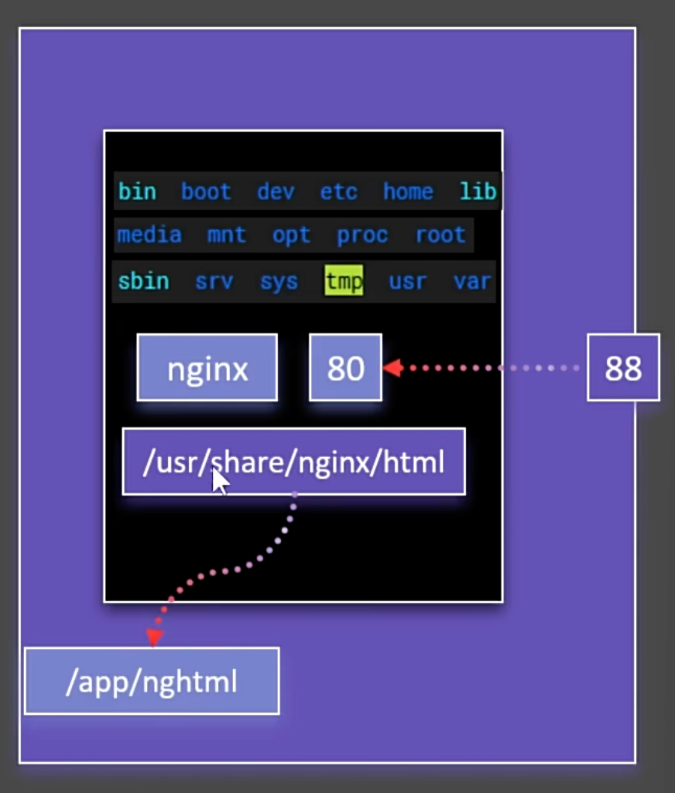
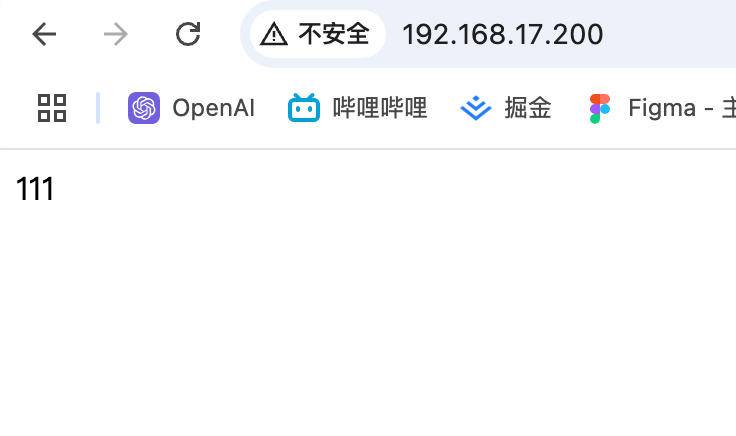
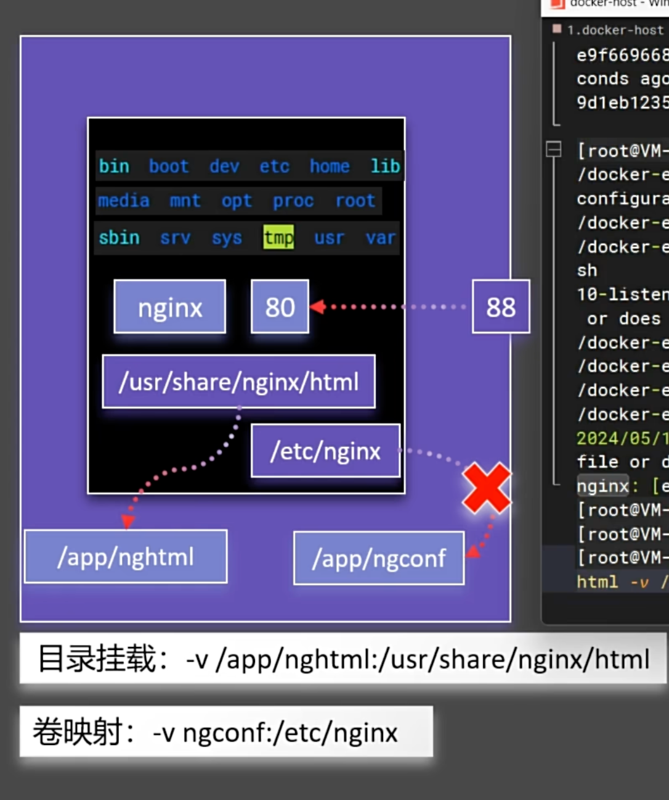

# 存储

::: info
掌握目录挂载和数据卷，让容器数据不再丢失
:::

先退出所有的容器

```shell
#  $(docker ps -aq) 的意思是获取所有容器的 ID
[root@docker_12-17 ~]# docker rm -f $(docker ps -aq)
42cb2ea54a67
[root@docker_12-17 ~]# docker ps
CONTAINER ID   IMAGE     COMMAND   CREATED   STATUS    PORTS     NAMES
```

## 目录挂载

之前修改 nginx 的 index.html

```shell
[root@docker_12-17 ~]# docker ps
CONTAINER ID   IMAGE     COMMAND                   CREATED         STATUS         PORTS                               NAMES
699b7a48c864   nginx     "/docker-entrypoint.…"   3 minutes ago   Up 3 minutes   0.0.0.0:80->80/tcp, :::80->80/tcp   app01
[root@docker_12-17 ~]# docker exec -it 699 /bin/bash
root@699b7a48c864:/# cd /usr/share/nginx/html/
root@699b7a48c864:/usr/share/nginx/html# echo "11" > index.html
```

- 挂载概念

{width="50%"}

现在使用目录挂载的方式修改 index.html

```shell
# 退出之前的
[root@docker_12-17 ~]# docker ps
CONTAINER ID   IMAGE     COMMAND                   CREATED         STATUS         PORTS                               NAMES
699b7a48c864   nginx     "/docker-entrypoint.…"   9 minutes ago   Up 9 minutes   0.0.0.0:80->80/tcp, :::80->80/tcp   app01
[root@docker_12-17 ~]# docker rm -f 699
699

# 这样就将 html 挂载到了 /app/nghtml 目录，如果主机没有这个目录还会自动创建
[root@docker_12-17 ~]# docker run -d -p 80:80 -v /app/nghtml:/usr/share/nginx/html --name app01 nginx
956b3fbfac324e918ee546623412ced1672c6b2d74d34b485bedaba798d44bf3

[root@docker_12-17 ~]# ls /app
nghtml
[root@docker_12-17 ~]# cd /app/nghtml/
[root@docker_12-17 nghtml]# echo 111 > index.html
[root@docker_12-17 nghtml]# ls
index.html
```

然后就可以整成访问 nginx 服务器了

{width="50%"}

下次删除容器，再重新启动，数据还是存在的

::: danger 注意
如果在容器内部修改 /usr/share/nginx/html/ 目录下的文件，会覆盖掉宿主机的目录下的文件，因为是同一个目录

这里很重要，务必记住
:::

## 卷映射

先看看如果想配置 nginx.conf 使用目录挂载的方式

```shell
[root@docker_12-17 nghtml]# docker run -d -p 80:80 -v /app/nghtml:/usr/share/nginx/html -v /app/ngconf:/etc/nginx --name app01 nginx
ea485d527f4dc5985e90c970dd9e458b4437caf2cefc35367589fecd2be03241
[root@docker_12-17 nghtml]# docker ps
CONTAINER ID   IMAGE     COMMAND   CREATED   STATUS    PORTS     NAMES
[root@docker_12-17 nghtml]# docker ps -a
CONTAINER ID   IMAGE     COMMAND                   CREATED          STATUS                      PORTS     NAMES
ea485d527f4d   nginx     "/docker-entrypoint.…"   23 seconds ago   Exited (1) 22 seconds ago             app01
[root@docker_12-17 nghtml]# docker logs app01
/docker-entrypoint.sh: /docker-entrypoint.d/ is not empty, will attempt to perform configuration
/docker-entrypoint.sh: Looking for shell scripts in /docker-entrypoint.d/
/docker-entrypoint.sh: Launching /docker-entrypoint.d/10-listen-on-ipv6-by-default.sh
10-listen-on-ipv6-by-default.sh: info: /etc/nginx/conf.d/default.conf is not a file or does not exist
/docker-entrypoint.sh: Sourcing /docker-entrypoint.d/15-local-resolvers.envsh
/docker-entrypoint.sh: Launching /docker-entrypoint.d/20-envsubst-on-templates.sh
/docker-entrypoint.sh: Launching /docker-entrypoint.d/30-tune-worker-processes.sh
/docker-entrypoint.sh: Configuration complete; ready for start up
2024/12/17 21:59:14 [emerg] 1#1: open() "/etc/nginx/nginx.conf" failed (2: No such file or directory)
nginx: [emerg] open() "/etc/nginx/nginx.conf" failed (2: No such file or directory)
```

可以看到报错了，因为 nginx.conf 没有配置，所以会报错

那么需要一个办法，让初始化的时候，将容器原本有的内容让主机目录保持一致，这时候就需要用到`卷映射`

{width="50%"}

上图就是创建一个名为 ngconf 的卷，他会自己定义存储的位置

`具体如何定义在下面有介绍`

```shell
[root@docker_12-17 nghtml]# docker run -d -p 99:80 -v /app/nghtml:/usr/share/nginx/html -v ngconf:/etc/nginx --name app03 nginx
e5a4498267a32d2b3ed513f2c87d2b5c159f06ed29928fb62d8f1bd4059de20a
[root@docker_12-17 nghtml]# docker ps
CONTAINER ID   IMAGE     COMMAND                   CREATED         STATUS         PORTS                               NAMES
e5a4498267a3   nginx     "/docker-entrypoint.…"   3 seconds ago   Up 3 seconds   0.0.0.0:99->80/tcp, :::99->80/tcp   app03
```

这时候访问主机的 99 端口就能正常的访问，位置统一放在宿主机的 `/var/lib/docker/volumes/<volumes-name>`

```shell
[root@docker_12-17 nghtml]# cd /var/lib/docker/volumes
[root@docker_12-17 volumes]# ls
backingFsBlockDev  metadata.db  ngconf
[root@docker_12-17 volumes]# cd ngconf/
[root@docker_12-17 ngconf]# ls
_data
[root@docker_12-17 ngconf]# cd _data/
[root@docker_12-17 _data]# ls
conf.d  fastcgi_params  mime.types  modules  nginx.conf  scgi_params  uwsgi_params
```

::: danger 注意
宿主和容器里面这两个位置的文件修改是会相互影响的
:::

对卷的操作

::: code-group

```shell [查看]
[root@docker_12-17 ~]# docker volume ls
DRIVER    VOLUME NAME
local     ngconf
```

```shell [创建]
[root@docker_12-17 ~]# docker volume create test
test
[root@docker_12-17 ~]# docker volume ls
DRIVER    VOLUME NAME
local     ngconf
local     test
```

```shell [删除]
[root@docker_12-17 ~]# docker volume rm test
test
[root@docker_12-17 ~]# docker volume ls
DRIVER    VOLUME NAME
local     ngconf
```

```shell [查看指定卷详情]
[root@docker_12-17 ~]# docker volume inspect ngconf
[
    {
        "CreatedAt": "2024-12-18T06:05:17+08:00",
        "Driver": "local",
        "Labels": null,
        "Mountpoint": "/var/lib/docker/volumes/ngconf/_data",
        "Name": "ngconf",
        "Options": null,
        "Scope": "local"
    }
]
```

```shell [备份卷]
   docker run --rm \
     -v myvolume:/volume \
     -v /path/to/backup:/backup \
     busybox \
     tar cvf /backup/myvolume-backup.tar /volume

# 命令解释：

# docker run --rm：创建一个临时容器，并在容器退出后自动删除
# -v myvolume:/volume：将卷 myvolume 挂载到容器的 /volume 目录
# -v /path/to/backup:/backup：将主机上的 /path/to/backup 目录挂载到容器的 /backup 目录
# busybox：使用 busybox 镜像作为基础镜像
# tar cvf /backup/myvolume-backup.tar /volume：将卷 myvolume 的内容打包到主机上的 /path/to/backup/myvolume-backup.tar 文件中

```

```shell [恢复卷]
docker run --rm \
  -v /path/to/backup:/backup \
  -v myvolume:/volume \
  busybox \
  tar xvf /backup/myvolume-backup.tar -C /volume

# 命令解释：

# docker run --rm：创建一个临时容器，并在容器退出后自动删除
# -v /path/to/backup:/backup：将主机上的 /path/to/backup 目录挂载到容器的 /backup 目录
# -v myvolume:/volume：将卷 myvolume 挂载到容器的 /volume 目录
# busybox：使用 busybox 镜像作为基础镜像
# tar xvf /backup/myvolume-backup.tar -C /volume：将主机上的 /path/to/backup/myvolume-backup.tar 文件解压到卷 myvolume 的 /volume 目录中

```

:::

::: warning 注意
使用容器 run 创建的卷，在删除容器的时候，卷不会被删除，需要手动删除
:::

## 异同

卷映射和目录挂载在功能上有很多重叠的地方，但它们在某些方面有不同的特性和适用场景。以下是一些卷映射可以实现而目录挂载不能轻松实现的功能，以及反之亦然的情况：

**卷映射优势**

- 数据持久化管理

独立于容器生命周期：卷的数据独立于容器的生命周期，删除容器不会影响卷中的数据。虽然目录挂载也能持久化数据，但卷提供了更好的管理工具

Docker 管理：卷由 Docker 管理，提供了命令行工具来创建、删除和管理卷。这使得备份、迁移和共享数据更加方便

- 性能优化

优化存储：卷通常存储在 Docker 主机上特定的文件系统中，可能会有性能优化，特别是在某些存储驱动下

- 跨平台一致性

平台无关：卷在不同的操作系统上表现一致，而目录挂载可能会因为文件系统的差异而表现不同

- 安全性

隔离性：卷的使用可以限制对主机文件系统的直接访问，提供更好的安全性，特别是在多用户环境中

**目录挂载优势**

- 灵活性和直接访问

直接访问主机文件系统：目录挂载允许直接访问和修改主机文件系统中的文件，这对于开发和调试非常有用

无需 Docker 管理：用户可以完全控制挂载的目录和文件，适合需要频繁修改的场景。

- 即时同步

实时更新：在开发环境中，代码或配置文件的更改可以立即反映在容器中，无需重启容器。

- 使用现有文件结构

利用现有目录：可以直接使用主机上的现有目录和文件结构，而不需要额外的配置或管理。
