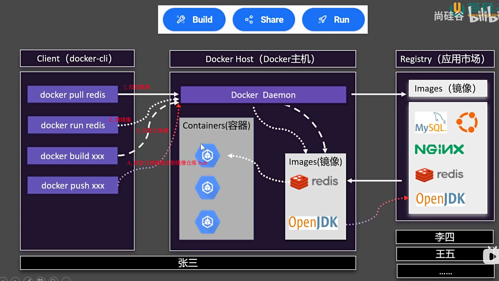
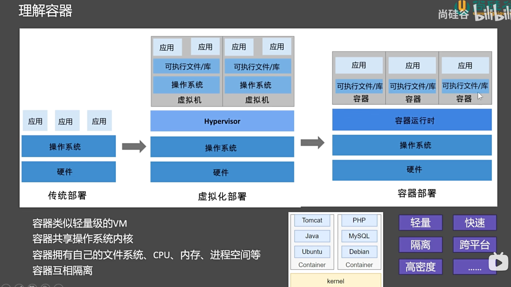

# 说明

::: danger 文档介绍
💞 教程: [尚硅谷](https://www.bilibili.com/video/BV1Zn4y1X7AZ?spm_id_from=333.788.videopod.episodes&vd_source=a5562c9c5e71d043328e11d8d153df25)

:::

## 基础说明

### 作用

1. 跨平台安装同一套环境

### 架构



### 容器



## 安装 docker

### linux

> 当前使用 centos 7

1. 卸载旧版本

```shell
# 移除旧版本docker
sudo yum remove docker \
                  docker-client \
                  docker-client-latest \
                  docker-common \
                  docker-latest \
                  docker-latest-logrotate \
                  docker-logrotate \
                  docker-engine
```

2. 配置源

> 此处使用阿里源

```shell
sudo yum install -y yum-utils
sudo yum-config-manager \
--add-repo \
http://mirrors.aliyun.com/docker-ce/linux/centos/docker-ce.repo
```

3. 安装 docker

```shell
# 安装 最新 docker
sudo yum install -y docker-ce docker-ce-cli containerd.io docker-buildx-plugin docker-compose-plugin

# docker-ce 引擎
# docker-ce-cli 命令行工具
# containerd.io 运行时
# docker-buildx-plugin 构建工具
# docker-compose-plugin 编排工具
```

4. 启动 docker

```shell
# 启动& 开机启动docker； enable + start 二合一
systemctl enable docker --now

# --now：这个选项会立即启动 Docker 服务，而不仅仅是设置为开机自启动。也就是说，执行这条命令后，Docker 服务会立即开始运行
```

5. 配置加速源地址

```shell
sudo mkdir -p /etc/docker # 创建目录

# 写入配置，/etc/docker/daemon.json 后台进程的配置文件在这里面。
# 在配置文件中写入镜像加速地址
sudo tee /etc/docker/daemon.json <<-'EOF'
{
    "registry-mirrors": [
        "https://mirror.ccs.tencentyun.com",
        "https://docker.m.daocloud.io"
    ]
}
EOF
sudo systemctl daemon-reload # 重新加载配置
# 重新加载配置文件：当你对 systemd 的服务单元文件（如 .service 文件）进行修改后，需要执行这条命令以使 systemd 重新读取这些配置文件。这样，systemd 才能应用新的配置
# 不影响正在运行的服务：执行这条命令不会中断或重启正在运行的服务，它只是更新 systemd 的配置缓存

sudo systemctl restart docker  # 重启docker
```
