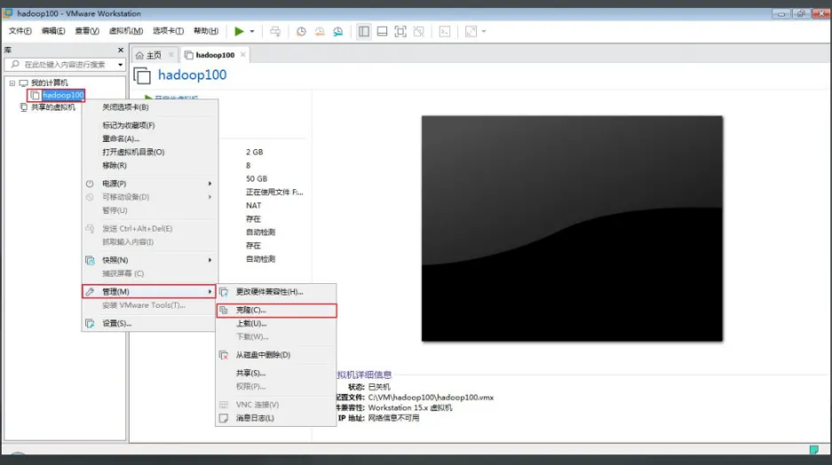
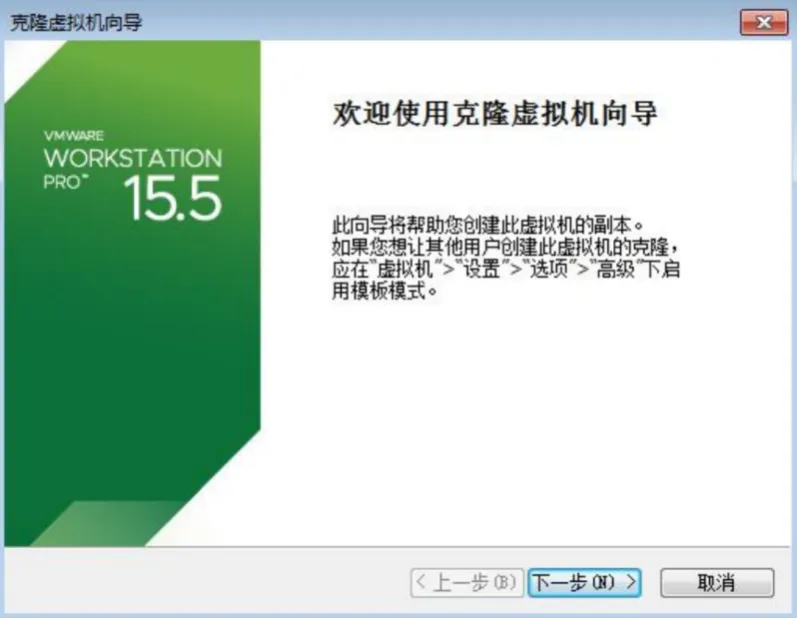
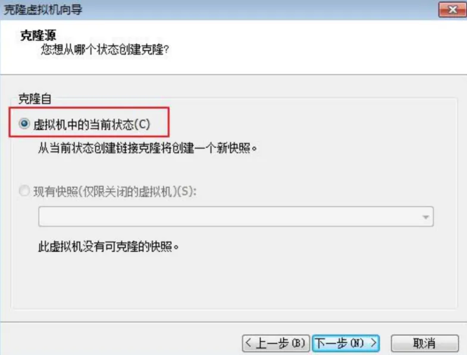
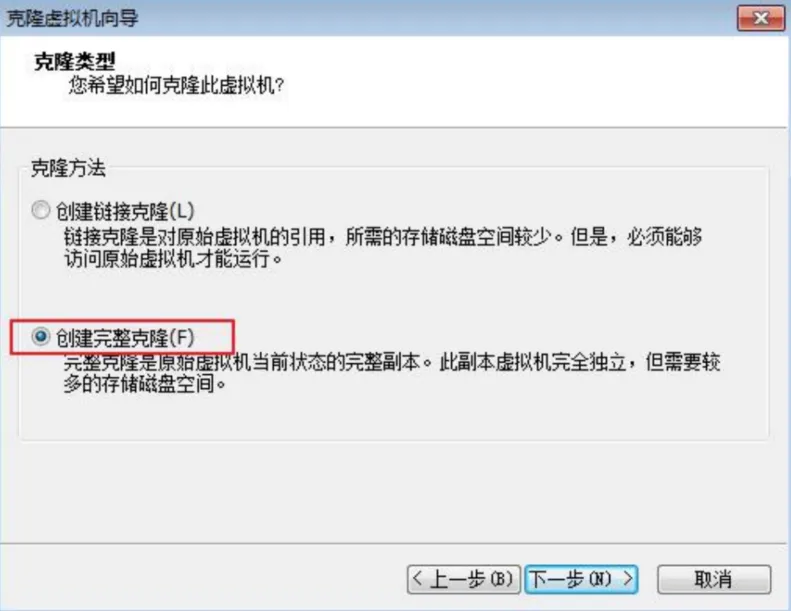
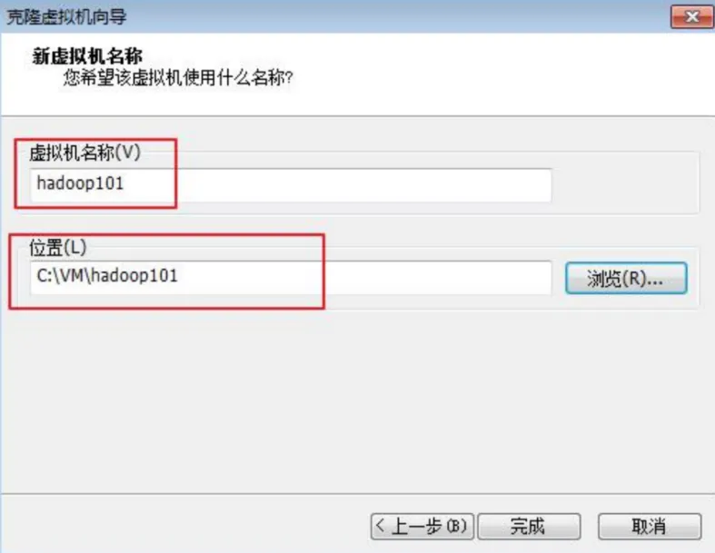
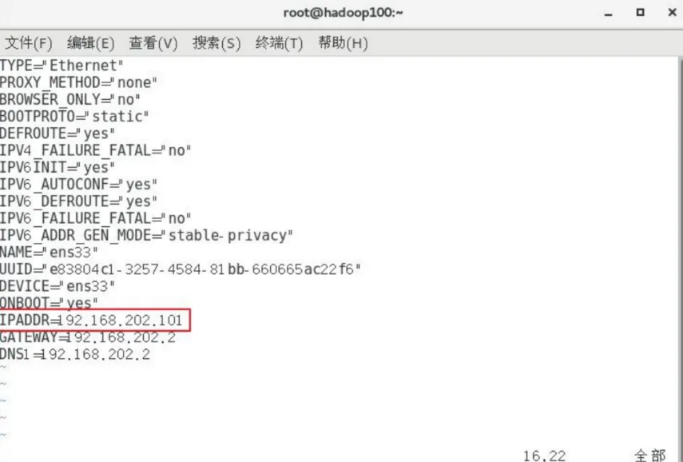
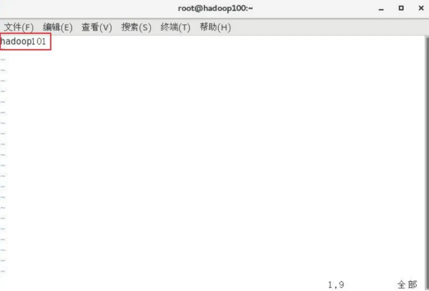

::: danger 说明
这里的内容是 window

mac 虚拟机基础款已经在 虚拟机/base
:::

# 虚拟机克隆

## 克隆流程

从现有虚拟机(关机状态)克隆出新虚拟机，右键选择管理 - 克隆



点击下一步



选择虚拟机中的当前状态



选择创建完整克隆



设置虚拟机名称及存储位置



## 修改配置

修改 vim /etc/sysconfig/network-scripts/ifcfg-ens33，修改 IP 地址（root 用户进入）



修改主机名：/etc/hostname



```bash
# 重启网络服务
service network restart
```
