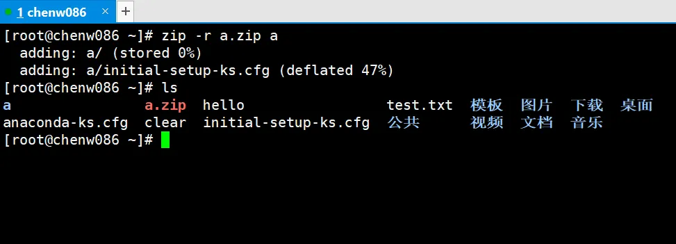
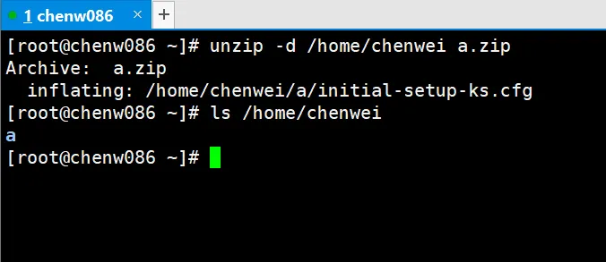
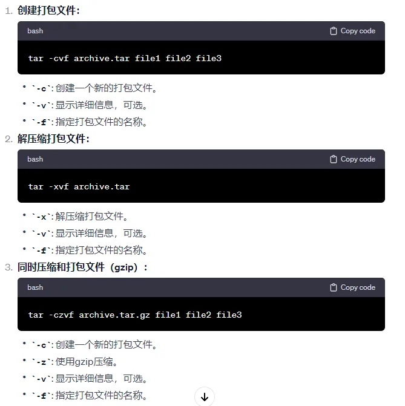

# 压缩与解压

## gzip/gunzip

```shell
gzip 文件  # 压缩文件，只能将文件压缩为 *.gz 文件

gunzip 文件.gz  # 解压缩文件命令
```

只能压缩文件不能压缩目录，不保留原来的文件，同时多个文件会产生多个压缩包

示例：将文件压缩再解压

```shell
# 这里的 a 是复制的 Cen..
# cp Centos-altarch-7.repo ./a
[root@localhost ~]# ls
a  anaconda-ks.cfg  Centos-altarch-7.repo  chenwei  wget-1.14-18.el7_6.1.x86_64.rpm

[root@localhost ~]# gzip a
[root@localhost ~]# ll
总用量 16
-rw-r--r--. 1 root root  486 10月 24 06:26 a.gz
-rw-------. 1 root root 1086 10月 22 23:13 anaconda-ks.cfg
-rw-r--r--. 1 root root 1428 4月  11 2023 Centos-altarch-7.repo
-rw-r--r--. 1 root root    0 10月 24 01:57 chenwei
-rw-r--r--. 1 root root  146 10月 23 08:34 wget-1.14-18.el7_6.1.x86_64.rpm
[root@localhost ~]# gunzip a.gz
[root@localhost ~]# ll
总用量 16
-rw-r--r--. 1 root root 1428 10月 24 06:26 a
-rw-------. 1 root root 1086 10月 22 23:13 anaconda-ks.cfg
-rw-r--r--. 1 root root 1428 4月  11 2023 Centos-altarch-7.repo
-rw-r--r--. 1 root root    0 10月 24 01:57 chenwei
-rw-r--r--. 1 root root  146 10月 23 08:34 wget-1.14-18.el7_6.1.x86_64.rpm
```

## zip/unzip

```shell
zip [选项] XXX.zip 将要压缩的内容  # 压缩文件和目录的命令

unzip [选项] XXX.zip  # 解压缩文件
```

| zip 选项 | 功能     |
| :------- | -------- |
| -r       | 压缩目录 |

| unzip 选项 | 功能                     |
| :--------- | ------------------------ |
| -d<目录>   | 指定压缩后文件的存放目录 |





## tar

```shell
tar [选项] XXX 将要打包进去的内容  # 打包目录，压缩后的文件格式.tar.gz
```

| 选项 | 功能               |
| :--- | ------------------ |
| -c   | 产生.tar 打包文件  |
| -v   | 显示详细信息       |
| -f   | 指定压缩后的文件名 |
| -z   | 使用 gzip 解压缩   |
| -x   | 解包.tar 文件      |
| -C   | 解压到指定目录     |

```shell
[root@localhost ~]# ls
a  adir  anaconda-ks.cfg  Centos-altarch-7.repo  chenwei  wget-1.14-18.el7_6.1.x86_64.rpm
[root@localhost ~]# ll
总用量 16
-rw-r--r--. 1 root root 1428 10月 24 06:26 a
drwxr-xr-x. 2 root root    6 10月 24 06:29 adir
-rw-------. 1 root root 1086 10月 22 23:13 anaconda-ks.cfg
-rw-r--r--. 1 root root 1428 4月  11 2023 Centos-altarch-7.repo
-rw-r--r--. 1 root root    0 10月 24 01:57 chenwei
-rw-r--r--. 1 root root  146 10月 23 08:34 wget-1.14-18.el7_6.1.x86_64.rpm

[root@localhost ~]# tar -cvf test.tar a adir/
a
adir/
[root@localhost ~]# ls
a  adir  anaconda-ks.cfg  Centos-altarch-7.repo  chenwei  test.tar  wget-1.14-18.el7_6.1.x86_64.rpm

[root@localhost ~]# rm -rf a adir/
[root@localhost ~]# ls
anaconda-ks.cfg  Centos-altarch-7.repo  chenwei  test.tar  wget-1.14-18.el7_6.1.x86_64.rpm

[root@localhost ~]# tar -xvf test.tar
a
adir/
[root@localhost ~]# ls
a  adir  anaconda-ks.cfg  Centos-altarch-7.repo  chenwei  test.tar  wget-1.14-18.el7_6.1.x86_64.rpm
[root@localhost ~]# ll
总用量 28
-rw-r--r--. 1 root root  1428 10月 24 06:26 a
drwxr-xr-x. 2 root root     6 10月 24 06:29 adir
-rw-------. 1 root root  1086 10月 22 23:13 anaconda-ks.cfg
-rw-r--r--. 1 root root  1428 4月  11 2023 Centos-altarch-7.repo
-rw-r--r--. 1 root root     0 10月 24 01:57 chenwei
-rw-r--r--. 1 root root 10240 10月 24 07:12 test.tar
-rw-r--r--. 1 root root   146 10月 23 08:34 wget-1.14-18.el7_6.1.x86_64.rpm
```



解压到指定目录

```shell
[root@localhost ~]# ls
a  adir  anaconda-ks.cfg  Centos-altarch-7.repo  chenwei  test.tar  wget-1.14-18.el7_6.1.x86_64.rpm
[root@localhost ~]# mkdir test
[root@localhost ~]# tar -xvf test.tar -C ./test
a
adir/
[root@localhost ~]# ls ./test
a  adir
```
