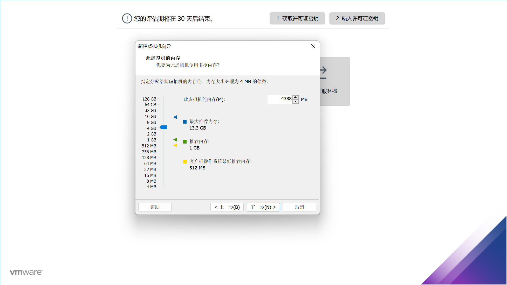
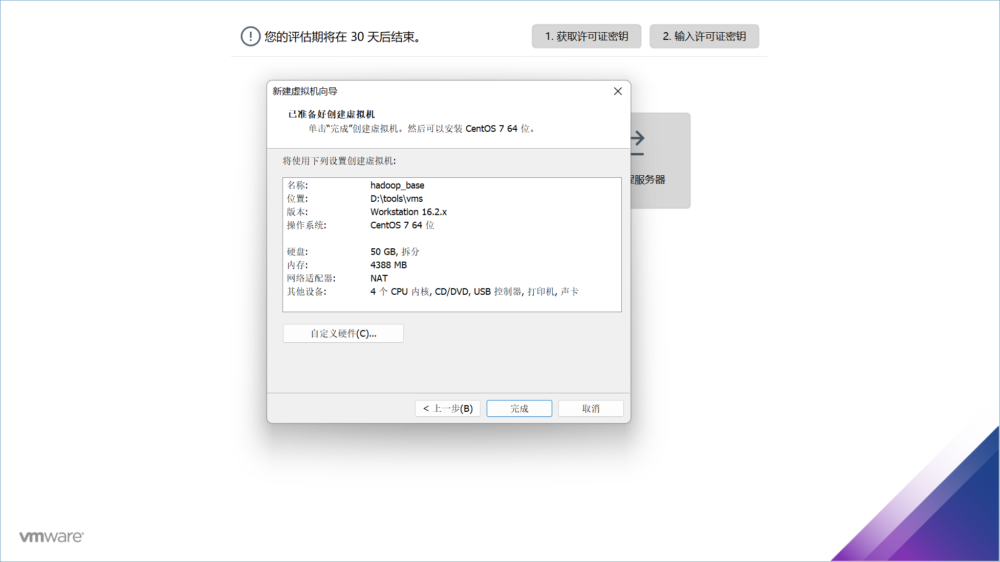
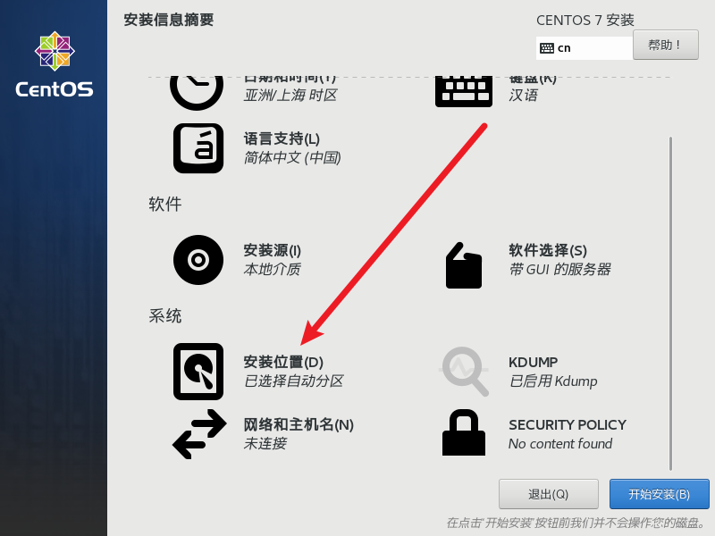
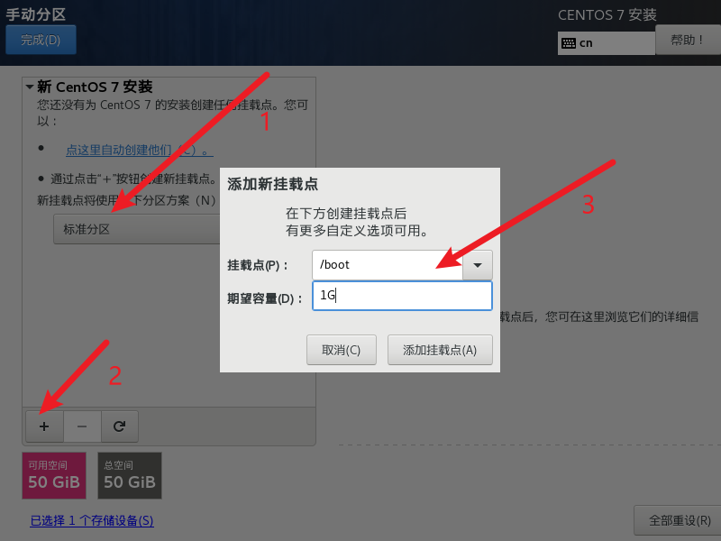
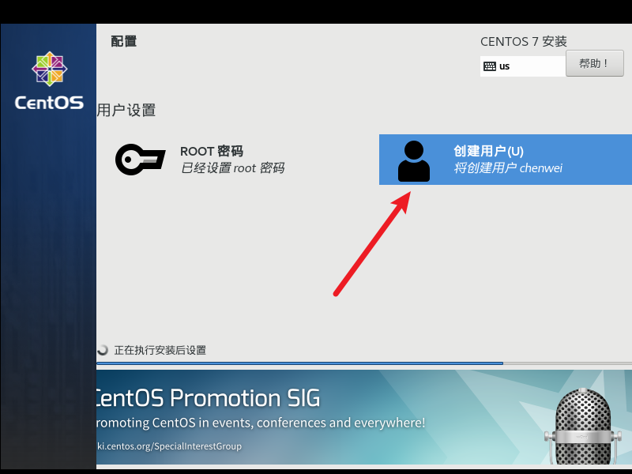
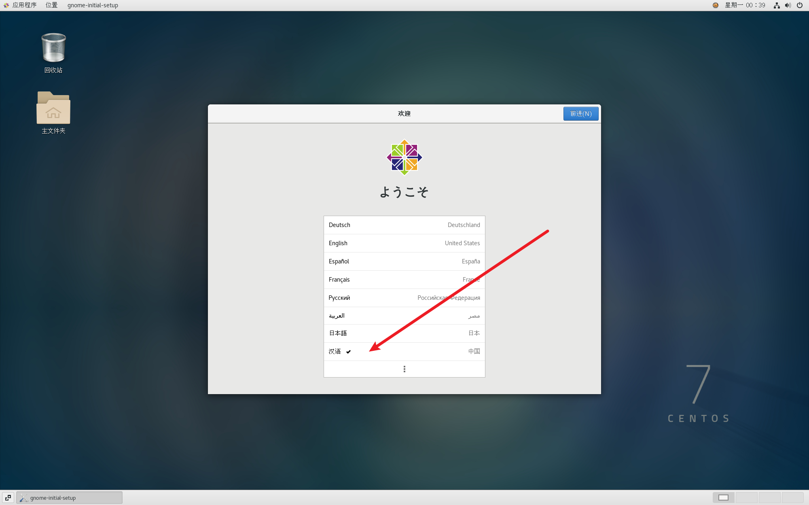

# 安装

此篇幅主要将如何安装 vmware 与 centos

## 安装新虚拟机

[官网地址：](https://www.vmware.com/cn.html)

::: details 陈伟资源所处位置

> 资源所在地址：D:\学习\2. linux 笔记\linux 学习资料\资料

里面包含 vmware、centos7、Xshell7 安装包

:::

**安装 vmware**

1. 安装的时候所有选项都取消勾选，除了协议
2. 安装完毕桌面点击打开，选择 30 天试用
3. 进入到安装页面

   

4. 创建新的虚拟机

   - 选择自定义
     
   - 直接下一步
     
   - 稍后安装操作系统
     
   - 版本选择
     
   - 硬盘选择（随意）
     
   - 处理器的选择

     > 任务管理器里面查看，一个 cpu 四个内核拓展出 8 个逻辑内核

     

   - 配置选择
     
   - 虚拟机内存选择
     
   - 网络选择
     
   - IO 控制器
     
   - 磁盘类型
     
   - 选择哪个磁盘
     
   - 指定磁盘容量
     
   - 磁盘文件名称，直接选中默认
     
   - 完成
     

## 安装 centos

**确认电脑是否支持 vt-x**

> 查看是否已启用
> 位置在：任务管理器 - 性能

**安装**

1. 选择 iso

   

2. 开启虚拟机

   

3. 进入黑屏，选择第一个回车

4. 选择简体中文

5. 

6. 选择桌面

   

7. 分区

   

8. 手动分区

   

9. 引导分区

   

10. 引导分区

    > 之前设置了 4G 的虚拟内存，但是当虚拟内存软件运行满了，
    > 就把限制的软件运行移到 swap 分区

    

11. 

12. 剩余内存分区

    

13. 分区配置完成

    

14. 系统崩溃诊断

    > 正式环境需要打开，因为是测试，所以这里关闭

    > 歇菜了直接打开

    

15. 网络和主机配置

    

16. 然后点击 - 开始安装

17. 设置 root 密码

    > 此处设置的是： w19950806

    

18. 创建用户

    > 用户: chenwei

    > 密码： w19950806

    

19. 安装完成点击重启

    

20. 点击进去同意即可

    

21. 完成配置

    

22. 然后登录，这里可以选择登录别的用户

    

23. 

24. 

25. 

26. 

27. 介绍页面直接关闭即可

    

## 桌面与终端

**进入终端**

> ctrl + alt + f2
>
> 也可以 + f3~6 多开几个终端，多个用户操作
>
> ctrl + alt + f1 切回桌面

**终端**

> 桌面右键打开终端

**创建文档**

> 点击右上角应用 - 点击工具 - 点击文档编辑器
>
> 输入任意内容，点击保存就会提示保存到哪里了，否则别的位置是没办法创建文档文件的
>
> 不想要的文件永久删除：shift + del

