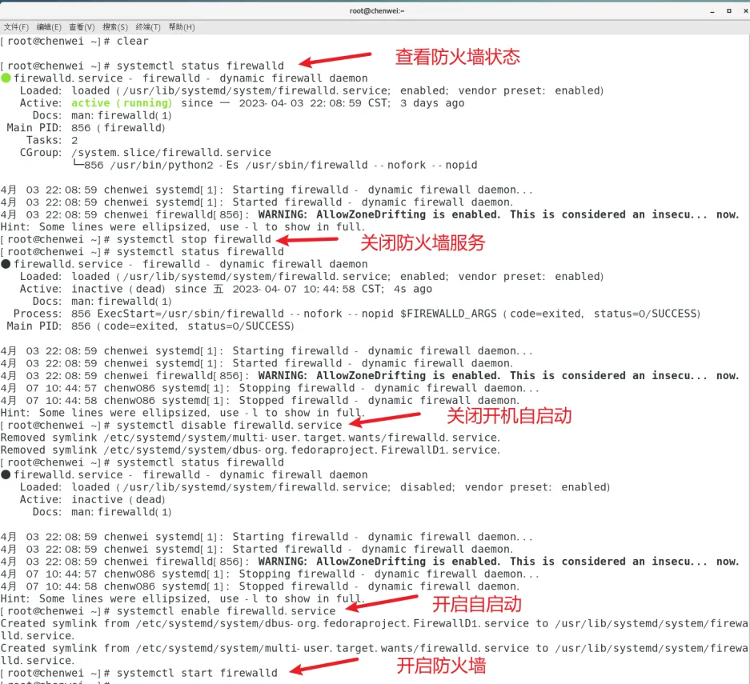
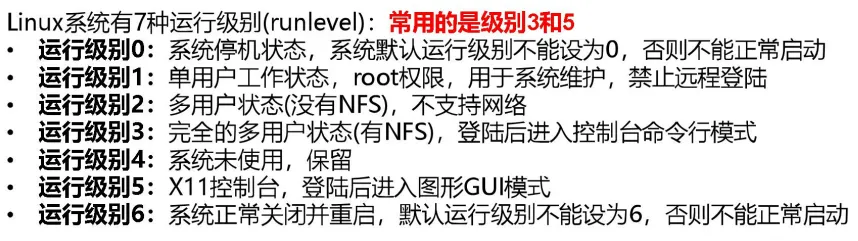

# 系统管理

## 进程与服务

Process：计算机中，一个正在执行的程序或命令，叫做进程

Service：启动之后一直存在、常驻内存的进程，一般成为服务

## 服务管理

查看服务，服务存在的文件目录：/usr/lib/systemd/system

::: details 展开

```shell
[root@localhost ~]# ls /usr/lib/systemd/system
auditd.service                          dracut-pre-pivot.service           kdump.service                       polkit.service                     runlevel4.target.wants                         systemd-binfmt.service                  systemd-shutdownd.service
autovt@.service                         dracut-pre-trigger.service         kexec.target                        postfix.service                    runlevel5.target                               systemd-bootchart.service               systemd-shutdownd.socket
basic.target                            dracut-pre-udev.service            kexec.target.wants                  poweroff.target                    runlevel5.target.wants                         systemd-firstboot.service               systemd-suspend.service
basic.target.wants                      dracut-shutdown.service            kmod-static-nodes.service           poweroff.target.wants              runlevel6.target                               systemd-fsck-root.service               systemd-sysctl.service
blk-availability.service                ebtables.service                   local-fs-pre.target                 printer.target                     selinux-policy-migrate-local-changes@.service  systemd-fsck@.service                   systemd-timedated.service
bluetooth.target                        emergency.service                  local-fs.target                     proc-sys-fs-binfmt_misc.automount  serial-getty@.service                          systemd-halt.service                    systemd-tmpfiles-clean.service
brandbot.path                           emergency.target                   local-fs.target.wants               proc-sys-fs-binfmt_misc.mount      shutdown.target                                systemd-hibernate-resume@.service       systemd-tmpfiles-clean.timer
brandbot.service                        final.target                       lvm2-lvmetad.service                quotaon.service                    shutdown.target.wants                          systemd-hibernate.service               systemd-tmpfiles-setup-dev.service
console-getty.service                   firewalld.service                  lvm2-lvmetad.socket                 rc-local.service                   sigpwr.target                                  systemd-hostnamed.service               systemd-tmpfiles-setup.service
console-shell.service                   fstrim.service                     lvm2-lvmpolld.service               rdisc.service                      sleep.target                                   systemd-hwdb-update.service             systemd-udevd-control.socket
container-getty@.service                fstrim.timer                       lvm2-lvmpolld.socket                reboot.target                      -.slice                                        systemd-hybrid-sleep.service            systemd-udevd-kernel.socket
cpupower.service                        getty-pre.target                   lvm2-monitor.service                reboot.target.wants                slices.target                                  systemd-importd.service                 systemd-udevd.service
crond.service                           getty@.service                     lvm2-pvscan@.service                remote-cryptsetup.target           smartcard.target                               systemd-initctl.service                 systemd-udev-settle.service
cryptsetup-pre.target                   getty.target                       machine.slice                       remote-fs-pre.target               sockets.target                                 systemd-initctl.socket                  systemd-udev-trigger.service
cryptsetup.target                       graphical.target                   machines.target                     remote-fs.target                   sockets.target.wants                           systemd-journal-catalog-update.service  systemd-update-done.service
ctrl-alt-del.target                     graphical.target.wants             messagebus.service                  rescue.service                     sound.target                                   systemd-journald.service                systemd-update-utmp-runlevel.service
dbus-org.freedesktop.hostname1.service  halt-local.service                 multi-user.target                   rescue.target                      sshd-keygen.service                            systemd-journald.socket                 systemd-update-utmp.service
dbus-org.freedesktop.import1.service    halt.target                        multi-user.target.wants             rescue.target.wants                sshd.service                                   systemd-journal-flush.service           systemd-user-sessions.service
dbus-org.freedesktop.locale1.service    halt.target.wants                  NetworkManager-dispatcher.service   rhel-autorelabel-mark.service      sshd@.service                                  systemd-kexec.service                   systemd-vconsole-setup.service
dbus-org.freedesktop.login1.service     hibernate.target                   NetworkManager.service              rhel-autorelabel.service           sshd.socket                                    systemd-localed.service                 system.slice
dbus-org.freedesktop.machine1.service   hybrid-sleep.target                NetworkManager-wait-online.service  rhel-configure.service             suspend.target                                 systemd-logind.service                  system-update.target
dbus-org.freedesktop.timedate1.service  initrd-cleanup.service             network-online.target               rhel-dmesg.service                 swap.target                                    systemd-machined.service                teamd@.service
dbus.service                            initrd-fs.target                   network-pre.target                  rhel-domainname.service            sys-fs-fuse-connections.mount                  systemd-machine-id-commit.service       timers.target
dbus.socket                             initrd-parse-etc.service           network.target                      rhel-import-state.service          sysinit.target                                 systemd-modules-load.service            timers.target.wants
dbus.target.wants                       initrd-root-fs.target              nss-lookup.target                   rhel-loadmodules.service           sysinit.target.wants                           systemd-nspawn@.service                 time-sync.target
debug-shell.service                     initrd-switch-root.service         nss-user-lookup.target              rhel-readonly.service              sys-kernel-config.mount                        systemd-poweroff.service                tmp.mount
default.target                          initrd-switch-root.target          paths.target                        rpcbind.target                     sys-kernel-debug.mount                         systemd-quotacheck.service              tuned.service
default.target.wants                    initrd-switch-root.target.wants    plymouth-halt.service               rsyslog.service                    syslog.socket                                  systemd-random-seed.service             umount.target
dev-hugepages.mount                     initrd.target                      plymouth-kexec.service              runlevel0.target                   syslog.target.wants                            systemd-readahead-collect.service       user.slice
dev-mqueue.mount                        initrd.target.wants                plymouth-poweroff.service           runlevel1.target                   systemd-ask-password-console.path              systemd-readahead-done.service          wpa_supplicant.service
dm-event.service                        initrd-udevadm-cleanup-db.service  plymouth-quit.service               runlevel1.target.wants             systemd-ask-password-console.service           systemd-readahead-done.timer
dm-event.socket                         iprdump.service                    plymouth-quit-wait.service          runlevel2.target                   systemd-ask-password-plymouth.path             systemd-readahead-drop.service
dracut-cmdline.service                  iprinit.service                    plymouth-read-write.service         runlevel2.target.wants             systemd-ask-password-plymouth.service          systemd-readahead-replay.service
dracut-initqueue.service                iprupdate.service                  plymouth-reboot.service             runlevel3.target                   systemd-ask-password-wall.path                 systemd-reboot.service
dracut-mount.service                    iprutils.target                    plymouth-start.service              runlevel3.target.wants             systemd-ask-password-wall.service              systemd-remount-fs.service
dracut-pre-mount.service                irqbalance.service                 plymouth-switch-root.service        runlevel4.target                   systemd-backlight@.service                     systemd-rfkill@.service
```

:::

基本语法：

```bash
# 启动 | 停止 | 重启 | 查看
systemctl start | stop | restart | status 服务名
```

查看服务状态示例：

```shell
[root@localhost ~]# systemctl status NetworkManager
● NetworkManager.service - Network Manager
   Loaded: loaded (/usr/lib/systemd/system/NetworkManager.service; enabled; vendor preset: enabled)
   Active: active (running) since 四 2024-10-24 00:03:29 CST; 10min ago
     Docs: man:NetworkManager(8)
 Main PID: 883 (NetworkManager)
   CGroup: /system.slice/NetworkManager.service
           └─883 /usr/sbin/NetworkManager --no-daemon

10月 24 00:03:30 localhost.localdomain NetworkManager[883]: <info>  [1729699410.0178] device (ens160): state change: config -> ip-config (reason 'none', sys-iface-state: 'managed')
10月 24 00:03:30 localhost.localdomain NetworkManager[883]: <info>  [1729699410.0193] device (ens160): state change: ip-config -> ip-check (reason 'none', sys-iface-state: 'managed')
10月 24 00:03:30 localhost.localdomain NetworkManager[883]: <info>  [1729699410.0199] device (ens160): state change: ip-check -> secondaries (reason 'none', sys-iface-state: 'managed')
10月 24 00:03:30 localhost.localdomain NetworkManager[883]: <info>  [1729699410.0205] device (ens160): state change: secondaries -> activated (reason 'none', sys-iface-state: 'managed')
10月 24 00:03:30 localhost.localdomain NetworkManager[883]: <info>  [1729699410.0208] manager: NetworkManager state is now CONNECTED_LOCAL
10月 24 00:03:30 localhost.localdomain NetworkManager[883]: <info>  [1729699410.0219] manager: NetworkManager state is now CONNECTED_SITE
10月 24 00:03:30 localhost.localdomain NetworkManager[883]: <info>  [1729699410.0221] policy: set 'ens33' (ens160) as default for IPv4 routing and DNS
10月 24 00:03:30 localhost.localdomain NetworkManager[883]: <info>  [1729699410.0228] device (ens160): Activation: successful, device activated.
10月 24 00:03:30 localhost.localdomain NetworkManager[883]: <info>  [1729699410.0236] manager: NetworkManager state is now CONNECTED_GLOBAL
10月 24 00:03:30 localhost.localdomain NetworkManager[883]: <info>  [1729699410.0241] manager: startup complete
```

## 服务自启动配置

```bash
# 功能描述：查看服务开机启动状态
systemctl status list-unit-files

# 功能描述：关闭服务
systemctl stop list-unit-files

# 功能描述：关掉指定服务的自动启动
systemctl disable service_name

# 功能描述：开启指定服务的自动启动
systemctl enable service_name
```

对防火墙的操作示例：



## 服务运行级别

```shell
[root@localhost ~]# systemctl get-default
multi-user.target
```



简化：

- multi-user.target 等价于原运行级别 3（多用户有网，无图形界面）
- graphical.target 等价于原运行级别 5（多用户有网，有图形界面）

修改当前运行级别：

```shell
#（这里 TARGET 取 multi-user 或者 graphical）
systemctl set-default TARGET.target
```

## 关机重启指令

| 语法                       | 说明                                                                                                                    | 备注                                                                                                                                                                                                                                                                                                                                                                            |
| :------------------------- | ----------------------------------------------------------------------------------------------------------------------- | :------------------------------------------------------------------------------------------------------------------------------------------------------------------------------------------------------------------------------------------------------------------------------------------------------------------------------------------------------------------------------ |
| sync                       | 将数据由内存同步到硬盘中                                                                                                | Linux 系统中为了提高磁盘的读写效率，对磁盘采取了 “预读迟写”操作方式。当用户保存文件时，Linux 核心并不一定立即将保存数据写入物理磁盘中，而是将数据保存在缓冲区中，等缓冲区满时再写入磁盘，这种方式可以极大的提高磁盘写入数据的效率。但是，也带来了安全隐患，如果数据还未写入磁盘时，系统掉电或者其他严重问题出现，则将导致数据丢失。使用 sync 指令可以立即将缓冲区的数据写入磁盘 |
| halt                       | 停机，关闭系统，但不断电                                                                                                |                                                                                                                                                                                                                                                                                                                                                                                 |
| poweroff                   | 关机，停电                                                                                                              |                                                                                                                                                                                                                                                                                                                                                                                 |
| reboot                     | 就是重启，等同于 shutdown -r now                                                                                        |                                                                                                                                                                                                                                                                                                                                                                                 |
| shutdown [选项] [时间参数] | 选项：-H 相当于 -halt，停机、 -r 相当于 reboot 重启、-c 撤销关机的指令。 时间参数：now 立刻关机，或者数字（单位是分钟） |                                                                                                                                                                                                                                                                                                                                                                                 |
