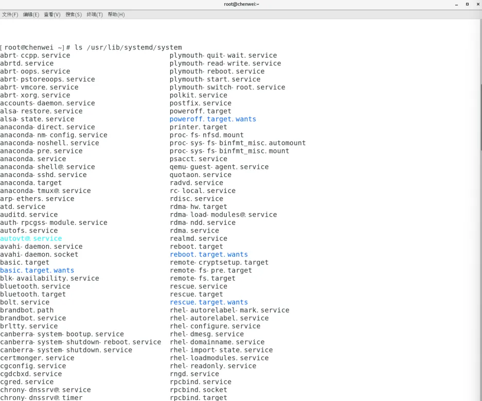

# 系统管理

## 进程与服务

Process：计算机中，一个正在执行的程序或命令，叫做进程

Service：启动之后一直存在、常驻内存的进程，一般成为服务

## 服务管理

查看服务，服务存在的文件目录：/usr/lib/systemd/system



基本语法：

```bash
# 启动 | 停止 | 重启 | 查看
systemctl start | stop | restart | status 服务名
```

查看服务状态示例：


## 服务自启动配置

```bash
# 功能描述：查看服务开机启动状态
systemctl status list-unit-files

# 功能描述：关掉指定服务的自动启动
systemctl disable service_name

# 功能描述：开启指定服务的自动启动
systemctl enable service_name
```

对防火墙的操作示例：


