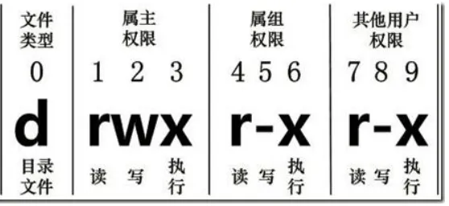
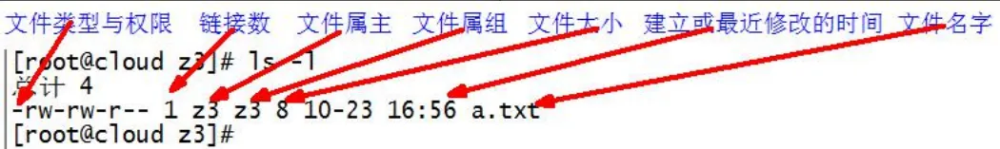
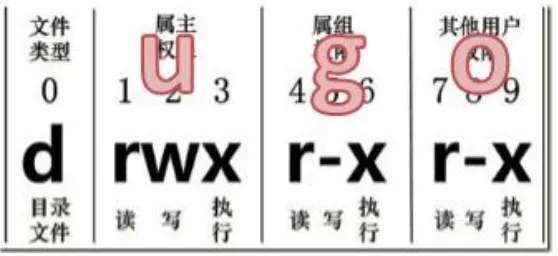
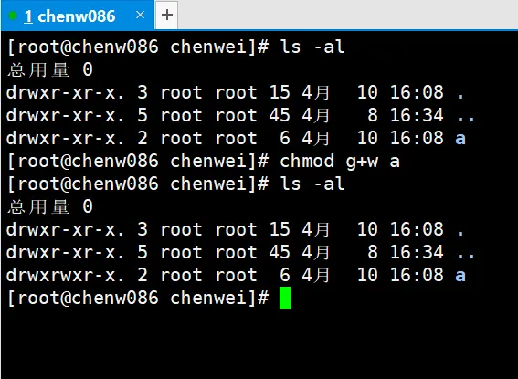
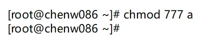
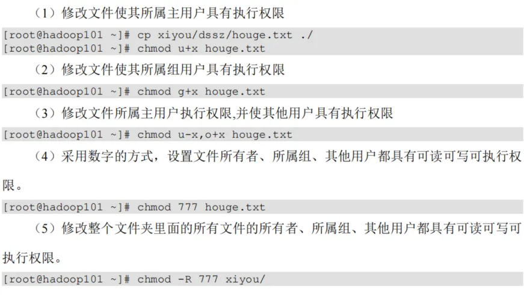

# 文件权限

linux 系统是一种典型的多用户系统，不同的用户处于不同的地位拥有不同的权限。为了保护系统的安全性，linux 系统对不同的用户访问同一文件（包括目录文件）的权限做了不同的规定。在 linux 中我们可以使用 ll 或者 ls -l 命令来显示一个文件的属性以及文件所属的用户和组

## 文件属性

从左到右的 10 个字符表示



0 位表示类型，在 linux 中第一个字符代表这个文件类型

- -代表文件
- d 代表目录
- l 连接文档

rwx 解释：

- r：代表可读，可以读取查看
- w：代表可写，但是不代表可以删除文件，删除一个文件的前提是该文件所在的目录有写权限，才能删除文件
- x：代表可以被系统执行



对于链接数：

- 文件：链接数指的是硬链接个数
- 文件夹：子文件夹个数

## chmod

改变权限



```shell
# u:所有者 g:所有组 o:其他人 a:所有人(u、g、o 的总和)
# u=ew  --> u=rw-
# g+r  --> 之前是 --- 就改成 r--
# o-r  --> 之前是 r-x 就改成 --x
# a：r=4 w=2 x=1 rwx=4+2+1=7
chmod [{ugoa}{+-=}{rwx}] 文件或目录  # 第一种方式变更权限

chmod [mode=421 ] [文件或目录]  # 第二种方式变更权限
```

给用户组加上写的权限







## chown

改变所有者

```shell
# 改变文件或者目录的所有者
chown [选项] [最终用户] [文件或目录]
```

| 选项 | 描述     |
| :--- | -------- |
| -R   | 递归操作 |

```shell
[root@localhost ~]# chown test11 anaconda-ks.cfg
[root@localhost ~]# ll
总用量 24
-rwxrwxrwx. 1 test11 test33  1086 10月 22 23:13 anaconda-ks.cfg
-rw-r--r--. 1 root   root    1428 4月  11 2023 Centos-altarch-7.repo
lrwxrwxrwx. 1 root   root       6 11月  2 16:45 ln.log -> ls.log
-rw-r--r--. 1 root   root       6 11月  2 16:45 ls.log
drwxr-xr-x. 2 root   root       6 11月  2 16:16 mvtest
-rw-r--r--. 1 root   root   10240 10月 24 07:12 test.tar
[root@localhost ~]#
```

## chgrp

改变所属组

```shell
chgrp [最终用户组] [文件或目录]  # 改变文件或者目录的所属组
```

```shell
[root@localhost ~]# chgrp test33 anaconda-ks.cfg
[root@localhost ~]# ll
总用量 24
-rwxrwxrwx. 1 test11 test33  1086 10月 22 23:13 anaconda-ks.cfg
-rw-r--r--. 1 root   root    1428 4月  11 2023 Centos-altarch-7.repo
lrwxrwxrwx. 1 root   root       6 11月  2 16:45 ln.log -> ls.log
-rw-r--r--. 1 root   root       6 11月  2 16:45 ls.log
drwxr-xr-x. 2 root   root       6 11月  2 16:16 mvtest
-rw-r--r--. 1 root   root   10240 10月 24 07:12 test.tar
[root@localhost ~]#
```
