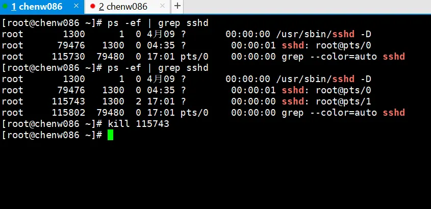

# 进程管理

进程是正在执行的一个程序或命令，每一个进程都是一个运行的实体，都有自己的地址空间，并占用一定的系统资源

## ps

查看当前系统进程状态

```shell
ps aux | grep xxx （功能描述：查看系统中所有进程）
ps -ef | grep xxx （功能描述：可以查看子父进程之间的关系）
```

直接敲 ps 是当前控制台相关联的一些进程

```shell
[root@localhost ~]# ps
  PID TTY          TIME CMD
 1664 pts/0    00:00:00 bash
19543 pts/0    00:00:00 ps
```

| 选项 | 功能                                       |
| :--- | ------------------------------------------ |
| a    | 列出带有终端的所有用户的进程               |
| x    | 列出当前用户的所有进程，包括没有终端的进程 |
| u    | 面向用户友好的显示风格                     |
| -e   | 列出所有进程                               |
| -u   | 列出某个用户关联的所有进程                 |
| -f   | 显示完整格式的进程列表                     |

- ps aux 显示信息说明

```shell
[root@localhost ~]# ps aux
USER       PID %CPU %MEM    VSZ   RSS TTY      STAT START   TIME COMMAND
root         1  0.0  0.2  92564  7788 ?        Ss   10月23   0:10 /usr/lib/systemd/systemd --switched-root --system --deserialize 22
root         2  0.0  0.0      0     0 ?        S    10月23   0:00 [kthreadd]
root         3  0.0  0.0      0     0 ?        I<   10月23   0:00 [rcu_gp]
root         4  0.0  0.0      0     0 ?        I<   10月23   0:00 [rcu_par_gp]
root         6  0.0  0.0      0     0 ?        I<   10月23   0:00 [kworker/0:0H-ev]
root         8  0.0  0.0      0     0 ?        I<   10月23   0:00 [mm_percpu_wq]
root         9  0.0  0.0      0     0 ?        S    10月23   0:00 [rcu_tasks_rude_]

...
```

| 选项    | 功能                                                                                                                                              |
| :------ | ------------------------------------------------------------------------------------------------------------------------------------------------- |
| USER    | 该进程是由哪个用户产生的                                                                                                                          |
| PID     | 进程的 ID 号                                                                                                                                      |
| %CPU    | 该进程占用 CPU 资源的百分比，占用越高，进程越耗费资源                                                                                             |
| %MEM    | 该进程占用物理内存的百分比，占用越高，进程越耗费资源                                                                                              |
| VSZ     | 该进程占用虚拟内存的大小，单位 KB                                                                                                                 |
| RSS     | 该进程占用实际物理内存的大小，单位 KB                                                                                                             |
| TTY     | 该进程是在哪个终端中运行的。对于 CentOS 来说，tty1 是图形化终端，tty2-tty6 是本地的字符界面终端。pts/0-255 代表虚拟终端                           |
| STAT    | 进程状态。常见的状态有：R：运行状态、S：睡眠状态、T：暂停状态、 Z：僵尸状态、s：包含子进程、l：多线程、+：前台显示 、<：优先级较高、N：优先级较低 |
| START   | 该进程的启动时间                                                                                                                                  |
| TIME    | 该进程占用 CPU 的运算时间，注意不是系统时间                                                                                                       |
| COMMAND | 产生此进程的命令名                                                                                                                                |

- ps -ef

显示信息说明

```shell
[root@localhost ~]# ps -ef
UID        PID  PPID  C STIME TTY          TIME CMD
root         1     0  0 10月23 ?      00:00:10 /usr/lib/systemd/systemd --switched-root --system --deserialize 22
root         2     0  0 10月23 ?      00:00:00 [kthreadd]
root         3     2  0 10月23 ?      00:00:00 [rcu_gp]
root         4     2  0 10月23 ?      00:00:00 [rcu_par_gp]
root         6     2  0 10月23 ?      00:00:00 [kworker/0:0H-ev]
root         8     2  0 10月23 ?      00:00:00 [mm_percpu_wq]
root         9     2  0 10月23 ?      00:00:00 [rcu_tasks_rude_]
root        10     2  0 10月23 ?      00:00:00 [rcu_tasks_trace]
root        11     2  0 10月23 ?      00:00:00 [ksoftirqd/0]
root        12     2  0 10月23 ?      00:00:01 [rcu_sched]
root        13     2  0 10月23 ?      00:00:00 [migration/0]
root        15     2  0 10月23 ?      00:00:00 [cpuhp/0]
root        16     2  0 10月23 ?      00:00:00 [cpuhp/1]
root        17     2  0 10月23 ?      00:00:00 [migration/1]
root        18     2  0 10月23 ?      00:00:00 [ksoftirqd/1]
root        20     2  0 10月23 ?      00:00:00 [kworker/1:0H-ev]

...
```

| 选项  | 说明                                                                                                                                        |
| :---- | ------------------------------------------------------------------------------------------------------------------------------------------- |
| UID   | 用户 ID                                                                                                                                     |
| PID   | 进程 ID                                                                                                                                     |
| PPID  | 父进程 ID                                                                                                                                   |
| C     | CPU 用于计算执行优先级的因子。数值越大，表明进程是 CPU 密集型运算， 执行优先级会降低；数值越小，表明进程是 I/O 密集型运算，执行优先级会提高 |
| STIME | 进程启动的时间                                                                                                                              |
| TTY   | 完整的终端名称                                                                                                                              |
| TIME  | CPU 时间                                                                                                                                    |
| CMD   | 启动进程所用的命令和参数                                                                                                                    |

- 使用选择

如果想查看进程的 cpu 占用率和内存占用率，可以使用 aux

如果想查看父进程 id 可以使用 ef

## kill

```shell
kill [选项] 进程号 （功能描述：通过进程号杀死进程）
killall 进程名称 （功能描述：通过进程名称杀死进程，也支持通配符，这在系统因负载过大而变得很慢时很有用）
```

| 选项 | 说明                 |
| :--- | -------------------- |
| -9   | 表示强迫进程立即停止 |

新增加一个终端进程，然后杀死这个终端，杀死以后的终端会退出



## pstree

查看进程树

```shell
pstree [选项]
```

| 选项 | 说明               |
| :--- | ------------------ |
| -p   | 显示进程的 pid     |
| -u   | 显示进程的所属用户 |

## top

实时监控进程状态,目前还没找到很好的示例，有需要就去 google

## netstat

显示网络状态和端口占用信息

```shell
netstat -anp | grep 进程号 （功能描述：查看该进程网络信息）
netstat –nlp | grep 端口号 （功能描述：查看网络端口号占用情况）
```

| 选项 | 功能                                                 |
| :--- | ---------------------------------------------------- |
| -a   | 显示所有正在监听（listen）和未监听的套接字（socket） |
| -n   | 拒绝显示别名，能显示数字的全部转化成数字             |
| -l   | 仅列出在监听的服务状态                               |
| -p   | 表示显示哪个进程在调用                               |
