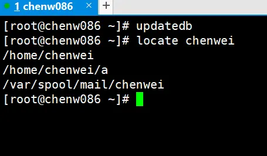

# 搜索查找

## find

查找文件或者目录，find 指令将从指定目录向下递归的遍历各个子目录，将满足条件的文件显示在终端

```shell
find [搜索范围] [选项]
```

| 选项            | 功能                                                                                                                         |
| :-------------- | ---------------------------------------------------------------------------------------------------------------------------- |
| -name<查询方式> | 按照指定的文件名查找文件                                                                                                     |
| -user<用户名>   | 查找属于指定用户名所有的文件                                                                                                 |
| -size<文件大小> | 按照指定的文件大小查找文件,单位为: b —— 块（512 字节）；c —— 字节；w —— 字（2 字节）；k —— 千字节；M —— 兆字节 ；G —— 吉字节 |

```shell
[root@localhost ~]# find / -name test1
/var/spool/mail/test1
/home/test1

# 使用通配符查找
[root@localhost ~]# find / -name "*.cfg"
/boot/efi/EFI/centos/grub.cfg
/etc/python/cert-verification.cfg
/etc/grub2-efi.cfg
/root/anaconda-ks.cfg
/usr/share/perl5/Net/libnet.cfg
```

查找指定用户在指定目录下的所有文件

```shell
[root@localhost ~]# find / -user test
find: ‘/proc/2334/task/2334/fd/6’: 没有那个文件或目录
find: ‘/proc/2334/task/2334/fdinfo/6’: 没有那个文件或目录
find: ‘/proc/2334/fd/5’: 没有那个文件或目录
find: ‘/proc/2334/fdinfo/5’: 没有那个文件或目录
/var/spool/mail/test
/home/test
/home/test/.bash_logout
/home/test/.bash_profile
/home/test/.bashrc
/home/test/.bash_history
/home/test/.viminfo
```

查找指定文件下大于 2M 的文件

```shell
[root@localhost ~]# find /root -size +2M
```

## locate

locate 指令利用事先建立的系统中所有文件名称及路径的 locate 数据库实现快速定位给定的文件。Locate 指令无需遍历整个文件系统，查询速度较快。为了保证查询结果的准确度，管理员必须定期更新 locate 时刻

```shell
locate 搜索文件
```

由于 locate 指令基于数据库进行查询，所以第一次运行前，必须使用 update 指令创建 locate 数据库。如果不这样操作，可能有些文件还没有被写入数据库，它每天是定时刷新的，使用之前先手动刷新一下



## which

查找命令在哪个位置放着在

```shell
[root@localhost ~]# which cd
/usr/bin/cd
```

## grep、|

管道符，| 表示将前一个命令的处理结果穿到给后面的命令处理

```shell
# 过滤查找
grep 选项 查找内容 源文件
```

| 选项 | 功能             |
| :--- | ---------------- |
| -n   | 显示匹配行及行号 |

查找 lang 在 anaconda-ks.cfg 出现的位置

```shell
[root@localhost ~]# grep -n lang anaconda-ks.cfg
14:# System language
15:lang zh_CN.UTF-8
```

查找 root 目录下，包含 .cfg 的文件名

```shell
[root@localhost ~]# ls /root | grep .cfg
anaconda-ks.cfg
```
