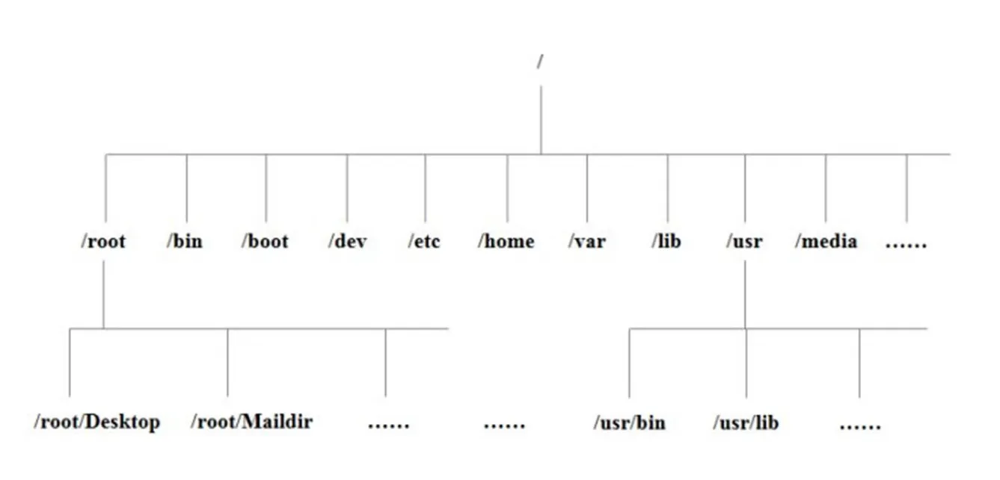
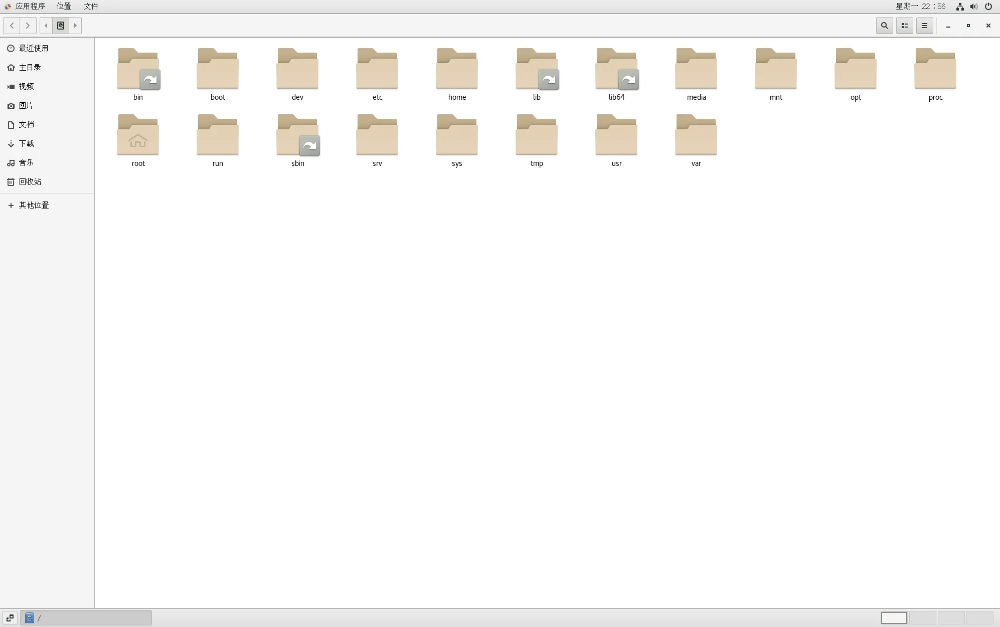
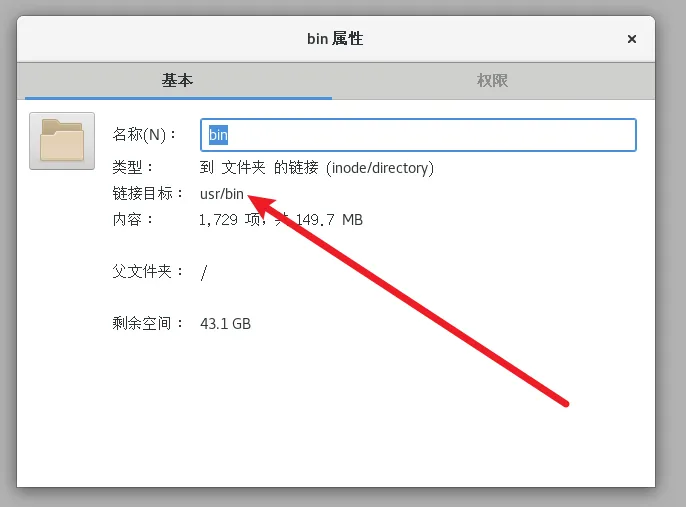
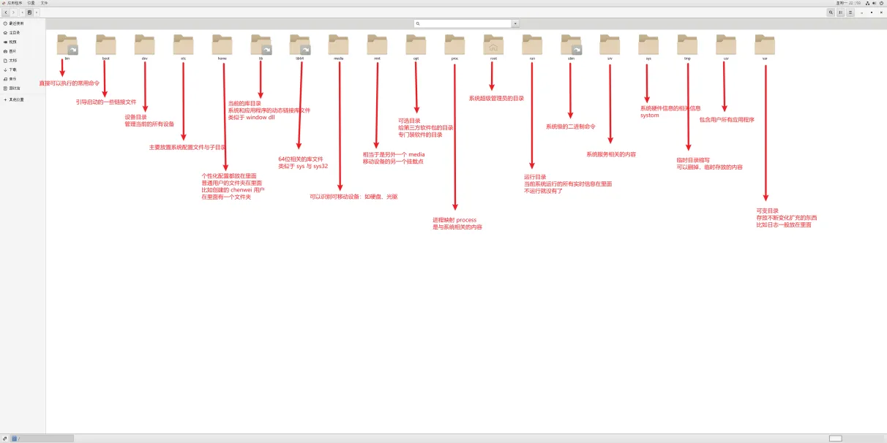

# 文件系统

::: info
linux 中一切皆文件
:::

## 目录结构

**概览**

- 图形化展示

  

  > 带箭头的：说明不是真实路径，此处只是一个链接而已

  

swap 目录原理上和 / 同级，但是在逻辑上 swap 在 / 下面。

在 linux 中，每一个文件都对应着一个功能，理论上来说，内容可以乱放

但是乱放不符合规范，应按照下图放置内容

## 总讲

linux 有四种基本文件系统类型：普通文件、目录文件、连接文件和特殊文件，可用 file 命令来识别

1. 普通文件：如文本文件、C 语言元代码、SHELL 脚本、二进制的可执行文件等，可用 cat、less、more、vi、emacs 来查看内容，用 mv 来改名
2. 目录文件：包括文件名、子目录及其指针。它是 linux 储存文件名的唯一地方，可用 ls 列出目录文件
3. 连接文件：是指向同一索引节点的那些目录条目。用 ls 来查看是，连接文件的标志用 l 开头，而文件后面以“-〉”指向所连接的文件
4. 特殊文件：linux 的一些设备如磁盘、终端、打印机等都在文件系统中表示出来，这一类文件就是特殊文件，常放在 /dev 目录内。例如，软驱 A 称为/dev/fd0。LINUX 无 C：的概念，而是用/dev/had 来自第一硬盘。

## 细致

| path        | 功能                                                                                                                                                                                                                                                                                                       | 备注                                                                                                                                                                                                                                                                                                                                                                                                                             |
| :---------- | :--------------------------------------------------------------------------------------------------------------------------------------------------------------------------------------------------------------------------------------------------------------------------------------------------------- | :------------------------------------------------------------------------------------------------------------------------------------------------------------------------------------------------------------------------------------------------------------------------------------------------------------------------------------------------------------------------------------------------------------------------------- |
| /           | 根目录                                                                                                                                                                                                                                                                                                     | 对你的电脑来说，有且只有一个根目录。所有的东西，我是说所有的东西都是从这里开始。举个例子：当你在终端里输入“/home”，你其实是在告诉电脑，先从/(根目录)开始，再进入到 home 目录。                                                                                                                                                                                                                                                   |
| /bin        | linux 系统所需要的那些命令位于此目录                                                                                                                                                                                                                                                                       | 比如 ls、cp、mkdir 等命令；功能和/usr/bin 类似，这个目录中的文件都是可执行的、普通用户都可以使用的命令。这个目录已经包含在你的“path”系统变量里面了。什么意思呢?就是当你在终端里输入 ls，系统就会去/bin 目录下面查找是不是有 ls 这个程序。作为基础系统所需要的最基础的命令就是放在这里（/usr/bin 和/usr/sbin 类似与“/”根目录下对应的目录（/bin 和/sbin），但不用于基本的启动（譬如，在紧急维护中）。大多数命令在这个目录下。 ）。 |
| /boot       | Linux 的内核及引导系统程序所需要的文件目录                                                                                                                                                                                                                                                                 | 比如 vmlinuz initrd.img 文件都位于这个目录中。在一般情况下，GRUB 或 LILO 系统引导管理器也位于这个目录。                                                                                                                                                                                                                                                                                                                          |
| /dev        | 这里主要存放与设备(包括外设)有关的文件(unix 和 linux 系统均把设备当成文件)                                                                                                                                                                                                                                 | 想连线打印机吗?系统就是从这个目录开始工作的。另外还有一些包括磁盘驱动、USB 驱动等都放在这个目录。                                                                                                                                                                                                                                                                                                                                |
| /etc        | 主要存放了系统配置方面的文件                                                                                                                                                                                                                                                                               | 举个例子：你安装了 samba 这个套件，当你想要修改 samba 配置文件的时候，你会发现它们(配置文件)就在/etc/samba 目录下。                                                                                                                                                                                                                                                                                                              |
| /home       | 这里主要存放你的个人数据                                                                                                                                                                                                                                                                                   | 具体每个用户的设置文件，用户的桌面文件夹，还有用户的数据都放在这里。每个用户都有自己的用户目录，位置为：/home/用户名。当然，root 用户除外                                                                                                                                                                                                                                                                                        |
| /lib        | 存放许多被 /bin 和 /sbin 中的程序使用的库文件                                                                                                                                                                                                                                                              |                                                                                                                                                                                                                                                                                                                                                                                                                                  |
| /lost+found | 在 ext2 或 ext3 文件系统中，当系统意外崩溃或机器意外关机，而产生一些文件碎片放在这里                                                                                                                                                                                                                       | 当系统启动的过程中 fsck 工具会检查这里，并修复已经损坏的文件系统。 有时系统发生问题，有很多的文件被移到这个目录中，可能会用手工的方式来修复，或移到文件到原来的位置上                                                                                                                                                                                                                                                            |
| /media      | 有些 linux 的发行版使用这个目录来挂载那些 usb 接口的移动硬盘(包括 U 盘)、CD/DVD 驱动器等等                                                                                                                                                                                                                 |                                                                                                                                                                                                                                                                                                                                                                                                                                  |
| /mnt        | 这个目录一般是用于存放挂载储存设备的挂载目录的，比如有 cdrom 等目录                                                                                                                                                                                                                                        | 可以参看/etc/fstab 的定义。有时我们可以把让系统开机自动挂载文件系统，把挂载点放在这里也是可以的。主要看/etc/fstab 中怎 么定义了；比如光驱可以挂载到/mnt/cdrom                                                                                                                                                                                                                                                                    |
| /opt        | 这里主要存放那些可选的程序，该目录主要被第三方开发者用来简易地安装和卸装他们的软件包。安装到/opt 目录下的程序，它所有的数据、库文件等等都是放在同个目录下面。你想尝试最新的 firefox 测试版吗?那就装到/opt 目录下吧，这样，当你尝试完，想删掉 firefox 的时候，你就可 以直接删除它，而不影响系统其他任何设置 | 举个例子：刚才装的测试版 firefox，就可以装到/opt/firefox_beta 目录下，/opt/firefox_beta 目录下面就包含了运 行 firefox 所需要的所有文件、库、数据等等。要删除 firefox 的时候，你只需删除/opt/firefox_beta 目录即可，非常简单                                                                                                                                                                                                      |
| /proc       | 操作系统运行时，进程信息及内核信息（比如 cpu、硬盘分区、内存信息等）存放在这里                                                                                                                                                                                                                             | /proc 目录伪装的文件系统 proc 的挂载目录，proc 并不是真正的文件系统，它的定义可以参见 /etc/fstab                                                                                                                                                                                                                                                                                                                                 |
| /root       | 这是系统管理员(root user)的目录                                                                                                                                                                                                                                                                            | 对于系统来说，系统管理员就好比是上帝，它能对系统做任何事情，甚至包括删除你的文件。因此，请小心使用 root 帐号                                                                                                                                                                                                                                                                                                                     |
| /sbin       | 大多是涉及系统管理的命令的存放，是超级权限用户 root 的可执行命令存放地，普通用户无权限执行这个目录下的命令，这个目录和/usr/sbin; /usr/X11R6/sbin 或/usr/local/sbin 目录是相似的                                                                                                                            | 我们记住就行了，凡是目录 sbin 中包含的都是 root 权限才能执行的。                                                                                                                                                                                                                                                                                                                                                                 |
| /tmp        | 这是临时目录。给予所有系统用户读写权                                                                                                                                                                                                                                                                       | 对于某些程序来说，有些文件被用了一次两次之后，就不会再被用到，像这样的文件就放在这里。有些 linux 系统会定期自动对这个目录进行清理，因此，千万不要把重要的数据放在这里                                                                                                                                                                                                                                                            |
| /usr        | 这个是系统存放程序的目录，比如命令、帮助文件等。你可以把不适合放在/bin 或/etc 目录下的程序安装到这里，这个目录下有很多的文件和目录                                                                                                                                                                         | 当我们安装一个 Linux 发行版官方提供的软件包时，大多安装在这里。 如果有涉及服务器配置文件的，会把配置文件安装在/etc 目录中。普通用户可执行文件目录/usr/bin 或/usr/local/bin 或/usr/X11R6/bin ，超级权限用户 root 的可执行命令存放目录，比如 /usr/sbin 或/usr/X11R6/sbin 或/usr/local/sbin 等；还有程序的头文件存放目录/usr/include                                                                                                |
| /usr/bin    | 目录用于存放程序                                                                                                                                                                                                                                                                                           |                                                                                                                                                                                                                                                                                                                                                                                                                                  |
| /usr/lib    | 用于存放那些不能直接运行的，但却是许多程序运行所必需的一些函数库文件                                                                                                                                                                                                                                       |                                                                                                                                                                                                                                                                                                                                                                                                                                  |
| /usr/local  | 这里主要存放那些手动安装的软件，即不是通过“新立得”或 apt-get 安装的软件                                                                                                                                                                                                                                    | 它和/usr 目录具有相类似的目录结构。让软件包管理器来管理/usr 目录，而把自定义的脚本(scripts)放到/usr/local 目录下面，我想这应该是个不错的主意。这个目录一般是用来存放用户自编译安装软件的存放目录；一般是通过源码包安装的软件，如果没有特别指定安装目录的话，一般是安装在这个目录中。                                                                                                                                             |
| /usr/share  | 系统共用的东西存放地，存放一些共享的数据，比如 /usr/share/fonts 是字体目录，/usr/share/doc 和/usr/share/man 帮助文件                                                                                                                                                                                       |                                                                                                                                                                                                                                                                                                                                                                                                                                  |
| /var        | 这个目录的内容是经常变动的，看名字就知道，我们可以理解为 vary 的缩写                                                                                                                                                                                                                                       | /var 下有/var/log 这是用来存放系统日志的目录。/var/www 目录是定义 Apache 服务器站点存放目录；/var/lib 用来存放一些库文件，比如 MySQL 的，以及 MySQL 数据库的的存放地；/var/spool 用来存放打印机、邮件、代理服务器等假脱机目录                                                                                                                                                                                                    |
