::: warning 提示
此部分为 window 配置

mac 配置在 terminus 里面有配置
:::

# 远程登录

## 终端登录

ssh 连接虚拟主机，然后 exit 退出

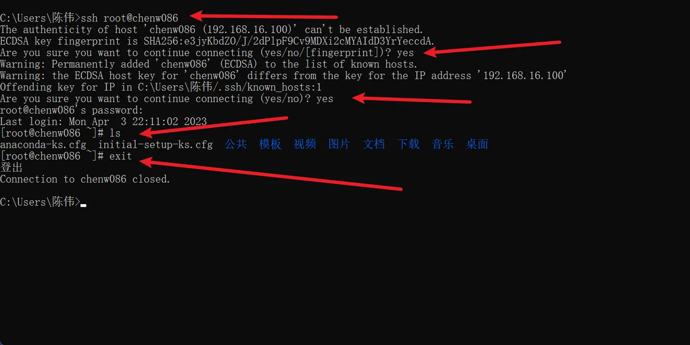

## xshell

下载打开配置

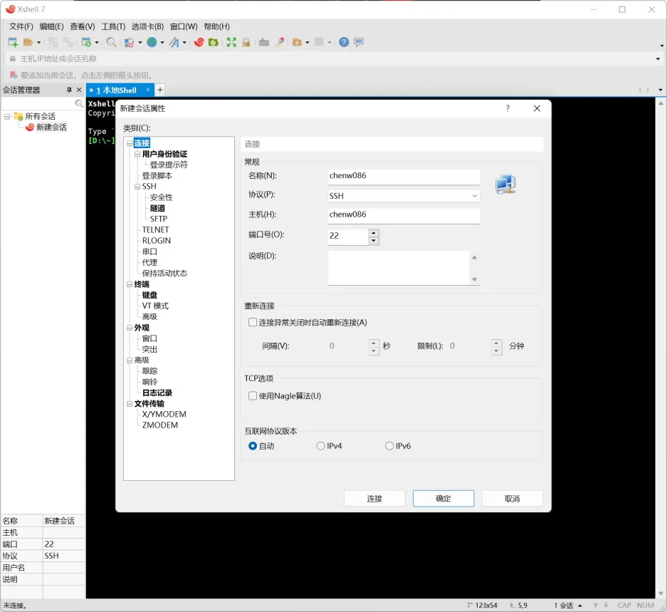

设置用户：root w19*****06.

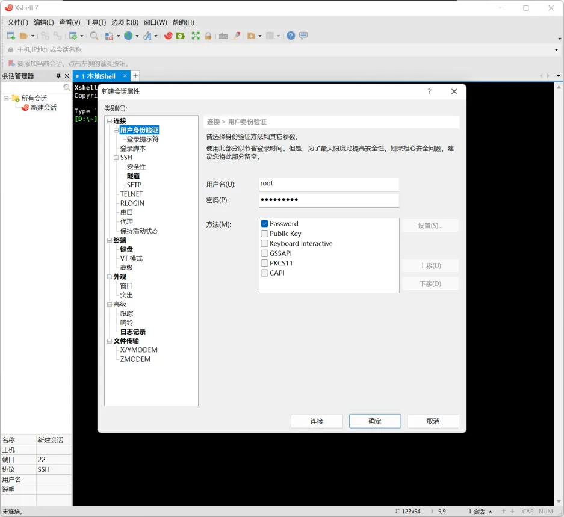

更改外观

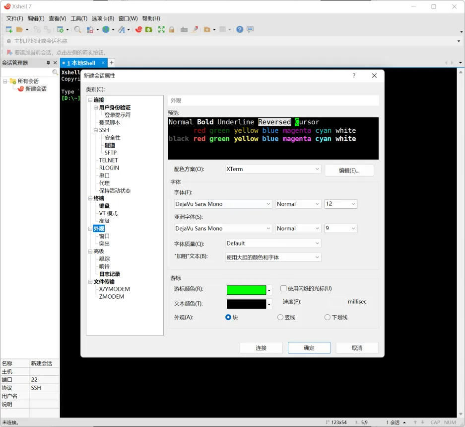

然后进入主页面，就可以进行配置了

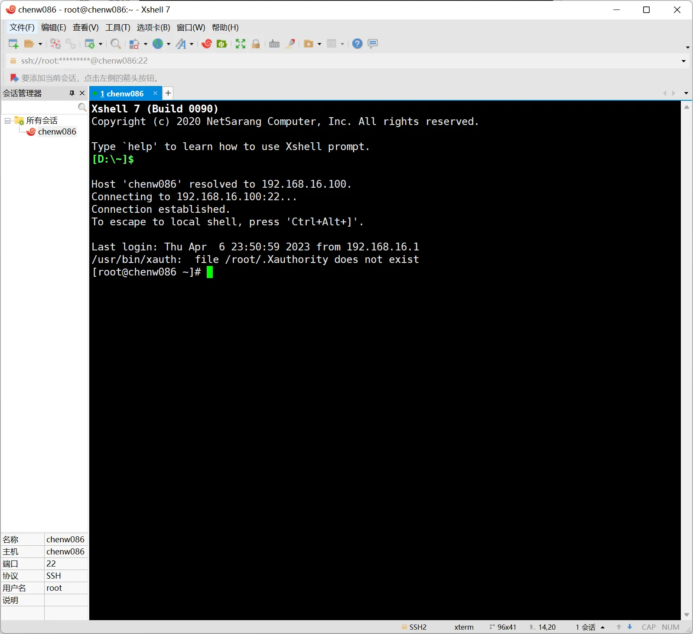

断开连接

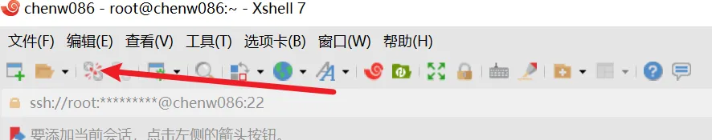

再次连接，双击选项卡会话即可

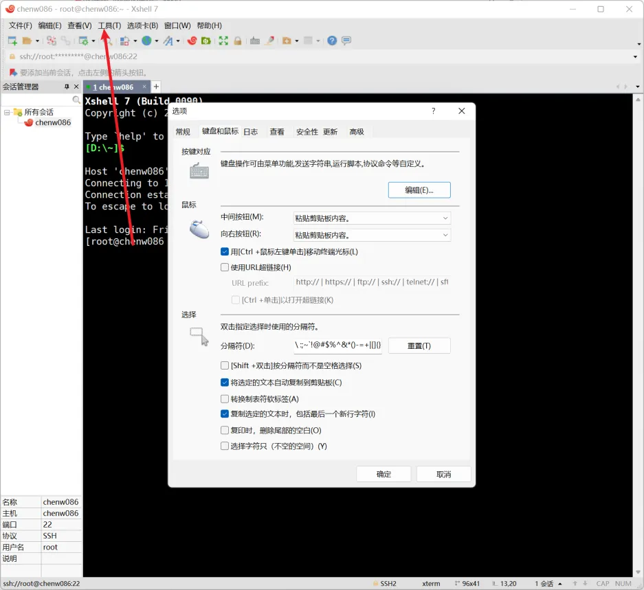

## xftp

建立连接

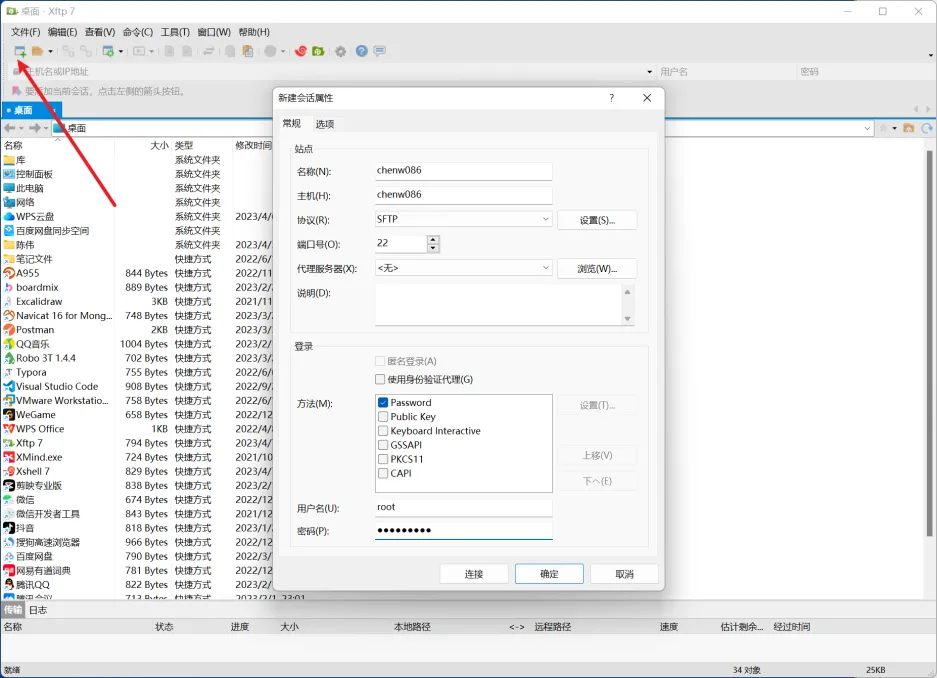

连接以后界面，需要什么直接拖到指定目录下面就好了

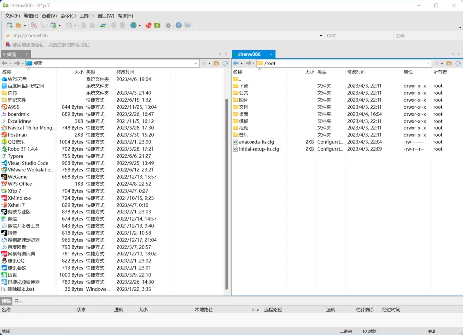

将文件拖动到 linux 目录下面，然后使用 xshell 查看

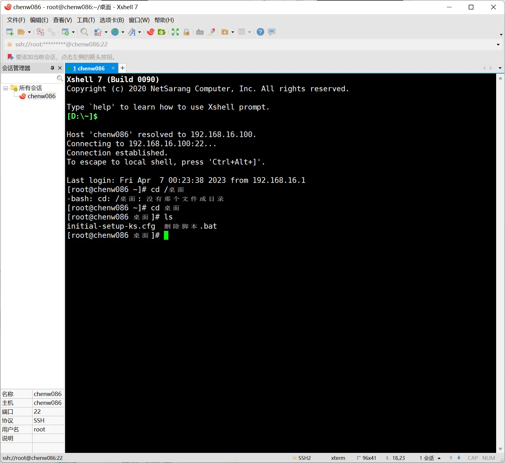

设置编码防止乱码

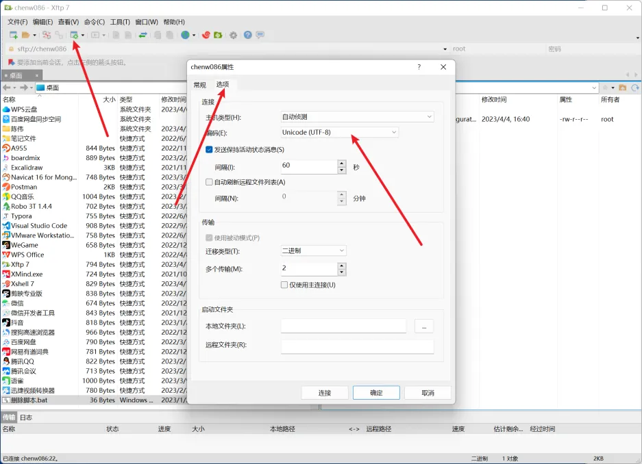
