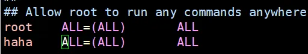

# 用户管理

## useradd

```shell
# 添加新用户
useradd 用户名

# 添加新用户到某个组
useradd -g 组名 用户名
```

添加用户 test，自定义用户文件夹

```shell
[root@localhost ~]# useradd -d /home/test test
[root@localhost ~]# ls /home
test
[root@localhost ~]# ll /home
总用量 0
drwx------. 2 test test 62 10月 23 23:54 test
```

## passwd

设置用户密码

```shell
passwd 用户名
```

查看创建了哪些用户

> cat /etc/passwd

```shell
[root@localhost ~]# cat /etc/passwd
root:x:0:0:root:/root:/bin/bash
bin:x:1:1:bin:/bin:/sbin/nologin
daemon:x:2:2:daemon:/sbin:/sbin/nologin
adm:x:3:4:adm:/var/adm:/sbin/nologin
lp:x:4:7:lp:/var/spool/lpd:/sbin/nologin
sync:x:5:0:sync:/sbin:/bin/sync
shutdown:x:6:0:shutdown:/sbin:/sbin/shutdown
halt:x:7:0:halt:/sbin:/sbin/halt
mail:x:8:12:mail:/var/spool/mail:/sbin/nologin
operator:x:11:0:operator:/root:/sbin/nologin
games:x:12:100:games:/usr/games:/sbin/nologin
ftp:x:14:50:FTP User:/var/ftp:/sbin/nologin
nobody:x:99:99:Nobody:/:/sbin/nologin
systemd-network:x:192:192:systemd Network Management:/:/sbin/nologin
dbus:x:81:81:System message bus:/:/sbin/nologin
polkitd:x:999:998:User for polkitd:/:/sbin/nologin
sshd:x:74:74:Privilege-separated SSH:/var/empty/sshd:/sbin/nologin
postfix:x:89:89::/var/spool/postfix:/sbin/nologin
test:x:1000:1000::/home/test:/bin/bash
```

## id

检查用户是否存在

```shell
id 用户名

# 检查 test
[root@localhost ~]# id test
uid=1000(test) gid=1000(test) 组=1000(test)
```

## su

切换用户

```shell
su 用户名称	# 切换用户，只能获得用户的执行权限，不能获得环境变量

su - 用户名称	# 切换到用户并获得该用户的环境变量及执行权限
```

切换账户身份，询问系统自己的身份，然后退回到 root 身份

```shell
[root@localhost ~]# who am i
root     pts/0        2024-10-24 00:03 (192.168.17.1)

[root@localhost ~]# su test

[test@localhost root]$ who am i
root     pts/0        2024-10-24 00:03 (192.168.17.1)

[test@localhost root]$ exit
exit
```

## userdel

删除用户

```shell
userdel 用户名	 # 删除用户但保存用户主目录

userdel -r 用户名  # 用户和用户主目录，都删除
```

示例

```shell
[root@localhost ~]# ls /home
test
[root@localhost ~]# userdel -r test
[root@localhost ~]# ls /home
```

## who

```shell
whoami  # 显示自身用户名称

who am i  # 显示登录用户的用户名以及登录事件
```

## sudo

设置普通用户具有 root 权限

> 注意并不是使用 sudo 就立马飞升了，需要配置文件才行

```shell
[root@localhost ~]# useradd test
[root@localhost ~]# su test
[test@localhost root]$ cd /root
bash: cd: /root: 权限不够

[test@localhost root]$ exit
exit
[root@localhost ~]# passwd test
更改用户 test 的密码 。
新的 密码：
重新输入新的 密码：
passwd：所有的身份验证令牌已经成功更新。

[root@localhost ~]# su test
[test@localhost root]$ sudo cd /root

我们信任您已经从系统管理员那里了解了日常注意事项。
总结起来无外乎这三点：

    #1) 尊重别人的隐私。
    #2) 输入前要先考虑(后果和风险)。
    #3) 权力越大，责任越大。

[sudo] test 的密码：

test 不在 sudoers 文件中。此事将被报告。
```

修改配置文件

```shell
vim /etc/sudoers
```



```shell
[root@localhost ~]# su test

[test@localhost root]$ sudo cd /root
[sudo] test 的密码：

[test@localhost root]$ ls
ls: 无法打开目录.: 权限不够

[test@localhost root]$ sudo ls
anaconda-ks.cfg  Centos-altarch-7.repo  chenwei  wget-1.14-18.el7_6.1.x86_64.rpm
```

## usermod

修改用户

```shell
usermod -g 用户组 用户名
```

| 选项 | 说明                                                   |
| :--- | ------------------------------------------------------ |
| -g   | 修改用户的初始登录组，给定的组必须存在。默认组 id 是 1 |
