# vim

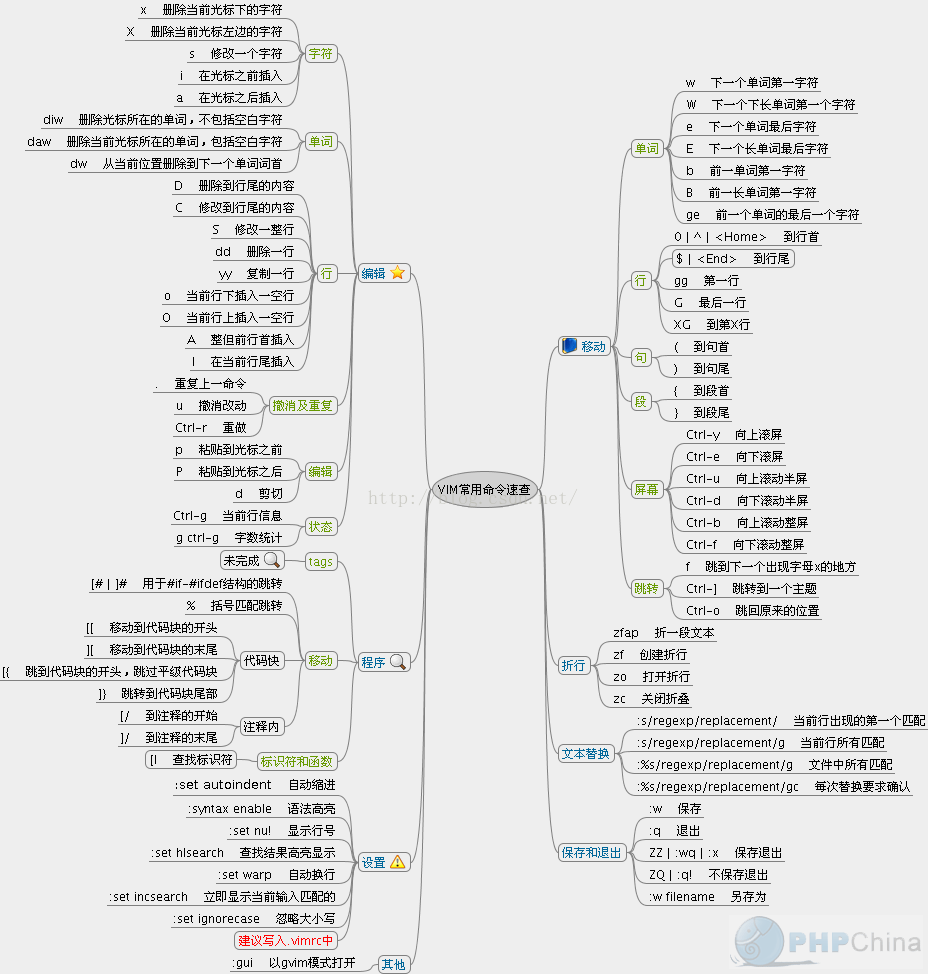

::: info 简介
linux 文本编辑器

可以主动的以字体颜色辨别语法的正确性
:::

**介绍**

打开文件
::: tip 描述
vim 文件名，就能打开文件

:q 退出
:::

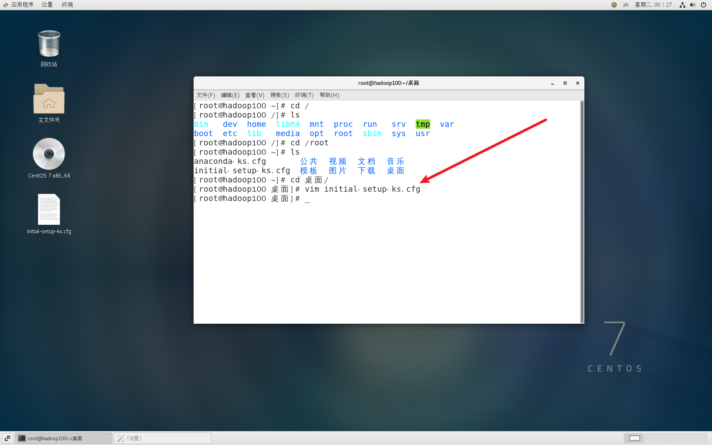

**模式间的转换**

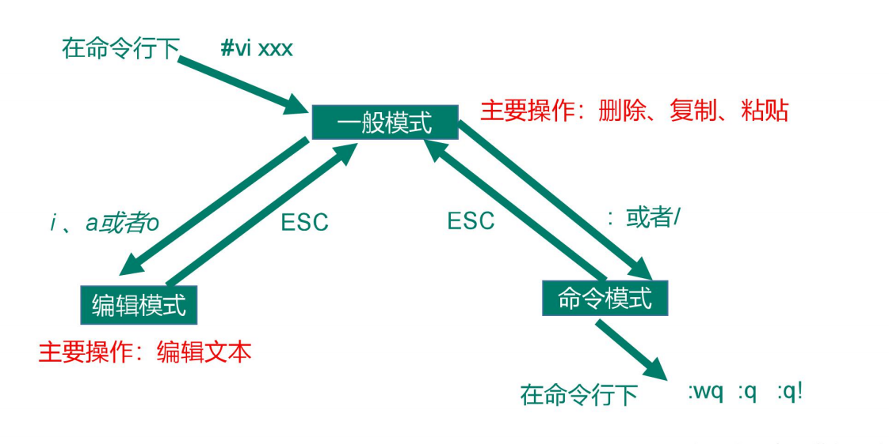

**插入模式**

输入 i 进入模式，就能调整光标位置

> 一般模式不能调整

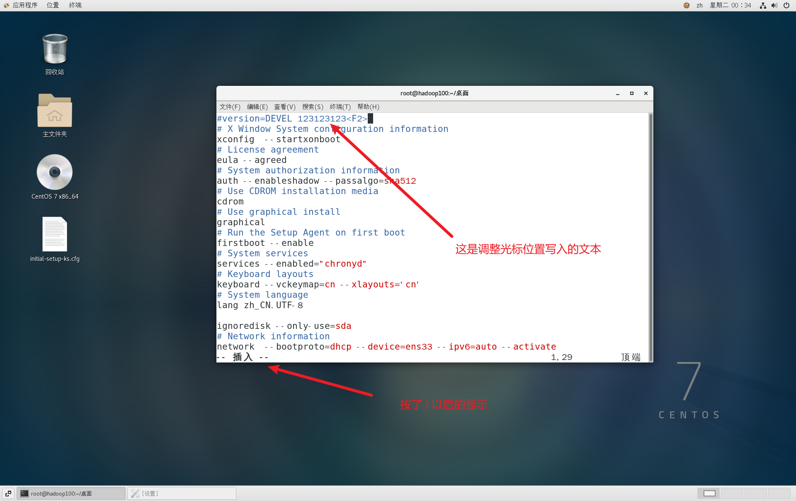

退出

> 按 esc 即可

## 命令模式

> 上面编辑模式退出以后，保存就需要命令模式了

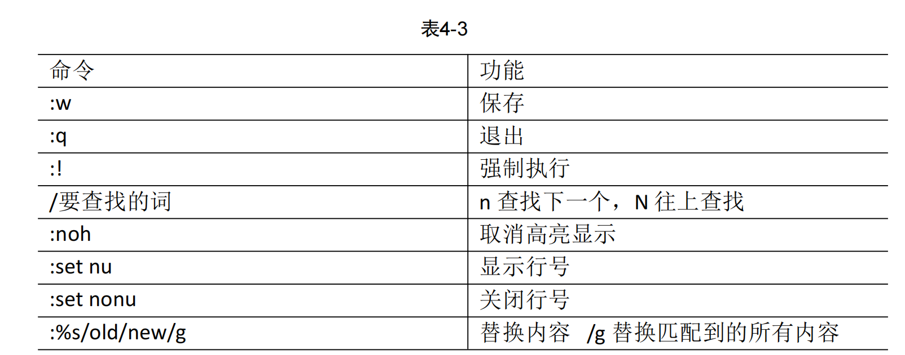

- :w

  把缓存区的内容写入硬盘，也就是保存了

  如果不想保存，按 u 就可以恢复

  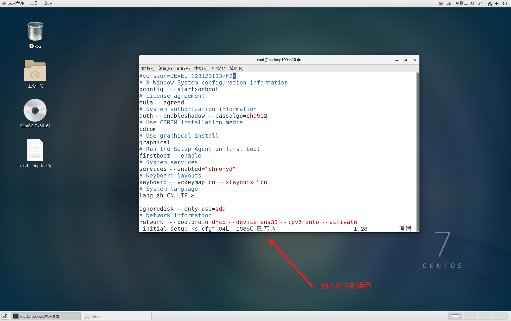

- :q

  编辑完退出 vim 编辑器

- :wq!

  强制保存退出

- 删除 2 ～ 20 行内容

  ```shell
  :3,20d

  # 同理，复制 2～20行内容
  # :2,20y
  ```

## 一般模式

**常用模式**

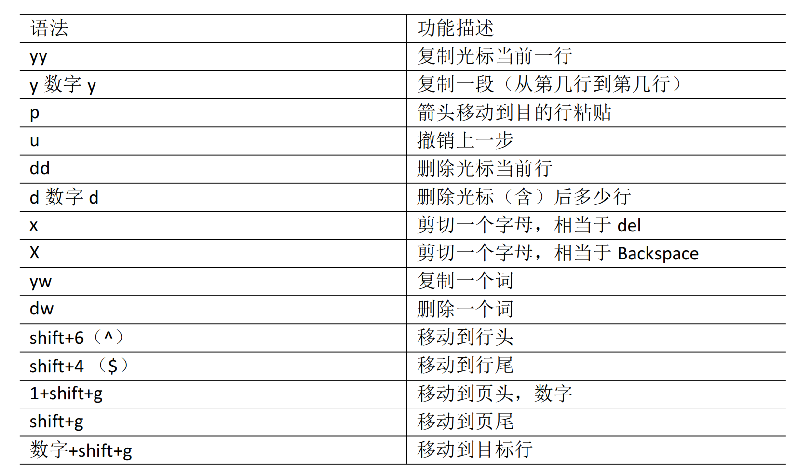

vim 键盘

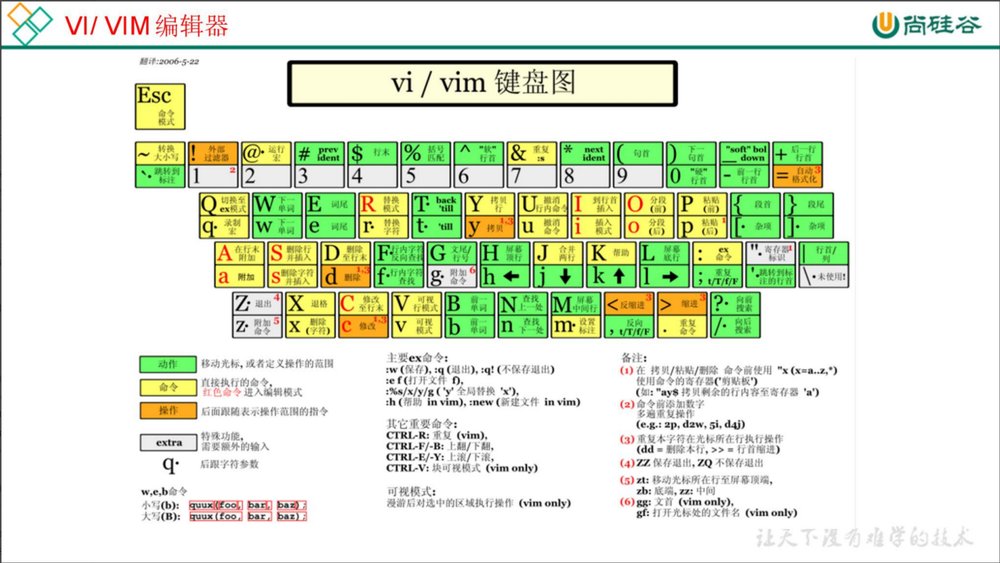

1. y$ 从光标位置复制到结尾
2. yw 复制光标当前的词
3. dw 删除当前光标的词

## 编辑模式

**常用语法**

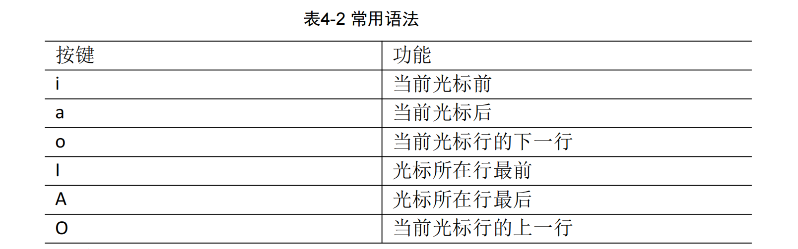

退出：esc

## 可视模式

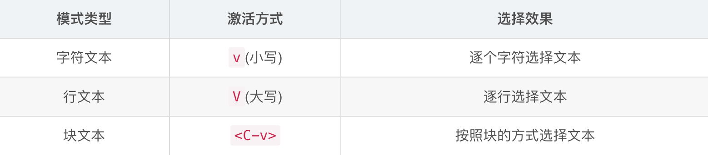

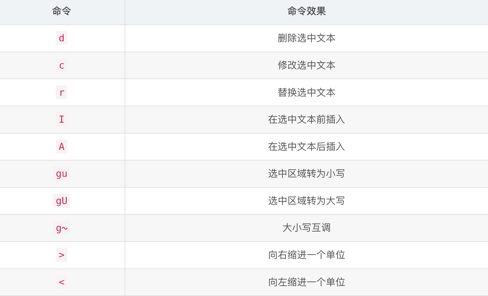
