# jenkins

::: info 涉及知识点

- [Docker 文档](/docker/){target="_blank"}
- [linux 文档](/linux/){target="_blank"}
- [nginx 文档](/nginx/){target="_blank"}

参考文档与问题解决文档：

- [ssh 密钥](https://blog.csdn.net/qq_36551991/article/details/135849346?spm=1001.2014.3001.5501)
- [Publish Over SSH](https://cloud.tencent.com/developer/article/2028098)
- [ssh server](https://blog.csdn.net/qq_36551991/article/details/135848943)
- [jenkins 插件安装失败解决方法](https://blog.csdn.net/m0_37679452/article/details/105556186)
- [jenkins 时区问题](https://blog.csdn.net/bbj12345678/article/details/115046606)
- [volume挂载本机文件出现不同步的问题解决](https://blog.csdn.net/qq_43684922/article/details/128882189)
- [nginx 配置](https://juejin.cn/post/6942607113118023710#heading-60)
- [jenkins 配置](https://juejin.cn/post/7306038680963383311?searchId=20250315202154D0592A6FB865A1361DA1#heading-18)

:::

对于 devops 的概念， 事实上下面这一张图已经解释很清晰

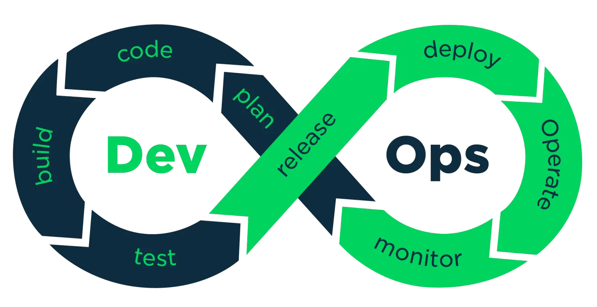{width="80%"}

::: danger 简单解释
Dev(规划→编码→构建→测试) → Release(发布) → Ops(部署→运维→监控)
:::

**第一阶段：Dev(开发)部分**

1. plan 规划

- 需求管理：要做什么
- 项目规划：怎么做
- 架构设计：用什么做
- 团队协作：谁来做

2. Code 编码

- 版本控制，比如 git 工作流程
- 代码质量，比如 eslint、prettier
- 协作工具，比如 gitlab、github

3. Build 构建

编码完毕以后，将内容构建为可以部署的构建物，然后相关的 dockerfile 也会在这里生成对应的 docker 镜像

- 依赖管理：比如包管理工具（npm、pnpm...），版本控制
- 构建过程：比如代码编译、资源处理、打包配置
- 容器化：比如 Dockerfile 编写，在我们项目中的 deploy 文件下就存在，下面介绍的过程中也会提到

4. Test 测试

这一步是测试代码， 确保代码能够正常运行，也没必要过多解释

- 单元测试：比如 jest
- 集成测试
- 自动化测试

**第二阶段：release 发布**

一般来说要正儿八经的运行一个团队， 至少需要三台服务器

- 一台用于私有化部署的 gitlab 服务器
- 一台用于运行 jenkins 的机器
- 一台用于运行部署真正的内容供给外部使用

然后就会产生一个场景，陈伟提交了代码到gitlab，然后gitlab 通知 jenkins 去构建我提交的代码，这时候会产生产物比如：陈伟写的 web 页面和相关的静态资源

然后这时候 jenkins 就会将这些静态资源通过 ssh 发布到对应的服务器上面。

这就是发布

1. 构建物的生成，用于后面部署
2. 变更记录的整理，相关版本号分配

**第三阶段：Ops 部署**

1. Deploy 部署

- 前面的 release 阶段生成的构建物，在这里被部署到目标环境中
- 环境的准备：比如网络配置
- 配置并启用服务，然后再加以验证

2. Operate 运维

- 这一步主要负责日常运维：比如系统错误的维护
- 也对安全方面加以控制：比如访问控制、漏洞修复

3. Monitor 监控

对于我们来说 sentry 就起到了部分作用

- 监控应用的性能：比如 CPU、内存、磁盘、网络
- 监控应用的日志：比如错误日志、访问日志
- 监控应用的部署：比如部署的频率、部署的时间

::: danger 提示
以上内容事实上是一个完整的总结， 如果部分不明白没关系

下面完整流程走一遍，再回过头看， 就明白了
:::

## 初始化环境

这里用的是腾讯云服务器，centos 7 版本

安装 yum 工具集合

```bash
yum install -y yum-utils
```

安装 docker

```bash
# 使用阿里镜像源
sudo yum-config-manager \
--add-repo \
http://mirrors.aliyun.com/docker-ce/linux/centos/docker-ce.repo

# 安装最新 docker

yum install -y docker-ce docker-ce-cli containerd.io docker-buildx-plugin docker-compose-plugin

# docker-ce 引擎
# docker-ce-cli 命令行工具
# containerd.io 运行时
# docker-buildx-plugin 构建工具
# docker-compose-plugin 编排工具

# 安装 docker 的时候可能会中断， 可以将以上命令复制进去再安装

[root@localhost ~]# docker -v
Docker version 26.1.4, build 5650f9b

# 配置开机自启动
systemctl enable docker --now

# 配置加速源地址
sudo mkdir -p /etc/docker

sudo tee /etc/docker/daemon.json <<-'EOF'
{
    "registry-mirrors": [
        "https://mirror.ccs.tencentyun.com",
        "https://docker.m.daocloud.io"
    ]
}
EOF

# 重新加载配置
systemctl daemon-reload

# 重启 docker
systemctl restart docker
```

安装 jenkins

[jenkins 镜像地址](https://hub.docker.com/r/jenkins/jenkins/)

安装并运行 jenkins 镜像

```bash
# 拉取最新的镜像
docker pull jenkins/jenkins

# 运行 jenkins 镜像
docker run -itd -u root -p 8080:8080 -v jenkins-data:/var/jenkins_home -v /var/run/docker.sock:/var/run/docker.sock -v /usr/bin/docker:/usr/bin/docker -e JAVA_OPTS=-Duser.timezone=Asia/Shanghai --name jenkins-master jenkins/jenkins
```

防火墙打开 8080 端口，并且登录到 jenkins

```bash
firewall-cmd --zone=public --add-port=8080/tcp --permanent

firewall-cmd --reload
```

访问 jenkins 地址

```bash
http://127.0.0.1:8080

[root@localhost ~]# docker logs jenkins-master
...


Jenkins initial setup is required. An admin user has been created and a password generated.
Please use the following password to proceed to installation:

b26fd0c997e64f3491cbb845c7b99498

This may also be found at: /var/jenkins_home/secrets/initialAdminPassword
```

将密码复制进去登录

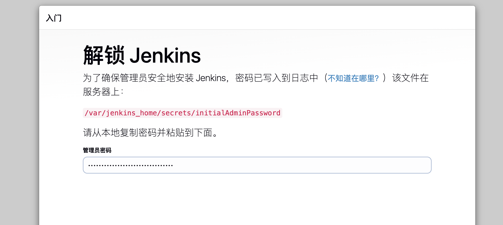{width="80%"}

点击继续，选择 `安装推荐插件`

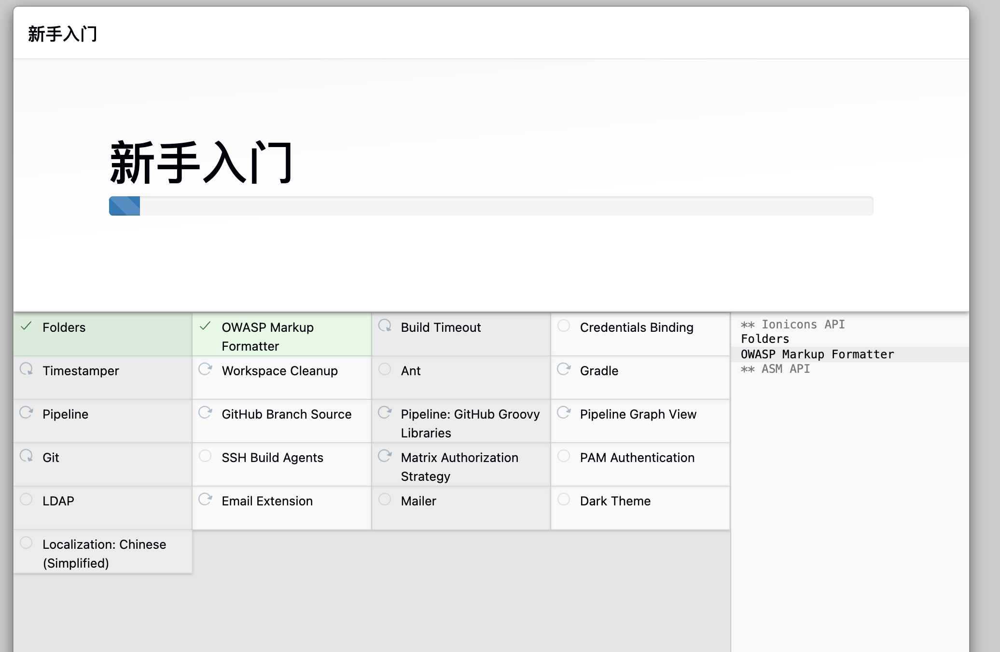{width="80%"}

安装完成以后创建一个用户，用于后面登录

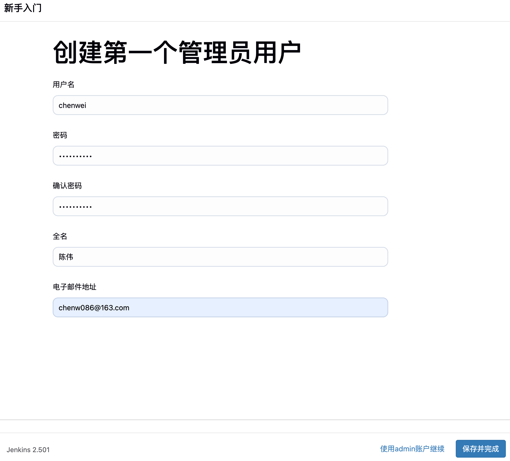{width="80%"}

然后进行实例配置，这里配置服务器 ip 地址就可以了

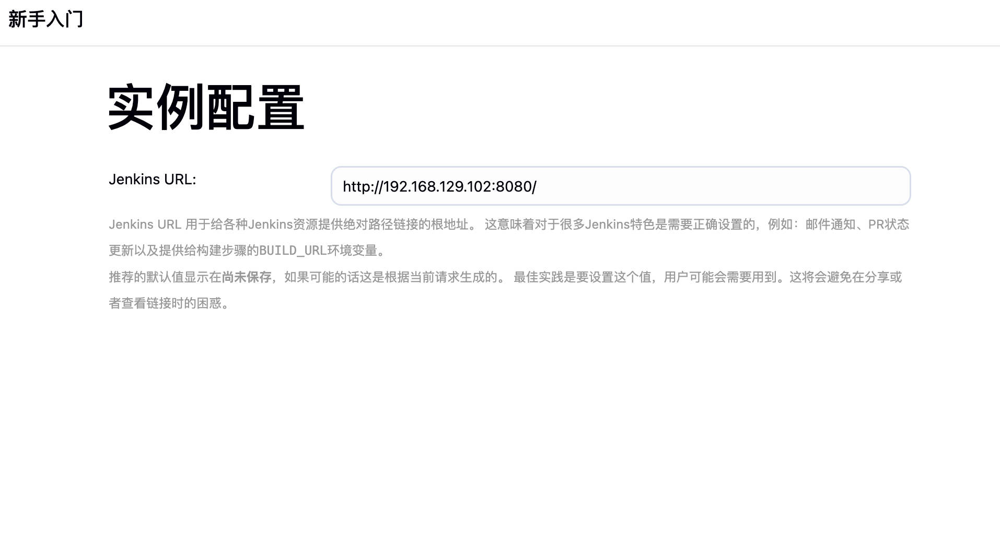{width="80%"}

然后就安装完毕，顺利进入到首页

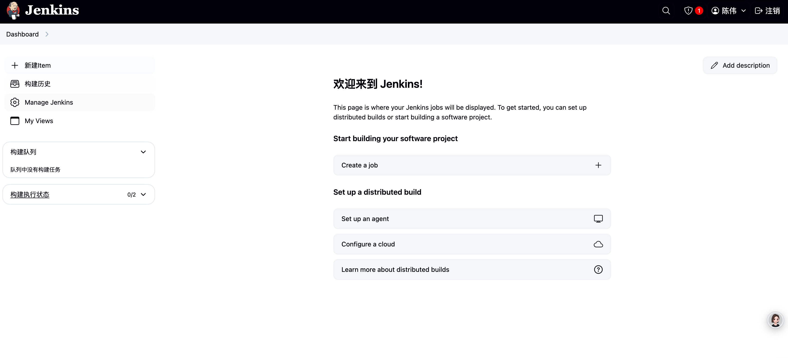{width="80%"}

## jenkins 配置

**配置插件加速**

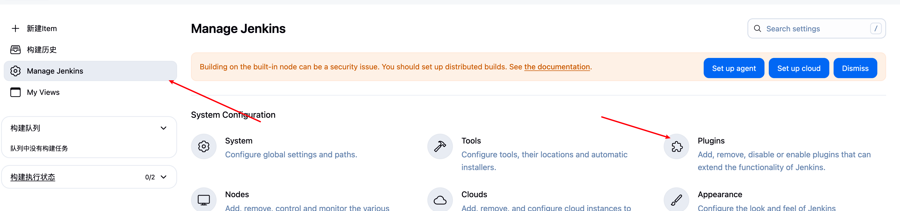{width="80%"}

然后选择 `advanced settings` 升级站点的 url

```bash
https://mirrors.tuna.tsinghua.edu.cn/jenkins/updates/current/update-center.json
```

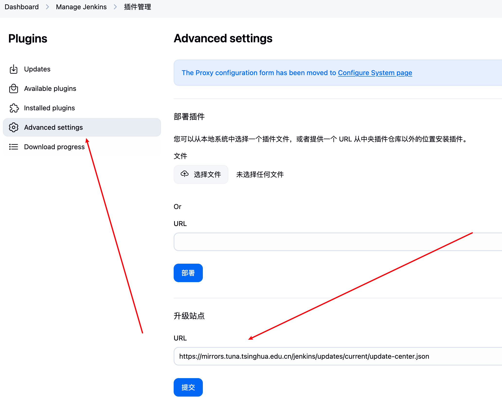{width="80%"}

**安装插件 Role-based Authorization Strategy 用于权限管理**

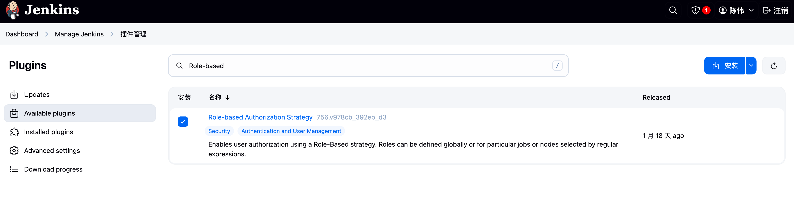{width="80%"}

安装完毕后重启 jenkins

```bash
docker restart jenkins-master
```

进入配置权限

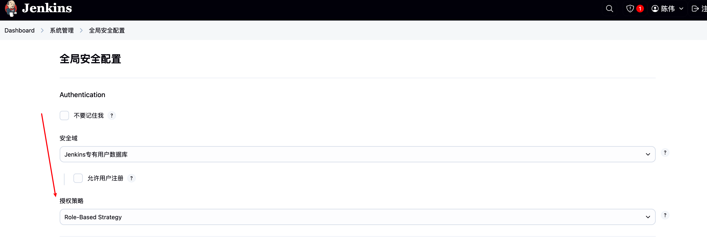{width="80%"}

这里不展开，需要就查文档 [权限管理](https://www.cnblogs.com/qican/p/15533972.html)

::: danger 提示
为什么测试环境我们可以直接合并

生产环境就需要找权限人员合并，就是此处权限管理
:::

**安装插件 NodeJS 用于 nodejs 的构建**

安装完毕以后在：系统管理 - 全局工具配置 中可以看到 nodeJs 选项

你开发环境是什么nodejs 版本这里就安装什么，可以安装多个

比如我是 18.20.2 版本

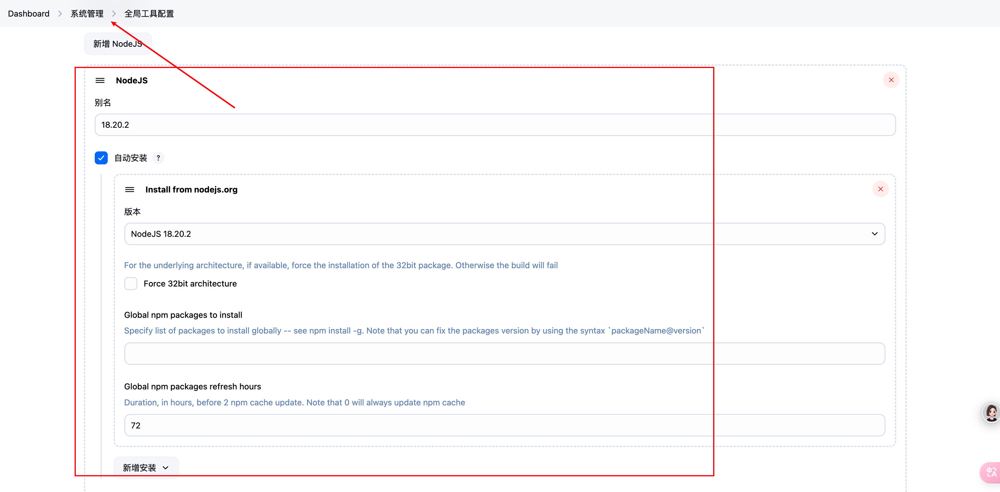{width="80%"}

这样子配置就好了， 构建的时候选择这个版本即可

**安装插件 Publish Over SSH**

用于将 A 服务器的产物发布到 B 服务器

**安装 ssh 插件用于 ssh 连接**

用于连接 A 服务器和 B 服务器，在 B 服务器上进行发布

**HTTP Request**

跨平台调用，在构建前后可以通过该插件以 http 形式调用各种 api 接口实现和内部系统的联动

**SSH Pipeline Steps**

用于 ssh 连接，在构建前后可以通过该插件以 ssh 形式调用各种 api 接口实现和内部系统的联动

## github 配置

GitHub 主页 -> Settings -> Developer settings -> Personal access tokens

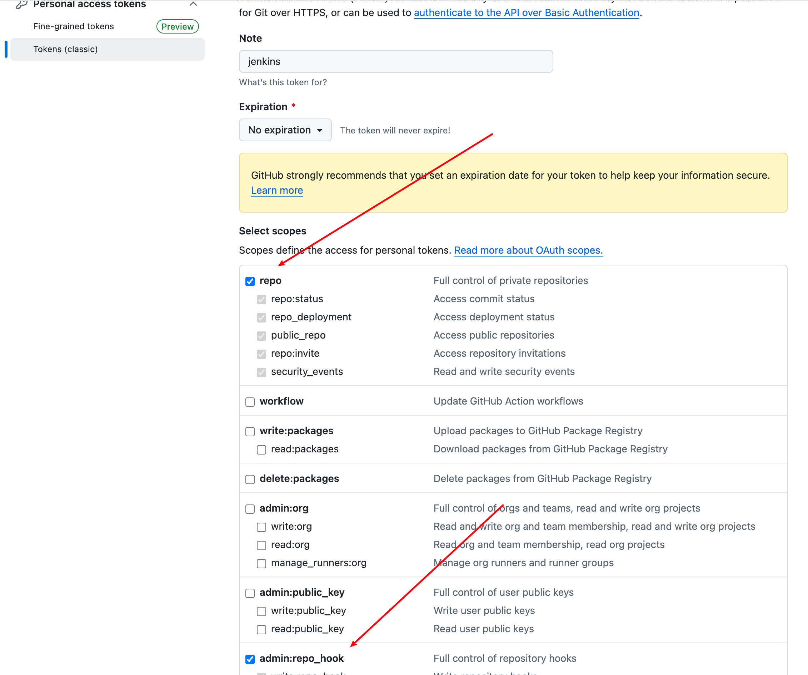{width=80%}

将这两个勾选上,生成后会生成一个 token 保存下来

进入到：系统管理 -> 系统设置 -> GitHub -> 添加Github服务器

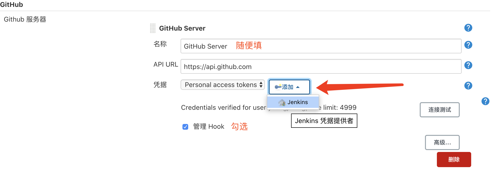{width=80%}

凭证类型选 Secret text：

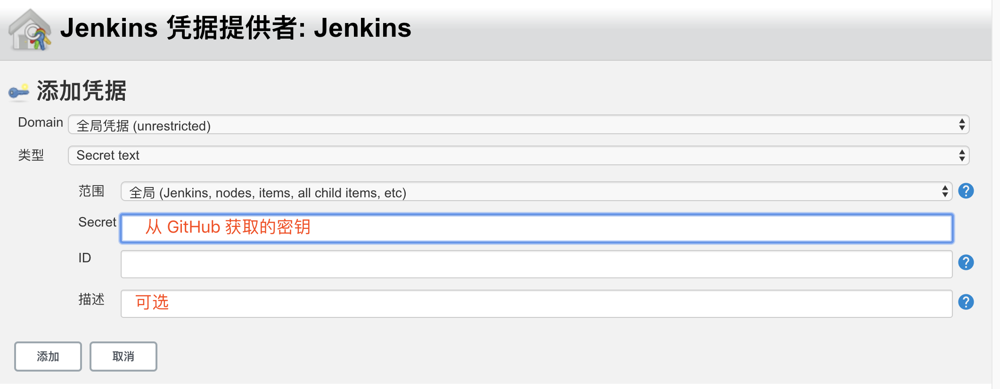{width=80%}

在凭据选上刚刚你添加的，勾上管理 Hook，点击“连接测试”，成功之后如下所示：

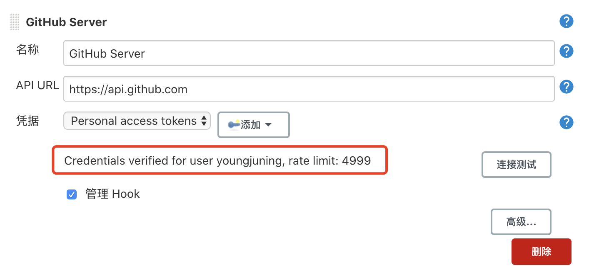{width=80%}

**配置 github 的 webhook 地址**

webhook 是通知 Jenkins 时的请求地址，用来填写到 GitHub 上，这样 GitHub 就能通过该地址通知到 Jenkins

假设Jenkins所在服务器的地址是：`192.168.0.1`，端口为8080，那么webhook地址就是 `<http://192.168.0.1:8080/github-webhook/>`

进入到具体的 github 地址，选择settings，然后选择 `Webhooks`

建议选 `json`

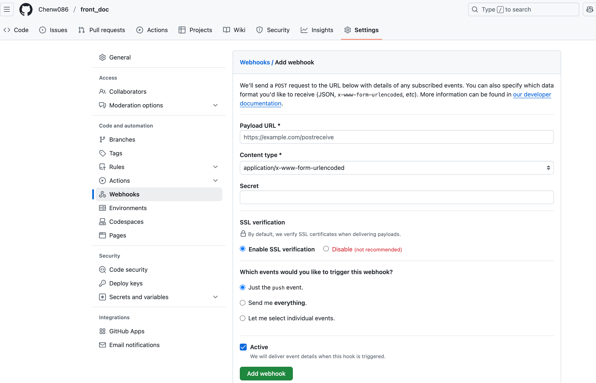{width=80%}

**配置 ssh**

```bash
# 进入到主目录，查看是否存在 .ssh 文件夹，如果没有就创建
cd ~

# 如果没有就创建密钥
ssh-keygen -t rsa -C "root"
# 解释：
# -t rsa 表示生成 RSA 密钥
# -C "root" 表示注释，可以随便写
# 生成后会生成两个文件：id_rsa 和 id_rsa.pub
# id_rsa 是私钥，id_rsa.pub 是公钥

```

将公钥添加到 github 的 `SSH and GPG keys` 中

配置完毕以后就是这样子,设置哇你以后就可以拉取 github 上的代码了

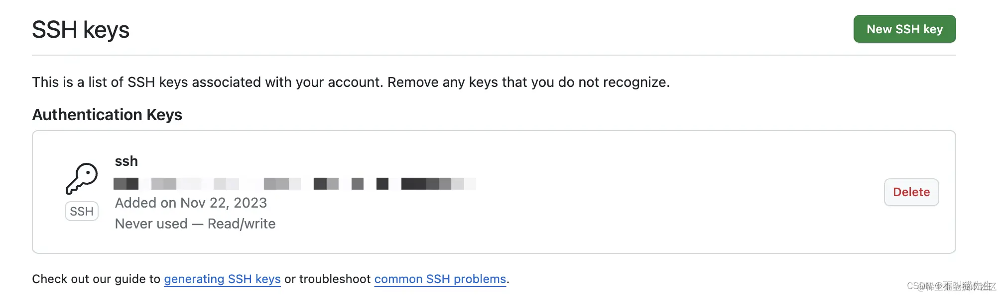{width=80%}

## 连接远程服务器

位置：系统管理 -> 系统设置 -> Publish over SSH -> 点击新增

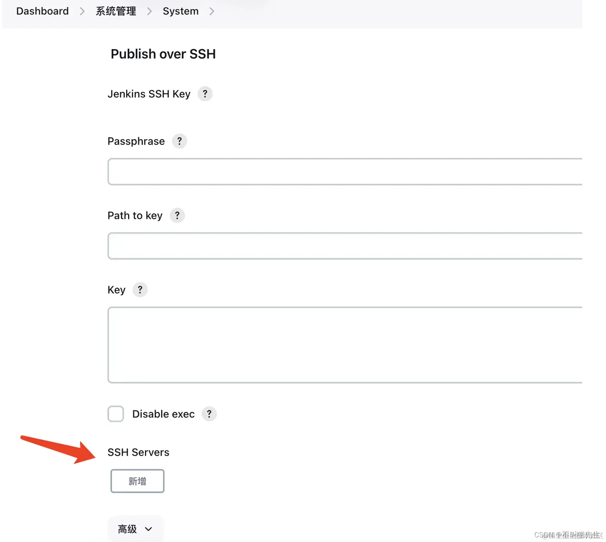{width=80%}

在新增后出来的面板中输入信息

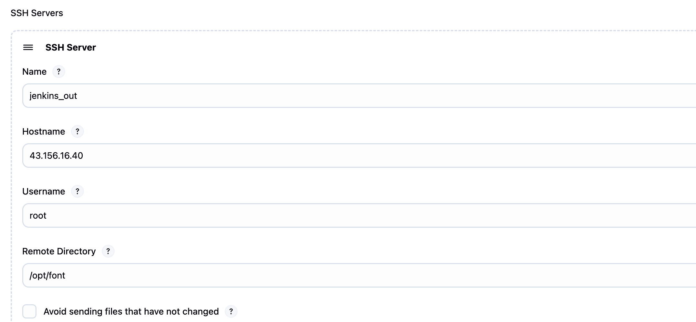{width=80%}

之后点击高级

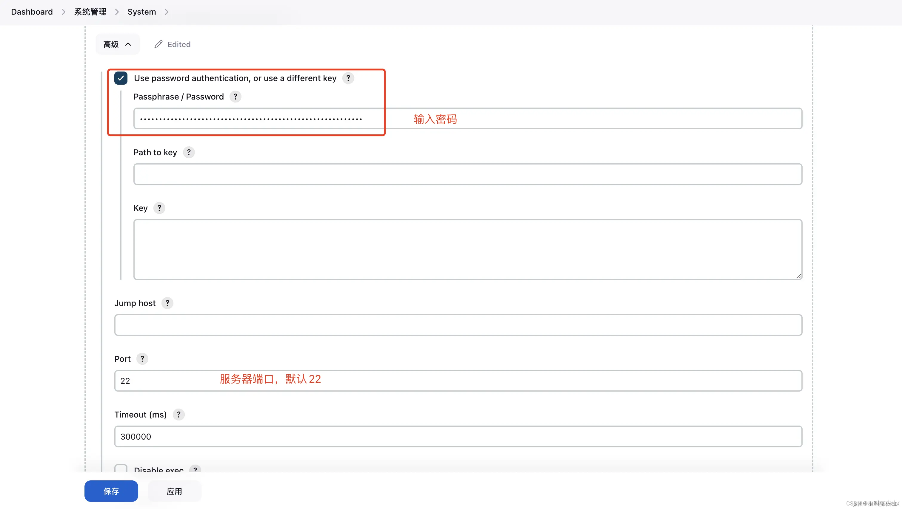{width=80%}

完事点击 Test Configuration 测试连接， success 就是对的了

## 配置打包发布

首先在要展示的服务器上面安装 docker 和 nginx 镜像

```bash
[root@VM-8-16-centos opt]# docker -v
Docker version 26.1.4, build 5650f9b

[root@VM-8-16-centos opt]# docker images
REPOSITORY   TAG       IMAGE ID       CREATED       SIZE
nginx        latest    53a18edff809   5 weeks ago   192MB
```

### 先构建 nginx 配置

我这里起名用的服务器 ip 地址

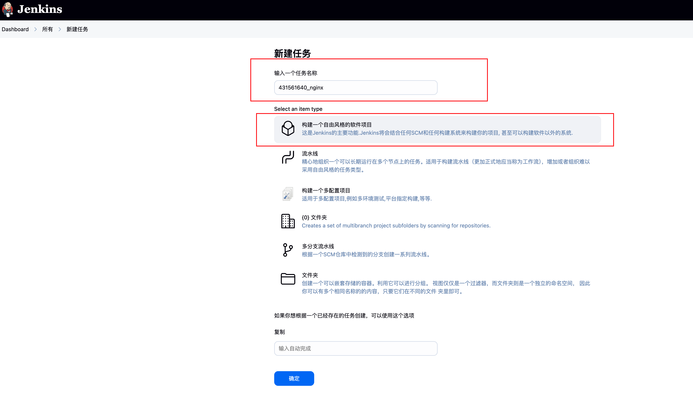{width=80%}

然后进入配置

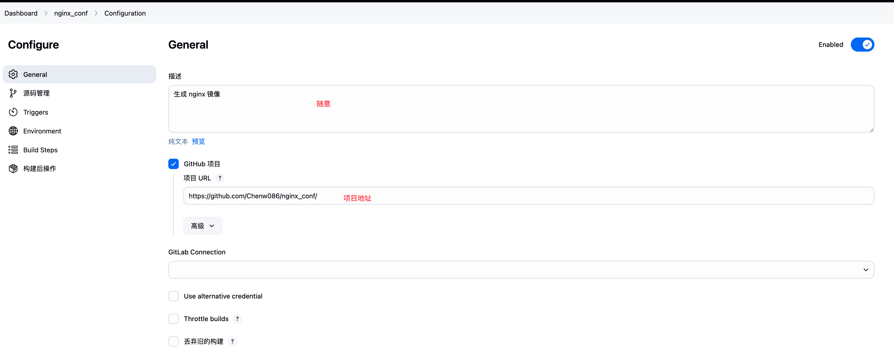{width=80%}

源管理，注意最好是 ssh，https 在仓库私有的时候会拉取失败。

::: danger 疑问
但这是为什么呢？
:::

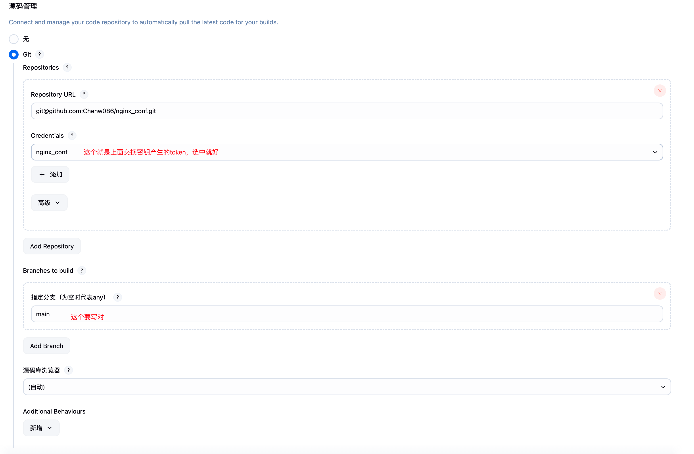{width=80%}

trigger 不进行配置， 这里使用手动触发， 后面的静态资源发布使用 webhook 触发

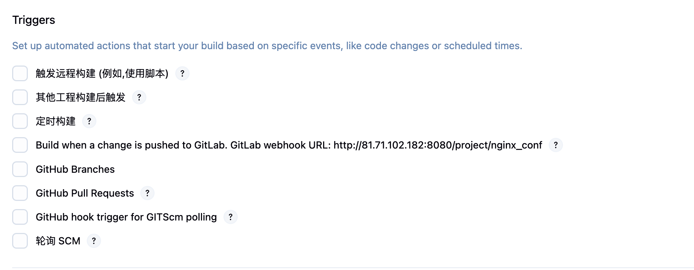{width=80%}

配置完毕以后，点击保存，进入控制台点击立即保存，然后进入构建历史查看控制台输出

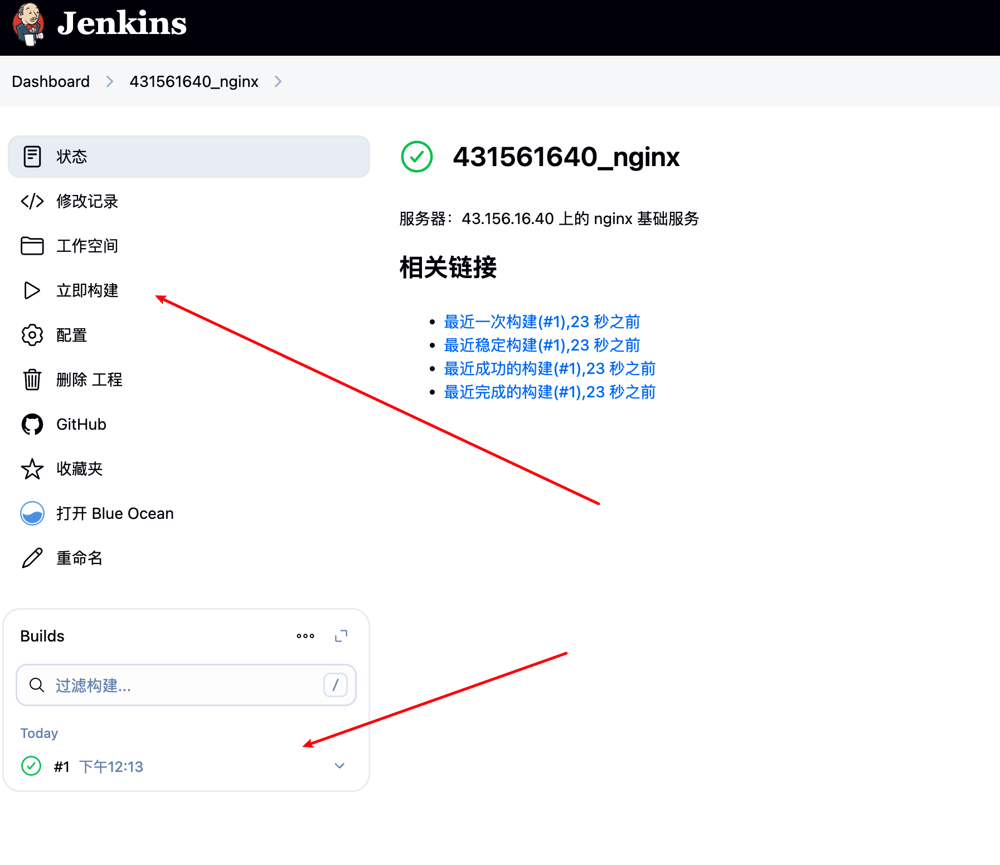{width=80%}

构建控制台

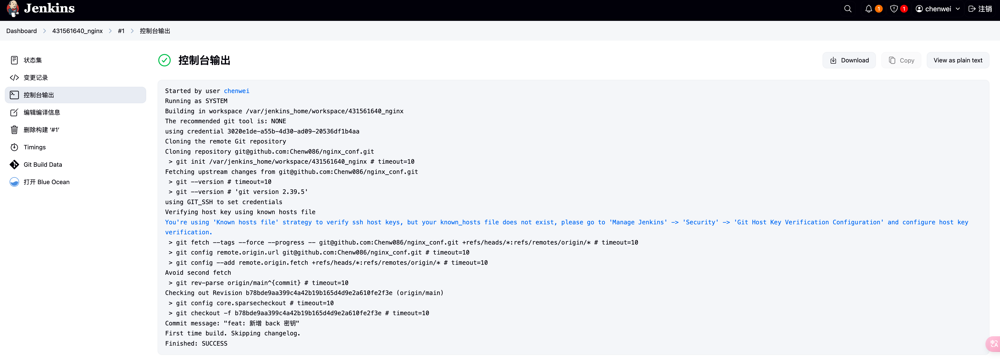{width=80%}

我们要做的是在 A 服务器构建，然后发布到 B 服务器

首先查看有什么内容，与构建位置,点击新增构建，选择执行 shell

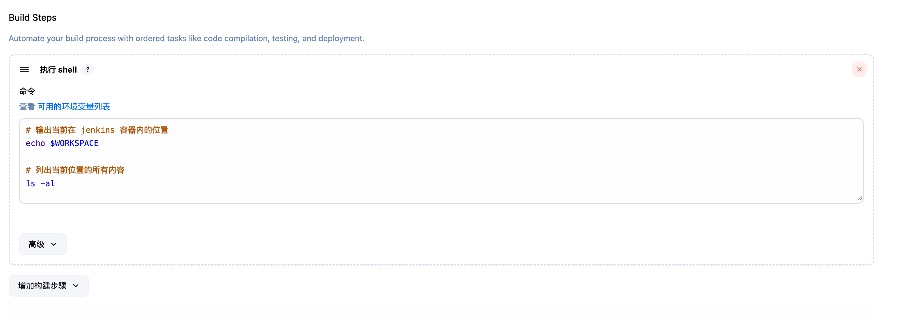{width=80%}

然后再次构建，再以上日志的基础上会多出：

```bash
[431561640_nginx] $ /bin/sh -xe /tmp/jenkins10374953363665192740.sh
+ echo /var/jenkins_home/workspace/431561640_nginx
/var/jenkins_home/workspace/431561640_nginx
+ ls -al
total 28
drwxr-xr-x  5 root root 4096 Mar 18 04:13 .
drwxr-xr-x 13 root root 4096 Mar 18 04:13 ..
drwxr-xr-x  8 root root 4096 Mar 18 04:28 .git
-rw-r--r--  1 root root  170 Mar 18 04:13 Dockerfile # 构建文件
drwxr-xr-x  2 root root 4096 Mar 18 04:13 certificate # 证书
-rw-r--r--  1 root root 3347 Mar 18 04:13 nginx.conf # 配置文件
drwxr-xr-x  2 root root 4096 Mar 18 04:13 default # 静态资源
Finished: SUCCESS
```

然后完整构建，构建完毕将内容打包发送到远程服务器

```bash
# 输出当前在 jenkins 容器内的位置
echo $WORKSPACE

# 列出当前位置的所有内容
ls -al

tar -czvf nginx-files.tar.gz Dockerfile certificate nginx.conf default

cat nginx.conf
```

新增构建步骤： send files or directories over SSH

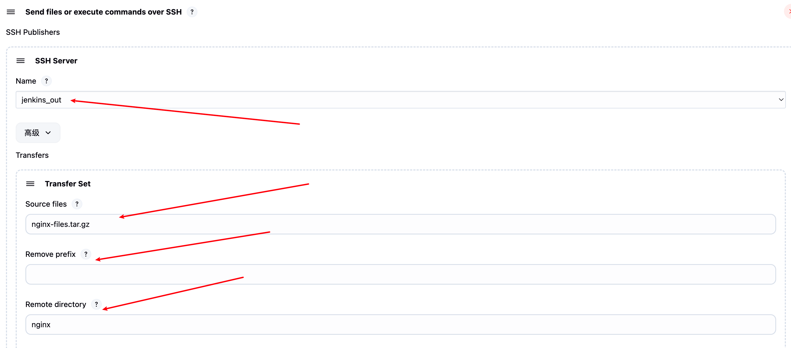{width=80%}

- name: 之前在系统配置里面配置的 ssh
- source files: 选择刚刚构建的文件
- remote directory: 系统配置里配置的是 /opt/font,这里写 nginx，那么就是 /opt/font/nginx
- remove prefix: 去除掉的前缀，比如 /aaa/vvv 去掉 /aaa

然后写入要执行的 shell

```bash
LOCAL_PREFIX="/etc/local/nginx"
CONTAINER_NAME="my-nginx-container"
IMAGE_NAME="my-nginx"

cd /opt/font/nginx

tar -xzvf nginx-files.tar.gz
rm -rf nginx-files.tar.gz

mkdir -p  $LOCAL_PREFIX/ssl
mkdir -p  $LOCAL_PREFIX/conf.d
mkdir -p  $LOCAL_PREFIX/logs
mkdir -p  $LOCAL_PREFIX/html
mkdir -p  $LOCAL_PREFIX/html/default

cp -R ./certificate/*    $LOCAL_PREFIX/ssl/
cp -R ./default/*     $LOCAL_PREFIX/html/default/
cp ./nginx.conf  $LOCAL_PREFIX/nginx.conf

# 停止旧容器
docker stop $CONTAINER_NAME || true
docker rm $CONTAINER_NAME || true

# 停止旧镜像
docker rmi -f $IMAGE_NAME || true
# 构建新镜像
docker build -t $IMAGE_NAME .

# 运行镜像
docker run -d \
--name $CONTAINER_NAME \
-v $LOCAL_PREFIX/ssl:/etc/nginx/ssl \
-v $LOCAL_PREFIX/conf.d:/etc/nginx/conf.d \
-v $LOCAL_PREFIX/html:/usr/share/nginx/html \
-v $LOCAL_PREFIX/nginx.conf:/etc/nginx/nginx.conf \
-v $LOCAL_PREFIX/logs:/var/log/nginx \
-p 443:443  -p 80:80 \
$IMAGE_NAME
```

点击立即构建， 完事打开测试网址： <http://43.156.16.40/a.html>

ok 大功告成
