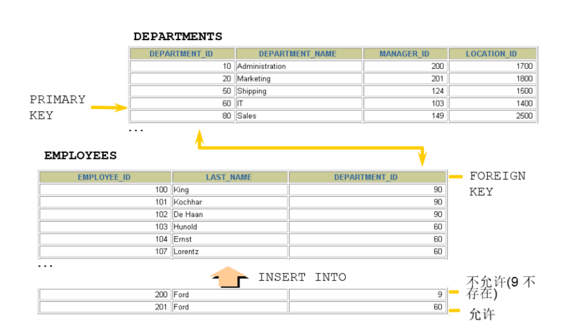

# 约束

**分类：**

- 可以在创建表时规定约束（通过 CREATE TABLE 语句），或者在表创建之后通过 ALTER TABLE 语句规定约束
- 可以分为当列约束 / 多列约束
- 也可以分为列级 / 表级约束

**根据约束起的作用，分为：**

- NOT NULL 非空约束，规定某个字段不能为空
- UNIQUE 唯一约束，规定某个字段在整个表中是唯一的
- PRIMARY KEY 主键(非空且唯一)约束
- FOREIGN KEY 外键约束
- CHECK 检查约束
- DEFAULT 默认值约束

**查看某个表已有的约束**

```sql
-- information_schema数据库名（系统库）
-- table_constraints表名称（专门存储各个表的约束）
SELECT * FROM information_schema.table_constraints
WHERE table_name = '表名称';
```

## 非空约束

::: info
限制某个字段/某列的值不允许为空

关键字：NOT NULL

特点：

1. 默认，所有的类型的值都可以是 NULL，包括 INT、FLOAT 等数据类型
2. 非空约束只能出现在表对象的列上，只能某个列单独限定非空，不能组合非空
3. 一个表可以有很多列都分别限定了非空
4. 空字符串''不等于 NULL，0 也不等于 NULL

:::


**添加非空约束**

- 建表时

::: code-group

```sql [语法]
CREATE TABLE 表名称(
  字段名 数据类型,
  字段名 数据类型 NOT NULL,
  字段名 数据类型 NOT NULL
);
```

```sql [exam 1]
CREATE TABLE emp(
  id INT(10) NOT NULL,
  NAME VARCHAR(20) NOT NULL,
  sex CHAR NULL
);
```

```sql [exam 2]
CREATE TABLE student(
  sid int,
  sname varchar(20) not null,
  tel char(11) ,
  cardid char(18) not null
);
```

```sql [插入数据]
insert into student values(1,'张三','13710011002','110222198912032545'); #成功

insert into student values(2,'李四','13710011002',null);#身份证号为空
-- ERROR 1048 (23000): Column 'cardid' cannot be null

insert into student values(2,'李四',null,'110222198912032546');#成功，tel允许为空

insert into student values(3,null,null,'110222198912032547');#失败
-- ERROR 1048 (23000): Column 'sname' cannot be null
```

:::

- 建表后

::: code-group

```sql [语法]
alter table 表名称 modify 字段名 数据类型 not null;
```

```sql [exam 1]
ALTER TABLE emp
MODIFY sex VARCHAR(30) NOT NULL;
```

```sql [exam 2]
alter table student modify sname varchar(20) not null;
```

:::

**删除非空约束**

::: code-group

```sql [语法]
alter table 表名称 modify 字段名 数据类型 NULL;
-- 去掉not null，相当于修改某个非注解字段，该字段允许为空

alter table 表名称 modify 字段名 数据类型;
-- 去掉not null，相当于修改某个非注解字段，该字段允许为空
```

```sql [exam 1]
ALTER TABLE emp
MODIFY sex VARCHAR(30) NULL;
```

```sql [exam 2]
ALTER TABLE emp
MODIFY NAME VARCHAR(15) DEFAULT 'abc' NULL;
```

:::

## 唯一性约束

::: info
限制某个字段/列的值不能重复

:::


特点：

1. 同一个表可以有多个唯一约束
2. 唯一约束可以是某一个列的值唯一，也可以多个列组合的值唯一
3. 唯一性约束允许列值为空
4. 在创建唯一约束的时候，如果不给唯一约束命名，就默认和列名相同
5. MySQL 会给唯一约束的列上默认创建一个唯一索引

**添加唯一约束**

- 建表时

::: code-group

```sql [语法]
create table 表名称(
  字段名 数据类型,
  字段名 数据类型 unique,
  字段名 数据类型 unique key,
  字段名 数据类型
);
create table 表名称(
  字段名 数据类型,
  字段名 数据类型,
  字段名 数据类型,
  [constraint 约束名] unique key(字段名)
);
```

```sql [学生表]
create table uni_student(
  sid int,
  sname varchar(20),
  tel char(11) unique,
  cardid char(18) unique key
);
```

```sql [课程表]
CREATE TABLE uni_course(
  cid INT UNIQUE,
  cname VARCHAR(100) UNIQUE,
  description VARCHAR(200)
);
```

```sql [复合]
CREATE TABLE uni_USER(
  id INT NOT NULL,
  NAME VARCHAR(25),
  PASSWORD VARCHAR(16),
  -- 使用表级约束语法
  CONSTRAINT uk_name_pwd UNIQUE(NAME,PASSWORD)
);
```

```sql [插入并验证]
insert into uni_student values(1,'张三','13710011002','101223199012015623');
insert into uni_student values(2,'李四','13710011003','101223199012015624');

mysql> select * from uni_student;
+-----+-------+-------------+--------------------+
| sid | sname | tel | cardid |
+-----+-------+-------------+--------------------+
| 1 | 张三 | 13710011002 | 101223199012015623 |
| 2 | 李四 | 13710011003 | 101223199012015624 |
+-----+-------+-------------+--------------------+
2 rows in set (0.00 sec)
```

```sql [插入重复数据]
insert into student values(3,'王五','13710011004','101223199012015624'); #身份证号重复
-- ERROR 1062 (23000): Duplicate entry '101223199012015624' for key 'cardid'

insert into student values(3,'王五','13710011003','101223199012015625');
-- ERROR 1062 (23000): Duplicate entry '13710011003' for key 'tel'
```

:::

- 建表后

::: code-group

```sql [语法]
-- 字段列表中如果是一个字段，表示该列的值唯一。如果是两个或更多个字段，那么复合唯一，即多个字段的组合是唯一的
alter table 表名称 add [CONSTRAINT name] unique key(字段列表);

alter table 表名称 modify 字段名 字段类型 unique;
```

```sql [添加复合约束]
ALTER TABLE uni_USER
ADD UNIQUE(NAME,PASSWORD);

ALTER TABLE uni_USER
ADD CONSTRAINT uk_name_pwd UNIQUE(NAME,PASSWORD);
```

```sql [添加单字段]
ALTER TABLE uni_USER
MODIFY NAME VARCHAR(20) UNIQUE;
```

```sql [学生表示例]
create table uni_student_01(
  sid int primary key,
  sname varchar(20),
  tel char(11) ,
  cardid char(18)
);

alter table student add unique key(tel);

alter table student add unique key(cardid);
```

:::

- 复合唯一约束
  > 上面语法已经包含了如何定义，以下只举例

::: code-group

```sql [建立学生/课程/学生课程表]
create table uni_student_02(
  sid int, -- 学号
  sname varchar(20), -- 姓名
  tel char(11) unique key, -- 电话
  cardid char(18) unique key -- 身份证号
);

create table uni_course_02(
  cid int, -- 课程编号
  cname varchar(20) -- 课程名称
);

create table uni_student_course_02(
  id int,
  sid int,
  cid int,
  score int,
  unique key(sid,cid) -- 复合唯一
);
```

```sql [插入并验证]
insert into uni_student_02 values(1,'张三','13710011002','101223199012015623');-- 成功
insert into uni_student_02 values(2,'李四','13710011003','101223199012015624');-- 成功
insert into uni_course_02 values(1001,'Java'),(1002,'MySQL');-- 成功

insert into uni_student_course_02 values
(1, 1, 1001, 89),
(2, 1, 1002, 90),
(3, 2, 1001, 88),
(4, 2, 1002, 56);

insert into uni_student_course_02 values (5, 1, 1001, 88);-- 失败
-- ERROR 1062 (23000): Duplicate entry '1-1001' for key 'sid'
```

:::

**查看约束**

::: warning 提示
注意：可以通过 show index from 表名称; 查看表的索引
:::

```sql
SELECT * FROM information_schema.table_constraints WHERE table_name = '表名';
```

**删除唯一约束**

::: info
添加唯一性约束的列上也会自动创建唯一索引

删除唯一约束只能通过删除唯一索引的方式删除

删除时需要指定唯一索引名，唯一索引名就和唯一约束名一样

如果创建唯一约束时未指定名称，如果是单列，就默认和列名相同；如果是组合列，那么默认和()中排在第一个的列名相同。也可以自定义唯一性约束名

:::

```sql [删除唯一约束]
ALTER TABLE USER
DROP INDEX uk_name_pwd;
```

## PRIMARY

用来唯一表示表中的一行记录

特点：

1. 主键约束相当于唯一约束+非空约束的组合，主键约束列不允许重复，也不允许出现空值
2. 一个表最多只能有一个主键约束，建立主键约束可以在列级别创建，也可以在表级别上创建
3. 主键约束对应着表中的一列或者多列（复合主键）
4. 如果是多列组合的复合主键约束，那么这些列都不允许为空值，并且组合的值不允许重复
5. MySQL 的主键名总是 PRIMARY，就算自己命名了主键约束名也没用
6. 当创建主键约束时，系统默认会在所在的列或列组合上建立对应的主键索引（能够根据主键查询的，就根据主键查询，效率更高）。如果删除主键约束了，主键约束对应的索引就自动删除了
7. 需要注意的一点是，不要修改主键字段的值。因为主键是数据记录的唯一标识，如果修改了主键的值，就有可能会破坏数据的完整性


**添加主键约束**

- 建表时

::: code-group

```sql [语法]
create table 表名称(
  字段名 数据类型 primary key, #列级模式
  字段名 数据类型,
  字段名 数据类型
);
create table 表名称(
  字段名 数据类型,
  字段名 数据类型,
  字段名 数据类型,
  [constraint 约束名] primary key(字段名) #表级模式
);
```

```sql [创建表并插入数据]
mysql> create table temp(
    -> id int primary key,
    -> name varchar(20)
    -> );
Query OK, 0 rows affected (0.01 sec)

mysql> desc temp;
+-------+-------------+------+-----+---------+-------+
| Field | Type        | Null | Key | Default | Extra |
+-------+-------------+------+-----+---------+-------+
| id    | int         | NO   | PRI | NULL    |       |
| name  | varchar(20) | YES  |     | NULL    |       |
+-------+-------------+------+-----+---------+-------+
2 rows in set (0.00 sec)

mysql> insert into temp values(1,'张三');
Query OK, 1 row affected (0.00 sec)

mysql> insert into temp values(2,'李四');
Query OK, 1 row affected (0.00 sec)

mysql> select * from temp;
+----+--------+
| id | name   |
+----+--------+
|  1 | 张三   |
|  2 | 李四   |
+----+--------+
2 rows in set (0.00 sec)
```

```sql [插入错误提示]
mysql> insert into temp values(1,'张三');
ERROR 1062 (23000): Duplicate entry '1' for key 'temp.PRIMARY'

mysql> insert into temp values(1,'王五');
ERROR 1062 (23000): Duplicate entry '1' for key 'temp.PRIMARY'
```

```sql [尝试建立两个主键]
mysql> create table mul_temp(
    -> id int primary key,
    -> name varchar(20) primary key
    -> );
ERROR 1068 (42000): Multiple primary key defined

mysql> desc mul_temp;
ERROR 1146 (42S02): Table 'test.mul_temp' doesn't exist
```

```sql [列级约束]
mysql> CREATE TABLE emp4(
    -> id INT PRIMARY KEY AUTO_INCREMENT ,
    -> NAME VARCHAR(20)
    -> );
Query OK, 0 rows affected (0.01 sec)

mysql> desc emp4;
+-------+-------------+------+-----+---------+----------------+
| Field | Type        | Null | Key | Default | Extra          |
+-------+-------------+------+-----+---------+----------------+
| id    | int         | NO   | PRI | NULL    | auto_increment |
| NAME  | varchar(20) | YES  |     | NULL    |                |
+-------+-------------+------+-----+---------+----------------+
2 rows in set (0.00 sec)
```

```sql [表级约束]
mysql> CREATE TABLE emp5(
    -> id INT NOT NULL AUTO_INCREMENT,
    -> NAME VARCHAR(20),
    -> pwd VARCHAR(15),
    -> CONSTRAINT emp5_id_pk PRIMARY KEY(id)
    -> );
Query OK, 0 rows affected (0.01 sec)

mysql> desc emp5;
+-------+-------------+------+-----+---------+----------------+
| Field | Type        | Null | Key | Default | Extra          |
+-------+-------------+------+-----+---------+----------------+
| id    | int         | NO   | PRI | NULL    | auto_increment |
| NAME  | varchar(20) | YES  |     | NULL    |                |
| pwd   | varchar(15) | YES  |     | NULL    |                |
+-------+-------------+------+-----+---------+----------------+
3 rows in set (0.00 sec)
```

:::

- 建表后

::: code-group

```sql [语法]
ALTER TABLE 表名称 ADD PRIMARY KEY(字段列表);
```

```sql [示例]
mysql> create table pri_stydent( id int, name varchar(10) );
Query OK, 0 rows affected (0.01 sec)

mysql> desc pri_stydent;
+-------+-------------+------+-----+---------+-------+
| Field | Type        | Null | Key | Default | Extra |
+-------+-------------+------+-----+---------+-------+
| id    | int         | YES  |     | NULL    |       |
| name  | varchar(10) | YES  |     | NULL    |       |
+-------+-------------+------+-----+---------+-------+
2 rows in set (0.00 sec)

mysql> ALTER TABLE pri_stydent ADD PRIMARY KEY (id);
Query OK, 0 rows affected (0.01 sec)
Records: 0  Duplicates: 0  Warnings: 0

mysql> desc pri_stydent;
+-------+-------------+------+-----+---------+-------+
| Field | Type        | Null | Key | Default | Extra |
+-------+-------------+------+-----+---------+-------+
| id    | int         | NO   | PRI | NULL    |       |
| name  | varchar(10) | YES  |     | NULL    |       |
+-------+-------------+------+-----+---------+-------+
2 rows in set (0.00 sec)

```

:::

- 复合主键

::: code-group

```sql [语法]
create table 表名称(
  字段名 数据类型,
  字段名 数据类型,
  字段名 数据类型,
  primary key(字段名1,字段名2) -- 表示字段1和字段2的组合是唯一的，也可以有更多个字段
);
```

```sql [建表插数据]
create table pri_mul_student(
  sid int primary key, -- 学号
  sname varchar(20) -- 学生姓名
);

create table pri_mul_course(
  cid int primary key, -- 课程编号
  cname varchar(20) -- 课程名称
);

create table pri_mul_student_course(
  sid int,
  cid int,
  score int,
  primary key(sid,cid) -- 复合主键
);

mysql> insert into pri_mul_student values(1,'张三'),(2,'李四');
Query OK, 2 rows affected (0.00 sec)
Records: 2  Duplicates: 0  Warnings: 0

mysql> insert into pri_mul_course values(1001,'Java'),(1002,'MySQL');
Query OK, 2 rows affected (0.00 sec)
Records: 2  Duplicates: 0  Warnings: 0
```

```sql [复合表插入并验证错误]
mysql> insert into pri_mul_student_course values(1, 1001, 89),(1,1002,90),(2,1001,88)
Query OK, 4 rows affected (0.01 sec)
Records: 4  Duplicates: 0  Warnings: 0

mysql> SELECT * FROM pri_mul_student_course;
+-----+------+-------+
| sid | cid  | score |
+-----+------+-------+
|   1 | 1001 |    89 |
|   1 | 1002 |    90 |
|   2 | 1001 |    88 |
|   2 | 1002 |    56 |
+-----+------+-------+
4 rows in set (0.00 sec)

mysql> INSERT INTO pri_mul_student_course values(1, 1001, 100);
ERROR 1062 (23000): Duplicate entry '1-1001' for key 'pri_mul_student_course.PRIMARY'
```

```SQL [查看复合表结构]
mysql> desc pri_mul_student_course;
+-------+------+------+-----+---------+-------+
| Field | Type | Null | Key | Default | Extra |
+-------+------+------+-----+---------+-------+
| sid   | int  | NO   | PRI | NULL    |       |
| cid   | int  | NO   | PRI | NULL    |       |
| score | int  | YES  |     | NULL    |       |
+-------+------+------+-----+---------+-------+
3 rows in set (0.00 sec)


```

:::

**删除主键约束**

::: danger 提示
说明：删除主键约束，不需要指定主键名，因为一个表只有一个主键，删除主键约束后，非空还存在
:::

::: code-group

```sql [语法]
alter table 表名称 drop primary key;
```

```sql [示例]
mysql> ALTER TABLE pri_mul_student_course DROP PRIMARY KEY;
Query OK, 4 rows affected (0.02 sec)
Records: 4  Duplicates: 0  Warnings: 0

mysql> DESC pri_mul_student_course;
+-------+------+------+-----+---------+-------+
| Field | Type | Null | Key | Default | Extra |
+-------+------+------+-----+---------+-------+
| sid   | int  | NO   |     | NULL    |       |
| cid   | int  | NO   |     | NULL    |       |
| score | int  | YES  |     | NULL    |       |
+-------+------+------+-----+---------+-------+
3 rows in set (0.00 sec)
```

:::

## 自增列

特点：

1. 一个表最多只能一个自增列
2. 当需要产生唯一标识符或顺序值时，可设置自增长
3. 自增长列约束的列必须是键列（主键列，唯一键列）
4. 自增约束的列的数据类型必须是整数类型
5. 如果自增列指定了 0 和 null，会在当前最大值的基础上自增；如果自增列手动指定了具体值，直接赋值为具体值

::: code-group

```sql [非键列报错]
mysql> create table employee(
    -> eid int auto_increment,
    -> ename varchar(20)
    -> );
ERROR 1075 (42000): Incorrect table definition; there can be only one auto column and it must be defined as a key
```

```sql [非 int 报错]
mysql> create table employee(
    -> eid int primary key,
    -> ename varchar(20) unique key auto_increment
    -> );
ERROR 1063 (42000): Incorrect column specifier for column 'ename'
```

:::

**指定自增约束**

- 建表时

::: code-group

```sql [语法]
create table 表名称(
  字段名 数据类型 primary key auto_increment,
  字段名 数据类型 unique key not null,
  字段名 数据类型 unique key,
  字段名 数据类型 not null default 默认值,
);

create table 表名称(
  字段名 数据类型 default 默认值 ,
  字段名 数据类型 unique key auto_increment,
  字段名 数据类型 not null default 默认值,,
  primary key(字段名)
);
```

```sql [示例]
mysql> create table incro_employee(
    -> eid int primary key auto_increment,
    -> ename varchar(20)
    -> );
Query OK, 0 rows affected (0.01 sec)

mysql> desc incro_employee;
+-------+-------------+------+-----+---------+----------------+
| Field | Type        | Null | Key | Default | Extra          |
+-------+-------------+------+-----+---------+----------------+
| eid   | int         | NO   | PRI | NULL    | auto_increment |
| ename | varchar(20) | YES  |     | NULL    |                |
+-------+-------------+------+-----+---------+----------------+
2 rows in set (0.00 sec)
```

:::

- 建表后

::: code-group

```sql [语法]
alter table 表名称 modify 字段名 数据类型 auto_increment;
```

```sql [exam 1]
create table inc_employee_01(
  eid int primary key ,
  ename varchar(20)
);

alter table inc_employee_01 modify eid int auto_increment;

mysql> desc inc_employee_01;
+-------+-------------+------+-----+---------+----------------+
| Field | Type        | Null | Key | Default | Extra          |
+-------+-------------+------+-----+---------+----------------+
| eid   | int         | NO   | PRI | NULL    | auto_increment |
| ename | varchar(20) | YES  |     | NULL    |                |
+-------+-------------+------+-----+---------+----------------+
2 rows in set (0.00 sec)
```

:::

**删除自增约束**

::: code-group

```sql [语法]
alter table 表名称 modify 字段名 数据类型;
-- 去掉auto_increment相当于删除
```

```sql [exam]
mysql> ALTER TABLE inc_employee_01 modify eid int;
Query OK, 0 rows affected (0.01 sec)
Records: 0  Duplicates: 0  Warnings: 0

mysql> desc inc_employee_01;
+-------+-------------+------+-----+---------+-------+
| Field | Type        | Null | Key | Default | Extra |
+-------+-------------+------+-----+---------+-------+
| eid   | int         | NO   | PRI | NULL    |       |
| ename | varchar(20) | YES  |     | NULL    |       |
+-------+-------------+------+-----+---------+-------+
2 rows in set (0.00 sec)
```

:::

## 外键约束

限定某个表的引用完整性



**主表与从表**

主表：被引用的表，被参考的表

从表：引用别人的表，参考别人的表

例如：学生表、课程表、选课表：选课表的学生和课程要分别参考学生表和课程表，学生表和课程表是主表，选课表是从表

**特点**

1. 从表的外键列，必须引用主表的主键或唯一约束的列，因为被依赖的值必须是唯一
2. 在创建外键约束时，如果不给外键约束命名，默认名不是列名，而是自动产生一个外键名，也可以指定外键约束名
3. 创建表时就指定外键约束的话，先指定主表，再创建从表
4. 删表时，先删从表，再删除主表
5. 当主表的记录被从表参照时，主表记录不允许删除，如果要删除数据，需要先删除从表中依赖该记录的数据，然后才可以删除主表的数据
6. 在从表中指定外键约束，并且一个表可以建立多个外键约束
7. 从表的外键列与主表被参照的列名字可以不相同，但是数据类型必须一样，逻辑意义一致
8. 当创建外键约束时，系统默认会在所在的列上建立对应的普通索引，索引名是外键约束名
9. 删除外键约束后，必须手动删除对应的索引

**添加外键约束**

- 建表时

::: code-group

```sql [语法]
create table 主表名称(
  字段1 数据类型 primary key,
  字段2 数据类型
);

create table 从表名称(
  字段1 数据类型 primary key,
  字段2 数据类型,
  [CONSTRAINT <外键约束名称>] FOREIGN KEY（从表的某个字段) references 主表名(被参考字段)
);
-- FOREIGN KEY: 在表级指定子表中的列
-- REFERENCES: 标示在父表中的列
```

```sql [exam]
create table foreign_dept( -- 主表
  did int primary key, -- 部门编号
  dname varchar(50) -- 部门名称
);

create table foreign_emp(-- 从表
  eid int primary key, -- 员工编号
  ename varchar(5), -- 员工姓名
  deptid int, -- 员工所在的部门
  foreign key (deptid) references dept(did) -- 在从表中指定外键约束
  -- emp表的deptid和和dept表的did的数据类型一致，意义都是表示部门的编号
);
```

:::

- 建表后

::: code-group

```sql [语法]
ALTER TABLE 从表名 ADD [CONSTRAINT 约束名]
FOREIGN KEY (从表的字段) REFERENCES 主表名(被引用字段) [on update xx][on delete xx];
```

```sql [exam]
create table foreign_dept_01(
  did int primary key, -- 部门编号
  dname varchar(50) -- 部门名称
);

create table foreign_emp_01(
  eid int primary key, -- 员工编号
  ename varchar(5), -- 员工姓名
  deptid int -- 员工所在的部门
);

mysql> alter table foreign_emp_01 add foreign  key(deptid) references foreign
_dept_01(did);
Query OK, 0 rows affected (0.02 sec)
Records: 0  Duplicates: 0  Warnings: 0

mysql> desc foreign_emp_01;
+--------+------------+------+-----+---------+-------+
| Field  | Type       | Null | Key | Default | Extra |
+--------+------------+------+-----+---------+-------+
| eid    | int        | NO   | PRI | NULL    |       |
| ename  | varchar(5) | YES  |     | NULL    |       |
| deptid | int        | YES  | MUL | NULL    |       |
+--------+------------+------+-----+---------+-------+
3 rows in set (0.01 sec)

mysql> desc foreign_dept_01;
+-------+-------------+------+-----+---------+-------+
| Field | Type        | Null | Key | Default | Extra |
+-------+-------------+------+-----+---------+-------+
| did   | int         | NO   | PRI | NULL    |       |
| dname | varchar(50) | YES  |     | NULL    |       |
+-------+-------------+------+-----+---------+-------+
2 rows in set (0.01 sec)

mysql> SELECT * FROM information_schema.table_constraints WHERE table_name =
'foreign_emp_01';
+--------------------+-------------------+-----------------------+--------------+----------------+-----------------+----------+
| CONSTRAINT_CATALOG | CONSTRAINT_SCHEMA | CONSTRAINT_NAME       | TABLE_SCHEMA | TABLE_NAME     | CONSTRAINT_TYPE | ENFORCED |
+--------------------+-------------------+-----------------------+--------------+----------------+-----------------+----------+
| def                | test              | PRIMARY               | test         | foreign_emp_01 | PRIMARY KEY     | YES      |
| def                | test              | foreign_emp_01_ibfk_1 | test         | foreign_emp_01 | FOREIGN KEY     | YES      |
+--------------------+-------------------+-----------------------+--------------+----------------+-----------------+----------+
2 rows in set (0.00 sec)
```

:::

::: danger
添加外键约束后，主表的修改和删除数据受约束

添加外键约束后，从表的删除和修改数据受约束

在从表上建立外键，要求主表必须存在

删除主表时，要求从表先删除，或者从表中外键引用该主表的关系先删除

:::

**约束等级**

::: warning 建议
对于外键约束，最好是采用: `ON UPDATE CASCADE ON DELETE RESTRICT` 的方式
:::

- Cascade 方式 ：在父表上 update/delete 记录时，同步 update/delete 掉子表的匹配记录

- Set null 方式 ：在父表上 update/delete 记录时，将子表上匹配记录的列设为 null，但是要注意子表的外键列不能为 not null

- No action 方式 ：如果子表中有匹配的记录，则不允许对父表对应候选键进行 update/delete 操作

- Restrict 方式 ：同 no action， 都是立即检查外键约束

- Set default 方式 （在可视化工具 SQLyog 中可能显示空白）：父表有变更时，子表将外键列设置成一个默认的值，但 Innodb 不能识别

**演示：** on update cascade on delete set null

::: code-group

```sql [建表插入数据]
create table foreign1_dept(
  did int primary key, -- 部门编号
  dname varchar(50) -- 部门名称
);
create table foreign1_emp(
  eid int primary key, -- 员工编号
  ename varchar(5), -- 员工姓名
  deptid int, -- 员工所在的部门
  foreign key (deptid) references dept(did) on update cascade on delete set null
  -- 把修改操作设置为级联修改等级，把删除操作设置为set null等级
);

insert into foreign1_dept values(1001,'教学部');
insert into foreign1_dept values(1002, '财务部');
insert into foreign1_dept values(1003, '咨询部');
insert into foreign1_emp values(1,'张三',1001); -- 在添加这条记录时，要求部门表有1001部门
insert into foreign1_emp values(2,'李四',1001);
insert into foreign1_emp values(3,'王五',1002);

```

```sql [更改数据]
-- 修改主表成功，从表也跟着修改，修改了主表被引用的字段1002为1004，从表的引用字段就跟着修改为1004了
mysql> update foreign1_dept set did = 1004 where did = 1002;
Query OK, 1 row affected (0.00 sec)
Rows matched: 1 Changed: 1 Warnings: 0

mysql> select * from foreign1_dept;
+------+--------+
| did | dname |
+------+--------+
| 1001 | 教学部 |
| 1003 | 咨询部 |
| 1004 | 财务部 | -- 原来是1002，修改为1004
+------+--------+
3 rows in set (0.00 sec)
mysql> select * from foreign1_emp;
+-----+-------+--------+
| eid | ename | deptid |
+-----+-------+--------+
| 1 | 张三 | 1001 |
| 2 | 李四 | 1001 |
| 3 | 王五 | 1004 | -- 原来是1002，跟着修改为1004
+-----+-------+--------+
3 rows in set (0.00 sec)
```

```sql [删除数据]
-- 删除主表的记录成功，从表对应的字段的值被修改为null
mysql> delete from dept where did = 1001;
Query OK, 1 row affected (0.01 sec)
mysql> select * from dept;
+------+--------+
| did | dname | -- 记录1001部门被删除了
+------+--------+
| 1003 | 咨询部 |
| 1004 | 财务部 |
+------+--------+
2 rows in set (0.00 sec)
mysql> select * from emp;
+-----+-------+--------+
| eid | ename | deptid |
+-----+-------+--------+
| 1 | 张三 | NULL | -- 原来引用1001部门的员工，deptid字段变为null
| 2 | 李四 | NULL |
| 3 | 王五 | 1004 |
+-----+-------+--------+
3 rows in set (0.00 sec)
```

:::

**演示：** on update set null on delete cascade

::: code-group

```sql [建表插入数据]
create table dept(
  did int primary key, -- 部门编号
  dname varchar(50) -- 部门名称
);
create table emp(
  eid int primary key, -- 员工编号
  ename varchar(5), -- 员工姓名
  deptid int, -- 员工所在的部门
  foreign key (deptid) references dept(did) on update set null on delete cascade
  -- 把修改操作设置为set null等级，把删除操作设置为级联删除等级
);

insert into dept values(1001,'教学部');
insert into dept values(1002, '财务部');
insert into dept values(1003, '咨询部');
insert into emp values(1,'张三',1001);
insert into emp values(2,'李四',1001);
insert into emp values(3,'王五',1002);

mysql> select * from dept;
+------+--------+
| did | dname |
+------+--------+
| 1001 | 教学部 |
| 1002 | 财务部 |
| 1003 | 咨询部 |
+------+--------+
3 rows in set (0.00 sec)
mysql> select * from emp;
+-----+-------+--------+
| eid | ename | deptid |
+-----+-------+--------+
| 1 | 张三 | 1001 |
| 2 | 李四 | 1001 |
| 3 | 王五 | 1002 |
+-----+-------+--------+
3 rows in set (0.00 sec)
```

```sql [修改]
-- 修改主表，从表对应的字段设置为null
mysql> update dept set did = 1004 where did = 1002;
Query OK, 1 row affected (0.00 sec)
Rows matched: 1 Changed: 1 Warnings: 0
mysql> select * from dept;
+------+--------+
| did | dname |
+------+--------+
| 1001 | 教学部 |
| 1003 | 咨询部 |
| 1004 | 财务部 | -- 原来did是1002
+------+--------+
3 rows in set (0.00 sec)

mysql> select * from emp;
+-----+-------+--------+
| eid | ename | deptid |
+-----+-------+--------+
| 1 | 张三 | 1001 |
| 2 | 李四 | 1001 |
| 3 | 王五 | NULL | -- 原来deptid是1002，因为部门表1002被修改了，1002没有对应的了，就设置为
null
+-----+-------+--------+
3 rows in set (0.00 sec)
```

```sql [删除]
-- 删除主表的记录成功，主表的1001行被删除了，从表相应的记录也被删除了
mysql> delete from dept where did=1001;
Query OK, 1 row affected (0.00 sec)
mysql> select * from dept;
+------+--------+
| did | dname | -- 部门表中1001部门被删除
+------+--------+
| 1003 | 咨询部 |
| 1004 | 财务部 |
+------+--------+
2 rows in set (0.00 sec)
mysql> select * from emp;
+-----+-------+--------+
| eid | ename | deptid |-- 原来1001部门的员工也被删除了
+-----+-------+--------+
| 3 | 王五 | NULL |
+-----+-------+--------+
1 row in set (0.00 sec)
```

:::

**删除外键约束**

::: code-group

```sql [删除流程]
(1)第一步先查看约束名和删除外键约束
SELECT * FROM information_schema.table_constraints WHERE table_name = '表名称'; -- 查看某个表的约束名

ALTER TABLE 从表名 DROP FOREIGN KEY 外键约束名;

(2)第二步查看索引名和删除索引。（注意，只能手动删除）
SHOW INDEX FROM 表名称; #查看某个表的索引名
ALTER TABLE 从表名 DROP INDEX 索引名;
```

```sql [示例原有结构]
mysql> SELECT * FROM information_schema.table_constraints WHERE table_name =
'foreign_emp_01';
+--------------------+-------------------+-----------------------+--------------+----------------+-----------------+----------+
| CONSTRAINT_CATALOG | CONSTRAINT_SCHEMA | CONSTRAINT_NAME       | TABLE_SCHEMA | TABLE_NAME     | CONSTRAINT_TYPE | ENFORCED |
+--------------------+-------------------+-----------------------+--------------+----------------+-----------------+----------+
| def                | test              | PRIMARY               | test         | foreign_emp_01 | PRIMARY KEY     | YES      |
| def                | test              | foreign_emp_01_ibfk_1 | test         | foreign_emp_01 | FOREIGN KEY     | YES      |
+--------------------+-------------------+-----------------------+--------------+----------------+-----------------+----------+
2 rows in set (0.00 sec)

mysql> SHOW INDEX FROM foreign_emp_01;
+----------------+------------+----------+--------------+-------------+-----------+-------------+----------+--------+------+------------+---------+---------------+---------+------------+
| Table          | Non_unique | Key_name | Seq_in_index | Column_name | Collation | Cardinality | Sub_part | Packed | Null | Index_type | Comment | Index_comment | Visible | Expression |
+----------------+------------+----------+--------------+-------------+-----------+-------------+----------+--------+------+------------+---------+---------------+---------+------------+
| foreign_emp_01 |          0 | PRIMARY  |            1 | eid         | A         |           0 |     NULL |   NULL |      | BTREE      |         |               | YES     | NULL       |
| foreign_emp_01 |          1 | deptid   |            1 | deptid      | A         |           0 |     NULL |   NULL | YES  | BTREE      |         |               | YES     | NULL       |
+----------------+------------+----------+--------------+-------------+-----------+-------------+----------+--------+------+------------+---------+---------------+---------+------------+
2 rows in set (0.00 sec)
```

```sql [删除后结构]
mysql> ALTER TABLE foreign_emp_01 DROP FOREIGN KEY foreign_emp_01_ibfk_1;
Query OK, 0 rows affected (0.01 sec)
Records: 0  Duplicates: 0  Warnings: 0

mysql> ALTER TABLE foreign_emp_01 DROP INDEX deptid;
Query OK, 0 rows affected (0.01 sec)
Records: 0  Duplicates: 0  Warnings: 0

mysql> SELECT * FROM information_schema.table_constraints WHERE table_name =
'foreign_emp_01';
+--------------------+-------------------+-----------------+--------------+----------------+-----------------+----------+
| CONSTRAINT_CATALOG | CONSTRAINT_SCHEMA | CONSTRAINT_NAME | TABLE_SCHEMA | TABLE_NAME     | CONSTRAINT_TYPE | ENFORCED |
+--------------------+-------------------+-----------------+--------------+----------------+-----------------+----------+
| def                | test              | PRIMARY         | test         | foreign_emp_01 | PRIMARY KEY     | YES      |
+--------------------+-------------------+-----------------+--------------+----------------+-----------------+----------+
1 row in set (0.00 sec)

mysql> SHOW INDEX FROM foreign_emp_01;
+----------------+------------+----------+--------------+-------------+-----------+-------------+----------+--------+------+------------+---------+---------------+---------+------------+
| Table          | Non_unique | Key_name | Seq_in_index | Column_name | Collation | Cardinality | Sub_part | Packed | Null | Index_type | Comment | Index_comment | Visible | Expression |
+----------------+------------+----------+--------------+-------------+-----------+-------------+----------+--------+------+------------+---------+---------------+---------+------------+
| foreign_emp_01 |          0 | PRIMARY  |            1 | eid         | A         |           0 |     NULL |   NULL |      | BTREE      |         |               | YES     | NULL       |
+----------------+------------+----------+--------------+-------------+-----------+-------------+----------+--------+------+------------+---------+---------------+---------+------------+
1 row in set (0.01 sec)

mysql> DESC foreign_emp_01;
+--------+------------+------+-----+---------+-------+
| Field  | Type       | Null | Key | Default | Extra |
+--------+------------+------+-----+---------+-------+
| eid    | int        | NO   | PRI | NULL    |       |
| ename  | varchar(5) | YES  |     | NULL    |       |
| deptid | int        | YES  |     | NULL    |       |
+--------+------------+------+-----+---------+-------+
3 rows in set (0.01 sec)
```

:::

::: danger 提示
在 MySQL 里，外键约束是有成本的，需要消耗系统资源。对于大并发的 SQL 操作，有可能会不适合。比如大型网站的中央数据库，可能会 因为外键约束的系统开销而变得非常慢 。

所以， MySQL 允许你不使用系统自带的外键约束，在 应用层面 完成检查数据一致性的逻辑。

即使你不用外键约束，也要想办法通过应用层面的附加逻辑，来实现外键约束的功能，确保数据的一致性

:::

**阿里规范：**

不得使用外键与级联，一切外键概念必须在应用层解决

> （概念解释）学生表中的 student_id 是主键，那么成绩表中的 student_id 则为外键。如果更新学生表中的 student_id，同时触发成绩表中的 student_id 更新，即为级联更新。外键与级联更新适用于 单机低并发 ，不适合 分布式 、 高并发集群 ；级联更新是强阻塞，存在数据库 更新风暴 的风险；外键影响数据库的 插入速度

## CHECK

::: warning
MySQL5.7 可以使用 check 约束，但 check 约束对数据验证没有任何作用。添加数据时，没有任何错误或警告
:::

::: code-group

```sql [建立结构]
mysql> CREATE TABLE check_temp(
    ->   id INT PRIMARY KEY AUTO_INCREMENT,
    ->   NAME VARCHAR(20),
    ->   age INT CHECK(age > 20),
    ->   sex char(1) CHECK(sex IN ('男', '女'))
    -> );
Query OK, 0 rows affected (0.01 sec)

mysql> DESC check_temp;
+-------+-------------+------+-----+---------+----------------+
| Field | Type        | Null | Key | Default | Extra          |
+-------+-------------+------+-----+---------+----------------+
| id    | int         | NO   | PRI | NULL    | auto_increment |
| NAME  | varchar(20) | YES  |     | NULL    |                |
| age   | int         | YES  |     | NULL    |                |
| sex   | char(1)     | YES  |     | NULL    |                |
+-------+-------------+------+-----+---------+----------------+
4 rows in set (0.00 sec)
```

```sql [插入验证]
mysql> INSERT INTO check_temp VALUES(NULL, 'TEST1', 21,'女');
Query OK, 1 row affected (0.00 sec)

mysql> INSERT INTO check_temp VALUES(NULL, 'TEST1', 21,'2');
ERROR 3819 (HY000): Check constraint 'check_temp_chk_2' is violated.

mysql> INSERT INTO check_temp VALUES(NULL, 'TEST1', 19,'男');
ERROR 3819 (HY000): Check constraint 'check_temp_chk_1' is violated.

mysql> SELECT * FROM check_temp;
+----+-------+------+------+
| id | NAME  | age  | sex  |
+----+-------+------+------+
|  1 | TEST1 |   21 | 女   |
+----+-------+------+------+
1 row in set (0.00 sec)
```

```sql [查看限制信息]
mysql> SELECT * FROM information_schema.table_constraints WHERE table_name = 'check_temp';
+--------------------+-------------------+------------------+--------------+------------+-----------------+----------+
| CONSTRAINT_CATALOG | CONSTRAINT_SCHEMA | CONSTRAINT_NAME  | TABLE_SCHEMA | TABLE_NAME | CONSTRAINT_TYPE | ENFORCED |
+--------------------+-------------------+------------------+--------------+------------+-----------------+----------+
| def                | test              | PRIMARY          | test         | check_temp | PRIMARY KEY     | YES      |
| def                | test              | check_temp_chk_1 | test         | check_temp | CHECK           | YES      |
| def                | test              | check_temp_chk_2 | test         | check_temp | CHECK           | YES      |
+--------------------+-------------------+------------------+--------------+------------+-----------------+----------+
3 rows in set (0.00 sec)

mysql> SHOW INDEX FROM check_temp;
+------------+------------+----------+--------------+-------------+-----------+-------------+----------+--------+------+------------+---------+---------------+---------+------------+
| Table      | Non_unique | Key_name | Seq_in_index | Column_name | Collation | Cardinality | Sub_part | Packed | Null | Index_type | Comment | Index_comment | Visible | Expression |
+------------+------------+----------+--------------+-------------+-----------+-------------+----------+--------+------+------------+---------+---------------+---------+------------+
| check_temp |          0 | PRIMARY  |            1 | id          | A         |           1 |     NULL |   NULL |      | BTREE      |         |               | YES     | NULL       |
+------------+------------+----------+--------------+-------------+-----------+-------------+----------+--------+------+------------+---------+---------------+---------+------------+
1 row in set (0.00 sec)
```

:::

## DEFAULT

给某个字段指定默认值，一旦设置默认值，在插入数据时，如果此字段没有显示赋值，则赋值为默认值

默认值一般不在主键与唯一键上加

**加默认值**

- 建表时

::: code-group

```sql [语法]
create table 表名称(
  字段名 数据类型 primary key,
  字段名 数据类型 unique key not null,
  字段名 数据类型 unique key,
  字段名 数据类型 not null default 默认值,
);

create table 表名称(
  字段名 数据类型 default 默认值 ,
  字段名 数据类型 not null default 默认值,
  字段名 数据类型 not null default 默认值,
  primary key(字段名),
  unique key(字段名)
);
```

```sql [exam]
create table default_employee(
  eid int primary key,
  ename varchar(20) not null,
  gender char default '男',
  tel char(11) not null default '' -- 默认是空字符串
);

mysql> SELECT * FROM default_employee;
+-----+--------+--------+-----+
| eid | ename  | gender | tel |
+-----+--------+--------+-----+
|   2 | 天琪   | 男     |     |
+-----+--------+--------+-----+
1 row in set (0.00 sec)
```

```SQL [查看表结构]
mysql> DESC default_employee;
+--------+-------------+------+-----+---------+-------+
| Field  | Type        | Null | Key | Default | Extra |
+--------+-------------+------+-----+---------+-------+
| eid    | int         | NO   | PRI | NULL    |       |
| ename  | varchar(20) | NO   |     | NULL    |       |
| gender | char(1)     | YES  |     | 男      |       |
| tel    | char(11)    | NO   |     |         |       |
+--------+-------------+------+-----+---------+-------+
4 rows in set (0.00 sec)


```

:::

- 建表后

```sql
-- 如果这个字段原来有非空约束，你还保留非空约束，那么在加默认值约束时，还得保留非空约束，否则非空约束就被删除了

alter table 表名称 modify 字段名 数据类型 default 默认值 [not null];
```

**删除默认约束**

```sql
alter table 表名称 modify 字段名 数据类型 ;-- 删除默认值约束，也不保留非空约束

alter table 表名称 modify 字段名 数据类型 not null; -- 删除默认值约束，保留非空约束
```

::: warning 问答
`为什么建表时，加 not null default '' 或 default 0 ？`

1. 不想让表中出现 null 值，不好比较，比较时只能用专门的 is null 和 is not null 来比较。碰到运算符，通常返回 null
2. 效率不高。影响提高索引效果。因此，我们往往在建表时 not null default '' 或 default 0

`带AUTO_INCREMENT约束的字段值是从1开始的吗？`

在 MySQL 中，默认 AUTO_INCREMENT 的初始值是 1，每新增一条记录，字段值自动加 1。设置自增属性（AUTO_INCREMENT）的时候，还可以指定第一条插入记录的自增字段的值，这样新插入的记录的自增字段值从初始值开始递增，如在表中插入第一条记录，同时指定 id 值为 5，则以后插入的记录的 id 值就会从 6 开始往上增加。添加主键约束时，往往需要设置字段自动增加属性

:::
