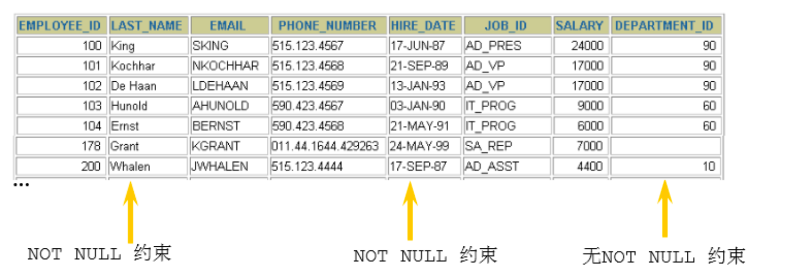
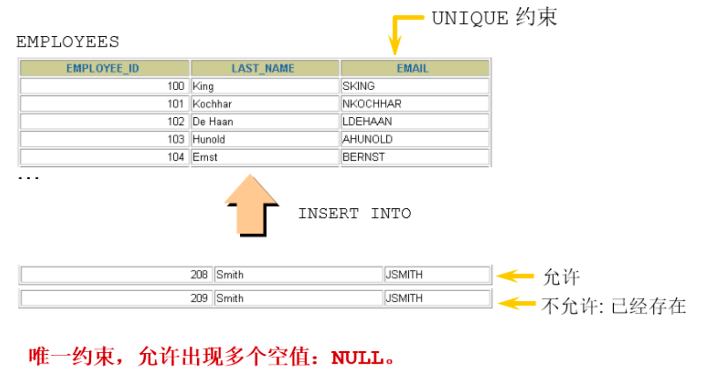
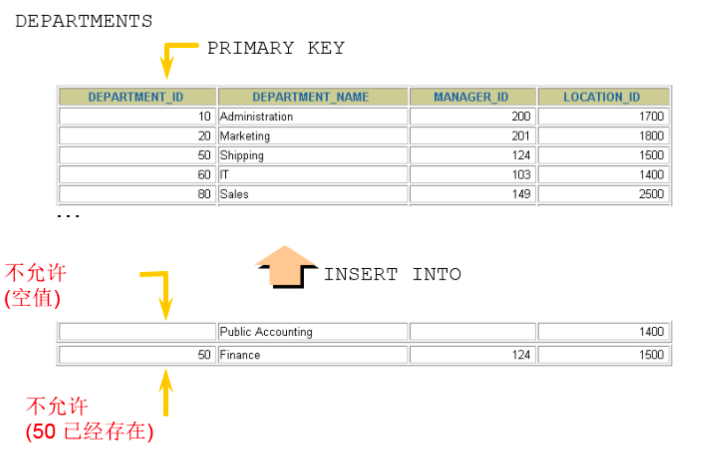

# 约束

**分类：**

- 可以在创建表时规定约束（通过 CREATE TABLE 语句），或者在表创建之后通过 ALTER TABLE 语句规定约束
- 可以分为当列约束 / 多列约束
- 也可以分为列级 / 表级约束

**根据约束起的作用，分为：**

- NOT NULL 非空约束，规定某个字段不能为空
- UNIQUE 唯一约束，规定某个字段在整个表中是唯一的
- PRIMARY KEY 主键(非空且唯一)约束
- FOREIGN KEY 外键约束
- CHECK 检查约束
- DEFAULT 默认值约束

**查看某个表已有的约束**

```sql
-- information_schema数据库名（系统库）
-- table_constraints表名称（专门存储各个表的约束）
SELECT * FROM information_schema.table_constraints
WHERE table_name = '表名称';
```

## 非空约束

::: info
限制某个字段/某列的值不允许为空

关键字：NOT NULL

特点：

1. 默认，所有的类型的值都可以是 NULL，包括 INT、FLOAT 等数据类型
2. 非空约束只能出现在表对象的列上，只能某个列单独限定非空，不能组合非空
3. 一个表可以有很多列都分别限定了非空
4. 空字符串''不等于 NULL，0 也不等于 NULL

:::



**添加非空约束**

- 建表时

::: code-group

```sql [语法]
CREATE TABLE 表名称(
  字段名 数据类型,
  字段名 数据类型 NOT NULL,
  字段名 数据类型 NOT NULL
);
```

```sql [exam 1]
CREATE TABLE emp(
  id INT(10) NOT NULL,
  NAME VARCHAR(20) NOT NULL,
  sex CHAR NULL
);
```

```sql [exam 2]
CREATE TABLE student(
  sid int,
  sname varchar(20) not null,
  tel char(11) ,
  cardid char(18) not null
);
```

```sql [插入数据]
insert into student values(1,'张三','13710011002','110222198912032545'); #成功

insert into student values(2,'李四','13710011002',null);#身份证号为空
-- ERROR 1048 (23000): Column 'cardid' cannot be null

insert into student values(2,'李四',null,'110222198912032546');#成功，tel允许为空

insert into student values(3,null,null,'110222198912032547');#失败
-- ERROR 1048 (23000): Column 'sname' cannot be null
```

:::

- 建表后

::: code-group

```sql [语法]
alter table 表名称 modify 字段名 数据类型 not null;
```

```sql [exam 1]
ALTER TABLE emp
MODIFY sex VARCHAR(30) NOT NULL;
```

```sql [exam 2]
alter table student modify sname varchar(20) not null;
```

:::

**删除非空约束**

::: code-group

```sql [语法]
alter table 表名称 modify 字段名 数据类型 NULL;
-- 去掉not null，相当于修改某个非注解字段，该字段允许为空

alter table 表名称 modify 字段名 数据类型;
-- 去掉not null，相当于修改某个非注解字段，该字段允许为空
```

```sql [exam 1]
ALTER TABLE emp
MODIFY sex VARCHAR(30) NULL;
```

```sql [exam 2]
ALTER TABLE emp
MODIFY NAME VARCHAR(15) DEFAULT 'abc' NULL;
```

:::

## 唯一性约束

::: info
限制某个字段/列的值不能重复

:::



特点：

1. 同一个表可以有多个唯一约束
2. 唯一约束可以是某一个列的值唯一，也可以多个列组合的值唯一
3. 唯一性约束允许列值为空
4. 在创建唯一约束的时候，如果不给唯一约束命名，就默认和列名相同
5. MySQL 会给唯一约束的列上默认创建一个唯一索引

**添加唯一约束**

- 建表时

::: code-group

```sql [语法]
create table 表名称(
  字段名 数据类型,
  字段名 数据类型 unique,
  字段名 数据类型 unique key,
  字段名 数据类型
);
create table 表名称(
  字段名 数据类型,
  字段名 数据类型,
  字段名 数据类型,
  [constraint 约束名] unique key(字段名)
);
```

```sql [学生表]
create table uni_student(
  sid int,
  sname varchar(20),
  tel char(11) unique,
  cardid char(18) unique key
);
```

```sql [课程表]
CREATE TABLE uni_course(
  cid INT UNIQUE,
  cname VARCHAR(100) UNIQUE,
  description VARCHAR(200)
);
```

```sql [复合]
CREATE TABLE uni_USER(
  id INT NOT NULL,
  NAME VARCHAR(25),
  PASSWORD VARCHAR(16),
  -- 使用表级约束语法
  CONSTRAINT uk_name_pwd UNIQUE(NAME,PASSWORD)
);
```

```sql [插入并验证]
insert into uni_student values(1,'张三','13710011002','101223199012015623');
insert into uni_student values(2,'李四','13710011003','101223199012015624');

mysql> select * from uni_student;
+-----+-------+-------------+--------------------+
| sid | sname | tel | cardid |
+-----+-------+-------------+--------------------+
| 1 | 张三 | 13710011002 | 101223199012015623 |
| 2 | 李四 | 13710011003 | 101223199012015624 |
+-----+-------+-------------+--------------------+
2 rows in set (0.00 sec)
```

```sql [插入重复数据]
insert into student values(3,'王五','13710011004','101223199012015624'); #身份证号重复
-- ERROR 1062 (23000): Duplicate entry '101223199012015624' for key 'cardid'

insert into student values(3,'王五','13710011003','101223199012015625');
-- ERROR 1062 (23000): Duplicate entry '13710011003' for key 'tel'
```

:::

- 建表后

::: code-group

```sql [语法]
-- 字段列表中如果是一个字段，表示该列的值唯一。如果是两个或更多个字段，那么复合唯一，即多个字段的组合是唯一的
alter table 表名称 add [CONSTRAINT name] unique key(字段列表);

alter table 表名称 modify 字段名 字段类型 unique;
```

```sql [添加复合约束]
ALTER TABLE uni_USER
ADD UNIQUE(NAME,PASSWORD);

ALTER TABLE uni_USER
ADD CONSTRAINT uk_name_pwd UNIQUE(NAME,PASSWORD);
```

```sql [添加单字段]
ALTER TABLE uni_USER
MODIFY NAME VARCHAR(20) UNIQUE;
```

```sql [学生表示例]
create table uni_student_01(
  sid int primary key,
  sname varchar(20),
  tel char(11) ,
  cardid char(18)
);

alter table student add unique key(tel);

alter table student add unique key(cardid);
```

:::

- 复合唯一约束
  > 上面语法已经包含了如何定义，以下只举例

::: code-group

```sql [建立学生/课程/学生课程表]
create table uni_student_02(
  sid int, -- 学号
  sname varchar(20), -- 姓名
  tel char(11) unique key, -- 电话
  cardid char(18) unique key -- 身份证号
);

create table uni_course_02(
  cid int, -- 课程编号
  cname varchar(20) -- 课程名称
);

create table uni_student_course_02(
  id int,
  sid int,
  cid int,
  score int,
  unique key(sid,cid) -- 复合唯一
);
```

```sql [插入并验证]
insert into uni_student_02 values(1,'张三','13710011002','101223199012015623');-- 成功
insert into uni_student_02 values(2,'李四','13710011003','101223199012015624');-- 成功
insert into uni_course_02 values(1001,'Java'),(1002,'MySQL');-- 成功

insert into uni_student_course_02 values
(1, 1, 1001, 89),
(2, 1, 1002, 90),
(3, 2, 1001, 88),
(4, 2, 1002, 56);

insert into uni_student_course_02 values (5, 1, 1001, 88);-- 失败
-- ERROR 1062 (23000): Duplicate entry '1-1001' for key 'sid'
```

:::

**查看约束**

::: warning 提示
注意：可以通过 show index from 表名称; 查看表的索引
:::

```sql
SELECT * FROM information_schema.table_constraints WHERE table_name = '表名';
```

**删除唯一约束**

::: info
添加唯一性约束的列上也会自动创建唯一索引

删除唯一约束只能通过删除唯一索引的方式删除

删除时需要指定唯一索引名，唯一索引名就和唯一约束名一样

如果创建唯一约束时未指定名称，如果是单列，就默认和列名相同；如果是组合列，那么默认和()中排在第一个的列名相同。也可以自定义唯一性约束名

:::

```sql [删除唯一约束]
ALTER TABLE USER
DROP INDEX uk_name_pwd;
```

## PRIMARY

用来唯一表示表中的一行记录

特点：

1. 主键约束相当于唯一约束+非空约束的组合，主键约束列不允许重复，也不允许出现空值
2. 一个表最多只能有一个主键约束，建立主键约束可以在列级别创建，也可以在表级别上创建
3. 主键约束对应着表中的一列或者多列（复合主键）
4. 如果是多列组合的复合主键约束，那么这些列都不允许为空值，并且组合的值不允许重复
5. MySQL 的主键名总是 PRIMARY，就算自己命名了主键约束名也没用
6. 当创建主键约束时，系统默认会在所在的列或列组合上建立对应的主键索引（能够根据主键查询的，就根据主键查询，效率更高）。如果删除主键约束了，主键约束对应的索引就自动删除了
7. 需要注意的一点是，不要修改主键字段的值。因为主键是数据记录的唯一标识，如果修改了主键的值，就有可能会破坏数据的完整性



**添加主键约束**

- 建表时

::: code-group

```sql [语法]
create table 表名称(
  字段名 数据类型 primary key, #列级模式
  字段名 数据类型,
  字段名 数据类型
);
create table 表名称(
  字段名 数据类型,
  字段名 数据类型,
  字段名 数据类型,
  [constraint 约束名] primary key(字段名) #表级模式
);
```

```sql [创建表并插入数据]
mysql> create table temp(
    -> id int primary key,
    -> name varchar(20)
    -> );
Query OK, 0 rows affected (0.01 sec)

mysql> desc temp;
+-------+-------------+------+-----+---------+-------+
| Field | Type        | Null | Key | Default | Extra |
+-------+-------------+------+-----+---------+-------+
| id    | int         | NO   | PRI | NULL    |       |
| name  | varchar(20) | YES  |     | NULL    |       |
+-------+-------------+------+-----+---------+-------+
2 rows in set (0.00 sec)

mysql> insert into temp values(1,'张三');
Query OK, 1 row affected (0.00 sec)

mysql> insert into temp values(2,'李四');
Query OK, 1 row affected (0.00 sec)

mysql> select * from temp;
+----+--------+
| id | name   |
+----+--------+
|  1 | 张三   |
|  2 | 李四   |
+----+--------+
2 rows in set (0.00 sec)
```

```sql [插入错误提示]
mysql> insert into temp values(1,'张三');
ERROR 1062 (23000): Duplicate entry '1' for key 'temp.PRIMARY'

mysql> insert into temp values(1,'王五');
ERROR 1062 (23000): Duplicate entry '1' for key 'temp.PRIMARY'
```

```sql [尝试建立两个主键]
mysql> create table mul_temp(
    -> id int primary key,
    -> name varchar(20) primary key
    -> );
ERROR 1068 (42000): Multiple primary key defined

mysql> desc mul_temp;
ERROR 1146 (42S02): Table 'test.mul_temp' doesn't exist
```

```sql [列级约束]
mysql> CREATE TABLE emp4(
    -> id INT PRIMARY KEY AUTO_INCREMENT ,
    -> NAME VARCHAR(20)
    -> );
Query OK, 0 rows affected (0.01 sec)

mysql> desc emp4;
+-------+-------------+------+-----+---------+----------------+
| Field | Type        | Null | Key | Default | Extra          |
+-------+-------------+------+-----+---------+----------------+
| id    | int         | NO   | PRI | NULL    | auto_increment |
| NAME  | varchar(20) | YES  |     | NULL    |                |
+-------+-------------+------+-----+---------+----------------+
2 rows in set (0.00 sec)
```

```sql [表级约束]
mysql> CREATE TABLE emp5(
    -> id INT NOT NULL AUTO_INCREMENT,
    -> NAME VARCHAR(20),
    -> pwd VARCHAR(15),
    -> CONSTRAINT emp5_id_pk PRIMARY KEY(id)
    -> );
Query OK, 0 rows affected (0.01 sec)

mysql> desc emp5;
+-------+-------------+------+-----+---------+----------------+
| Field | Type        | Null | Key | Default | Extra          |
+-------+-------------+------+-----+---------+----------------+
| id    | int         | NO   | PRI | NULL    | auto_increment |
| NAME  | varchar(20) | YES  |     | NULL    |                |
| pwd   | varchar(15) | YES  |     | NULL    |                |
+-------+-------------+------+-----+---------+----------------+
3 rows in set (0.00 sec)
```

:::

- 建表后

::: code-group

```sql [语法]
ALTER TABLE 表名称 ADD PRIMARY KEY(字段列表);
```

```sql [示例]
mysql> create table pri_stydent( id int, name varchar(10) );
Query OK, 0 rows affected (0.01 sec)

mysql> desc pri_stydent;
+-------+-------------+------+-----+---------+-------+
| Field | Type        | Null | Key | Default | Extra |
+-------+-------------+------+-----+---------+-------+
| id    | int         | YES  |     | NULL    |       |
| name  | varchar(10) | YES  |     | NULL    |       |
+-------+-------------+------+-----+---------+-------+
2 rows in set (0.00 sec)

mysql> ALTER TABLE pri_stydent ADD PRIMARY KEY (id);
Query OK, 0 rows affected (0.01 sec)
Records: 0  Duplicates: 0  Warnings: 0

mysql> desc pri_stydent;
+-------+-------------+------+-----+---------+-------+
| Field | Type        | Null | Key | Default | Extra |
+-------+-------------+------+-----+---------+-------+
| id    | int         | NO   | PRI | NULL    |       |
| name  | varchar(10) | YES  |     | NULL    |       |
+-------+-------------+------+-----+---------+-------+
2 rows in set (0.00 sec)

```

:::

- 复合主键

::: code-group

```sql [语法]
create table 表名称(
  字段名 数据类型,
  字段名 数据类型,
  字段名 数据类型,
  primary key(字段名1,字段名2) -- 表示字段1和字段2的组合是唯一的，也可以有更多个字段
);
```

```sql [建表插数据]
create table pri_mul_student(
  sid int primary key, -- 学号
  sname varchar(20) -- 学生姓名
);

create table pri_mul_course(
  cid int primary key, -- 课程编号
  cname varchar(20) -- 课程名称
);

create table pri_mul_student_course(
  sid int,
  cid int,
  score int,
  primary key(sid,cid) -- 复合主键
);

mysql> insert into pri_mul_student values(1,'张三'),(2,'李四');
Query OK, 2 rows affected (0.00 sec)
Records: 2  Duplicates: 0  Warnings: 0

mysql> insert into pri_mul_course values(1001,'Java'),(1002,'MySQL');
Query OK, 2 rows affected (0.00 sec)
Records: 2  Duplicates: 0  Warnings: 0
```

```sql [复合表插入并验证错误]
mysql> insert into pri_mul_student_course values(1, 1001, 89),(1,1002,90),(2,1001,88)
Query OK, 4 rows affected (0.01 sec)
Records: 4  Duplicates: 0  Warnings: 0

mysql> SELECT * FROM pri_mul_student_course;
+-----+------+-------+
| sid | cid  | score |
+-----+------+-------+
|   1 | 1001 |    89 |
|   1 | 1002 |    90 |
|   2 | 1001 |    88 |
|   2 | 1002 |    56 |
+-----+------+-------+
4 rows in set (0.00 sec)

mysql> INSERT INTO pri_mul_student_course values(1, 1001, 100);
ERROR 1062 (23000): Duplicate entry '1-1001' for key 'pri_mul_student_course.PRIMARY'
```

```SQL [查看复合表结构]
mysql> desc pri_mul_student_course;
+-------+------+------+-----+---------+-------+
| Field | Type | Null | Key | Default | Extra |
+-------+------+------+-----+---------+-------+
| sid   | int  | NO   | PRI | NULL    |       |
| cid   | int  | NO   | PRI | NULL    |       |
| score | int  | YES  |     | NULL    |       |
+-------+------+------+-----+---------+-------+
3 rows in set (0.00 sec)


```

:::

**删除主键约束**

::: danger 提示
说明：删除主键约束，不需要指定主键名，因为一个表只有一个主键，删除主键约束后，非空还存在
:::

::: code-group

```sql [语法]
alter table 表名称 drop primary key;
```

```sql [示例]
mysql> ALTER TABLE pri_mul_student_course DROP PRIMARY KEY;
Query OK, 4 rows affected (0.02 sec)
Records: 4  Duplicates: 0  Warnings: 0

mysql> DESC pri_mul_student_course;
+-------+------+------+-----+---------+-------+
| Field | Type | Null | Key | Default | Extra |
+-------+------+------+-----+---------+-------+
| sid   | int  | NO   |     | NULL    |       |
| cid   | int  | NO   |     | NULL    |       |
| score | int  | YES  |     | NULL    |       |
+-------+------+------+-----+---------+-------+
3 rows in set (0.00 sec)
```

:::
