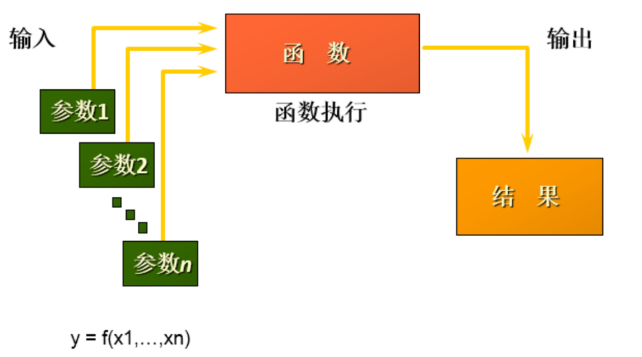
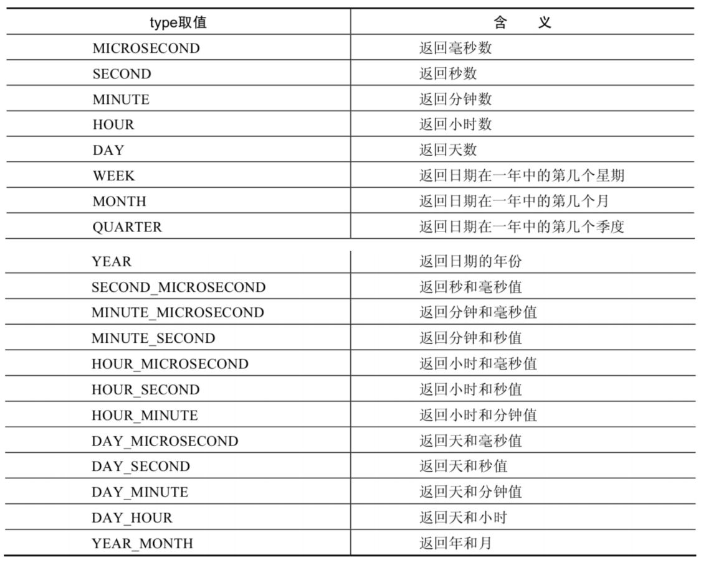
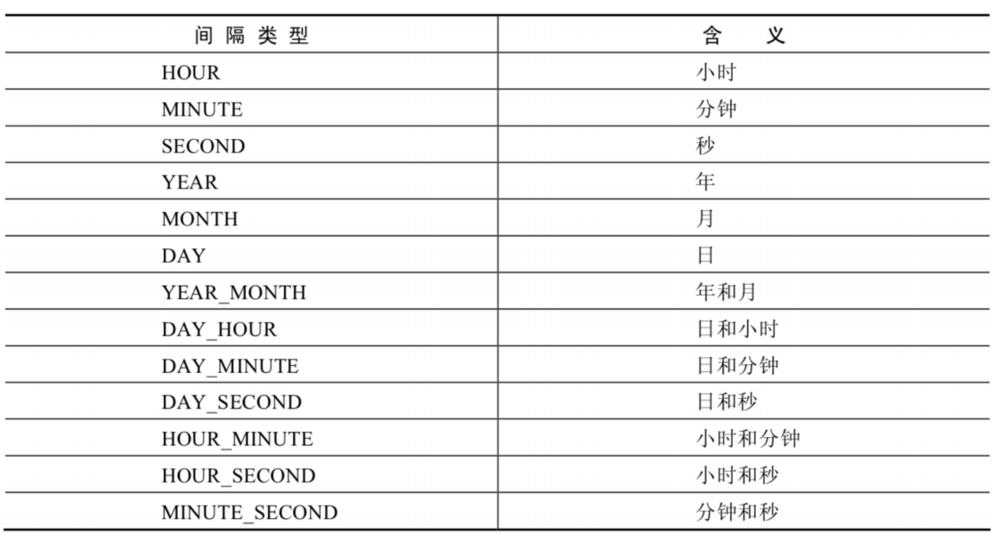
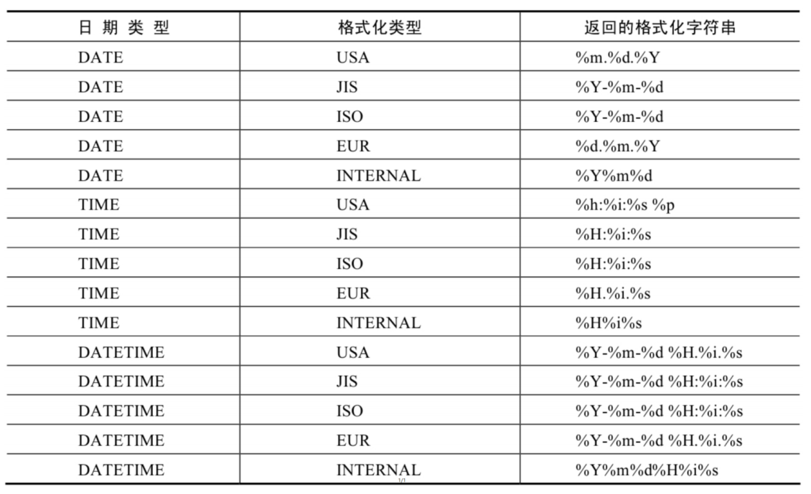
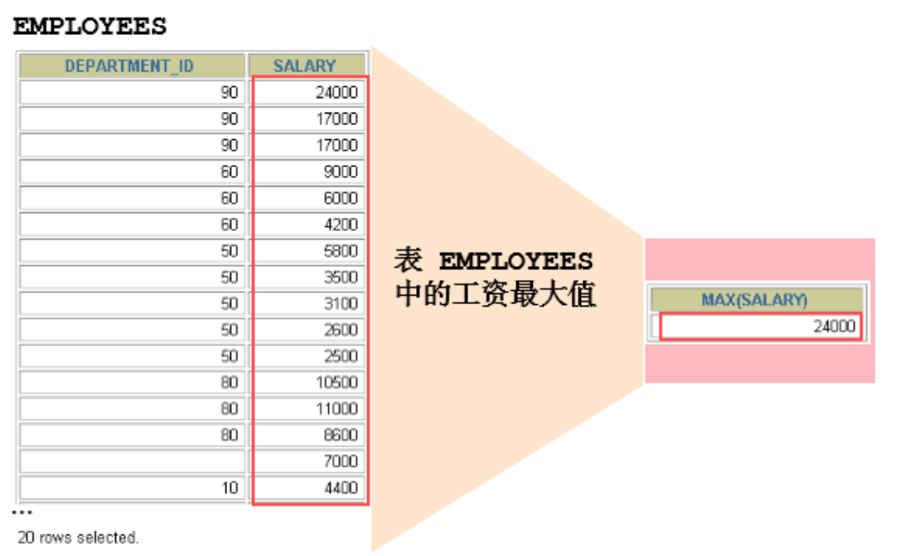
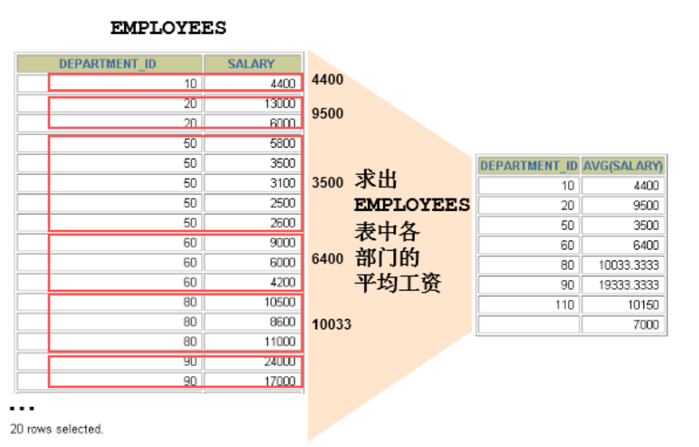
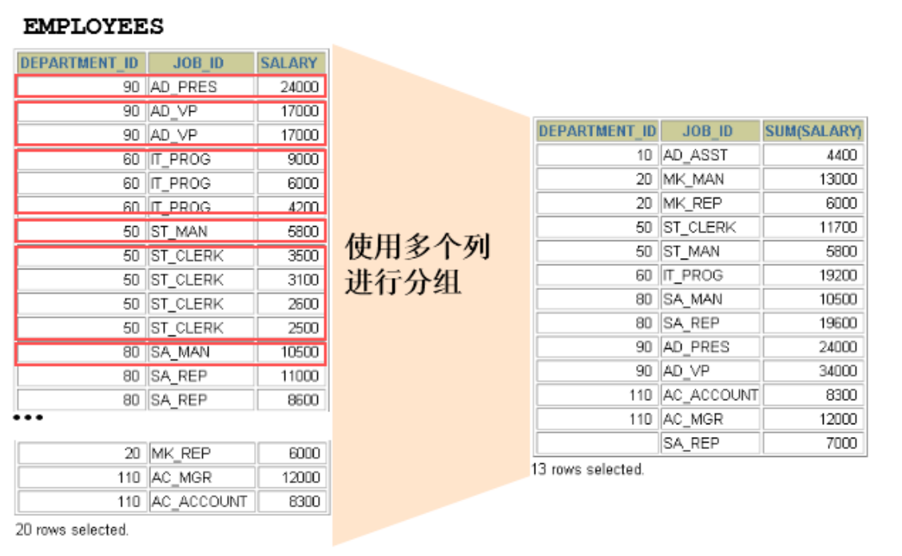
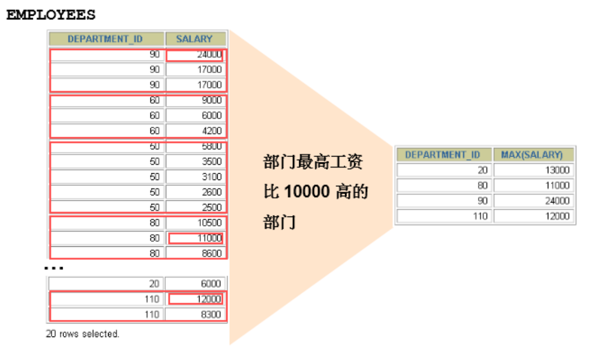
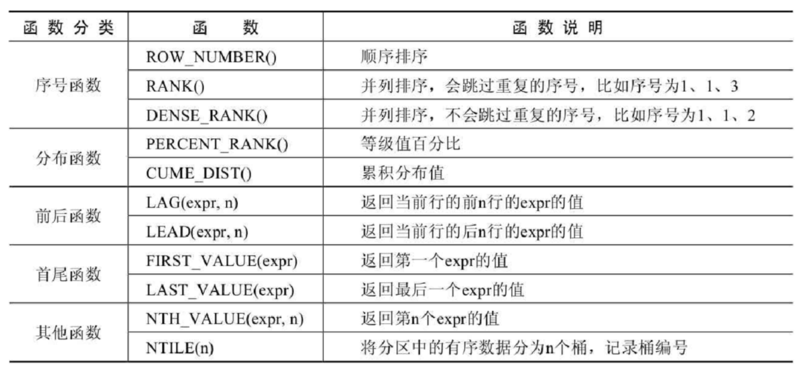

# 函数

从函数的角度出发，分为`内置函数`与`自定义函数`

单行函数与聚合函数就是 SQL 的内置函数

## 单行函数

::: warning 说明

1. 操作数据对象
2. 接收参数返回一个结果
3. 只对一行进行变换
4. 每行返回一个结果
5. 可以嵌套
6. 参数可以是一列或一个值

:::

在 SQL 中可以使用函数对检索出来的数据进行函数操作

使用这些函数可以极大提高用户对数据库的管理效率



### 数值函数

#### 基本函数

| 函数                | 用法                                                                    |
| :------------------ | ----------------------------------------------------------------------- |
| ABS(x)              | 返回 x 的绝对值                                                         |
| SIGN(X)             | 返回 X 的符号。正数返回 1，负数返回-1，0 返回 0                         |
| PI()                | 返回圆周率的值                                                          |
| CEIL(x)，CEILING(x) | 返回大于或等于某个值的最小整数                                          |
| FLOOR(x)            | 返回小于或等于某个值的最大整数                                          |
| LEAST(e1,e2,e3…)    | 返回列表中的最小值                                                      |
| GREATEST(e1,e2,e3…) | 返回列表中的最大值                                                      |
| MOD(x,y)            | 返回 X 除以 Y 后的余数                                                  |
| RAND()              | 返回 0~1 的随机值                                                       |
| RAND(x)             | 返回 0~1 的随机值，其中 x 的值用作种子值，相同的 X 值会产生相同的随机数 |
| ROUND(x)            | 返回一个对 x 的值进行四舍五入后，最接近于 X 的整数                      |
| ROUND(x,y)          | 返回一个对 x 的值进行四舍五入后最接近 X 的值，并保留到小数点后面 Y 位   |
| TRUNCATE(x,y)       | 返回数字 x 截断为 y 位小数的结果                                        |
| SQRT(x)             | 返回 x 的平方根。当 X 的值为负数时，返回 NULL                           |

::: code-group

```bash [示例 1]
mysql> SELECT
    -> ABS(-123),ABS(32),SIGN(-23),SIGN(43),PI(),CEIL(32.32),CEILING(-43.23),FLOOR(32.32),
    -> FLOOR(-43.23),MOD(12,5)
    -> FROM DUAL;
+-----------+---------+-----------+----------+----------+-------------+-----------------+--------------+---------------+-----------+
| ABS(-123) | ABS(32) | SIGN(-23) | SIGN(43) | PI()     | CEIL(32.32) | CEILING(-43.23) | FLOOR(32.32) | FLOOR(-43.23) | MOD(12,5) |
+-----------+---------+-----------+----------+----------+-------------+-----------------+--------------+---------------+-----------+
|       123 |      32 |        -1 |        1 | 3.141593 |          33 |             -43 |           32 |           -44 |         2 |
+-----------+---------+-----------+----------+----------+-------------+-----------------+--------------+---------------+-----------+
1 row in set (0.02 sec)
```

```bash [示例 2]
mysql> SELECT RAND(),RAND(),RAND(10),RAND(10),RAND(-1),RAND(-1)
    -> FROM DUAL;
+--------------------+--------------------+--------------------+--------------------+--------------------+--------------------+
| RAND()             | RAND()             | RAND(10)           | RAND(10)           | RAND(-1)           | RAND(-1)           |
+--------------------+--------------------+--------------------+--------------------+--------------------+--------------------+
| 0.6368513485759975 | 0.3500276481267322 | 0.6570515219653505 | 0.6570515219653505 | 0.9050373219931845 | 0.9050373219931845 |
+--------------------+--------------------+--------------------+--------------------+--------------------+--------------------+
1 row in set (0.01 sec)
```

```bash [示例 3]
mysql> SELECT
    -> ROUND(12.33),ROUND(12.343,2),ROUND(12.324,-1),TRUNCATE(12.66,1),TRUNCATE(12.66,-1)
    -> FROM DUAL;
+--------------+-----------------+------------------+-------------------+--------------------+
| ROUND(12.33) | ROUND(12.343,2) | ROUND(12.324,-1) | TRUNCATE(12.66,1) | TRUNCATE(12.66,-1) |
+--------------+-----------------+------------------+-------------------+--------------------+
|           12 |           12.34 |               10 |              12.6 |                 10 |
+--------------+-----------------+------------------+-------------------+--------------------+
1 row in set (0.01 sec)
```

:::

#### 角度与弧度互换函数

| 函数       | 用法                                    |
| :--------- | --------------------------------------- |
| RADIANS(x) | 将角度转化为弧度，其中，参数 x 为角度值 |
| DEGREES(x) | 将弧度转化为角度，其中，参数 x 为弧度值 |

```bash
mysql> SELECT RADIANS(30),RADIANS(60),RADIANS(90),DEGREES(2*PI()),DEGREES(RADIANS(90))
    -> FROM DUAL;
+--------------------+--------------------+--------------------+-----------------+----------------------+
| RADIANS(30)        | RADIANS(60)        | RADIANS(90)        | DEGREES(2*PI()) | DEGREES(RADIANS(90)) |
+--------------------+--------------------+--------------------+-----------------+----------------------+
| 0.5235987755982988 | 1.0471975511965976 | 1.5707963267948966 |             360 |                   90 |
+--------------------+--------------------+--------------------+-----------------+----------------------+
1 row in set (0.01 sec)
```

#### 三角函数

基本上没有用到，后面用到再来详细补充

| 函数       | 用法                                                                             |
| :--------- | -------------------------------------------------------------------------------- |
| SIN(x)     | 返回 x 的正弦值，其中，参数 x 为弧度值                                           |
| ASIN(x)    | 返回 x 的反正弦值，即获取正弦为 x 的值。如果 x 的值不在-1 到 1 之间，则返回 NULL |
| COS(x)     | 返回 x 的余弦值，其中，参数 x 为弧度值                                           |
| ACOS(x)    | 返回 x 的反余弦值，即获取余弦为 x 的值。如果 x 的值不在-1 到 1 之间，则返回 NULL |
| TAN(x)     | 返回 x 的正切值，其中，参数 x 为弧度值                                           |
| ATAN(x)    | 返回 x 的反正切值，即返回正切值为 x 的值                                         |
| ATAN2(m,n) | 返回两个参数的反正切值                                                           |
| COT(x)     | 返回 x 的余切值，其中，X 为弧度值                                                |

#### 指数与对数

| 函数                 | 用法                                                       |
| :------------------- | ---------------------------------------------------------- |
| POW(x,y)，POWER(X,Y) | 返回 x 的 y 次方                                           |
| EXP(X)               | 返回 e 的 X 次方，其中 e 是一个常数，2.718281828459045     |
| LN(X)，LOG(X)        | 返回以 e 为底的 X 的对数，当 X <= 0 时，返回的结果为 NULL  |
| LOG10(X)             | 返回以 10 为底的 X 的对数，当 X <= 0 时，返回的结果为 NULL |
| LOG2(X)              | 返回以 2 为底的 X 的对数，当 X <= 0 时，返回 NULL          |

```bash
mysql>  SELECT POW(2,5),POWER(2,4),EXP(2),LN(10),LOG10(10),LOG2(4) FROM DUAL;
+----------+------------+------------------+-------------------+-----------+---------+
| POW(2,5) | POWER(2,4) | EXP(2)           | LN(10)            | LOG10(10) | LOG2(4) |
+----------+------------+------------------+-------------------+-----------+---------+
|       32 |         16 | 7.38905609893065 | 2.302585092994046 |         1 |       2 |
+----------+------------+------------------+-------------------+-----------+---------+
1 row in set (0.00 sec)
```

#### 进制间转换

| 函数          | 用法                         |
| :------------ | ---------------------------- |
| BIN(x)        | 返回 x 的二进制编码          |
| HEX(x)        | 返回 x 的十六进制编码        |
| OCT(x)        | 返回 x 的八进制编码          |
| CONV(x,f1,f2) | 返回 f1 进制数变成 f2 进制数 |

```bash
mysql> SELECT BIN(10),HEX(10),OCT(10),CONV(10,2,8) FROM DUAL;
+---------+---------+---------+--------------+
| BIN(10) | HEX(10) | OCT(10) | CONV(10,2,8) |
+---------+---------+---------+--------------+
| 1010    | A       | 12      | 2            |
+---------+---------+---------+--------------+
1 row in set (0.01 sec)
```

### 字符串函数

::: danger 警告
字符串中的位置是从 1 开始的
:::

| 函数                             | 用法                                                                                                                   |
| :------------------------------- | ---------------------------------------------------------------------------------------------------------------------- |
| ASCII(S)                         | 返回字符串 S 中的第一个字符的 ASCII 码值                                                                               |
| CHAR_LENGTH(s)                   | 返回字符串 s 的字符数。作用与 CHARACTER_LENGTH(s)相同                                                                  |
| LENGTH(s)                        | 返回字符串 s 的字节数，和字符集有关                                                                                    |
| CONCAT(s1,s2,......,sn)          | 连接 s1,s2,......,sn 为一个字符串                                                                                      |
| CONCAT_WS(x,s1,s2,......,sn)     | 同 CONCAT(s1,s2,...)函数，但是每个字符串之间要加上 x                                                                   |
| INSERT(str, idx, len,replacestr) | 将字符串 str 从第 idx 位置开始，len 个字符长的子串替换为字符串 replacestr                                              |
| REPLACE(str, a, b)               | 用字符串 b 替换字符串 str 中所有出现的字符串 a                                                                         |
| UPPER(s) 或 UCASE(s)             | 将字符串 s 的所有字母转成大写字母                                                                                      |
| LOWER(s) 或 LCASE(s)             | 将字符串 s 的所有字母转成小写字母                                                                                      |
| LEFT(str,n)                      | 返回字符串 str 最左边的 n 个字符                                                                                       |
| RIGHT(str,n)                     | 返回字符串 str 最右边的 n 个字符                                                                                       |
| LPAD(str, len, pad)              | 用字符串 pad 对 str 最左边进行填充，直到 str 的长度为 len 个字符                                                       |
| RPAD(str ,len, pad)              | 用字符串 pad 对 str 最右边进行填充，直到 str 的长度为 len 个字符                                                       |
| LTRIM(s)                         | 去掉字符串 s 左侧的空格                                                                                                |
| RTRIM(s)                         | 去掉字符串 s 右侧的空格                                                                                                |
| TRIM(s)                          | 去掉字符串 s 开始与结尾的空格                                                                                          |
| TRIM(s1 FROM s)                  | 去掉字符串 s 开始与结尾的 s1                                                                                           |
| TRIM(LEADING s1 FROM s)          | 去掉字符串 s 开始处的 s1                                                                                               |
| TRIM(TRAILING s1 FROM s)         | 去掉字符串 s 结尾处的 s1                                                                                               |
| REPEAT(str, n)                   | 返回 str 重复 n 次的结果                                                                                               |
| SPACE(n)                         | 返回 n 个空格                                                                                                          |
| STRCMP(s1,s2)                    | 比较字符串 s1,s2 的 ASCII 码值的大小                                                                                   |
| SUBSTR(s,index,len)              | 返回从字符串 s 的 index 位置其 len 个字符，作用与 SUBSTRING(s,n,len)、MID(s,n,len)相同                                 |
| LOCATE(substr,str)               | 返回字符串 substr 在字符串 str 中首次出现的位置，作用于 POSITION(substr IN str)、INSTR(str,substr)相同。未找到，返回 0 |
| ELT(m,s1,s2,…,sn)                | 返回指定位置的字符串，如果 m=1，则返回 s1，如果 m=2，则返回 s2，如果 m=n，则返回 sn                                    |
| FIELD(s,s1,s2,…,sn)              | 返回字符串 s 在字符串列表中第一次出现的位置                                                                            |
| FIND_IN_SET(s1,s2)               | 返回字符串 s1 在字符串 s2 中出现的位置。其中，字符串 s2 是一个以逗号分隔的字符串                                       |
| REVERSE(s)                       | 返回 s 反转后的字符串                                                                                                  |
| NULLIF(value1,value2)            | 比较两个字符串，如果 value1 与 value2 相等，则返回 NULL，否则返回 value1                                               |

示例：

::: code-group

```bash [示例 1]
mysql> SELECT FIELD('mm','hello','msm','amma'),FIND_IN_SET('mm','hello,mm,amma') FROM DUAL;

+----------------------------------+-----------------------------------+
| FIELD('mm','hello','msm','amma') | FIND_IN_SET('mm','hello,mm,amma') |
+----------------------------------+-----------------------------------+
|                                0 |                                 2 |
+----------------------------------+-----------------------------------+
1 row in set (0.01 sec)
```

```bash [示例 2]
mysql> SELECT NULLIF('mysql','mysql'),NULLIF('mysql', '');

+-------------------------+---------------------+
| NULLIF('mysql','mysql') | NULLIF('mysql', '') |
+-------------------------+---------------------+
| NULL                    | mysql               |
+-------------------------+---------------------+
1 row in set (0.00 sec)
```

:::

### 日期和时间函数

#### 获取日期、时间

| 函数                                                                     | 用法                           |
| :----------------------------------------------------------------------- | ------------------------------ |
| CURDATE() ，CURRENT_DATE()                                               | 返回当前日期，只包含年、月、日 |
| CURTIME() ， CURRENT_TIME()                                              | 返回当前时间，只包含时、分、秒 |
| NOW() / SYSDATE() / CURRENT_TIMESTAMP() / LOCALTIME() / LOCALTIMESTAMP() | 返回当前系统日期和时间         |
| UTC_DATE()                                                               | 返回 UTC（世界标准时间）日期   |
| UTC_TIME()                                                               | 返回 UTC（世界标准时间）时间   |

```bash
mysql> SELECT
    -> CURDATE(),CURTIME(),NOW(),SYSDATE()+0,UTC_DATE(),UTC_DATE()+0,UTC_TIME(),UTC_TIME()+0
    -> FROM DUAL;

+------------+-----------+---------------------+----------------+------------+--------------+------------+--------------+
| CURDATE()  | CURTIME() | NOW()               | SYSDATE()+0    | UTC_DATE() | UTC_DATE()+0 | UTC_TIME() | UTC_TIME()+0 |
+------------+-----------+---------------------+----------------+------------+--------------+------------+--------------+
| 2024-06-04 | 01:02:48  | 2024-06-04 01:02:48 | 20240604010248 | 2024-06-03 |     20240603 | 17:02:48   |       170248 |
+------------+-----------+---------------------+----------------+------------+--------------+------------+--------------+
1 row in set (0.00 sec)
```

#### 日期与时间戳的转换

| 函数                     | 用法                                                                   |
| :----------------------- | ---------------------------------------------------------------------- |
| UNIX_TIMESTAMP()         | 以 UNIX 时间戳的形式返回当前时间。SELECT UNIX_TIMESTAMP() ->1634348884 |
| UNIX_TIMESTAMP(date)     | 将时间 date 以 UNIX 时间戳的形式返回                                   |
| FROM_UNIXTIME(timestamp) | 将 UNIX 时间戳的时间转换为普通格式的时间                               |

```bash
mysql> SELECT UNIX_TIMESTAMP(now()), UNIX_TIMESTAMP(),FROM_UNIXTIME(1717434423);

+-----------------------+------------------+---------------------------+
| UNIX_TIMESTAMP(now()) | UNIX_TIMESTAMP() | FROM_UNIXTIME(1717434423) |
+-----------------------+------------------+---------------------------+
|            1717434448 |       1717434448 | 2024-06-04 01:07:03       |
+-----------------------+------------------+---------------------------+
```

#### 获取具体函数

| 函数                                     | 用法                                                 |
| :--------------------------------------- | ---------------------------------------------------- |
| YEAR(date) / MONTH(date) / DAY(date)     | 返回具体的日期值                                     |
| HOUR(time) / MINUTE(time) / SECOND(time) | 返回具体的时间值                                     |
| MONTHNAME(date)                          | 返回月份：January，...                               |
| DAYNAME(date)                            | 返回星期几：MONDAY，TUESDAY.....SUNDAY               |
| WEEKDAY(date)                            | 返回周几，注意，周 1 是 0，周 2 是 1，。。。周日是 6 |
| QUARTER(date)                            | 返回日期对应的季度，范围为 1 ～ 4                    |
| WEEK(date) ， WEEKOFYEAR(date)           | 返回一年中的第几周                                   |
| DAYOFYEAR(date)                          | 返回日期是一年中的第几天                             |
| DAYOFMONTH(date)                         | 返回日期位于所在月份的第几天                         |
| DAYOFWEEK(date)                          | 返回周几，注意：周日是 1，周一是 2，。。。周六是 7   |

::: code-group

```bash [示例 1]
mysql> SELECT YEAR(CURDATE()),MONTH(CURDATE()),DAY(CURDATE()),
    -> HOUR(CURTIME()),MINUTE(NOW()),SECOND(SYSDATE())
    -> FROM DUAL;
+-----------------+------------------+----------------+-----------------+---------------+-------------------+
| YEAR(CURDATE()) | MONTH(CURDATE()) | DAY(CURDATE()) | HOUR(CURTIME()) | MINUTE(NOW()) | SECOND(SYSDATE()) |
+-----------------+------------------+----------------+-----------------+---------------+-------------------+
|            2024 |                6 |              4 |              15 |            43 |                14 |
+-----------------+------------------+----------------+-----------------+---------------+-------------------+
1 row in set (0.00 sec)
```

```bash [示例 2]
mysql> SELECT MONTHNAME('2021-10-26'),DAYNAME('2021-10-26'),WEEKDAY('2021-10-26'),
    -> QUARTER(CURDATE()),WEEK(CURDATE()),DAYOFYEAR(NOW()),
    -> DAYOFMONTH(NOW()),DAYOFWEEK(NOW())
    -> FROM DUAL;
+-------------------------+-----------------------+-----------------------+--------------------+-----------------+------------------+-------------------+------------------+
| MONTHNAME('2021-10-26') | DAYNAME('2021-10-26') | WEEKDAY('2021-10-26') | QUARTER(CURDATE()) | WEEK(CURDATE()) | DAYOFYEAR(NOW()) | DAYOFMONTH(NOW()) | DAYOFWEEK(NOW()) |
+-------------------------+-----------------------+-----------------------+--------------------+-----------------+------------------+-------------------+------------------+
| October                 | Tuesday               |                     1 |                  2 |              22 |              156 |                 4 |                3 |
+-------------------------+-----------------------+-----------------------+--------------------+-----------------+------------------+-------------------+------------------+
1 row in set (0.00 sec)

```

:::

#### 日期的操作函数

| 函数                    | 用法                                        |
| :---------------------- | ------------------------------------------- |
| EXTRACT(type FROM date) | 返回指定日期中特定的部分，type 指定返回的值 |

EXTRACT(type FROM date)函数中 type 的取值与含义：



```bash
mysql> SELECT EXTRACT(MINUTE FROM NOW()),EXTRACT( WEEK FROM NOW()),
    -> EXTRACT( QUARTER FROM NOW()),EXTRACT( MINUTE_SECOND FROM NOW())
    -> FROM DUAL;
+----------------------------+---------------------------+------------------------------+------------------------------------+
| EXTRACT(MINUTE FROM NOW()) | EXTRACT( WEEK FROM NOW()) | EXTRACT( QUARTER FROM NOW()) | EXTRACT( MINUTE_SECOND FROM NOW()) |
+----------------------------+---------------------------+------------------------------+------------------------------------+
|                         51 |                        22 |                            2 |                               5144 |
+----------------------------+---------------------------+------------------------------+------------------------------------+
1 row in set (0.00 sec)

```

#### 时间与秒钟转换

| 函数                 | 用法                                                              |
| :------------------- | ----------------------------------------------------------------- |
| TIME_TO_SEC(time)    | 将 time 转化为秒并返回结果值。转化的公式为： 小时*3600+分钟*60+秒 |
| SEC_TO_TIME(seconds) | 将 seconds 描述转化为包含小时、分钟和秒的时间                     |

::: code-group

```bash [time2sec]
mysql> SELECT TIME_TO_SEC(NOW());
+--------------------+
| TIME_TO_SEC(NOW()) |
+--------------------+
|              57484 |
+--------------------+
1 row in set (0.00 sec)

```

```bash [sec2time]
mysql> SELECT SEC_TO_TIME(57484);
+--------------------+
| SEC_TO_TIME(57484) |
+--------------------+
| 15:58:04           |
+--------------------+
1 row in set (0.00 sec)

```

:::

#### 计算时间与日期

- 第一组

| 函数                                                                     | 用法                                             |
| :----------------------------------------------------------------------- | ------------------------------------------------ |
| DATE_ADD(datetime, INTERVAL expr type)，ADDDATE(date,INTERVAL expr type) | 返回与给定日期时间相差 INTERVAL 时间段的日期时间 |
| DATE_SUB(date,INTERVAL expr type)，SUBDATE(date,INTERVAL expr type)      | 返回与 date 相差 INTERVAL 时间间隔的日期         |

type 取值：



::: code-group

```bash [示例 1]
mysql> SELECT DATE_ADD(NOW(), INTERVAL 1 DAY) AS col1,DATE_ADD('2021-10-21 23:32:12',INTERVAL
    -> 1 SECOND) AS col2,
    -> ADDDATE('2021-10-21 23:32:12',INTERVAL 1 SECOND) AS col3,
    -> DATE_ADD('2021-10-21 23:32:12',INTERVAL '1_1' MINUTE_SECOND) AS col4,
    -> DATE_ADD(NOW(), INTERVAL -1 YEAR) AS col5, #可以是负数
    -> DATE_ADD(NOW(), INTERVAL '1_1' YEAR_MONTH) AS col6 #需要单引号
    -> FROM DUAL;
+---------------------+---------------------+---------------------+---------------------+---------------------+---------------------+
| col1                | col2                | col3                | col4                | col5                | col6                |
+---------------------+---------------------+---------------------+---------------------+---------------------+---------------------+
| 2024-06-05 16:09:57 | 2021-10-21 23:32:13 | 2021-10-21 23:32:13 | 2021-10-21 23:33:13 | 2023-06-04 16:09:57 | 2025-07-04 16:09:57 |
+---------------------+---------------------+---------------------+---------------------+---------------------+---------------------+
1 row in set (0.00 sec)

```

```bash [示例 2]
mysql> SELECT DATE_SUB('2021-01-21',INTERVAL 31 DAY) AS col1,
    -> SUBDATE('2021-01-21',INTERVAL 31 DAY) AS col2,
    -> DATE_SUB('2021-01-21 02:01:01',INTERVAL '1 1' DAY_HOUR) AS col3
    -> FROM DUAL;
+------------+------------+---------------------+
| col1       | col2       | col3                |
+------------+------------+---------------------+
| 2020-12-21 | 2020-12-21 | 2021-01-20 01:01:01 |
+------------+------------+---------------------+
1 row in set (0.00 sec)

```

:::

- 第二组

| 函数                         | 用法                                                                           |
| :--------------------------- | ------------------------------------------------------------------------------ |
| ADDTIME(time1,time2)         | 返回 time1 加上 time2 的时间。当 time2 为一个数字时，代表的是秒 ，可以为负数   |
| SUBTIME(time1,time2)         | 返回 time1 减去 time2 后的时间。当 time2 为一个数字时，代表的是秒 ，可以为负数 |
| DATEDIFF(date1,date2)        | 返回 date1 - date2 的日期间隔天数                                              |
| TIMEDIFF(time1, time2)       | 返回 time1 - time2 的时间间隔                                                  |
| FROM_DAYS(N)                 | 返回从 0000 年 1 月 1 日起，N 天以后的日期                                     |
| TO_DAYS(date)                | 返回日期 date 距离 0000 年 1 月 1 日的天数                                     |
| LAST_DAY(date)               | 返回 date 所在月份的最后一天的日期                                             |
| MAKEDATE(year,n)             | 针对给定年份与所在年份中的天数返回一个日期                                     |
| MAKETIME(hour,minute,second) | 将给定的小时、分钟和秒组合成时间并返回                                         |
| PERIOD_ADD(time,n)           | 返回 time 加上 n 后的时间                                                      |

::: code-group

```bash [示例 1]
mysql> SELECT
    -> ADDTIME(NOW(),20),SUBTIME(NOW(),30),SUBTIME(NOW(),'1:1:3'),DATEDIFF(NOW(),'2021-10-01'),TIMEDIFF(NOW(),'2021-10-25 22:10:10'),FROM_DAYS(366),TO_DAYS('0000-12-25'),LAST_DAY(NOW()),MAKEDATE(YEAR(NOW()),12),MAKETIME(10,21,23),PERIOD_ADD(20200101010101,10)FROM DUAL;
+---------------------+---------------------+------------------------+------------------------------+---------------------------------------+----------------+-----------------------+-----------------+--------------------------+--------------------+-------------------------------+
| ADDTIME(NOW(),20)   | SUBTIME(NOW(),30)   | SUBTIME(NOW(),'1:1:3') | DATEDIFF(NOW(),'2021-10-01') | TIMEDIFF(NOW(),'2021-10-25 22:10:10') | FROM_DAYS(366) | TO_DAYS('0000-12-25') | LAST_DAY(NOW()) | MAKEDATE(YEAR(NOW()),12) | MAKETIME(10,21,23) | PERIOD_ADD(20200101010101,10) |
+---------------------+---------------------+------------------------+------------------------------+---------------------------------------+----------------+-----------------------+-----------------+--------------------------+--------------------+-------------------------------+
| 2024-06-04 16:42:41 | 2024-06-04 16:41:51 | 2024-06-04 15:41:18    |                          977 | 838:59:59                             | 0001-01-01     |                   359 | 2024-06-30      | 2024-01-12| 10:21:23           |                20200101010111 |
+---------------------+---------------------+------------------------+------------------------------+---------------------------------------+----------------+-----------------------+-----------------+--------------------------+--------------------+-------------------------------+
1 row in set, 1 warning (0.00 sec)

```

```bash [示例 2]
mysql> SELECT TO_DAYS('0000-01-02');
+-----------------------+
| TO_DAYS('0000-01-02') |
+-----------------------+
|                     2 |
+-----------------------+
1 row in set (0.00 sec)

```

:::

#### 日期的格式化与解析

| 函数                              | 用法                                           |
| :-------------------------------- | ---------------------------------------------- |
| DATE_FORMAT(date,fmt)             | 按照字符串 fmt 格式化日期 date 值              |
| TIME_FORMAT(time,fmt)             | 按照字符串 fmt 格式化时间 time 值              |
| GET_FORMAT(date_type,format_type) | 返回日期字符串的显示格式                       |
| STR_TO_DATE(str, fmt)             | 按照字符串 fmt 对 str 进行解析，解析为一个日期 |

上述 非 GET_FORMAT 函数中 fmt 参数常用的格式符:


GET_FORMAT 函数中 date_type 和 format_type 参数取值如下：



::: code-group

```bash [示例 1]
mysql> SELECT DATE_FORMAT(NOW(), '%H:%i:%s');
+--------------------------------+
| DATE_FORMAT(NOW(), '%H:%i:%s') |
+--------------------------------+
| 17:06:20                       |
+--------------------------------+
1 row in set (0.00 sec)

```

```bash [示例 2]
mysql> SELECT STR_TO_DATE('09/01/2009','%m/%d/%Y'), STR_TO_DATE('20140422154706','%Y%m%d%H%i%s'), STR_TO_DATE('2014-04-22 15:47:06','%Y-%m-%d %H:%i:%s') FROM DUAL;
+--------------------------------------+----------------------------------------------+--------------------------------------------------------+
| STR_TO_DATE('09/01/2009','%m/%d/%Y') | STR_TO_DATE('20140422154706','%Y%m%d%H%i%s') | STR_TO_DATE('2014-04-22 15:47:06','%Y-%m-%d %H:%i:%s') |
+--------------------------------------+----------------------------------------------+--------------------------------------------------------+
| 2009-09-01                           | 2014-04-22 15:47:06                          | 2014-04-22 15:47:06                                    |
+--------------------------------------+----------------------------------------------+--------------------------------------------------------+
1 row in set (0.00 sec)


```

```bash [示例 3]
mysql> SELECT GET_FORMAT(DATE, 'USA');
+-------------------------+
| GET_FORMAT(DATE, 'USA') |
+-------------------------+
| %m.%d.%Y                |
+-------------------------+
1 row in set (0.00 sec)

```

:::

### 流程控制函数

流程处理函数可以根据不同的条件，执行不同的处理流程，可以在 SQL 语句中实现不同条件选择

mysql 中的流程处理函数主要包括 IF、IFNULL、CASE 函数

| 函数                                                                           | 用法                                                 |
| :----------------------------------------------------------------------------- | ---------------------------------------------------- |
| IF(value,value1,value2)                                                        | 如果 value 的值为 TRUE，返回 value1，否则返回 value2 |
| IFNULL(value1, value2)                                                         | 如果 value1 不为 NULL，返回 value1，否则返回 value2  |
| CASE WHEN 条件 1 THEN 结果 1 WHEN 条件 2 THEN 结果 2.... [ELSE resultn] END    | 相当于 Java 的 if...else if...else...                |
| CASE expr WHEN 常量值 1 THEN 值 1 WHEN 常量值 1 THEN 值 1 .... [ELSE 值 n] END | 相当于 Java 的 switch...case...                      |

::: code-group

```bash [IF]
mysql> SELECT IF(1 > 0,'正确','错误');
+-------------------------+
| IF(1 > 0,'正确','错误') |
+-------------------------+
| 正确                    |
+-------------------------+
1 row in set (0.00 sec)

```

```bash [IFNULL]
mysql> SELECT IFNULL(null,'Hello Word');
+---------------------------+
| IFNULL(null,'Hello Word') |
+---------------------------+
| Hello Word                |
+---------------------------+
1 row in set (0.00 sec)

```

```bash [IF ELSE]
mysql> SELECT CASE
    -> WHEN 1 > 0
    -> THEN '1 > 0'
    -> WHEN 2 > 0
    -> THEN '2 > 0'
    -> ELSE '3 > 0'
    -> END RES;
+-------+
| RES   |
+-------+
| 1 > 0 |
+-------+
1 row in set (0.00 sec)


```

```bash [SWITCH]
mysql> SELECT CASE 1
    -> WHEN 1 THEN '我是1'
    -> WHEN 2 THEN '我是2'
    -> ELSE '你是谁' END RES;
+-------+
| RES   |
+-------+
| 我是1 |
+-------+
1 row in set (0.00 sec)

```

:::

结合数据示例：

::: code-group

```bash [IF ELSE]
mysql> SELECT employee_id,salary, CASE WHEN salary>=15000 THEN '高薪'
    -> WHEN salary>=10000 THEN '潜力股'
    -> WHEN salary>=8000 THEN '屌丝'
    -> ELSE '草根' END "描述"
    -> FROM employees;
+-------------+----------+--------+
| employee_id | salary   | 描述   |
+-------------+----------+--------+
|         100 | 24000.00 | 高薪   |
|         101 | 17000.00 | 高薪   |
|         102 | 17000.00 | 高薪   |
|         103 |  9000.00 | 屌丝   |
|         104 |  6000.00 | 草根   |
|         105 |  4800.00 | 草根   |
...
```

```bash [SWITCH]
mysql> SELECT last_name, job_id, salary,
    -> CASE job_id WHEN 'IT_PROG' THEN 1.10*salary
    -> WHEN 'ST_CLERK' THEN 1.15*salary
    -> WHEN 'SA_REP' THEN 1.20*salary
    -> ELSE salary END "REVISED_SALARY"
    -> FROM employees;
+-------------+------------+----------+----------------+
| last_name   | job_id     | salary   | REVISED_SALARY |
+-------------+------------+----------+----------------+
| King        | AD_PRES    | 24000.00 |       24000.00 |
| Kochhar     | AD_VP      | 17000.00 |       17000.00 |
| De Haan     | AD_VP      | 17000.00 |       17000.00 |
| Hunold      | IT_PROG    |  9000.00 |        9900.00 |
| Ernst       | IT_PROG    |  6000.00 |        6600.00 |
| Austin      | IT_PROG    |  4800.00 |        5280.00 |
| Pataballa   | IT_PROG    |  4800.00 |        5280.00 |
| Lorentz     | IT_PROG    |  4200.00 |        4620.00 |
| Greenberg   | FI_MGR     | 12000.00 |       12000.00 |
| Faviet      | FI_ACCOUNT |  9000.00 |        9000.00 |
| Chen        | FI_ACCOUNT |  8200.00 |        8200.00 |
...
```

:::

### 加密解密函数

::: danger 说明
只记录部分， 搜索到的很多都不能使用如 password

后期遇到再在此添加
:::

| 函数     | 用法                                                                                                     |
| :------- | -------------------------------------------------------------------------------------------------------- |
| MD5(str) | 返回字符串 str 的 md5 加密后的值，也是一种加密方式。若参数为 NULL，则会返回 NULL                         |
| SHA(str) | 从原明文密码 str 计算并返回加密后的密码字符串，当参数为 NULL 时，返回 NULL。 SHA 加密算法比 MD5 更加安全 |

示例：

::: code-group

```bash [MD5]
mysql> SELECT md5('123');
+----------------------------------+
| md5('123')                       |
+----------------------------------+
| 202cb962ac59075b964b07152d234b70 |
+----------------------------------+
1 row in set (0.00 sec)

```

```bash [SHA]
mysql> SELECT SHA('Tom123');
+------------------------------------------+
| SHA('Tom123')                            |
+------------------------------------------+
| c7c506980abc31cc390a2438c90861d0f1216d50 |
+------------------------------------------+
1 row in set (0.00 sec)

```

:::

### Mysql 信息函数

| 函数                                                  | 用法                                                       |
| :---------------------------------------------------- | ---------------------------------------------------------- |
| VERSION()                                             | 返回当前 MySQL 的版本号                                    |
| CONNECTION_ID()                                       | 返回当前 MySQL 服务器的连接数                              |
| DATABASE()，SCHEMA()                                  | 返回 MySQL 命令行当前所在的数据库                          |
| USER()，CURRENT_USER()、SYSTEM_USER()，SESSION_USER() | 返回当前连接 MySQL 的用户名，返回结果格式为“主机名@用户名” |
| CHARSET(value)                                        | 返回字符串 value 自变量的字符集                            |
| COLLATION(value)                                      | 返回字符串 value 的比较规则                                |

示例：

::: code-group

```bash [DATABASE]
mysql> SELECT DATABASE();
+------------+
| DATABASE() |
+------------+
| chenwei    |
+------------+
1 row in set (0.00 sec)

```

```bash [VERSION]
mysql> SELECT VERSION();
+-----------+
| VERSION() |
+-----------+
| 8.0.25    |
+-----------+
1 row in set (0.00 sec)

```

```bash [USER]
mysql> SELECT USER(), CURRENT_USER(), SYSTEM_USER(),SESSION_USER();
+----------------+----------------+----------------+----------------+
| USER()         | CURRENT_USER() | SYSTEM_USER()  | SESSION_USER() |
+----------------+----------------+----------------+----------------+
| root@localhost | root@localhost | root@localhost | root@localhost |
+----------------+----------------+----------------+----------------+
1 row in set (0.00 sec)

```

```bash [CHARSET]
mysql> SELECT CHARSET('ABC');
+----------------+
| CHARSET('ABC') |
+----------------+
| gbk            |
+----------------+
1 row in set (0.00 sec)

```

```bash [COLLATION]
mysql> SELECT COLLATION('ABC');
+------------------+
| COLLATION('ABC') |
+------------------+
| gbk_chinese_ci   |
+------------------+
1 row in set (0.00 sec)

```

```bash [CONNECTION_ID]
mysql> SELECT CONNECTION_ID();
+-----------------+
| CONNECTION_ID() |
+-----------------+
|              19 |
+-----------------+
1 row in set (0.00 sec)
```

:::

### 其余函数

| 函数              | 用法                                                                     |
| :---------------- | ------------------------------------------------------------------------ |
| BENCHMARK(n,expr) | 将表达式 expr 重复执行 n 次。用于测试 MySQL 处理 expr 表达式所耗费的时间 |

```bash
mysql> SELECT BENCHMARK(10000000000, MD5('mysql'));
+--------------------------------------+
| BENCHMARK(10000000000, MD5('mysql')) |
+--------------------------------------+
|                                    0 |
+--------------------------------------+
1 row in set (27 min 30.66 sec)

```

### 练习

显示系统时间(注：日期+时间)

```sql
SELECT NOW()
FROM DUAL;
```

查询员工号，姓名，工资，以及工资提高百分之 20%后的结果（new salary）

```sql
SELECT employee_id, last_name, salary, salary * 1.2 "new salary"
FROM employees;
```

将员工的姓名按首字母排序，并写出姓名的长度（length）

```sql
SELECT last_name, LENGTH(last_name)
FROM employees
ORDER BY last_name DESC;
```

查询员工 id,last_name,salary，并作为一个列输出，别名为 OUT_PUT

```sql
SELECT CONCAT(employee_id, ',' , last_name , ',', salary) OUT_PUT
FROM employees;
```

查询公司各员工工作的年数、工作的天数，并按工作年数的降序排序

```sql
SELECT DATEDIFF(SYSDATE(), hire_date) / 365 worked_years, DATEDIFF(SYSDATE(),
hire_date) worked_days
FROM employees
ORDER BY worked_years DESC
```

查询员工姓名，hire_date , department_id，满足以下条件：雇用时间在 1997 年之后，department_id 为 80 或 90 或 110, commission_pct 不为空

```sql
SELECT last_name, hire_date, department_id
FROM employees
-- WHERE hire_date >= '1997-01-01'
-- WHERE hire_date >= STR_TO_DATE('1997-01-01', '%Y-%m-%d')
WHERE DATE_FORMAT(hire_date,'%Y') >= '1997'
AND department_id IN (80, 90, 110)
AND commission_pct IS NOT NULL
```

查询公司中入职超过 10000 天的员工姓名、入职时间

```sql
SELECT last_name,hire_date
FROM employees
-- WHERE TO_DAYS(NOW()) - to_days(hire_date) > 10000;
WHERE DATEDIFF(NOW(),hire_date) > 10000;
```

做一个查询，产生下面的结果

::: code-group

```bash
<last_name> earns `<salary>` monthly but wants <salary*3>
Dream Salary
King earns 24000 monthly but wants 72000
```

```sql
SELECT CONCAT(last_name, ' earns ', TRUNCATE(salary, 0) , ' monthly but wants ',
TRUNCATE(salary * 3, 0)) "Dream Salary"
FROM employees;
```

:::

使用 CASE-WHEN，按照下面的条件：

::: code-group

```bash [示例]
-- job grade
-- AD_PRES A
-- ST_MAN B
-- IT_PROG C
-- SA_REP D
-- ST_CLERK E
-- 产生下面的结果
-- Last_name Job_id Grade
-- king AD_PRES A
```

```sql [答案]
SELECT last_name Last_name, job_id Job_id, CASE job_id WHEN 'AD_PRES' THEN 'A'
WHEN 'ST_MAN' THEN 'B'
WHEN 'IT_PROG' THEN 'C'
WHEN 'SA_REP' THEN 'D'
WHEN 'ST_CLERK' THEN 'E'
ELSE 'F'
END "grade"
FROM employees;
```

:::

## 聚合函数

::: danger

1. 聚合函数不能嵌套调用，不如不能出现类似：AVG(SUM(字段名称))形式的调用

:::

聚合函数作用与一组数据，并对一组数据返回一个值



聚合函数类型

- AVG()
- SUM()
- MAX()
- MIN()
- COUNT()

### 函数介绍

**AVG 和 SUM**

可以对数值型数据使用 AVG 和 SUM 函数

```bash
mysql> SELECT AVG(salary), MAX(salary),MIN(salary), SUM(salary)
    -> FROM employees
    -> WHERE job_id LIKE '%REP%';
+-------------+-------------+-------------+-------------+
| AVG(salary) | MAX(salary) | MIN(salary) | SUM(salary) |
+-------------+-------------+-------------+-------------+
| 8272.727273 |    11500.00 |     6000.00 |   273000.00 |
+-------------+-------------+-------------+-------------+
1 row in set (0.00 sec)

```

**MIN、MAX**

```bash
mysql> SELECT MIN(hire_date), MAX(hire_date)
    -> FROM employees;
+----------------+----------------+
| MIN(hire_date) | MAX(hire_date) |
+----------------+----------------+
| 1987-06-17     | 2000-04-21     |
+----------------+----------------+
1 row in set (0.00 sec)
```

**COUNT**

COUNT(\*)返回表中记录总数，适用于任意数据类型

COUNT(expr) 返回 expr 不为空的记录总数

::: code-group

```sql [count *]
mysql> SELECT COUNT(*)
    -> FROM employees
    -> WHERE department_id = 50;
+----------+
| COUNT(*) |
+----------+
|       45 |
+----------+
1 row in set (0.01 sec)

```

```bash [count expr]
mysql> SELECT COUNT(commission_pct)
    -> FROM employees
    -> WHERE department_id = 50;
+-----------------------+
| COUNT(commission_pct) |
+-----------------------+
|                     0 |
+-----------------------+
1 row in set (0.00 sec)

```

:::

::: warning 比较
**用 count(\_)，count(1)，count(列名)谁好呢 ?**

其实，对于 MyISAM 引擎的表是没有区别的。这种引擎内部有一计数器在维护着行数。Innodb 引擎的表用 count(\_),count(1)直接读行数，复杂度是 O(n)，因为 innodb 真的要去数一遍。但好于具体的 count(列名)。

**能不能使用 count(列名)替换 count(\*) ?**

不要使用 count(列名)来替代 count(\*) ， count(\*) 是 SQL92 定义的标准统计行数的语法，跟数据库无关，跟 NULL 和非 NULL 无关。

说明：count(\*)会统计值为 NULL 的行，而 count(列名)不会统计此列为 NULL 值的行。

:::

### GROUP BY

::: danger 提示
在 SELECT 列表中所有未包含在组函数中的列都应该包含在 GROUP BY 子句中

包含在 GROUP BY 子句中的列不必包含在 SELECT 列表中
:::



::: code-group

```sql [语法]
SELECT column, group_function(column)
FROM table
[WHERE condition]
[GROUP BY group_by_expression]
[ORDER BY column];
```

```sql [示例]
SELECT department_id, AVG(salary)
FROM employees
GROUP BY department_id ;
```

:::

**使用多个列分组**



```sql
SELECT department_id dept_id, job_id, SUM(salary)
FROM employees
GROUP BY department_id, job_id ;
```

#### WITH ROLLUP

使用 WITH ROLLUP 关键字之后，在所有查询出的分组记录之后增加一条记录，该记录计算查询出所有记录的总和，即统计记录数量

```bash
mysql> SELECT IFNULL(department_id, '结果：'),AVG(salary)
    -> FROM employees
    -> WHERE department_id >80
    -> GROUP BY department_id WITH ROLLUP;
+---------------------------------+--------------+
| IFNULL(department_id, '结果：') | AVG(salary)  |
+---------------------------------+--------------+
| 90                              | 19333.333333 |
| 100                             |  8600.000000 |
| 110                             | 10150.000000 |
| 结果：                          | 11809.090909 |
+---------------------------------+--------------+
4 rows in set (0.00 sec)

```

### HAVING

::: danger 注意
不能在 WHERE 子句中使用聚合函数
:::

过滤分组：HAVING 子句

1. 行已经被分组
2. 使用了聚合函数
3. 满足 HAVING 子句中条件分组将被显示
4. HAVING 不能单独使用，必须要跟 GROUP BY 一起使用



示例：

```bash
mysql> SELECT department_id, MAX(salary)
    -> FROM employees
    -> GROUP BY department_id
    -> HAVING MAX(salary)>10000 ;
+---------------+-------------+
| department_id | MAX(salary) |
+---------------+-------------+
|            20 |    13000.00 |
|            30 |    11000.00 |
|            80 |    14000.00 |
|            90 |    24000.00 |
|           100 |    12000.00 |
|           110 |    12000.00 |
+---------------+-------------+
6 rows in set (0.00 sec)

```

::: info WHERE 与 HAVING 的区别

1. WHERE 可以直接使用表中的字段作为筛选条件，但不能使用分组中的计算函数作为筛选条件；HAVING 必须要与 GROUP BY 配合使用，可以把分组计算的函数和分组字段作为筛选条件

   > 查询结构中，WHERE 在 GROUP BY 之前，所以无法对分组结果进行筛选

2. 如果需要通过连接从关联表中获取需要的数据，WHERE 是先筛选后连接，而 HAVING 是先连接后筛选

   > WHERE 比 HAVING 更高效，WHERE 先筛选，用一个筛选后较小的数据集和关联表进行连接，这样占用资源较少

:::

### 练习

查询公司员工工资的最大值，最小值，平均值，总和

```sql
SELECT MAX(salary), MIN(salary), AVG(salary), SUM(salary)
FROM employees;
```

查询各 job_id 的员工工资的最大值，最小值，平均值，总和

```sql
SELECT job_id, MAX(salary), MIN(salary), AVG(salary), SUM(salary)
FROM employees
GROUP BY job_id;
```

选择具有各个 job_id 的员工人数

```sql
SELECT job_id, COUNT(*)
FROM employees
GROUP BY job_id;
```

查询员工最高工资和最低工资的差距（DIFFERENCE）

```sql
SELECT MAX(salary), MIN(salary), MAX(salary) - MIN(salary) DIFFERENCE
FROM employees;
```

查询各个管理者手下员工的最低工资，其中最低工资不能低于 6000，没有管理者的员工不计算在内

```sql
SELECT manager_id, MIN(salary)
FROM employees
WHERE manager_id IS NOT NULL
GROUP BY manager_id
HAVING MIN(salary) > 6000;
```

查询所有部门的名字，location_id，员工数量和平均工资，并按平均工资降序

```bash
mysql> SELECT department_name, location_id, COUNT(employee_id), COUNT(d.`department_id`),AVG(salary) avg_sal
    -> FROM employees e RIGHT JOIN departments d
    -> ON e.`department_id` = d.`department_id`
    -> GROUP BY department_name, location_id
    -> ORDER BY avg_sal DESC;
+----------------------+-------------+--------------------+--------------------------+--------------+
| department_name      | location_id | COUNT(employee_id) | COUNT(d.`department_id`) | avg_sal      |
+----------------------+-------------+--------------------+--------------------------+--------------+
| Executive            |        1700 |                  3 |                        3 | 19333.333333 |
| Accounting           |        1700 |                  2 |                        2 | 10150.000000 |
。。。
| Retail Sales         |        1700 |                  0 |                        1 |         NULL |
| Recruiting           |        1700 |                  0 |                        1 |         NULL |
| Payroll              |        1700 |                  0 |                        1 |         NULL |
+----------------------+-------------+--------------------+--------------------------+--------------+
27 rows in set (0.03 sec)

```

查询每部门中工种名和其最低工资

```bash
mysql> SELECT department_name,job_id,MIN(salary)
    -> FROM departments d LEFT JOIN employees e
    -> ON e.`department_id` = d.`department_id`
    -> GROUP BY department_name,job_id;
+----------------------+------------+-------------+
| department_name      | job_id     | MIN(salary) |
+----------------------+------------+-------------+
| Administration       | AD_ASST    |     4400.00 |
| Marketing            | MK_MAN     |    13000.00 |
| Marketing            | MK_REP     |     6000.00 |
。。。
| Government Sales     | NULL       |        NULL |
| Retail Sales         | NULL       |        NULL |
| Recruiting           | NULL       |        NULL |
| Payroll              | NULL       |        NULL |
+----------------------+------------+-------------+
35 rows in set (0.00 sec)

```

## 窗口函数

::: danger 总结
窗口函数的特点是可以分组，而且可以在分组内排序

窗口函数不会因为分组而减少原表中的行数， 对我们在原表数据的基础上进行统计和排序非常有用
:::

假设有一个购物网站在每个城市每个区的销售额

::: code-group

```sql [建表]
CREATE TABLE sales(
    id INT PRIMARY KEY AUTO_INCREMENT,
    city VARCHAR(15),
    county VARCHAR(15),
    sales_value DECIMAL
);
```

```sql [插入数据并验证]
INSERT INTO sales(city,county,sales_value)
VALUES
('北京','海淀',10.00),
('北京','朝阳',20.00),
('上海','黄埔',30.00),
('上海','长宁',10.00);

mysql> SELECT * FROM sales;
+----+------+--------+-------------+
| id | city | county | sales_value |
+----+------+--------+-------------+
| 1 | 北京 | 海淀 | 10 |
| 2 | 北京 | 朝阳 | 20 |
| 3 | 上海 | 黄埔 | 30 |
| 4 | 上海 | 长宁 | 10 |
+----+------+--------+-------------+
4 rows in set (0.00 sec)
```

:::

**需求：** 现在计算这个网站在每个城市的销售总额、在全国的销售总额、每个区的销售额占所在城市销售额中的比率，以及占总销售额中的比率

- 使用分组和聚合函数

::: code-group

```sql [总销售金额表 a]
CREATE TEMPORARY TABLE a -- 创建临时表
SELECT SUM(sales_value) AS sales_value -- 计算总计金额
FROM sales;

mysql> SELECT * FROM a;
+-------------+
| sales_value |
+-------------+
|          70 |
+-------------+
1 row in set (0.00 sec)
```

```sql [各城市销售表]
CREATE TEMPORARY TABLE b -- 创建临时表
SELECT city,SUM(sales_value) AS sales_value -- 计算城市销售合计
FROM sales
GROUP BY city;

mysql> SELECT * FROM b;
+--------+-------------+
| city   | sales_value |
+--------+-------------+
| 北京   |          30 |
| 上海   |          40 |
+--------+-------------+
2 rows in set (0.00 sec)


```

```sql [求比例]
 SELECT s.city AS 城市,s.county AS 区,s.sales_value AS 区销售额,
 b.sales_value AS 市销售额,s.sales_value/b.sales_value AS 市比率,
 a.sales_value AS 总销售额,s.sales_value/a.sales_value AS 总比率
 FROM sales s
 JOIN b ON (s.city=b.city) -- 连接市统计结果临时表
 JOIN a -- 连接总计金额临时表
 ORDER BY s.city,s.county;

 +--------+--------+--------------+--------------+-----------+--------------+-----------+
| 城市   | 区     | 区销售额     | 市销售额     | 市比率    | 总销售额     | 总比率    |
+--------+--------+--------------+--------------+-----------+--------------+-----------+
| 上海   | 长宁   |           10 |           40 |    0.2500 |           70 |    0.1429 |
| 上海   | 黄埔   |           30 |           40 |    0.7500 |           70 |    0.4286 |
| 北京   | 朝阳   |           20 |           30 |    0.6667 |           70 |    0.2857 |
| 北京   | 海淀   |           10 |           30 |    0.3333 |           70 |    0.1429 |
+--------+--------+--------------+--------------+-----------+--------------+-----------+
4 rows in set (0.00 sec)
```

:::

- 使用窗口函数

没有用到临时表，执行的效率也更高了

`在需要用到分组统计的结果对每一条记录进行计算的场景下，使用窗口函数更好`

```sql
SELECT city AS 城市,county AS 区,sales_value AS 区销售额,
SUM(sales_value) OVER(PARTITION BY city) AS 市销售额, -- 计算市销售额
sales_value/SUM(sales_value) OVER(PARTITION BY city) AS 市比率,
SUM(sales_value) OVER() AS 总销售额, -- 计算总销售额
sales_value/SUM(sales_value) OVER() AS 总比率
FROM sales
ORDER BY city,county;

+--------+--------+--------------+--------------+-----------+--------------+-----------+
| 城市   | 区     | 区销售额     | 市销售额     | 市比率    | 总销售额     | 总比率    |
+--------+--------+--------------+--------------+-----------+--------------+-----------+
| 上海   | 长宁   |           10 |           40 |    0.2500 |           70 |    0.1429 |
| 上海   | 黄埔   |           30 |           40 |    0.7500 |           70 |    0.4286 |
| 北京   | 朝阳   |           20 |           30 |    0.6667 |           70 |    0.2857 |
| 北京   | 海淀   |           10 |           30 |    0.3333 |           70 |    0.1429 |
+--------+--------+--------------+--------------+-----------+--------------+-----------+
4 rows in set (0.00 sec)
```

### 语法结构

窗口函数的作用类似于在查询中对数据进行分组，不同的是，分组操作会把分组的结果聚合成一条记录，而窗口函数是将结果置于每一条数据记录中

窗口函数可以分为 静态窗口函数 和 动态窗口函数



```sql
函数 OVER（[PARTITION BY 字段名 ORDER BY 字段名 ASC|DESC]）

-- 或者

函数 OVER 窗口名 … WINDOW 窗口名 AS （[PARTITION BY 字段名 ORDER BY 字段名 ASC|DESC]）
```

**分类讲解**

::: code-group

```sql [创建表]
CREATE TABLE goods(
    id INT PRIMARY KEY AUTO_INCREMENT,
    category_id INT,
    category VARCHAR(15),
    NAME VARCHAR(30),
    price DECIMAL(10,2),
    stock INT,
    upper_time DATETIME
);
```

```sql [插入数据]
INSERT INTO goods(category_id,category,NAME,price,stock,upper_time)
VALUES
(1, '女装/女士精品', 'T恤', 39.90, 1000, '2020-11-10 00:00:00'),
(1, '女装/女士精品', '连衣裙', 79.90, 2500, '2020-11-10 00:00:00'),
(1, '女装/女士精品', '卫衣', 89.90, 1500, '2020-11-10 00:00:00'),
(1, '女装/女士精品', '牛仔裤', 89.90, 3500, '2020-11-10 00:00:00'),
(1, '女装/女士精品', '百褶裙', 29.90, 500, '2020-11-10 00:00:00'),
(1, '女装/女士精品', '呢绒外套', 399.90, 1200, '2020-11-10 00:00:00'),
(2, '户外运动', '自行车', 399.90, 1000, '2020-11-10 00:00:00'),
(2, '户外运动', '山地自行车', 1399.90, 2500, '2020-11-10 00:00:00'),
(2, '户外运动', '登山杖', 59.90, 1500, '2020-11-10 00:00:00'),
(2, '户外运动', '骑行装备', 399.90, 3500, '2020-11-10 00:00:00'),
(2, '户外运动', '运动外套', 799.90, 500, '2020-11-10 00:00:00'),
(2, '户外运动', '滑板', 499.90, 1200, '2020-11-10 00:00:00');
```

```sql [查看数据]
mysql> select * from goods;
+----+-------------+---------------------+-----------------+---------+-------+---------------------+
| id | category_id | category            | NAME            | price   | stock | upper_time          |
+----+-------------+---------------------+-----------------+---------+-------+---------------------+
|  1 |           1 | 女装/女士精品       | T恤             |   39.90 |  1000 | 2020-11-10 00:00:00 |
|  2 |           1 | 女装/女士精品       | 连衣裙          |   79.90 |  2500 | 2020-11-10 00:00:00 |
|  3 |           1 | 女装/女士精品       | 卫衣            |   89.90 |  1500 | 2020-11-10 00:00:00 |
|  4 |           1 | 女装/女士精品       | 牛仔裤          |   89.90 |  3500 | 2020-11-10 00:00:00 |
|  5 |           1 | 女装/女士精品       | 百褶裙          |   29.90 |   500 | 2020-11-10 00:00:00 |
|  6 |           1 | 女装/女士精品       | 呢绒外套        |  399.90 |  1200 | 2020-11-10 00:00:00 |
|  7 |           2 | 户外运动            | 自行车          |  399.90 |  1000 | 2020-11-10 00:00:00 |
|  8 |           2 | 户外运动            | 山地自行车      | 1399.90 |  2500 | 2020-11-10 00:00:00 |
|  9 |           2 | 户外运动            | 登山杖          |   59.90 |  1500 | 2020-11-10 00:00:00 |
| 10 |           2 | 户外运动            | 骑行装备        |  399.90 |  3500 | 2020-11-10 00:00:00 |
| 11 |           2 | 户外运动            | 运动外套        |  799.90 |   500 | 2020-11-10 00:00:00 |
| 12 |           2 | 户外运动            | 滑板            |  499.90 |  1200 | 2020-11-10 00:00:00 |
+----+-------------+---------------------+-----------------+---------+-------+---------------------+
12 rows in set (0.00 sec)
```

:::

### 序号函数

**ROW_NUMBER**

对数据中的序号进行顺序显示

查询 goods 数据表中每个商品分类下价格降序排列的各个商品信息

```sql
SELECT ROW_NUMBER() OVER(PARTITION BY category_id ORDER BY price DESC) AS row_num,
id, category_id, category, NAME, price, stock
FROM goods;

+---------+----+-------------+---------------------+-----------------+---------+-------+
| row_num | id | category_id | category            | NAME            | price   | stock |
+---------+----+-------------+---------------------+-----------------+---------+-------+
|       1 |  6 |           1 | 女装/女士精品       | 呢绒外套        |  399.90 |  1200 |
|       2 |  3 |           1 | 女装/女士精品       | 卫衣            |   89.90 |  1500 |
|       3 |  4 |           1 | 女装/女士精品       | 牛仔裤          |   89.90 |  3500 |
|       4 |  2 |           1 | 女装/女士精品       | 连衣裙          |   79.90 |  2500 |
|       5 |  1 |           1 | 女装/女士精品       | T恤             |   39.90 |  1000 |
|       6 |  5 |           1 | 女装/女士精品       | 百褶裙          |   29.90 |   500 |
|       1 |  8 |           2 | 户外运动            | 山地自行车      | 1399.90 |  2500 |
|       2 | 11 |           2 | 户外运动            | 运动外套        |  799.90 |   500 |
|       3 | 12 |           2 | 户外运动            | 滑板            |  499.90 |  1200 |
|       4 |  7 |           2 | 户外运动            | 自行车          |  399.90 |  1000 |
|       5 | 10 |           2 | 户外运动            | 骑行装备        |  399.90 |  3500 |
|       6 |  9 |           2 | 户外运动            | 登山杖          |   59.90 |  1500 |
+---------+----+-------------+---------------------+-----------------+---------+-------+
12 rows in set (0.00 sec)
```

查询 goods 数据表中每个商品分类下价格最高的 3 种商品信息

```sql
SELECT *
FROM (
SELECT ROW_NUMBER() OVER(PARTITION BY category_id ORDER BY price DESC) AS row_num, id, category_id, category, NAME, price, stock
FROM goods) t
WHERE row_num <= 3;

+---------+----+-------------+---------------------+-----------------+---------+-------+
| row_num | id | category_id | category            | NAME            | price   | stock |
+---------+----+-------------+---------------------+-----------------+---------+-------+
|       1 |  6 |           1 | 女装/女士精品       | 呢绒外套        |  399.90 |  1200 |
|       2 |  3 |           1 | 女装/女士精品       | 卫衣            |   89.90 |  1500 |
|       3 |  4 |           1 | 女装/女士精品       | 牛仔裤          |   89.90 |  3500 |
|       1 |  8 |           2 | 户外运动            | 山地自行车      | 1399.90 |  2500 |
|       2 | 11 |           2 | 户外运动            | 运动外套        |  799.90 |   500 |
|       3 | 12 |           2 | 户外运动            | 滑板            |  499.90 |  1200 |
+---------+----+-------------+---------------------+-----------------+---------+-------+
6 rows in set (0.00 sec)
```

在名称为“女装/女士精品”的商品类别中，有两款商品的价格为 89.90 元，分别是卫衣和牛仔裤。两款商品的序号都应该为 2，而不是一个为 2，另一个为 3。此时，可以使用 RANK()函数和 DENSE_RANK()函数解决

**RANK**

使用 RANK()函数能够对序号进行并列排序，并且会跳过重复的序号，比如序号为 1、1、3

使用 RANK()函数获取 goods 数据表中各类别的价格从高到低排序的各商品信息

```sql
SELECT RANK() OVER(PARTITION BY category_id ORDER BY price DESC) AS row_num, id, category_id, category, NAME, price, stock FROM goods;

+---------+----+-------------+---------------------+-----------------+---------+-------+
| row_num | id | category_id | category            | NAME            | price   | stock |
+---------+----+-------------+---------------------+-----------------+---------+-------+
|       1 |  6 |           1 | 女装/女士精品       | 呢绒外套        |  399.90 |  1200 |
|       2 |  3 |           1 | 女装/女士精品       | 卫衣            |   89.90 |  1500 |
|       2 |  4 |           1 | 女装/女士精品       | 牛仔裤          |   89.90 |  3500 |
|       4 |  2 |           1 | 女装/女士精品       | 连衣裙          |   79.90 |  2500 |
|       5 |  1 |           1 | 女装/女士精品       | T恤             |   39.90 |  1000 |
|       6 |  5 |           1 | 女装/女士精品       | 百褶裙          |   29.90 |   500 |
|       1 |  8 |           2 | 户外运动            | 山地自行车      | 1399.90 |  2500 |
|       2 | 11 |           2 | 户外运动            | 运动外套        |  799.90 |   500 |
|       3 | 12 |           2 | 户外运动            | 滑板            |  499.90 |  1200 |
|       4 |  7 |           2 | 户外运动            | 自行车          |  399.90 |  1000 |
|       4 | 10 |           2 | 户外运动            | 骑行装备        |  399.90 |  3500 |
|       6 |  9 |           2 | 户外运动            | 登山杖          |   59.90 |  1500 |
+---------+----+-------------+---------------------+-----------------+---------+-------+
12 rows in set (0.01 sec)
```

使用 RANK()函数获取 goods 数据表中类别为“女装/女士精品”的价格最高的 4 款商品信息

```sql
SELECT *
FROM(
    SELECT RANK() OVER(PARTITION BY category_id ORDER BY price DESC) AS row_num,
    id, category_id, category, NAME, price, stock
    FROM goods) t
WHERE category_id = 1 AND row_num <= 4;

+---------+----+-------------+---------------------+--------------+--------+-------+
| row_num | id | category_id | category            | NAME         | price  | stock |
+---------+----+-------------+---------------------+--------------+--------+-------+
|       1 |  6 |           1 | 女装/女士精品       | 呢绒外套     | 399.90 |  1200 |
|       2 |  3 |           1 | 女装/女士精品       | 卫衣         |  89.90 |  1500 |
|       2 |  4 |           1 | 女装/女士精品       | 牛仔裤       |  89.90 |  3500 |
|       4 |  2 |           1 | 女装/女士精品       | 连衣裙       |  79.90 |  2500 |
+---------+----+-------------+---------------------+--------------+--------+-------+
4 rows in set (0.00 sec)
4 rows in set (0.00 sec)
```

**DENSE_RANK**

DENSE_RANK()函数对序号进行并列排序，并且不会跳过重复的序号，比如序号为 1、1、2

使用 DENSE_RANK()函数获取 goods 数据表中各类别的价格从高到低排序的各商品信息

```sql
SELECT DENSE_RANK() OVER(PARTITION BY category_id ORDER BY price DESC) AS
row_num,
id, category_id, category, NAME, price, stock
FROM goods;

+---------+----+-------------+---------------------+-----------------+---------+-------+
| row_num | id | category_id | category            | NAME            | price   | stock |
+---------+----+-------------+---------------------+-----------------+---------+-------+
|       1 |  6 |           1 | 女装/女士精品       | 呢绒外套        |  399.90 |  1200 |
|       2 |  3 |           1 | 女装/女士精品       | 卫衣            |   89.90 |  1500 |
|       2 |  4 |           1 | 女装/女士精品       | 牛仔裤          |   89.90 |  3500 |
|       3 |  2 |           1 | 女装/女士精品       | 连衣裙          |   79.90 |  2500 |
|       4 |  1 |           1 | 女装/女士精品       | T恤             |   39.90 |  1000 |
|       5 |  5 |           1 | 女装/女士精品       | 百褶裙          |   29.90 |   500 |
|       1 |  8 |           2 | 户外运动            | 山地自行车      | 1399.90 |  2500 |
|       2 | 11 |           2 | 户外运动            | 运动外套        |  799.90 |   500 |
|       3 | 12 |           2 | 户外运动            | 滑板            |  499.90 |  1200 |
|       4 |  7 |           2 | 户外运动            | 自行车          |  399.90 |  1000 |
|       4 | 10 |           2 | 户外运动            | 骑行装备        |  399.90 |  3500 |
|       5 |  9 |           2 | 户外运动            | 登山杖          |   59.90 |  1500 |
+---------+----+-------------+---------------------+-----------------+---------+-------+
12 rows in set (0.01 sec)
```

### 分布函数

**PERCENT_RANK**

PERCENT_RANK()函数是等级值百分比函数。按照如下方式进行计算

```bash
(rank - 1) / (rows - 1)
```

rank 的值为使用 RANK()函数产生的序号，rows 的值为当前窗口的总记录数

- 示例：

计算 goods 数据表中名称为“女装/女士精品”的类别下的商品的 PERCENT_RANK 值

::: code-group

```sql [way 1]
SELECT RANK() OVER (PARTITION BY category_id ORDER BY price DESC) AS r,
PERCENT_RANK() OVER (PARTITION BY category_id ORDER BY price DESC) AS pr,
id, category_id, category, NAME, price, stock
FROM goods
WHERE category_id = 1;

```

```sql [way 2]
SELECT RANK() OVER w AS r,
PERCENT_RANK() OVER w AS pr,
id, category_id, category, NAME, price, stock
FROM goods
WHERE category_id = 1 WINDOW w AS (PARTITION BY category_id ORDER BY priceDESC);
```

```sql [res]
+---+-----+----+-------------+---------------+----------+--------+-------+
| r | pr | id | category_id | category | NAME | price | stock |
+---+-----+----+-------------+---------------+----------+--------+-------+
| 1 | 0 | 6 | 1 | 女装/女士精品 | 呢绒外套 | 399.90 | 1200 |
| 2 | 0.2 | 3 | 1 | 女装/女士精品 | 卫衣 | 89.90 | 1500 |
| 2 | 0.2 | 4 | 1 | 女装/女士精品 | 牛仔裤 | 89.90 | 3500 |
| 4 | 0.6 | 2 | 1 | 女装/女士精品 | 连衣裙 | 79.90 | 2500 |
| 5 | 0.8 | 1 | 1 | 女装/女士精品 | T恤 | 39.90 | 1000 |
| 6 | 1 | 5 | 1 | 女装/女士精品 | 百褶裙 | 29.90 | 500 |
+---+-----+----+-------------+---------------+----------+--------+-------+
6 rows in set (0.00 sec)
```

:::

**CUME_DIST**

主要用于查询小于或等于某个值的比例

- 示例：

查询 goods 数据表中小于或等于当前价格的比例

```sql
SELECT CUME_DIST() OVER(PARTITION BY category_id ORDER BY price ASC) AS cd,
id, category, NAME, price
FROM goods;

+---------------------+----+---------------------+-----------------+---------+
| cd                  | id | category            | NAME            | price   |
+---------------------+----+---------------------+-----------------+---------+
| 0.16666666666666666 |  5 | 女装/女士精品       | 百褶裙          |   29.90 |
|  0.3333333333333333 |  1 | 女装/女士精品       | T恤             |   39.90 |
|                 0.5 |  2 | 女装/女士精品       | 连衣裙          |   79.90 |
|  0.8333333333333334 |  3 | 女装/女士精品       | 卫衣            |   89.90 |
|  0.8333333333333334 |  4 | 女装/女士精品       | 牛仔裤          |   89.90 |
|                   1 |  6 | 女装/女士精品       | 呢绒外套        |  399.90 |
| 0.16666666666666666 |  9 | 户外运动            | 登山杖          |   59.90 |
|                 0.5 |  7 | 户外运动            | 自行车          |  399.90 |
|                 0.5 | 10 | 户外运动            | 骑行装备        |  399.90 |
|  0.6666666666666666 | 12 | 户外运动            | 滑板            |  499.90 |
|  0.8333333333333334 | 11 | 户外运动            | 运动外套        |  799.90 |
|                   1 |  8 | 户外运动            | 山地自行车      | 1399.90 |
+---------------------+----+---------------------+-----------------+---------+
12 rows in set (0.00 sec)
```

### 前后函数

**LAG**

LAG(expr,n)函数返回当前行的前 n 行的 expr 的值

- 示例：

查询 goods 数据表中前一个商品价格与当前商品价格的差值

::: code-group

```sql [resolve]
SELECT id, category, NAME, price, pre_price, price - pre_price AS diff_price
FROM (
SELECT id, category, NAME, price,LAG(price,1) OVER w AS pre_price
FROM goods
WINDOW w AS (PARTITION BY category_id ORDER BY price)) t;
```

```sql [res]
+----+---------------------+-----------------+---------+-----------+------------+
| id | category            | NAME            | price   | pre_price | diff_price |
+----+---------------------+-----------------+---------+-----------+------------+
|  5 | 女装/女士精品       | 百褶裙          |   29.90 |      NULL |       NULL |
|  1 | 女装/女士精品       | T恤             |   39.90 |     29.90 |      10.00 |
|  2 | 女装/女士精品       | 连衣裙          |   79.90 |     39.90 |      40.00 |
|  3 | 女装/女士精品       | 卫衣            |   89.90 |     79.90 |      10.00 |
|  4 | 女装/女士精品       | 牛仔裤          |   89.90 |     89.90 |       0.00 |
|  6 | 女装/女士精品       | 呢绒外套        |  399.90 |     89.90 |     310.00 |
|  9 | 户外运动            | 登山杖          |   59.90 |      NULL |       NULL |
|  7 | 户外运动            | 自行车          |  399.90 |     59.90 |     340.00 |
| 10 | 户外运动            | 骑行装备        |  399.90 |    399.90 |       0.00 |
| 12 | 户外运动            | 滑板            |  499.90 |    399.90 |     100.00 |
| 11 | 户外运动            | 运动外套        |  799.90 |    499.90 |     300.00 |
|  8 | 户外运动            | 山地自行车      | 1399.90 |    799.90 |     600.00 |
+----+---------------------+-----------------+---------+-----------+------------+
12 rows in set (0.01 sec)
```

:::

**LEAD**

LEAD(expr,n)函数返回当前行的后 n 行的 expr 的值

- 示例：

查询 goods 数据表中后一个商品价格与当前商品价格的差值

::: code-group

```sql [resolve]
SELECT id, category, NAME, behind_price, price,behind_price - price AS diff_price
FROM(
SELECT id, category, NAME, price,LEAD(price, 1) OVER w AS behind_price
FROM goods WINDOW w AS (PARTITION BY category_id ORDER BY price)) t;
```

```sql [res]
+----+---------------------+-----------------+--------------+---------+------------+
| id | category            | NAME            | behind_price | price   | diff_price |
+----+---------------------+-----------------+--------------+---------+------------+
|  5 | 女装/女士精品       | 百褶裙          |        39.90 |   29.90 |      10.00 |
|  1 | 女装/女士精品       | T恤             |        79.90 |   39.90 |      40.00 |
|  2 | 女装/女士精品       | 连衣裙          |        89.90 |   79.90 |      10.00 |
|  3 | 女装/女士精品       | 卫衣            |        89.90 |   89.90 |       0.00 |
|  4 | 女装/女士精品       | 牛仔裤          |       399.90 |   89.90 |     310.00 |
|  6 | 女装/女士精品       | 呢绒外套        |         NULL |  399.90 |       NULL |
|  9 | 户外运动            | 登山杖          |       399.90 |   59.90 |     340.00 |
|  7 | 户外运动            | 自行车          |       399.90 |  399.90 |       0.00 |
| 10 | 户外运动            | 骑行装备        |       499.90 |  399.90 |     100.00 |
| 12 | 户外运动            | 滑板            |       799.90 |  499.90 |     300.00 |
| 11 | 户外运动            | 运动外套        |      1399.90 |  799.90 |     600.00 |
|  8 | 户外运动            | 山地自行车      |         NULL | 1399.90 |       NULL |
+----+---------------------+-----------------+--------------+---------+------------+
12 rows in set (0.00 sec)
```

:::

### 首尾函数

**FIRST_VALUE**

FIRST_VALUE(expr)函数返回第一个 expr 的值

- 示例：

按照价格排序，查询第 1 个商品的价格信息

::: code-group

```sql [resolve]
SELECT id, category, NAME, price, stock,FIRST_VALUE(price) OVER w AS first_price
FROM goods WINDOW w AS (PARTITION BY category_id ORDER BY price);
```

```sql [res]
+----+---------------------+-----------------+---------+-------+-------------+
| id | category            | NAME            | price   | stock | first_price |
+----+---------------------+-----------------+---------+-------+-------------+
|  5 | 女装/女士精品       | 百褶裙          |   29.90 |   500 |       29.90 |
|  1 | 女装/女士精品       | T恤             |   39.90 |  1000 |       29.90 |
|  2 | 女装/女士精品       | 连衣裙          |   79.90 |  2500 |       29.90 |
|  3 | 女装/女士精品       | 卫衣            |   89.90 |  1500 |       29.90 |
|  4 | 女装/女士精品       | 牛仔裤          |   89.90 |  3500 |       29.90 |
|  6 | 女装/女士精品       | 呢绒外套        |  399.90 |  1200 |       29.90 |
|  9 | 户外运动            | 登山杖          |   59.90 |  1500 |       59.90 |
|  7 | 户外运动            | 自行车          |  399.90 |  1000 |       59.90 |
| 10 | 户外运动            | 骑行装备        |  399.90 |  3500 |       59.90 |
| 12 | 户外运动            | 滑板            |  499.90 |  1200 |       59.90 |
| 11 | 户外运动            | 运动外套        |  799.90 |   500 |       59.90 |
|  8 | 户外运动            | 山地自行车      | 1399.90 |  2500 |       59.90 |
+----+---------------------+-----------------+---------+-------+-------------+
12 rows in set (0.00 sec
```

:::

**LAST_VALUE**

LAST_VALUE(expr)函数返回最后一个 expr 的值

- 示例：

::: code-group

```sql [resolve]
SELECT id, category, NAME, price, stock,LAST_VALUE(price) OVER w AS last_price
FROM goods WINDOW w AS (PARTITION BY category_id ORDER BY price);
```

```sql [res]
+----+---------------------+-----------------+---------+-------+------------+
| id | category            | NAME            | price   | stock | last_price |
+----+---------------------+-----------------+---------+-------+------------+
|  5 | 女装/女士精品       | 百褶裙          |   29.90 |   500 |      29.90 |
|  1 | 女装/女士精品       | T恤             |   39.90 |  1000 |      39.90 |
|  2 | 女装/女士精品       | 连衣裙          |   79.90 |  2500 |      79.90 |
|  3 | 女装/女士精品       | 卫衣            |   89.90 |  1500 |      89.90 |
|  4 | 女装/女士精品       | 牛仔裤          |   89.90 |  3500 |      89.90 |
|  6 | 女装/女士精品       | 呢绒外套        |  399.90 |  1200 |     399.90 |
|  9 | 户外运动            | 登山杖          |   59.90 |  1500 |      59.90 |
|  7 | 户外运动            | 自行车          |  399.90 |  1000 |     399.90 |
| 10 | 户外运动            | 骑行装备        |  399.90 |  3500 |     399.90 |
| 12 | 户外运动            | 滑板            |  499.90 |  1200 |     499.90 |
| 11 | 户外运动            | 运动外套        |  799.90 |   500 |     799.90 |
|  8 | 户外运动            | 山地自行车      | 1399.90 |  2500 |    1399.90 |
+----+---------------------+-----------------+---------+-------+------------+
12 rows in set (0.00 sec)
```

:::

### 其他函数

**NTH_VALUE**

NTH_VALUE(expr,n)函数返回第 n 个 expr 的值

- 示例：

查询 goods 数据表中排名第 2 和第 3 的价格信息

::: code-group

```sql [resolve]
SELECT id, category, NAME, price,NTH_VALUE(price,2) OVER w AS second_price,
NTH_VALUE(price,3) OVER w AS third_price
FROM goods WINDOW w AS (PARTITION BY category_id ORDER BY price);
```

```sql [res]
+----+---------------------+-----------------+---------+--------------+-------------+
| id | category            | NAME            | price   | second_price | third_price |
+----+---------------------+-----------------+---------+--------------+-------------+
|  5 | 女装/女士精品       | 百褶裙          |   29.90 |         NULL |        NULL |
|  1 | 女装/女士精品       | T恤             |   39.90 |        39.90 |        NULL |
|  2 | 女装/女士精品       | 连衣裙          |   79.90 |        39.90 |       79.90 |
|  3 | 女装/女士精品       | 卫衣            |   89.90 |        39.90 |       79.90 |
|  4 | 女装/女士精品       | 牛仔裤          |   89.90 |        39.90 |       79.90 |
|  6 | 女装/女士精品       | 呢绒外套        |  399.90 |        39.90 |       79.90 |
|  9 | 户外运动            | 登山杖          |   59.90 |         NULL |        NULL |
|  7 | 户外运动            | 自行车          |  399.90 |       399.90 |      399.90 |
| 10 | 户外运动            | 骑行装备        |  399.90 |       399.90 |      399.90 |
| 12 | 户外运动            | 滑板            |  499.90 |       399.90 |      399.90 |
| 11 | 户外运动            | 运动外套        |  799.90 |       399.90 |      399.90 |
|  8 | 户外运动            | 山地自行车      | 1399.90 |       399.90 |      399.90 |
+----+---------------------+-----------------+---------+--------------+-------------+
12 rows in set (0.00 sec)
```

:::

**NTILE**

NTILE(n)函数将分区中的有序数据分为 n 个桶，记录桶编号

- 示例：

将 goods 表中的商品按照价格分为 3 组

::: code-group

```sql [resolve]
SELECT NTILE(3) OVER w AS nt,id, category, NAME, price
FROM goods WINDOW w AS (PARTITION BY category_id ORDER BY price);
```

```sql [res]
+----+----+---------------------+-----------------+---------+
| nt | id | category            | NAME            | price   |
+----+----+---------------------+-----------------+---------+
|  1 |  5 | 女装/女士精品       | 百褶裙          |   29.90 |
|  1 |  1 | 女装/女士精品       | T恤             |   39.90 |
|  2 |  2 | 女装/女士精品       | 连衣裙          |   79.90 |
|  2 |  3 | 女装/女士精品       | 卫衣            |   89.90 |
|  3 |  4 | 女装/女士精品       | 牛仔裤          |   89.90 |
|  3 |  6 | 女装/女士精品       | 呢绒外套        |  399.90 |
|  1 |  9 | 户外运动            | 登山杖          |   59.90 |
|  1 |  7 | 户外运动            | 自行车          |  399.90 |
|  2 | 10 | 户外运动            | 骑行装备        |  399.90 |
|  2 | 12 | 户外运动            | 滑板            |  499.90 |
|  3 | 11 | 户外运动            | 运动外套        |  799.90 |
|  3 |  8 | 户外运动            | 山地自行车      | 1399.90 |
+----+----+---------------------+-----------------+---------+
12 rows in set (0.00 sec)
```

:::
