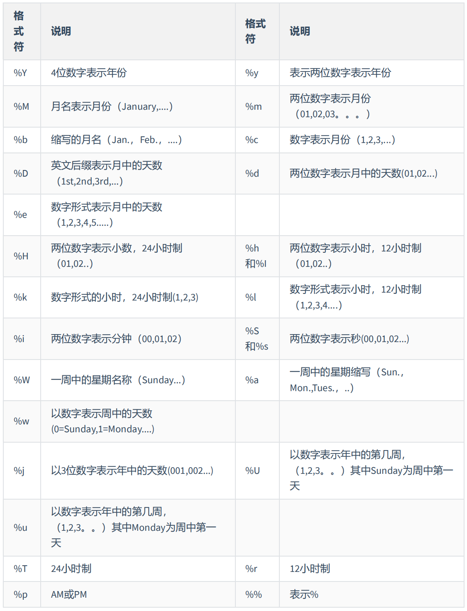

# 函数

从函数的角度出发，分为`内置函数`与`自定义函数`

单行函数与聚合函数就是 SQL 的内置函数

## 单行函数

::: warning 说明

1. 操作数据对象
2. 接收参数返回一个结果
3. 只对一行进行变换
4. 每行返回一个结果
5. 可以嵌套
6. 参数可以是一列或一个值

:::

在 SQL 中可以使用函数对检索出来的数据进行函数操作

使用这些函数可以极大提高用户对数据库的管理效率


### 数值函数

#### 基本函数

| 函数                | 用法                                                                    |
| :------------------ | ----------------------------------------------------------------------- |
| ABS(x)              | 返回 x 的绝对值                                                         |
| SIGN(X)             | 返回 X 的符号。正数返回 1，负数返回-1，0 返回 0                         |
| PI()                | 返回圆周率的值                                                          |
| CEIL(x)，CEILING(x) | 返回大于或等于某个值的最小整数                                          |
| FLOOR(x)            | 返回小于或等于某个值的最大整数                                          |
| LEAST(e1,e2,e3…)    | 返回列表中的最小值                                                      |
| GREATEST(e1,e2,e3…) | 返回列表中的最大值                                                      |
| MOD(x,y)            | 返回 X 除以 Y 后的余数                                                  |
| RAND()              | 返回 0~1 的随机值                                                       |
| RAND(x)             | 返回 0~1 的随机值，其中 x 的值用作种子值，相同的 X 值会产生相同的随机数 |
| ROUND(x)            | 返回一个对 x 的值进行四舍五入后，最接近于 X 的整数                      |
| ROUND(x,y)          | 返回一个对 x 的值进行四舍五入后最接近 X 的值，并保留到小数点后面 Y 位   |
| TRUNCATE(x,y)       | 返回数字 x 截断为 y 位小数的结果                                        |
| SQRT(x)             | 返回 x 的平方根。当 X 的值为负数时，返回 NULL                           |

::: code-group

```bash [示例 1]
mysql> SELECT
    -> ABS(-123),ABS(32),SIGN(-23),SIGN(43),PI(),CEIL(32.32),CEILING(-43.23),FLOOR(32.32),
    -> FLOOR(-43.23),MOD(12,5)
    -> FROM DUAL;
+-----------+---------+-----------+----------+----------+-------------+-----------------+--------------+---------------+-----------+
| ABS(-123) | ABS(32) | SIGN(-23) | SIGN(43) | PI()     | CEIL(32.32) | CEILING(-43.23) | FLOOR(32.32) | FLOOR(-43.23) | MOD(12,5) |
+-----------+---------+-----------+----------+----------+-------------+-----------------+--------------+---------------+-----------+
|       123 |      32 |        -1 |        1 | 3.141593 |          33 |             -43 |           32 |           -44 |         2 |
+-----------+---------+-----------+----------+----------+-------------+-----------------+--------------+---------------+-----------+
1 row in set (0.02 sec)
```

```bash [示例 2]
mysql> SELECT RAND(),RAND(),RAND(10),RAND(10),RAND(-1),RAND(-1)
    -> FROM DUAL;
+--------------------+--------------------+--------------------+--------------------+--------------------+--------------------+
| RAND()             | RAND()             | RAND(10)           | RAND(10)           | RAND(-1)           | RAND(-1)           |
+--------------------+--------------------+--------------------+--------------------+--------------------+--------------------+
| 0.6368513485759975 | 0.3500276481267322 | 0.6570515219653505 | 0.6570515219653505 | 0.9050373219931845 | 0.9050373219931845 |
+--------------------+--------------------+--------------------+--------------------+--------------------+--------------------+
1 row in set (0.01 sec)
```

```bash [示例 3]
mysql> SELECT
    -> ROUND(12.33),ROUND(12.343,2),ROUND(12.324,-1),TRUNCATE(12.66,1),TRUNCATE(12.66,-1)
    -> FROM DUAL;
+--------------+-----------------+------------------+-------------------+--------------------+
| ROUND(12.33) | ROUND(12.343,2) | ROUND(12.324,-1) | TRUNCATE(12.66,1) | TRUNCATE(12.66,-1) |
+--------------+-----------------+------------------+-------------------+--------------------+
|           12 |           12.34 |               10 |              12.6 |                 10 |
+--------------+-----------------+------------------+-------------------+--------------------+
1 row in set (0.01 sec)
```

:::

#### 角度与弧度互换函数

| 函数       | 用法                                    |
| :--------- | --------------------------------------- |
| RADIANS(x) | 将角度转化为弧度，其中，参数 x 为角度值 |
| DEGREES(x) | 将弧度转化为角度，其中，参数 x 为弧度值 |

```bash
mysql> SELECT RADIANS(30),RADIANS(60),RADIANS(90),DEGREES(2*PI()),DEGREES(RADIANS(90))
    -> FROM DUAL;
+--------------------+--------------------+--------------------+-----------------+----------------------+
| RADIANS(30)        | RADIANS(60)        | RADIANS(90)        | DEGREES(2*PI()) | DEGREES(RADIANS(90)) |
+--------------------+--------------------+--------------------+-----------------+----------------------+
| 0.5235987755982988 | 1.0471975511965976 | 1.5707963267948966 |             360 |                   90 |
+--------------------+--------------------+--------------------+-----------------+----------------------+
1 row in set (0.01 sec)
```

#### 三角函数

基本上没有用到，后面用到再来详细补充

| 函数       | 用法                                                                             |
| :--------- | -------------------------------------------------------------------------------- |
| SIN(x)     | 返回 x 的正弦值，其中，参数 x 为弧度值                                           |
| ASIN(x)    | 返回 x 的反正弦值，即获取正弦为 x 的值。如果 x 的值不在-1 到 1 之间，则返回 NULL |
| COS(x)     | 返回 x 的余弦值，其中，参数 x 为弧度值                                           |
| ACOS(x)    | 返回 x 的反余弦值，即获取余弦为 x 的值。如果 x 的值不在-1 到 1 之间，则返回 NULL |
| TAN(x)     | 返回 x 的正切值，其中，参数 x 为弧度值                                           |
| ATAN(x)    | 返回 x 的反正切值，即返回正切值为 x 的值                                         |
| ATAN2(m,n) | 返回两个参数的反正切值                                                           |
| COT(x)     | 返回 x 的余切值，其中，X 为弧度值                                                |

#### 指数与对数

| 函数                 | 用法                                                       |
| :------------------- | ---------------------------------------------------------- |
| POW(x,y)，POWER(X,Y) | 返回 x 的 y 次方                                           |
| EXP(X)               | 返回 e 的 X 次方，其中 e 是一个常数，2.718281828459045     |
| LN(X)，LOG(X)        | 返回以 e 为底的 X 的对数，当 X <= 0 时，返回的结果为 NULL  |
| LOG10(X)             | 返回以 10 为底的 X 的对数，当 X <= 0 时，返回的结果为 NULL |
| LOG2(X)              | 返回以 2 为底的 X 的对数，当 X <= 0 时，返回 NULL          |

```bash
mysql>  SELECT POW(2,5),POWER(2,4),EXP(2),LN(10),LOG10(10),LOG2(4) FROM DUAL;
+----------+------------+------------------+-------------------+-----------+---------+
| POW(2,5) | POWER(2,4) | EXP(2)           | LN(10)            | LOG10(10) | LOG2(4) |
+----------+------------+------------------+-------------------+-----------+---------+
|       32 |         16 | 7.38905609893065 | 2.302585092994046 |         1 |       2 |
+----------+------------+------------------+-------------------+-----------+---------+
1 row in set (0.00 sec)
```

#### 进制间转换

| 函数          | 用法                         |
| :------------ | ---------------------------- |
| BIN(x)        | 返回 x 的二进制编码          |
| HEX(x)        | 返回 x 的十六进制编码        |
| OCT(x)        | 返回 x 的八进制编码          |
| CONV(x,f1,f2) | 返回 f1 进制数变成 f2 进制数 |

```bash
mysql> SELECT BIN(10),HEX(10),OCT(10),CONV(10,2,8) FROM DUAL;
+---------+---------+---------+--------------+
| BIN(10) | HEX(10) | OCT(10) | CONV(10,2,8) |
+---------+---------+---------+--------------+
| 1010    | A       | 12      | 2            |
+---------+---------+---------+--------------+
1 row in set (0.01 sec)
```

### 字符串函数

::: danger 警告
字符串中的位置是从 1 开始的
:::

| 函数                             | 用法                                                                                                                   |
| :------------------------------- | ---------------------------------------------------------------------------------------------------------------------- |
| ASCII(S)                         | 返回字符串 S 中的第一个字符的 ASCII 码值                                                                               |
| CHAR_LENGTH(s)                   | 返回字符串 s 的字符数。作用与 CHARACTER_LENGTH(s)相同                                                                  |
| LENGTH(s)                        | 返回字符串 s 的字节数，和字符集有关                                                                                    |
| CONCAT(s1,s2,......,sn)          | 连接 s1,s2,......,sn 为一个字符串                                                                                      |
| CONCAT_WS(x,s1,s2,......,sn)     | 同 CONCAT(s1,s2,...)函数，但是每个字符串之间要加上 x                                                                   |
| INSERT(str, idx, len,replacestr) | 将字符串 str 从第 idx 位置开始，len 个字符长的子串替换为字符串 replacestr                                              |
| REPLACE(str, a, b)               | 用字符串 b 替换字符串 str 中所有出现的字符串 a                                                                         |
| UPPER(s) 或 UCASE(s)             | 将字符串 s 的所有字母转成大写字母                                                                                      |
| LOWER(s) 或 LCASE(s)             | 将字符串 s 的所有字母转成小写字母                                                                                      |
| LEFT(str,n)                      | 返回字符串 str 最左边的 n 个字符                                                                                       |
| RIGHT(str,n)                     | 返回字符串 str 最右边的 n 个字符                                                                                       |
| LPAD(str, len, pad)              | 用字符串 pad 对 str 最左边进行填充，直到 str 的长度为 len 个字符                                                       |
| RPAD(str ,len, pad)              | 用字符串 pad 对 str 最右边进行填充，直到 str 的长度为 len 个字符                                                       |
| LTRIM(s)                         | 去掉字符串 s 左侧的空格                                                                                                |
| RTRIM(s)                         | 去掉字符串 s 右侧的空格                                                                                                |
| TRIM(s)                          | 去掉字符串 s 开始与结尾的空格                                                                                          |
| TRIM(s1 FROM s)                  | 去掉字符串 s 开始与结尾的 s1                                                                                           |
| TRIM(LEADING s1 FROM s)          | 去掉字符串 s 开始处的 s1                                                                                               |
| TRIM(TRAILING s1 FROM s)         | 去掉字符串 s 结尾处的 s1                                                                                               |
| REPEAT(str, n)                   | 返回 str 重复 n 次的结果                                                                                               |
| SPACE(n)                         | 返回 n 个空格                                                                                                          |
| STRCMP(s1,s2)                    | 比较字符串 s1,s2 的 ASCII 码值的大小                                                                                   |
| SUBSTR(s,index,len)              | 返回从字符串 s 的 index 位置其 len 个字符，作用与 SUBSTRING(s,n,len)、MID(s,n,len)相同                                 |
| LOCATE(substr,str)               | 返回字符串 substr 在字符串 str 中首次出现的位置，作用于 POSITION(substr IN str)、INSTR(str,substr)相同。未找到，返回 0 |
| ELT(m,s1,s2,…,sn)                | 返回指定位置的字符串，如果 m=1，则返回 s1，如果 m=2，则返回 s2，如果 m=n，则返回 sn                                    |
| FIELD(s,s1,s2,…,sn)              | 返回字符串 s 在字符串列表中第一次出现的位置                                                                            |
| FIND_IN_SET(s1,s2)               | 返回字符串 s1 在字符串 s2 中出现的位置。其中，字符串 s2 是一个以逗号分隔的字符串                                       |
| REVERSE(s)                       | 返回 s 反转后的字符串                                                                                                  |
| NULLIF(value1,value2)            | 比较两个字符串，如果 value1 与 value2 相等，则返回 NULL，否则返回 value1                                               |

示例：

::: code-group

```bash [示例 1]
mysql> SELECT FIELD('mm','hello','msm','amma'),FIND_IN_SET('mm','hello,mm,amma') FROM DUAL;

+----------------------------------+-----------------------------------+
| FIELD('mm','hello','msm','amma') | FIND_IN_SET('mm','hello,mm,amma') |
+----------------------------------+-----------------------------------+
|                                0 |                                 2 |
+----------------------------------+-----------------------------------+
1 row in set (0.01 sec)
```

```bash [示例 2]
mysql> SELECT NULLIF('mysql','mysql'),NULLIF('mysql', '');

+-------------------------+---------------------+
| NULLIF('mysql','mysql') | NULLIF('mysql', '') |
+-------------------------+---------------------+
| NULL                    | mysql               |
+-------------------------+---------------------+
1 row in set (0.00 sec)
```

:::

### 日期和时间函数

#### 获取日期、时间

| 函数                                                                     | 用法                           |
| :----------------------------------------------------------------------- | ------------------------------ |
| CURDATE() ，CURRENT_DATE()                                               | 返回当前日期，只包含年、月、日 |
| CURTIME() ， CURRENT_TIME()                                              | 返回当前时间，只包含时、分、秒 |
| NOW() / SYSDATE() / CURRENT_TIMESTAMP() / LOCALTIME() / LOCALTIMESTAMP() | 返回当前系统日期和时间         |
| UTC_DATE()                                                               | 返回 UTC（世界标准时间）日期   |
| UTC_TIME()                                                               | 返回 UTC（世界标准时间）时间   |

```bash
mysql> SELECT
    -> CURDATE(),CURTIME(),NOW(),SYSDATE()+0,UTC_DATE(),UTC_DATE()+0,UTC_TIME(),UTC_TIME()+0
    -> FROM DUAL;

+------------+-----------+---------------------+----------------+------------+--------------+------------+--------------+
| CURDATE()  | CURTIME() | NOW()               | SYSDATE()+0    | UTC_DATE() | UTC_DATE()+0 | UTC_TIME() | UTC_TIME()+0 |
+------------+-----------+---------------------+----------------+------------+--------------+------------+--------------+
| 2024-06-04 | 01:02:48  | 2024-06-04 01:02:48 | 20240604010248 | 2024-06-03 |     20240603 | 17:02:48   |       170248 |
+------------+-----------+---------------------+----------------+------------+--------------+------------+--------------+
1 row in set (0.00 sec)
```

#### 日期与时间戳的转换

| 函数                     | 用法                                                                   |
| :----------------------- | ---------------------------------------------------------------------- |
| UNIX_TIMESTAMP()         | 以 UNIX 时间戳的形式返回当前时间。SELECT UNIX_TIMESTAMP() ->1634348884 |
| UNIX_TIMESTAMP(date)     | 将时间 date 以 UNIX 时间戳的形式返回                                   |
| FROM_UNIXTIME(timestamp) | 将 UNIX 时间戳的时间转换为普通格式的时间                               |

```bash
mysql> SELECT UNIX_TIMESTAMP(now()), UNIX_TIMESTAMP(),FROM_UNIXTIME(1717434423);

+-----------------------+------------------+---------------------------+
| UNIX_TIMESTAMP(now()) | UNIX_TIMESTAMP() | FROM_UNIXTIME(1717434423) |
+-----------------------+------------------+---------------------------+
|            1717434448 |       1717434448 | 2024-06-04 01:07:03       |
+-----------------------+------------------+---------------------------+
```

#### 获取具体函数

| 函数                                     | 用法                                                 |
| :--------------------------------------- | ---------------------------------------------------- |
| YEAR(date) / MONTH(date) / DAY(date)     | 返回具体的日期值                                     |
| HOUR(time) / MINUTE(time) / SECOND(time) | 返回具体的时间值                                     |
| MONTHNAME(date)                          | 返回月份：January，...                               |
| DAYNAME(date)                            | 返回星期几：MONDAY，TUESDAY.....SUNDAY               |
| WEEKDAY(date)                            | 返回周几，注意，周 1 是 0，周 2 是 1，。。。周日是 6 |
| QUARTER(date)                            | 返回日期对应的季度，范围为 1 ～ 4                    |
| WEEK(date) ， WEEKOFYEAR(date)           | 返回一年中的第几周                                   |
| DAYOFYEAR(date)                          | 返回日期是一年中的第几天                             |
| DAYOFMONTH(date)                         | 返回日期位于所在月份的第几天                         |
| DAYOFWEEK(date)                          | 返回周几，注意：周日是 1，周一是 2，。。。周六是 7   |

::: code-group

```bash [示例 1]
mysql> SELECT YEAR(CURDATE()),MONTH(CURDATE()),DAY(CURDATE()),
    -> HOUR(CURTIME()),MINUTE(NOW()),SECOND(SYSDATE())
    -> FROM DUAL;
+-----------------+------------------+----------------+-----------------+---------------+-------------------+
| YEAR(CURDATE()) | MONTH(CURDATE()) | DAY(CURDATE()) | HOUR(CURTIME()) | MINUTE(NOW()) | SECOND(SYSDATE()) |
+-----------------+------------------+----------------+-----------------+---------------+-------------------+
|            2024 |                6 |              4 |              15 |            43 |                14 |
+-----------------+------------------+----------------+-----------------+---------------+-------------------+
1 row in set (0.00 sec)
```

```bash [示例 2]
mysql> SELECT MONTHNAME('2021-10-26'),DAYNAME('2021-10-26'),WEEKDAY('2021-10-26'),
    -> QUARTER(CURDATE()),WEEK(CURDATE()),DAYOFYEAR(NOW()),
    -> DAYOFMONTH(NOW()),DAYOFWEEK(NOW())
    -> FROM DUAL;
+-------------------------+-----------------------+-----------------------+--------------------+-----------------+------------------+-------------------+------------------+
| MONTHNAME('2021-10-26') | DAYNAME('2021-10-26') | WEEKDAY('2021-10-26') | QUARTER(CURDATE()) | WEEK(CURDATE()) | DAYOFYEAR(NOW()) | DAYOFMONTH(NOW()) | DAYOFWEEK(NOW()) |
+-------------------------+-----------------------+-----------------------+--------------------+-----------------+------------------+-------------------+------------------+
| October                 | Tuesday               |                     1 |                  2 |              22 |              156 |                 4 |                3 |
+-------------------------+-----------------------+-----------------------+--------------------+-----------------+------------------+-------------------+------------------+
1 row in set (0.00 sec)

```

:::

#### 日期的操作函数

| 函数                    | 用法                                        |
| :---------------------- | ------------------------------------------- |
| EXTRACT(type FROM date) | 返回指定日期中特定的部分，type 指定返回的值 |

EXTRACT(type FROM date)函数中 type 的取值与含义：


```bash
mysql> SELECT EXTRACT(MINUTE FROM NOW()),EXTRACT( WEEK FROM NOW()),
    -> EXTRACT( QUARTER FROM NOW()),EXTRACT( MINUTE_SECOND FROM NOW())
    -> FROM DUAL;
+----------------------------+---------------------------+------------------------------+------------------------------------+
| EXTRACT(MINUTE FROM NOW()) | EXTRACT( WEEK FROM NOW()) | EXTRACT( QUARTER FROM NOW()) | EXTRACT( MINUTE_SECOND FROM NOW()) |
+----------------------------+---------------------------+------------------------------+------------------------------------+
|                         51 |                        22 |                            2 |                               5144 |
+----------------------------+---------------------------+------------------------------+------------------------------------+
1 row in set (0.00 sec)

```

#### 时间与秒钟转换

| 函数                 | 用法                                                              |
| :------------------- | ----------------------------------------------------------------- |
| TIME_TO_SEC(time)    | 将 time 转化为秒并返回结果值。转化的公式为： 小时*3600+分钟*60+秒 |
| SEC_TO_TIME(seconds) | 将 seconds 描述转化为包含小时、分钟和秒的时间                     |

::: code-group

```bash [time2sec]
mysql> SELECT TIME_TO_SEC(NOW());
+--------------------+
| TIME_TO_SEC(NOW()) |
+--------------------+
|              57484 |
+--------------------+
1 row in set (0.00 sec)

```

```bash [sec2time]
mysql> SELECT SEC_TO_TIME(57484);
+--------------------+
| SEC_TO_TIME(57484) |
+--------------------+
| 15:58:04           |
+--------------------+
1 row in set (0.00 sec)

```

:::

#### 计算时间与日期

- 第一组

| 函数                                                                     | 用法                                             |
| :----------------------------------------------------------------------- | ------------------------------------------------ |
| DATE_ADD(datetime, INTERVAL expr type)，ADDDATE(date,INTERVAL expr type) | 返回与给定日期时间相差 INTERVAL 时间段的日期时间 |
| DATE_SUB(date,INTERVAL expr type)，SUBDATE(date,INTERVAL expr type)      | 返回与 date 相差 INTERVAL 时间间隔的日期         |

type 取值：


::: code-group

```bash [示例 1]
mysql> SELECT DATE_ADD(NOW(), INTERVAL 1 DAY) AS col1,DATE_ADD('2021-10-21 23:32:12',INTERVAL
    -> 1 SECOND) AS col2,
    -> ADDDATE('2021-10-21 23:32:12',INTERVAL 1 SECOND) AS col3,
    -> DATE_ADD('2021-10-21 23:32:12',INTERVAL '1_1' MINUTE_SECOND) AS col4,
    -> DATE_ADD(NOW(), INTERVAL -1 YEAR) AS col5, #可以是负数
    -> DATE_ADD(NOW(), INTERVAL '1_1' YEAR_MONTH) AS col6 #需要单引号
    -> FROM DUAL;
+---------------------+---------------------+---------------------+---------------------+---------------------+---------------------+
| col1                | col2                | col3                | col4                | col5                | col6                |
+---------------------+---------------------+---------------------+---------------------+---------------------+---------------------+
| 2024-06-05 16:09:57 | 2021-10-21 23:32:13 | 2021-10-21 23:32:13 | 2021-10-21 23:33:13 | 2023-06-04 16:09:57 | 2025-07-04 16:09:57 |
+---------------------+---------------------+---------------------+---------------------+---------------------+---------------------+
1 row in set (0.00 sec)

```

```bash [示例 2]
mysql> SELECT DATE_SUB('2021-01-21',INTERVAL 31 DAY) AS col1,
    -> SUBDATE('2021-01-21',INTERVAL 31 DAY) AS col2,
    -> DATE_SUB('2021-01-21 02:01:01',INTERVAL '1 1' DAY_HOUR) AS col3
    -> FROM DUAL;
+------------+------------+---------------------+
| col1       | col2       | col3                |
+------------+------------+---------------------+
| 2020-12-21 | 2020-12-21 | 2021-01-20 01:01:01 |
+------------+------------+---------------------+
1 row in set (0.00 sec)

```

:::

- 第二组

| 函数                         | 用法                                                                           |
| :--------------------------- | ------------------------------------------------------------------------------ |
| ADDTIME(time1,time2)         | 返回 time1 加上 time2 的时间。当 time2 为一个数字时，代表的是秒 ，可以为负数   |
| SUBTIME(time1,time2)         | 返回 time1 减去 time2 后的时间。当 time2 为一个数字时，代表的是秒 ，可以为负数 |
| DATEDIFF(date1,date2)        | 返回 date1 - date2 的日期间隔天数                                              |
| TIMEDIFF(time1, time2)       | 返回 time1 - time2 的时间间隔                                                  |
| FROM_DAYS(N)                 | 返回从 0000 年 1 月 1 日起，N 天以后的日期                                     |
| TO_DAYS(date)                | 返回日期 date 距离 0000 年 1 月 1 日的天数                                     |
| LAST_DAY(date)               | 返回 date 所在月份的最后一天的日期                                             |
| MAKEDATE(year,n)             | 针对给定年份与所在年份中的天数返回一个日期                                     |
| MAKETIME(hour,minute,second) | 将给定的小时、分钟和秒组合成时间并返回                                         |
| PERIOD_ADD(time,n)           | 返回 time 加上 n 后的时间                                                      |

::: code-group

```bash [示例 1]
mysql> SELECT
    -> ADDTIME(NOW(),20),SUBTIME(NOW(),30),SUBTIME(NOW(),'1:1:3'),DATEDIFF(NOW(),'2021-10-01'),TIMEDIFF(NOW(),'2021-10-25 22:10:10'),FROM_DAYS(366),TO_DAYS('0000-12-25'),LAST_DAY(NOW()),MAKEDATE(YEAR(NOW()),12),MAKETIME(10,21,23),PERIOD_ADD(20200101010101,10)FROM DUAL;
+---------------------+---------------------+------------------------+------------------------------+---------------------------------------+----------------+-----------------------+-----------------+--------------------------+--------------------+-------------------------------+
| ADDTIME(NOW(),20)   | SUBTIME(NOW(),30)   | SUBTIME(NOW(),'1:1:3') | DATEDIFF(NOW(),'2021-10-01') | TIMEDIFF(NOW(),'2021-10-25 22:10:10') | FROM_DAYS(366) | TO_DAYS('0000-12-25') | LAST_DAY(NOW()) | MAKEDATE(YEAR(NOW()),12) | MAKETIME(10,21,23) | PERIOD_ADD(20200101010101,10) |
+---------------------+---------------------+------------------------+------------------------------+---------------------------------------+----------------+-----------------------+-----------------+--------------------------+--------------------+-------------------------------+
| 2024-06-04 16:42:41 | 2024-06-04 16:41:51 | 2024-06-04 15:41:18    |                          977 | 838:59:59                             | 0001-01-01     |                   359 | 2024-06-30      | 2024-01-12| 10:21:23           |                20200101010111 |
+---------------------+---------------------+------------------------+------------------------------+---------------------------------------+----------------+-----------------------+-----------------+--------------------------+--------------------+-------------------------------+
1 row in set, 1 warning (0.00 sec)

```

```bash [示例 2]
mysql> SELECT TO_DAYS('0000-01-02');
+-----------------------+
| TO_DAYS('0000-01-02') |
+-----------------------+
|                     2 |
+-----------------------+
1 row in set (0.00 sec)

```

:::

#### 日期的格式化与解析

| 函数                              | 用法                                           |
| :-------------------------------- | ---------------------------------------------- |
| DATE_FORMAT(date,fmt)             | 按照字符串 fmt 格式化日期 date 值              |
| TIME_FORMAT(time,fmt)             | 按照字符串 fmt 格式化时间 time 值              |
| GET_FORMAT(date_type,format_type) | 返回日期字符串的显示格式                       |
| STR_TO_DATE(str, fmt)             | 按照字符串 fmt 对 str 进行解析，解析为一个日期 |

上述 非 GET_FORMAT 函数中 fmt 参数常用的格式符:



GET_FORMAT 函数中 date_type 和 format_type 参数取值如下：


::: code-group

```bash [示例 1]
mysql> SELECT DATE_FORMAT(NOW(), '%H:%i:%s');
+--------------------------------+
| DATE_FORMAT(NOW(), '%H:%i:%s') |
+--------------------------------+
| 17:06:20                       |
+--------------------------------+
1 row in set (0.00 sec)

```

```bash [示例 2]
mysql> SELECT STR_TO_DATE('09/01/2009','%m/%d/%Y'), STR_TO_DATE('20140422154706','%Y%m%d%H%i%s'), STR_TO_DATE('2014-04-22 15:47:06','%Y-%m-%d %H:%i:%s') FROM DUAL;
+--------------------------------------+----------------------------------------------+--------------------------------------------------------+
| STR_TO_DATE('09/01/2009','%m/%d/%Y') | STR_TO_DATE('20140422154706','%Y%m%d%H%i%s') | STR_TO_DATE('2014-04-22 15:47:06','%Y-%m-%d %H:%i:%s') |
+--------------------------------------+----------------------------------------------+--------------------------------------------------------+
| 2009-09-01                           | 2014-04-22 15:47:06                          | 2014-04-22 15:47:06                                    |
+--------------------------------------+----------------------------------------------+--------------------------------------------------------+
1 row in set (0.00 sec)


```

```bash [示例 3]
mysql> SELECT GET_FORMAT(DATE, 'USA');
+-------------------------+
| GET_FORMAT(DATE, 'USA') |
+-------------------------+
| %m.%d.%Y                |
+-------------------------+
1 row in set (0.00 sec)

```

:::

### 流程控制函数

流程处理函数可以根据不同的条件，执行不同的处理流程，可以在 SQL 语句中实现不同条件选择

mysql 中的流程处理函数主要包括 IF、IFNULL、CASE 函数

| 函数                                                                           | 用法                                                 |
| :----------------------------------------------------------------------------- | ---------------------------------------------------- |
| IF(value,value1,value2)                                                        | 如果 value 的值为 TRUE，返回 value1，否则返回 value2 |
| IFNULL(value1, value2)                                                         | 如果 value1 不为 NULL，返回 value1，否则返回 value2  |
| CASE WHEN 条件 1 THEN 结果 1 WHEN 条件 2 THEN 结果 2.... [ELSE resultn] END    | 相当于 Java 的 if...else if...else...                |
| CASE expr WHEN 常量值 1 THEN 值 1 WHEN 常量值 1 THEN 值 1 .... [ELSE 值 n] END | 相当于 Java 的 switch...case...                      |

::: code-group

```bash [IF]
mysql> SELECT IF(1 > 0,'正确','错误');
+-------------------------+
| IF(1 > 0,'正确','错误') |
+-------------------------+
| 正确                    |
+-------------------------+
1 row in set (0.00 sec)

```

```bash [IFNULL]
mysql> SELECT IFNULL(null,'Hello Word');
+---------------------------+
| IFNULL(null,'Hello Word') |
+---------------------------+
| Hello Word                |
+---------------------------+
1 row in set (0.00 sec)

```

```bash [IF ELSE]
mysql> SELECT CASE
    -> WHEN 1 > 0
    -> THEN '1 > 0'
    -> WHEN 2 > 0
    -> THEN '2 > 0'
    -> ELSE '3 > 0'
    -> END RES;
+-------+
| RES   |
+-------+
| 1 > 0 |
+-------+
1 row in set (0.00 sec)


```

```bash [SWITCH]
mysql> SELECT CASE 1
    -> WHEN 1 THEN '我是1'
    -> WHEN 2 THEN '我是2'
    -> ELSE '你是谁' END RES;
+-------+
| RES   |
+-------+
| 我是1 |
+-------+
1 row in set (0.00 sec)

```

:::

结合数据示例：

::: code-group

```bash [IF ELSE]
mysql> SELECT employee_id,salary, CASE WHEN salary>=15000 THEN '高薪'
    -> WHEN salary>=10000 THEN '潜力股'
    -> WHEN salary>=8000 THEN '屌丝'
    -> ELSE '草根' END "描述"
    -> FROM employees;
+-------------+----------+--------+
| employee_id | salary   | 描述   |
+-------------+----------+--------+
|         100 | 24000.00 | 高薪   |
|         101 | 17000.00 | 高薪   |
|         102 | 17000.00 | 高薪   |
|         103 |  9000.00 | 屌丝   |
|         104 |  6000.00 | 草根   |
|         105 |  4800.00 | 草根   |
...
```

```bash [SWITCH]
mysql> SELECT last_name, job_id, salary,
    -> CASE job_id WHEN 'IT_PROG' THEN 1.10*salary
    -> WHEN 'ST_CLERK' THEN 1.15*salary
    -> WHEN 'SA_REP' THEN 1.20*salary
    -> ELSE salary END "REVISED_SALARY"
    -> FROM employees;
+-------------+------------+----------+----------------+
| last_name   | job_id     | salary   | REVISED_SALARY |
+-------------+------------+----------+----------------+
| King        | AD_PRES    | 24000.00 |       24000.00 |
| Kochhar     | AD_VP      | 17000.00 |       17000.00 |
| De Haan     | AD_VP      | 17000.00 |       17000.00 |
| Hunold      | IT_PROG    |  9000.00 |        9900.00 |
| Ernst       | IT_PROG    |  6000.00 |        6600.00 |
| Austin      | IT_PROG    |  4800.00 |        5280.00 |
| Pataballa   | IT_PROG    |  4800.00 |        5280.00 |
| Lorentz     | IT_PROG    |  4200.00 |        4620.00 |
| Greenberg   | FI_MGR     | 12000.00 |       12000.00 |
| Faviet      | FI_ACCOUNT |  9000.00 |        9000.00 |
| Chen        | FI_ACCOUNT |  8200.00 |        8200.00 |
...
```

:::

### 加密解密函数

::: danger 说明
只记录部分， 搜索到的很多都不能使用如 password

后期遇到再在此添加
:::

| 函数     | 用法                                                                                                     |
| :------- | -------------------------------------------------------------------------------------------------------- |
| MD5(str) | 返回字符串 str 的 md5 加密后的值，也是一种加密方式。若参数为 NULL，则会返回 NULL                         |
| SHA(str) | 从原明文密码 str 计算并返回加密后的密码字符串，当参数为 NULL 时，返回 NULL。 SHA 加密算法比 MD5 更加安全 |

示例：

::: code-group

```bash [MD5]
mysql> SELECT md5('123');
+----------------------------------+
| md5('123')                       |
+----------------------------------+
| 202cb962ac59075b964b07152d234b70 |
+----------------------------------+
1 row in set (0.00 sec)

```

```bash [SHA]
mysql> SELECT SHA('Tom123');
+------------------------------------------+
| SHA('Tom123')                            |
+------------------------------------------+
| c7c506980abc31cc390a2438c90861d0f1216d50 |
+------------------------------------------+
1 row in set (0.00 sec)

```

:::

### Mysql 信息函数

| 函数                                                  | 用法                                                       |
| :---------------------------------------------------- | ---------------------------------------------------------- |
| VERSION()                                             | 返回当前 MySQL 的版本号                                    |
| CONNECTION_ID()                                       | 返回当前 MySQL 服务器的连接数                              |
| DATABASE()，SCHEMA()                                  | 返回 MySQL 命令行当前所在的数据库                          |
| USER()，CURRENT_USER()、SYSTEM_USER()，SESSION_USER() | 返回当前连接 MySQL 的用户名，返回结果格式为“主机名@用户名” |
| CHARSET(value)                                        | 返回字符串 value 自变量的字符集                            |
| COLLATION(value)                                      | 返回字符串 value 的比较规则                                |

示例：

::: code-group

```bash [DATABASE]
mysql> SELECT DATABASE();
+------------+
| DATABASE() |
+------------+
| chenwei    |
+------------+
1 row in set (0.00 sec)

```

```bash [VERSION]
mysql> SELECT VERSION();
+-----------+
| VERSION() |
+-----------+
| 8.0.25    |
+-----------+
1 row in set (0.00 sec)

```

```bash [USER]
mysql> SELECT USER(), CURRENT_USER(), SYSTEM_USER(),SESSION_USER();
+----------------+----------------+----------------+----------------+
| USER()         | CURRENT_USER() | SYSTEM_USER()  | SESSION_USER() |
+----------------+----------------+----------------+----------------+
| root@localhost | root@localhost | root@localhost | root@localhost |
+----------------+----------------+----------------+----------------+
1 row in set (0.00 sec)

```

```bash [CHARSET]
mysql> SELECT CHARSET('ABC');
+----------------+
| CHARSET('ABC') |
+----------------+
| gbk            |
+----------------+
1 row in set (0.00 sec)

```

```bash [COLLATION]
mysql> SELECT COLLATION('ABC');
+------------------+
| COLLATION('ABC') |
+------------------+
| gbk_chinese_ci   |
+------------------+
1 row in set (0.00 sec)

```

```bash [CONNECTION_ID]
mysql> SELECT CONNECTION_ID();
+-----------------+
| CONNECTION_ID() |
+-----------------+
|              19 |
+-----------------+
1 row in set (0.00 sec)
```

:::

### 其余函数

| 函数              | 用法                                                                     |
| :---------------- | ------------------------------------------------------------------------ |
| BENCHMARK(n,expr) | 将表达式 expr 重复执行 n 次。用于测试 MySQL 处理 expr 表达式所耗费的时间 |
