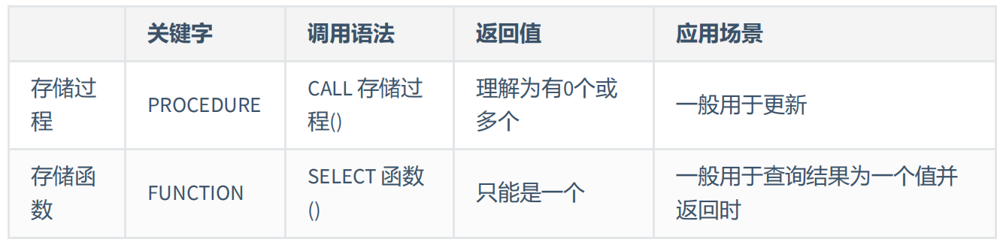

# 存储过程与函数

::: danger 关于存储函数
**优点**

1. 存储过程可以一次编译多次使用
2. 可以减少开发工作量
3. 存储过程的安全性强
4. 可以减少网络传输量
5. 良好的封装性

**缺点**

1. 可移植性差
2. 调试困难
3. 存储过程的版本管理很困难
4. 它不适合高并发的场景

   高并发的场景需要减少数据库的压力，有时数据库会采用分库分表的方
   式，而且对可扩展性要求很高，在这种情况下，存储过程会变得难以维护， 增加数据库的压力 ，显然就
   不适用了

:::

就是一组经过预先编译的 sql 语句

执行过程：存储过程预先存储在 MySQL 服务器上，需要执行的时候，客户端只需要向服务器端发出调用存储过程的命令，服务器端就可以把预先存储好的这一系列 SQL 语句全部执行

**和视图、函数对比**

它和视图有着同样的优点，清晰、安全，还可以减少网络传输量

不过它和视图不同，视图是 虚拟表 ，通常不对底层数据表直接操作，而存储过程是程序化的 SQL，可以 直接操作底层数据表 ，相比于面向集合的操作方式，能够实现一些更复杂的数据处理

一旦存储过程被创建出来，使用它就像使用函数一样简单，我们直接通过调用存储过程名即可。相较于函数，存储过程是 没有返回值 的

**分类**

存储过程的参数类型可以是 IN、OUT 和 INOUT

`注意：IN、OUT、INOUT 都可以在一个存储过程中带多个`

## 创建存储过程

**语法**

```sql
CREATE PROCEDURE 存储过程名(IN|OUT|INOUT 参数名 参数类型,...)
[characteristics ...]
BEGIN
  存储过程体
END
```

**参数含义：**

IN：当前参数为输入参数，也就是表示入参

> 存储过程只是读取这个参数的值。如果没有定义参数种类， 默认就是 IN ，表示输入参数

OUT：当前参数为输出参数，也就是表示出参

> 执行完成之后，调用这个存储过程的客户端或者应用程序就可以读取这个参数返回的值了

INOUT：当前参数既可以为输入参数，也可以为输出参数

形参类型可以是 MySQL 数据库中的任意类型

**characteristics**

表示创建存储过程时指定的对存储过程的约束条件

```sql
LANGUAGE SQL
| [NOT] DETERMINISTIC
| { CONTAINS SQL | NO SQL | READS SQL DATA | MODIFIES SQL DATA }
| SQL SECURITY { DEFINER | INVOKER }
| COMMENT 'string'
```

- LANGUAGE SQL ：说明存储过程执行体是由 SQL 语句组成的，当前系统支持的语言为 SQL。
- [NOT] DETERMINISTIC ：指明存储过程执行的结果是否确定。DETERMINISTIC 表示结果是确定的。每次执行存储过程时，相同的输入会得到相同的输出。NOT DETERMINISTIC 表示结果是不确定的，相同的输入可能得到不同的输出。如果没有指定任意一个值，默认为 NOT DETERMINISTIC
- { CONTAINS SQL | NO SQL | READS SQL DATA | MODIFIES SQL DATA } ：指明子程序使用 SQL 语句的限制
  - CONTAINS SQL 表示当前存储过程的子程序包含 SQL 语句，但是并不包含读写数据的 SQL 语句
  - NO SQL 表示当前存储过程的子程序中不包含任何 SQL 语句
  - READS SQL DATA 表示当前存储过程的子程序中包含读数据的 SQL 语句
  - MODIFIES SQL DATA 表示当前存储过程的子程序中包含写数据的 SQL 语句
  - 默认情况下，系统会指定为 CONTAINS SQL
- SQL SECURITY { DEFINER | INVOKER } ：执行当前存储过程的权限，即指明哪些用户能够执行当前存储过程
  - DEFINER 表示只有当前存储过程的创建者或者定义者才能执行当前存储过程；
  - INVOKER 表示拥有当前存储过程的访问权限的用户能够执行当前存储过程
  - 如果没有设置相关的值，则 MySQL 默认指定值为 DEFINER
- COMMENT 'string' ：注释信息，可以用来描述存储过程

存储过程体中可以有多条 SQL 语句，如果仅仅一条 SQL 语句，则可以省略 BEGIN 和 END

**注意点**

1. BEGIN…END：BEGIN…END 中间包含了多个语句，每个语句都以（;）号为结束符。
2. DECLARE：DECLARE 用来声明变量，使用的位置在于 BEGIN…END 语句中间，而且需要在其他语句使用之前进行变量的声明。
3. SET：赋值语句，用于对变量进行赋值。
4. SELECT… INTO：把从数据表中查询的结果存放到变量中，也就是为变量赋值。

**需要设置新的结束标记**

```sql
DELIMITER 新的结束标记
```

因为 MySQL 默认的语句结束符号为分号‘;’。为了避免与存储过程中 SQL 语句结束符相冲突，需要使用 DELIMITER 改变存储过程的结束符

比如：“DELIMITER //”语句的作用是将 MySQL 的结束符设置为//，并以“END //”结束存储过程。存储过程定义完毕之后再使用“DELIMITER ;”恢复默认结束符。DELIMITER 也可以指定其他符号作为结束符

当使用 DELIMITER 命令时，应该避免使用反斜杠（‘\’）字符，因为反斜线是 MySQL 的转义字符

```sql
DELIMITER $
CREATE PROCEDURE 存储过程名(IN|OUT|INOUT 参数名 参数类型,...)
  [characteristics ...]
BEGIN
  sql语句1;
  sql语句2;
END $
```

**代码示例：**

::: code-group

```sql [创建环境]
mysql> CREATE TABLE emp AS SELECT * FROM employees;
Query OK, 107 rows affected, 2 warnings (0.02 sec)
Records: 107  Duplicates: 0  Warnings: 2

mysql> desc emp;
+----------------+-------------+------+-----+---------+-------+
| Field          | Type        | Null | Key | Default | Extra |
+----------------+-------------+------+-----+---------+-------+
| employee_id    | int         | NO   |     | 0       |       |
| first_name     | varchar(20) | YES  |     | NULL    |       |
| last_name      | varchar(25) | NO   |     | NULL    |       |
| email          | varchar(25) | NO   |     | NULL    |       |
| phone_number   | varchar(20) | YES  |     | NULL    |       |
| hire_date      | date        | NO   |     | NULL    |       |
| job_id         | varchar(10) | NO   |     | NULL    |       |
| salary         | double(8,2) | YES  |     | NULL    |       |
| commission_pct | double(2,2) | YES  |     | NULL    |       |
| manager_id     | int         | YES  |     | NULL    |       |
| department_id  | int         | YES  |     | NULL    |       |
+----------------+-------------+------+-----+---------+-------+
11 rows in set (0.00 sec)
```

```sql [查看 emps 所有数据]
mysql> DELIMITER $
mysql> CREATE PROCEDURE select_all_data()
    -> BEGIN
    -> SELECT * FROM emps;
    -> END $
Query OK, 0 rows affected (0.01 sec)

mysql> DELIMITER ;

CALL select_all_data();

```

```sql [返回平均工资]
DELIMITER //
CREATE PROCEDURE avg_employee_salary ()
BEGIN
  SELECT AVG(salary) AS avg_salary FROM emps;
END //
DELIMITER ;

mysql> call avg_employee_salary;
+-------------+
| avg_salary  |
+-------------+
| 6461.682243 |
+-------------+
1 row in set (0.00 sec)

Query OK, 0 rows affected (0.00 sec)
```

```sql [查看最高薪资]
DELIMITER //

CREATE PROCEDURE show_max_salary()
LANGUAGE SQL
NOT DETERMINISTIC
CONTAINS SQL
SQL SECURITY DEFINER
COMMENT '查看最高薪资'
BEGIN
  SELECT MAX(salary) FROM emps;
END //

DELIMITER ;

mysql> call show_max_salary;
+-------------+
| MAX(salary) |
+-------------+
|    24000.00 |
+-------------+
1 row in set (0.00 sec)

Query OK, 0 rows affected (0.00 sec)
```

```sql [查看最高薪资并输出]
DELIMITER //
CREATE PROCEDURE show_min_salary(OUT ms DOUBLE)
  BEGIN
    SELECT MIN(salary) INTO ms FROM emps;
  END //
DELIMITER ;

mysql> SET @maxar=0;
Query OK, 0 rows affected (0.00 sec)

mysql> CALL show_min_salary(@maxar);
Query OK, 1 row affected (0.00 sec)

mysql> SELECT @maxar;
+--------+
| @maxar |
+--------+
|   2100 |
+--------+
1 row in set (0.00 sec)
```

```sql [查看 in 的员工薪资]
DELIMITER //
CREATE PROCEDURE show_someone_salary(IN empname VARCHAR(20))
  BEGIN
    SELECT salary FROM emps WHERE ename = empname;
  END //
DELIMITER ;
```

```sql [in out]
DELIMITER //
CREATE PROCEDURE show_someone_salary2(IN empname VARCHAR(20),OUT empsalary DOUBLE)
  BEGIN
    SELECT salary INTO empsalary FROM emps WHERE ename = empname;
  END //
DELIMITER ;
```

```sql [INOUT]
DELIMITER //
CREATE PROCEDURE show_mgr_name(INOUT empname VARCHAR(20))
  BEGIN
    SELECT ename INTO empname FROM emps
    WHERE eid = (SELECT MID FROM emps WHERE ename=empname);
  END //
DELIMITER ;
```

:::

## 调用存储过程

如果要执行其他数据库中的存储过程，需要指定数据库名称，例如 CALL dbname.procname。

::: code-group

```sql [语法]
CALL 存储过程名(实参列表)
```

```sql [OUT]
SET @name;
CALL sp1(@name);
SELECT @name;
```

```SQL [INOUT]
SET @name=值;
CALL sp1(@name);
SELECT @name;
```

```SQL [输入实现累加]
DELIMITER //
CREATE PROCEDURE `add_num`(IN n INT)
BEGIN
  DECLARE i INT;
  DECLARE sum INT;
  SET i = 1;
  SET sum = 0;
  WHILE i <= n DO
  SET sum = sum + i;
  SET i = i +1;
  END WHILE;
  SELECT sum;
END //
DELIMITER ;

mysql>  CALL add_num(50);
+------+
| sum  |
+------+
| 1275 |
+------+
1 row in set (0.00 sec)

Query OK, 0 rows affected (0.00 sec)
```

:::

## 存储函数的使用

MySQL 支持自定义函数，定义好之后，调用方式与调用 MySQL 预定义的系统函数一样

**语法**

```sql
CREATE FUNCTION 函数名(参数名 参数类型,...)
RETURNS 返回值类型
[characteristics ...]
BEGIN
函数体 -- 函数体中肯定有 RETURN 语句
END
```

**说明**

1. 参数列表：指定参数为 IN、OUT 或 INOUT 只对 PROCEDURE 是合法的，FUNCTION 中总是默认为 IN 参数
2. RETURNS type 语句表示函数返回数据的类型
3. RETURNS 子句只能对 FUNCTION 做指定，对函数而言这是强制的。它用来指定函数的返回类型，而且函数体必须包含一个 RETURN value 语句
4. characteristic 创建函数时指定的对函数的约束。取值与创建存储过程时相同
5. 函数体也可以用 BEGIN…END 来表示 SQL 代码的开始和结束。如果函数体只有一条语句，也可以省略 BEGIN…END

**调用存储函数**

::: code-group

```sql [语法]
SELECT 函数名(实参列表)
```

```sql [示例 1]
-- 创建存储函数，名称为email_by_name()，参数定义为空，该函数查询Abel的email，并返回，数据类型为字符串型。

DELIMITER //
CREATE FUNCTION email_by_name()
RETURNS VARCHAR(25)
DETERMINISTIC
CONTAINS SQL
  BEGIN
    RETURN (SELECT email FROM employees WHERE last_name = 'Abel');
  END //
DELIMITER ;

mysql> SELECT email_by_name();
+-----------------+
| email_by_name() |
+-----------------+
| EABEL           |
+-----------------+
1 row in set (0.00 sec)
```

```sql [示例 2]
--创建存储函数，名称为email_by_id()，参数传入emp_id，该函数查询emp_id的email，并返回，数据类型为字符串型

DELIMITER //
CREATE FUNCTION email_by_id(emp_id INT)
RETURNS VARCHAR(25)
DETERMINISTIC
CONTAINS SQL
  BEGIN
    RETURN (SELECT email FROM employees WHERE employee_id = emp_id);
  END //
DELIMITER ;

mysql> SET @emp_id = 102;
Query OK, 0 rows affected (0.00 sec)

mysql> SELECT email_by_id(102);
+------------------+
| email_by_id(102) |
+------------------+
| LDEHAAN          |
+------------------+
1 row in set (0.00 sec)
```

```sql [示例 3]
-- 创建存储函数count_by_id()，参数传入dept_id，该函数查询dept_id部门的员工人数，并返回，数据类型为整型。

DELIMITER //
CREATE FUNCTION count_by_id(dept_id INT)
RETURNS INT
LANGUAGE SQL
NOT DETERMINISTIC
READS SQL DATA
SQL SECURITY DEFINER
COMMENT '查询部门平均工资'
  BEGIN
    RETURN (SELECT COUNT(*) FROM employees WHERE department_id = dept_id);
  END //
DELIMITER ;

mysql> SET @dept_id = 50;
Query OK, 0 rows affected (0.00 sec)

mysql> SELECT count_by_id(@dept_id);
+-----------------------+
| count_by_id(@dept_id) |
+-----------------------+
|                    45 |
+-----------------------+
1 row in set (0.00 sec)
```

:::

::: danger 注意
若在创建存储函数中报错“ you might want to use the less safe log_bin_trust_function_creators variable ”，有两种处理方法：

1. 加上必要的函数特性“[NOT] DETERMINISTIC”和“{CONTAINS SQL | NO SQL | READS SQL DATA | MODIFIES SQL DATA}”
2. SET GLOBAL log_bin_trust_function_creators = 1;

:::

**对比存储过程与函数**



存储函数可以放在查询语句中使用，存储过程不行

## 存储过程和函数的查看、修改、删除

### 查看

::: code-group

```sql [SHOW CREATE]
SHOW CREATE {PROCEDURE | FUNCTION} 存储过程名或函数名

mysql> SHOW CREATE FUNCTION count_by_id;
+-------------+----------+------------------------------------------------------------------------------------------------------------------------------------------------------------------------------------------------------------------------------------+----------------------+----------------------+--------------------+
| Function    | sql_mode | Create Function                                                                                                                                                                                                                    | character_set_client | collation_connection | Database Collation |
+-------------+----------+------------------------------------------------------------------------------------------------------------------------------------------------------------------------------------------------------------------------------------+----------------------+----------------------+--------------------+
| count_by_id |          | CREATE DEFINER=`root`@`localhost` FUNCTION `count_by_id`(dept_id INT) RETURNS int
    READS SQL DATA
    COMMENT '查询部门平均工资'
BEGIN
    RETURN (SELECT COUNT(*) FROM employees WHERE department_id = dept_id);
  END         | utf8mb3              | utf8_general_ci      | utf8_general_ci    |
+-------------+----------+------------------------------------------------------------------------------------------------------------------------------------------------------------------------------------------------------------------------------------+----------------------+----------------------+--------------------+
1 row in set (0.00 sec)


```

```sql [SHOW STATUS]
SHOW {PROCEDURE | FUNCTION} STATUS [LIKE 'pattern']

mysql> SHOW FUNCTION STATUS LIKE 'count_by_id';
+---------+-------------+----------+----------------+---------------------+---------------------+---------------+--------------------------+----------------------+----------------------+--------------------+
| Db      | Name        | Type     | Definer        | Modified            | Created             | Security_type | Comment                  | character_set_client | collation_connection | Database Collation |
+---------+-------------+----------+----------------+---------------------+---------------------+---------------+--------------------------+----------------------+----------------------+--------------------+
| chenwei | count_by_id | FUNCTION | root@localhost | 2024-06-13 19:33:51 | 2024-06-13 19:33:51 | DEFINER       | 查询部门平均工资         | utf8                 | utf8_general_ci      | utf8_general_ci    |
+---------+-------------+----------+----------------+---------------------+---------------------+---------------+--------------------------+----------------------+----------------------+--------------------+
1 row in set (0.00 sec)
```

```sql [information_schema.Routines]
SELECT * FROM information_schema.Routines
WHERE ROUTINE_NAME='存储过程或函数的名' [AND ROUTINE_TYPE = {'PROCEDURE|FUNCTION'}];

mysql> SELECT * FROM information_schema.Routines WHERE ROUTINE_NAME='count_by_id' AND ROUTINE_TYPE = 'FUNCTION';
+---------------+-----------------+----------------+--------------+--------------+-----------+--------------------------+------------------------+-------------------+---------------+--------------------+--------------------+----------------+----------------+--------------+----------------------------------------------------------------------------------------+---------------+-------------------+-----------------+------------------+-----------------+----------+---------------+---------------------+---------------------+----------+--------------------------+----------------+----------------------+----------------------+--------------------+
| SPECIFIC_NAME | ROUTINE_CATALOG | ROUTINE_SCHEMA | ROUTINE_NAME | ROUTINE_TYPE | DATA_TYPE | CHARACTER_MAXIMUM_LENGTH | CHARACTER_OCTET_LENGTH | NUMERIC_PRECISION | NUMERIC_SCALE | DATETIME_PRECISION | CHARACTER_SET_NAME | COLLATION_NAME | DTD_IDENTIFIER | ROUTINE_BODY | ROUTINE_DEFINITION                                                                     | EXTERNAL_NAME | EXTERNAL_LANGUAGE | PARAMETER_STYLE | IS_DETERMINISTIC | SQL_DATA_ACCESS | SQL_PATH | SECURITY_TYPE | CREATED             | LAST_ALTERED        | SQL_MODE | ROUTINE_COMMENT          | DEFINER        | CHARACTER_SET_CLIENT | COLLATION_CONNECTION | DATABASE_COLLATION |
+---------------+-----------------+----------------+--------------+--------------+-----------+--------------------------+------------------------+-------------------+---------------+--------------------+--------------------+----------------+----------------+--------------+----------------------------------------------------------------------------------------+---------------+-------------------+-----------------+------------------+-----------------+----------+---------------+---------------------+---------------------+----------+--------------------------+----------------+----------------------+----------------------+--------------------+
| count_by_id   | def             | chenwei        | count_by_id  | FUNCTION     | int       |                     NULL |                   NULL |                10 |             0 |               NULL | NULL               | NULL           | int            | SQL          | BEGIN
    RETURN (SELECT COUNT(*) FROM employees WHERE department_id = dept_id);
  END |          NULL | SQL               | SQL             | NO               | READS SQL DATA  |     NULL | DEFINER       | 2024-06-13 19:33:51 | 2024-06-13 19:33:51 |          | 查询部门平均工资         | root@localhost | utf8                 | utf8_general_ci      | utf8_general_ci    |
+---------------+-----------------+----------------+--------------+--------------+-----------+--------------------------+------------------------+-------------------+---------------+--------------------+--------------------+----------------+----------------+--------------+----------------------------------------------------------------------------------------+---------------+-------------------+-----------------+------------------+-----------------+----------+---------------+---------------------+---------------------+----------+--------------------------+----------------+----------------------+----------------------+--------------------+
1 row in set (0.01 sec)


```

:::

### 修改

修改存储过程或函数，不影响存储过程或函数功能，只是修改相关特性。使用 ALTER 语句实现

```sql
ALTER {PROCEDURE | FUNCTION} 存储过程或函数的名 [characteristic ...]
```

其中，characteristic 指定存储过程或函数的特性，其取值信息与创建存储过程、函数时的取值信息略有不同

```sql
{ CONTAINS SQL | NO SQL | READS SQL DATA | MODIFIES SQL DATA }
| SQL SECURITY { DEFINER | INVOKER }
| COMMENT 'string'
```

- CONTAINS SQL ，表示子程序包含 SQL 语句，但不包含读或写数据的语句
- NO SQL ，表示子程序中不包含 SQL 语句
- READS SQL DATA ，表示子程序中包含读数据的语句
- MODIFIES SQL DATA ，表示子程序中包含写数据的语句
- SQL SECURITY { DEFINER | INVOKER } ，指明谁有权限来执行
  - DEFINER ，表示只有定义者自己才能够执行
  - INVOKER ，表示调用者可以执行
- COMMENT 'string' ，表示注释信息

**简单示例**

```sql
ALTER PROCEDURE CountProc
MODIFIES SQL DATA
SQL SECURITY INVOKER ;
```

### 删除

```sql
DROP {PROCEDURE | FUNCTION} [IF EXISTS] 存储过程或函数的名
```
