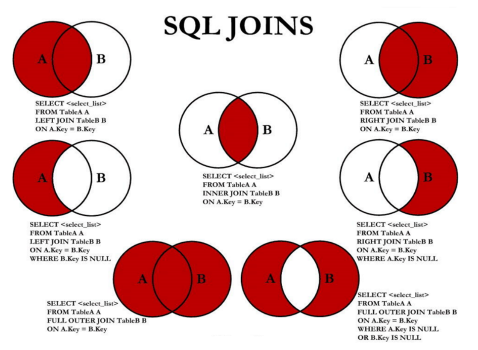

# 查询

::: danger 说明
SQL 语言在功能上主要分成三大类：

DDL（Data Definition Languages）：定义了不同的数据库、表、视图、索引等数据库对象，还可以用来创建、删除、修改数据表的结构

DML（Data Manipulation Language）：用于添加、删除、更新和查询数据库记录，并检查数据完整性

- 主要的雨具关键字包括：INSERT、DELETE、UPDATE、SELECT 等
- SELECT 是 SQL 语言的基础，最为重要

DCL（Data Control Language）：用于定义数据库、表、字段、用户的访问权限和安全级别

- 主要语句关键字包括：GRANT、REVOKE、ROLLBACK、SAVEPOINT 等

:::

## SELECT 执行过程

::: code-group

```sql [书写顺序]
SELECT ... FROM ... WHERE ... GROUP BY ... HAVING ... ORDER BY ... LIMIT...
```

```sql [执行顺序]
FROM -> WHERE -> GROUP BY -> HAVING -> SELECT 的字段 -> DISTINCT -> ORDER BY -> LIMIT
```

```sql [示例]
SELECT DISTINCT player_id, player_name, count(*) as num -- 顺序 5
FROM player JOIN team ON player.team_id = team.team_id -- 顺序 1
WHERE height > 1.80 -- 顺序 2
GROUP BY player.team_id -- 顺序 3
HAVING num > 2 -- 顺序 4
ORDER BY num DESC -- 顺序 6
LIMIT 2 -- 顺序 7
```

:::

**执行原理**

1. SELECT 是先执行 FROM 这一步的。在这个阶段，如果是多张表联查，还会经历以下步骤：

- 首先通过 CROSS JOIN 求笛卡尔积，相当于虚拟表 vt_1-1
- 通过 ON 进行筛选，在虚拟表 vt_1-1 的基础上进行筛选，得到虚拟表 vt_1-2
- 添加外部行。如果使用的是左连接、右连接或者全连接，会涉及到外部行，也就是在虚拟表 vt_1-2 的基础上增加外部行，得到虚拟表 vt_1-3

  > 如果是 2 张以上的表，还会重复上面的步骤，直到所有表都被处理完为止。这个过程得到原始数据

2. 当拿到查询数据表的原始数据，也就是最终虚拟表 vt_1，可以在此基础上进行`WHERE 阶段`，在此阶段，会根据 vt_1 表的结果进行筛选过滤，得到虚拟表 vt_2
3. 进入 `GROUP` 与 `HAVING` 阶段，在这个阶段在虚拟表 vt_2 的基础上进行分组和分组过滤，得到中间虚拟表 vt_3 和 vt_4

- 当完成了条件筛选部分之后，就可以筛选表中提取的字段，也就是进入 `SELECT` 和 `DISTINCT` 阶段

4. 在 `SELECT` 阶段会提取想要的字段，然后在 `DISTINCT` 阶段过滤掉重复的行，分别得到中间的虚拟表 vt_5-1 和 vt_5-2
5. 在提取到了想要的字段数据之后，就可以按照制定的字段进行排序，也就是 ORDER BY 阶段，得到虚拟表 vt_6
6. 在 vt_6 的基础上，取出指定行的记录，也就是 LIMIT 阶段，得到最终的结果，对应的虚拟表是 vt_7

## 基本语法

::: danger
除非使用所有数据，最好不要使用通配符 \*

因为这样会降低查询效率

:::

::: code-group

```sql [基本语法]
SELECT 标识选择哪些列
FROM 标识从哪个表中选择
```

```sql [查询全部列]
SELECT *
FROM departments;

mysql> select * from departments;
+---------------+----------------------+------------+-------------+
| department_id | department_name      | manager_id | location_id |
+---------------+----------------------+------------+-------------+
|            10 | Administration       |        200 |        1700 |
|            20 | Marketing            |        201 |        1800 |
|            30 | Purchasing           |        114 |        1700 |
|            40 | Human Resources      |        203 |        2400 |
|            50 | Shipping             |        121 |        1500 |
...
27 rows in set (0.00 sec)
```

:::

### 列的别名

1. 重命名一个列
2. 便于计算
3. 紧跟列名，也可以在列名和别名之间加入关键字 AS，别名使用双引号，以便在别名中包含空格或特殊的字符并区分大小写
4. AS 可以省略
5. 建议别名简短，见名知意

```bash
mysql> SELECT last_name AS name, commission_pct comm
    -> FROM employees;
+-------------+------+
| name        | comm |
+-------------+------+
| King        | NULL |
| Kochhar     | NULL |
| De Haan     | NULL |
...
```

### 去除重复行

默认情况下，查询会返回全部行，包括重复行

```bash
mysql> SELECT department_id
    -> FROM employees;
+---------------+
| department_id |
+---------------+
|          NULL |
|            10 |
|            20 |
|            20 |
|            30 |
|            30 |
|            30 |
...
+---------------+
107 rows in set (0.00 sec)
```

在 select 语句中使用关键字 DISTINCT 去除重复行

```bash
mysql> SELECT DISTINCT department_id
    -> FROM employees;
+---------------+
| department_id |
+---------------+
|          NULL |
|            10 |
|            20 |
|            30 |
|            40 |
|            50 |
|            60 |
|            70 |
|            80 |
|            90 |
|           100 |
|           110 |
+---------------+
12 rows in set (0.01 sec)
```

::: danger 注意点

1. DISTINCT 需要放到所有列名的前面，如果写成 SELECT salary,DISTINCT department_id FROM employees 会报错
2. DISTINCT 其实是对后面所有列名的组合进行去重

:::

正确应该写成：

```sql
SELECT DISTINCT department_id,salary
FROM employees;
```

### 空值运算

所有运算符或列值遇到 null 值，运算的结果都为 null

在 mysql 里面，空值不等于空字符串。

一个空字符串的长度是 0，而一个空值的长度是空，而且在 mysql 里面，空值是占用空间的。

```sql
SELECT employee_id,salary,commission_pct,
  12 * salary * (1 + commission_pct) "annual_sal"
FROM employees;
```

### 着重号

需要保证表中的字段、表名等没有和保留字、数据库系统或常用方法冲突

如果真的相同，在 SQL 中使用一对 `` 引起来

```bash
mysql> SELECT * FROM order;
ERROR 1064 (42000): You have an error in your SQL syntax; check the manual that corresponds to your MySQL server version for the right syntax to use near 'order' at line 1
```

正确的写法：

```bash
mysql> SELECT * FROM `order`;
+----------+------------+
| order_id | order_name |
+----------+------------+
|        1 | shkstart   |
|        2 | tomcat     |
|        3 | dubbo      |
+----------+------------+
3 rows in set (0.00 sec)
```

### 查询常数

SELECT 查询结果中增加一列固定的常数列，这列的取值是自定义的，而不是从表中取出来的

```sql
SELECT '尚硅谷' as corporation, last_name FROM employees;

mysql> SELECT '陈伟' as corporation, last_name FROM employees;
+-------------+-------------+
| corporation | last_name   |
+-------------+-------------+
| 陈伟        | King        |
| 陈伟        | Kochhar     |
| 陈伟        | De Haan     |
| 陈伟        | Hunold      |
| 陈伟        | Ernst       |
| 陈伟        | Austin      |
| 陈伟        | Pataballa   |
| 陈伟        | Lorentz     |
| 陈伟        | Greenberg   |
...
+-------------+-------------+
107 rows in set (0.00 sec)
```

### 练习

查询 12 个月的工资总和，并起名 ANNUAL SALARY

```bash
mysql> SELECT employee_id,last_name,salary * 12 * (1 + IFNULL(commission_pct,0)) "ANNUAL
    "> SALARY"
    -> FROM employees;
+-------------+-------------+---------------+
| employee_id | last_name   | ANNUAL
SALARY |
+-------------+-------------+---------------+
|         100 | King        |     288000.00 |
|         101 | Kochhar     |     204000.00 |
|         102 | De Haan     |     204000.00 |
|         103 | Hunold      |     108000.00 |
|         104 | Ernst       |      72000.00 |
|         105 | Austin      |      57600.00 |
|         106 | Pataballa   |      57600.00 |
...
+-------------+-------------+---------------+
107 rows in set (0.01 sec)
```

查询 employees 表中去除重复的 job_id 以后的数据

```bash
mysql> SELECT DISTINCT job_id
    -> FROM employees;
+------------+
| job_id     |
+------------+
| AC_ACCOUNT |
| AC_MGR     |
...
| ST_MAN     |
+------------+
19 rows in set (0.01 sec)
```

查询工资大于 12000 员工姓名和工资

```bash
mysql> SELECT last_name, salary
    -> FROM employees
    -> WHERE salary > 12000;
+-----------+----------+
| last_name | salary   |
+-----------+----------+
| King      | 24000.00 |
| Kochhar   | 17000.00 |
| De Haan   | 17000.00 |
| Russell   | 14000.00 |
| Partners  | 13500.00 |
| Hartstein | 13000.00 |
+-----------+----------+
6 rows in set (0.00 sec)
```

查询员工号为 176 的员工的姓名和部门号

```bash
mysql> SELECT last_name, department_id
    -> FROM employees
    -> WHERE employee_id = 176;
+-----------+---------------+
| last_name | department_id |
+-----------+---------------+
| Taylor    |            80 |
+-----------+---------------+
1 row in set (0.01 sec)
```

显示表 departments 的结构，并查询其中的全部数据

```bash
mysql> DESC departments;
+-----------------+-------------+------+-----+---------+-------+
| Field           | Type        | Null | Key | Default | Extra |
+-----------------+-------------+------+-----+---------+-------+
| department_id   | int         | NO   | PRI | 0       |       |
| department_name | varchar(30) | NO   |     | NULL    |       |
| manager_id      | int         | YES  | MUL | NULL    |       |
| location_id     | int         | YES  | MUL | NULL    |       |
+-----------------+-------------+------+-----+---------+-------+
4 rows in set (0.01 sec)

# 查询所有
SELECT * FROM departments;
```

## 显示表结构

使用 DESCRIBE 或 DESC 命令，表示表结构

```sql
DESCRIBE employees;
-- 或
DESC employees;

mysql> DESC employees;
+----------------+-------------+------+-----+---------+-------+
| Field          | Type        | Null | Key | Default | Extra |
+----------------+-------------+------+-----+---------+-------+
| employee_id    | int         | NO   | PRI | 0       |       |
| first_name     | varchar(20) | YES  |     | NULL    |       |
| last_name      | varchar(25) | NO   |     | NULL    |       |
| email          | varchar(25) | NO   | UNI | NULL    |       |
| phone_number   | varchar(20) | YES  |     | NULL    |       |
| hire_date      | date        | NO   |     | NULL    |       |
| job_id         | varchar(10) | NO   | MUL | NULL    |       |
| salary         | double(8,2) | YES  |     | NULL    |       |
| commission_pct | double(2,2) | YES  |     | NULL    |       |
| manager_id     | int         | YES  | MUL | NULL    |       |
| department_id  | int         | YES  | MUL | NULL    |       |
+----------------+-------------+------+-----+---------+-------+
11 rows in set (0.00 sec)
```

| 字段    | 说明                                                                                                                         |
| :------ | ---------------------------------------------------------------------------------------------------------------------------- |
| Field   | 字段名称                                                                                                                     |
| Type    | 字段类型                                                                                                                     |
| Null    | 表示该列是否可以存储 Null 值                                                                                                 |
| Key     | 该列是否已编制索引。PRI 表示该列是表主键的一部分；UNI 表示该列是 UNIQUE 索引的一部分；MUL 表示在列中某个给定值允许出现多次。 |
| Default | 该列是否有默认值。若有，那么值是多少                                                                                         |
| Extra   | 可以获取的与给定列有关的附加信息。如：AUTO_INCREMENT                                                                         |

## 过滤数据

::: code-group

```bash [语法]
SELECT 字段1,字段2
FROM 表名
WHERE 过滤条件
```

```bash [简单展示]
mysql> SELECT employee_id, last_name, job_id, department_id
    -> FROM employees
    -> WHERE department_id = 90 ;
+-------------+-----------+---------+---------------+
| employee_id | last_name | job_id  | department_id |
+-------------+-----------+---------+---------------+
|         100 | King      | AD_PRES |            90 |
|         101 | Kochhar   | AD_VP   |            90 |
|         102 | De Haan   | AD_VP   |            90 |
+-------------+-----------+---------+---------------+
3 rows in set (0.00 sec)
```

:::

## 关联查询

### 笛卡尔积

笛卡尔乘积是一个数学运算

假设我有两个集合 X 和 Y，那么 X 和 Y 的笛卡尔积就是 X 和 Y 的所有可能组合，也就是第一个对象来自于 X，第二个对象来自于 Y 的所有可能。组合的个数即为两个集合中元素个数的乘积数


SQL92 中，笛卡尔积也称为 交叉连接 ，英文是 CROSS JOIN 。

在 SQL99 中也是使用 CROSS JOIN 表示交叉连接。它的作用就是可以把任意表进行连接，即使这两张表不相关。

在以下情况的时候会出现笛卡尔积

```sql
-- 查询员工姓名和所在部门名称
SELECT last_name,department_name FROM employees,departments;
SELECT last_name,department_name FROM employees CROSS JOIN departments;
SELECT last_name,department_name FROM employees INNER JOIN departments;
SELECT last_name,department_name FROM employees JOIN departments;
```

解决方法就是添加连接条件

```sql
-- 案例：查询员工的姓名及其部门名称
SELECT last_name, department_name
FROM employees, departments
WHERE employees.department_id = departments.department_id;
```

::: danger 提示
在表中有相同列时，在列名之前加上表明前缀
:::

### (非)等值连接

```sql
SELECT employees.employee_id, employees.last_name,
employees.department_id, departments.department_id,
departments.location_id
FROM employees, departments
WHERE employees.department_id = departments.department_id;
```

**表的别名**

::: warning 提示

1. 多个表有相同列时，必须在列之前加上表名前缀
2. 在不同表中有相同列名的列可以用表名加以区分
3. 使用别名可以简化查询
4. 列名钱使用表明可以提高查询效率
5. 连接 N 个表，至少需要 n-1 个连接条件

需要注意的是：如果使用了表的别名，在查询字段中、过滤条件就只能使用别名进行替换，不能使用原有的表明，否则就会报错

:::

```sql
SELECT e.employee_id, e.last_name, e.department_id,
d.department_id, d.location_id
FROM employees e , departments d
WHERE e.department_id = d.department_id;
```

employees 表中的列工资在 job_grades 表中最高工资与最低工资之间

```sql
SELECT e.last_name, e.salary, j.grade_level
FROM employees e, job_grades j
WHERE e.salary BETWEEN j.lowest_sal AND j.highest_sal;
```

### (非)自连接

当 t1 与 t2 本质上是同一张表，只是利用取别名的方式虚拟成两张表以代表不同的意义

然后两张表再进行内连接，外连接等查询

```sql
SELECT CONCAT(worker.last_name ,' works for ', manager.last_name)
FROM employees worker, employees manager
WHERE worker.manager_id = manager.employee_id ;

+------------------------------------------------------------+
| CONCAT(worker.last_name ,' works for ', manager.last_name) |
+------------------------------------------------------------+
| Kochhar works for King                                     |
| De Haan works for King                                     |
| Hunold works for De Haan                                   |
| Ernst works for Hunold                                     |
| Austin works for Hunold                                    |
| Pataballa works for Hunold                                 |
| Lorentz works for Hunold                                   |
| Greenberg works for Kochhar                                |
| Faviet works for Greenberg                                 |
...
+------------------------------------------------------------+
106 rows in set (0.00 sec)

```

### [内|外]连接

内连接：结果集中不包含一个表与另一个表不匹配的行

外连接：除了匹配一个表与另一个表匹配的行以外，还返回左（或右）表中不满足条件的行 ，这种连接称为左（或右） 外连接。

如果是左外连接，则连接条件中左边的表成为主表，右边的表成为从表。

如果是右外连接，则连接条件中右边的表成为主表，左边的表成为从表。

**使用 + 创建连接**

在 SQL92 中采用（+）代表从表所在的位置。即左或右外连接中，(+) 表示哪个是从表

在 SQL92 中，只有左外连接和右外连接，没有满外连接

```sql
-- 左外连接
SELECT last_name,department_name
FROM employees ,departments
WHERE employees.department_id = departments.department_id(+);

-- 右外连接
SELECT last_name,department_name
FROM employees ,departments
WHERE employees.department_id(+) = departments.department_id;
```

### SQL99 实现

**基本语法**

- 可以使用 ON 子句制定额外的连接条件
- 这个连接条件是与其它条件分开的
- ON 子句使语句具有更高的易读性
- 关键字 JOIN、INNER JOIN、CROSS JOIN 含义是一样的，都表示内连接

::: code-group

```sql [语法]
SELECT table1.column, table2.column,table3.column
FROM table1
JOIN table2 ON table1 和 table2 的连接条件
JOIN table3 ON table2 和 table3 的连接条件
```

```bash [原理]
for t1 in table1:
    for t2 in table2:
        if condition1:
            for t3 in table3:
                if condition2:
                    output t1 + t2 + t3
```

:::

**内连接**

::: code-group

```bash [语法]
SELECT 字段列表
FROM A表 INNER JOIN B表
ON 关联条件
WHERE 等其他子句;
```

```sql [demo 1]
SELECT e.employee_id, e.last_name, e.department_id, d.department_id, d.location_id
FROM employees e JOIN departments d
ON (e.department_id = d.department_id);
```

```sql [demo 2]
SELECT employee_id, city, department_name
FROM employees e
JOIN departments d
ON d.department_id = e.department_id
JOIN locations l
ON d.location_id = l.location_id;
```

:::

**外连接**

::: danger 注意
LEFT JOIN 和 RIGHT JOIN 只存在于 SQL99 及以后的标准中，在 SQL92 中不存在，只能用 (+) 表示
:::

- 左外连接

::: code-group

```bash [语法]
SELECT 字段列表
FROM A表 LEFT JOIN B表
ON 关联条件
WHERE 等其他子句;
```

```bash [示例]
mysql> SELECT e.last_name, e.department_id, d.department_name
    -> FROM employees e
    -> LEFT OUTER JOIN departments d
    -> ON (e.department_id = d.department_id) ;
+-------------+---------------+------------------+
| last_name   | department_id | department_name  |
+-------------+---------------+------------------+
| King        |            90 | Executive        |
| Kochhar     |            90 | Executive        |
| De Haan     |            90 | Executive        |
| Hunold      |            60 | IT               |
| Ernst       |            60 | IT               |
| Austin      |            60 | IT               |
| Pataballa   |            60 | IT               |
| Lorentz     |            60 | IT               |
| Greenberg   |           100 | Finance          |
| Faviet      |           100 | Finance          |
| Chen        |           100 | Finance          |
...
| Grant       |          NULL | NULL             |
...
```

:::

- 右外连接

::: code-group

```bash [语法]
SELECT 字段列表
FROM A表 RIGHT JOIN B表
ON 关联条件
WHERE 等其他子句;
```

```bash [示例]
SELECT e.last_name, e.department_id, d.department_name
FROM employees e
RIGHT OUTER JOIN departments d
ON (e.department_id = d.department_id) ;
```

:::

**满外连接**

满外连接的结果 = 左右表匹配的数据 + 左表没有匹配到的数据 + 右表没有匹配到的数据

SQL99 是支持满外连接的。使用 FULL JOIN 或 FULL OUTER JOIN 来实现

需要注意的是，MySQL 不支持 FULL JOIN，但是可以用 LEFT JOIN UNION RIGHT join 代替

### 合并查询结果

利用 union 关键字，可以给出多条 SELECT 语句，并将他们的结果组合成单个结果集

合并时，两个表对应的数据类型必须相同，并且相互对应

各个 SELECT 语句之间使用 UNION 或 UNION ALL 关键字分隔

**union**

返回两个查询的结果集并集，去除重复记录


**union all**

返回两个查询的结果集并集，不去除重复记录


**示例**

查询部门编号 >90 或邮件包含 a 的员工信息

::: code-group

```sql [res 1]
SELECT * FROM employees WHERE email LIKE '%a%' OR department_id>90;
```

```sql [res 2]
SELECT * FROM employees WHERE email LIKE '%a%'
UNION
SELECT * FROM employees WHERE department_id>90;
```

:::

::: danger 提示
执行 UNION ALL 语句时所需要的资源比 UNION 语句少。

如果明确知道合并数据后的结果数据不存在重复数据，或者不需要去除重复的数据，则尽量使用 UNION ALL 语句，以提高数据查询的效率
:::

### 7 种 SQL JOIN



::: code-group

```sql [内]
-- 中图：内连接 A∩B
SELECT employee_id,last_name,department_name
FROM employees e JOIN departments d
ON e.`department_id` = d.`department_id`;
```

```sql [左上]
-- 左上图：左外连接
SELECT employee_id,last_name,department_name
FROM employees e LEFT JOIN departments d
ON e.`department_id` = d.`department_id`;
```

```sql [右上]
-- 右上图：右外连接
SELECT employee_id,last_name,department_name
FROM employees e RIGHT JOIN departments d
ON e.`department_id` = d.`department_id`;
```

```sql [左中]
-- 左中图：A - A∩B
SELECT employee_id,last_name,department_name
FROM employees e LEFT JOIN departments d
ON e.`department_id` = d.`department_id`
WHERE d.`department_id` IS NULL
```

```sql [右中]
-- 右中图：B-A∩B
SELECT employee_id,last_name,department_name
FROM employees e RIGHT JOIN departments d
ON e.`department_id` = d.`department_id`
WHERE e.`department_id` IS NULL
```

```sql [左下]
-- 左下图：满外连接
-- 左中图 + 右上图 A∪B
SELECT employee_id,last_name,department_name
FROM employees e LEFT JOIN departments d
ON e.`department_id` = d.`department_id`
WHERE d.`department_id` IS NULL
UNION ALL #没有去重操作，效率高
SELECT employee_id,last_name,department_name
FROM employees e RIGHT JOIN departments d
ON e.`department_id` = d.`department_id`;
```

```sql [右下]
-- 左中图 + 右中图 A ∪B- A∩B 或者 (A - A∩B) ∪ （B - A∩B）
SELECT employee_id,last_name,department_name
FROM employees e LEFT JOIN departments d
ON e.`department_id` = d.`department_id`
WHERE d.`department_id` IS NULL
UNION ALL
SELECT employee_id,last_name,department_name
FROM employees e RIGHT JOIN departments d
ON e.`department_id` = d.`department_id`
WHERE e.`department_id` IS NULL
```

:::

### 自然连接

::: warning 提示
此内容为 SQL 99 新增内容
:::

NATURAL JOIN 表示自然连接，可以理解为 SQL92 中的等值连接

会自动查询两张连接表中所有相同的字段，然后进行等值连接

::: code-group

```sql [SQL92]
SELECT employee_id,last_name,department_name
FROM employees e JOIN departments d
ON e.`department_id` = d.`department_id`
AND e.`manager_id` = d.`manager_id`;
```

```sql [SQL99]
SELECT employee_id,last_name,department_name
FROM employees e NATURAL JOIN departments d;
```

:::

### USING

::: warning 提示
此内容为 SQL 99 新增内容
:::

进行连接的时候 SQL99 支持使用 USING 指定数据表里同名字段进行等值连接

但是只能配合 JOIN 一起使用

::: code-group

```sql [SQL99]
SELECT employee_id,last_name,department_name
FROM employees e JOIN departments d
USING (department_id);
```

```sql [SQL92]
SELECT employee_id,last_name,department_name
FROM employees e ,departments d
WHERE e.department_id = d.department_id;
```

:::

### WHERE、ON、USING 对比

where：适用于所有关联查询

on：只能和 join 一起使用，只能写关联条件。虽然关联条件可以并到 where 中和其他条件一起写，但分开可读性更好

using：只能与 join 一起使用，而且要求两个关联字段在关联表中名称一致，而且只能表示关联字段相等

::: danger 建议
超过三个表禁止 JOIN

需要 JOIN 的字段，数据类型保持绝对一致

多表关联查询时，保证关联的字段需要索引
:::

### 练习

显示所有员工的姓名，部门号和部门名称

```sql
SELECT last_name, e.department_id, department_name
FROM employees e
LEFT OUTER JOIN departments d
ON e.`department_id` = d.`department_id`;
```

查询 90 号部门员工的 job_id 和 90 号部门的 location_id

::: code-group

```sql [方式 1]
SELECT job_id, location_id
FROM employees e, departments d
WHERE e.`department_id` = d.`department_id`
AND e.`department_id` = 90;
```

```sql [方式 2]
SELECT job_id, location_id
FROM employees e
JOIN departments d
ON e.`department_id` = d.`department_id`
WHERE e.`department_id` = 90;
```

:::

选择所有有奖金的员工的 last_name , department_name , location_id ,city

```sql
SELECT last_name , department_name , d.location_id , city
FROM employees e
LEFT OUTER JOIN departments d
ON e.`department_id` = d.`department_id`
LEFT OUTER JOIN locations l
ON d.`location_id` = l.`location_id`
WHERE commission_pct IS NOT NULL;
```

选择 city 在 Toronto 工作的员工的 last_name , job_id , department_id ,department_name

::: code-group

```sql [方式 1]
SELECT last_name , job_id , e.department_id , department_name
FROM employees e, departments d, locations l
WHERE e.`department_id` = d.`department_id`
AND d.`location_id` = l.`location_id`
AND city = 'Toronto';
```

```sql [方式 2]
SELECT last_name , job_id , e.department_id , department_name
FROM employees e
JOIN departments d
ON e.`department_id` = d.`department_id`
JOIN locations l
ON l.`location_id` = d.`location_id`
WHERE l.`city` = 'Toronto';
```

:::

查询员工所在的部门名称、部门地址、姓名、工作、工资，其中员工所在部门的部门名称为’Executive’

```sql
SELECT department_name, street_address, last_name, job_id, salary
FROM employees e JOIN departments d
ON e.department_id = d.department_id
JOIN locations l
ON d.`location_id` = l.`location_id`
WHERE department_name = 'Executive'
```

选择指定员工的姓名，员工号，以及他的管理者的姓名和员工号

```sql
SELECT emp.last_name employees, emp.employee_id "Emp#", mgr.last_name manager,
mgr.employee_id "Mgr#"
FROM employees emp
LEFT OUTER JOIN employees mgr
ON emp.manager_id = mgr.employee_id;
```

查询哪些部门没有员工

::: code-group

```sql [方式 1]
-- 关联查询
SELECT d.department_id
FROM departments d LEFT JOIN employees e
ON e.department_id = d.`department_id`
WHERE e.department_id IS NULL
```

```sql [方式 2]
-- 子查询
SELECT department_id
FROM departments d
WHERE NOT EXISTS (
    SELECT *
    FROM employees e
    WHERE e.`department_id` = d.`department_id`
)
```

:::

查询哪个城市没有部门

```sql
SELECT l.location_id,l.city
FROM locations l LEFT JOIN departments d
ON l.`location_id` = d.`location_id`
WHERE d.`location_id` IS NULL
```

查询部门名为 Sales 或 IT 的员工信息

```sql
SELECT employee_id,last_name,department_name
FROM employees e,departments d
WHERE e.department_id = d.`department_id`
AND d.`department_name` IN ('Sales','IT');
```

## 子查询

::: danger 注意

- 子查询要包含在括号内

- 将子查询放在比较条件的右侧

- 单行操作符对应单行子查询，多行操作符对应多行子查询

- 自连接速度高于子查询：

  > 子查询实际上是通过未知表进行查询后的条件判断，而自连接是通过已知的自身数据表进行条件判断，因此在大部分 DBMS 中都对自连接处理进行了优化

:::

子查询指的是查询语句嵌套在另一个查询语句内部的查询

很多时候查询需要从结果集中获取数据，或者需要从同一个表中先计算得出一个数据结果，然后与这个数据结果（可能是某个标量，也可能是某个集合）进行比较

示例：谁的工资比 Abel 高？

::: code-group

```sql [普通]
SELECT salary
FROM employees
WHERE last_name = 'Abel';

SELECT last_name,salary
FROM employees
WHERE salary > 11000;
```

```sql [自连接]
SELECT e2.last_name,e2.salary
FROM employees e1,employees e2
WHERE e1.last_name = 'Abel'
AND e1.`salary` < e2.`salary
```

```sql [子查询]
SELECT last_name,salary
FROM employees
WHERE salary > (
    SELECT salary
    FROM employees
    WHERE last_name = 'Abel'
);
```

:::

**子查询基本使用**

- 子查询在主查询之前一次执行完成
- 子查询的结果被主查询使用

**子查询的分类**

方式 1:

分为单行子查询、多行子查询


方式 2：

按照子查询是否执行多次，分为 `相关子查询` 或 `不相关子查询`

子查询从数据表中查询了数据结果，如果这个数据结果只执行一次，然后这个数据结果作为主查询的条件进行执行，那么这样的子查询叫做不相关子查询。

同样，如果子查询需要执行多次，即采用循环的方式，先从外部查询开始，每次都传入子查询进行查询，然后再将结果反馈给外部，这种嵌套的执行方式就称为相关子查询。

### 单行子查询

单行比较操作符：=、>、>=、<、<=、<>

**示例：**

返回 job_id 与 141 号员工相同，salary 比 143 号员工多的员工姓名，job_id 和工资

```sql
SELECT last_name, job_id, salary
FROM employees
WHERE job_id =
    (SELECT job_id
    FROM employees
    WHERE employee_id = 141)
AND salary >
    (SELECT salary
    FROM employees
    WHERE employee_id = 143);
```

返回公司工资最少的员工的 last_name,job_id 和 salary

```sql
SELECT last_name, job_id, salary
FROM employees
WHERE salary =
    (SELECT MIN(salary)
    FROM employees);
```

查询与 141 号或 174 号员工的 manager_id 和 department_id 相同的其他员工的 employee_id，manager_id，department_id

::: code-group

```sql [不成对比较]
SELECT employee_id, manager_id, department_id
FROM employees
WHERE manager_id IN
    (SELECT manager_id
    FROM employees
    WHERE employee_id IN (174,141))
AND department_id IN
    (SELECT department_id
    FROM employees
    WHERE employee_id IN (174,141))
    AND employee_id NOT IN(174,141);
```

```sql [成对比较]
SELECT employee_id, manager_id, department_id
FROM employees
WHERE (manager_id, department_id) IN
    (SELECT manager_id, department_id
    FROM employees
    WHERE employee_id IN (141,174))
    AND employee_id NOT IN (141,174);
```

:::

**写在 HAVING 或 CASE 中**

::: code-group

```sql [HAVING]
-- 查询最低工资大于50号部门最低工资的部门id和其最低工资
--  首先执行子查询，然后向主查询的 HAVING 子句返回结果
SELECT department_id, MIN(salary)
FROM employees
GROUP BY department_id
HAVING MIN(salary) >
    (SELECT MIN(salary)
    FROM employees
    WHERE department_id = 50);
```

```sql [CASE]
-- 显式员工的employee_id,last_name和location。其中，若员工department_id与location_id为1800的department_id相同，则location为’Canada’，其余则为’USA’。
SELECT employee_id, last_name,
(CASE department_id
WHEN
    (SELECT department_id FROM departments
    WHERE location_id = 1800)
    THEN 'Canada' ELSE 'USA' END) location
    FROM employees;
```

:::

**子查询空值问题**

子查询不返回任何行

```bash
mysql> SELECT last_name, job_id
    -> FROM employees
    -> WHERE job_id =
    -> (SELECT job_id
    -> FROM employees
    -> WHERE last_name = 'Haas');
Empty set (0.00 sec)

```

**非法使用子查询**

会报错

```bash
# 多行子查询使用单行比较符

mysql> SELECT employee_id, last_name
    -> FROM employees
    -> WHERE salary =
    ->     (SELECT MIN(salary)
    ->     FROM employees
    ->     GROUP BY department_id);
ERROR 1242 (21000): Subquery returns more than 1 row

```

### 多行子查询

内查询返回多行，使用多行比较操作符

多行操作符： IN、ANY、ALL、SOME

**代码示例：**

查询平均工资最低的部门 id

::: code-group

```sql [res 1]
SELECT department_id
FROM employees
GROUP BY department_id
HAVING AVG(salary) = (
    SELECT MIN(avg_sal)
        FROM (
        SELECT AVG(salary) avg_sal
        FROM employees
        GROUP BY department_id
        ) dept_avg_sal
    )
```

```sql [res 2]
SELECT department_id
FROM employees
GROUP BY department_id
HAVING AVG(salary) <= ALL (
        SELECT AVG(salary) avg_sal
        FROM employees
        GROUP BY department_id
    )
```

:::

### 相关子查询

子查询的执行依赖外部查询，通常情况下都是因为子查询中的表用到了外部的表，并进行条件关联

因此每执行一次外部查询，子查询都要重新计算一次，这样的子查询就称之为关联子查询

子查询使用主查询中的列


**示例：**

查询员工中工资大于本部门平均工资的员工的 last_name,salary 和其 department_id

::: code-group

```sql [相关子查询]
SELECT last_name, salary, department_id
FROM employees `outer`
WHERE salary > (
 SELECT AVG(salary)
 FROM employees
 WHERE department_id = `outer`.department_id
);
```

```sql [FROM 中使用子查询]
SELECT last_name, salary, e1.department_id FROM employees e1,( SELECT department_id, AVG( salary ) dept_avg_sal FROM employees GROUP BY department_id ) e2
WHERE
 e1.`department_id` = e2.department_id
 AND e2.dept_avg_sal < e1.`salary`;
```

:::

::: info
FROM 型的子查询：子查询作为 FROM 的一部分，子查询要用（）引起来，并且要给这个子查询取别名，把它当成一张“临时虚拟表”来用
:::

在 ORDER BY 中使用子查询

查询员工的 id,salary,按照 department_name 排序

```sql
SELECT employee_id,salary
FROM employees e
ORDER BY (
    SELECT department_name
    FROM departments d
    WHERE e.`department_id` = d.`department_id`
);
```

若 employees 表中 employee_id 与 job_history 表中 employee_id 相同的数目不小于 2，输出这些相同 id 的员工的 employee_id,last_name 和其 job_id

```sql
SELECT e.employee_id, last_name,e.job_id
FROM employees e
WHERE 2 <= (SELECT COUNT(*)
    FROM job_history
    WHERE employee_id = e.employee_id);
```

**EXISTS 与 NOT EXISTS**

关联子查询通常也会和 EXISTS 操作符一起使用，用来检查在子查询中是否存在满足条件的行

如果子查询中不存在满足条件的行：

- 条件返回 FALSE
- 继续在子查询中查找

如果在子查询中存在满足条件的行

- 不在子查询中继续查找
- 条件返回 TRUE

NOT EXISTS 关键字表示如果不存在某种条件，则返回 TRUE，否则 FALSE

查询公司管理者的 employee_id，last_name，job_id，department_id 信息

::: code-group

```sql [子查询]
SELECT employee_id, last_name, job_id, department_id
FROM employees e1
WHERE EXISTS ( SELECT *
    FROM employees e2
    WHERE e2.manager_id =
        e1.employee_id);
```

```sql [自连接]
SELECT DISTINCT e1.employee_id, e1.last_name, e1.job_id, e1.department_id
FROM employees e1 JOIN employees e2
WHERE e1.employee_id = e2.manager_id;
```

```sql [IN]
SELECT employee_id,last_name,job_id,department_id
FROM employees
WHERE employee_id IN (
    SELECT DISTINCT manager_id
    FROM employees
);
```

:::

查询 departments 表中，不存在于 employees 表中的部门的 department_id 和 department_name

```sql
SELECT department_id, department_name
FROM departments d
WHERE NOT EXISTS (SELECT 'X'
    FROM employees
    WHERE department_id = d.department_id);
```

**相关更新**

```sql
UPDATE table1 alias1
SET column = (SELECT expression
    FROM table2 alias2
    WHERE alias1.column = alias2.column);
```

在 employees 中增加一个 department_name 字段，数据为员工对应的部门名称

```sql
-- 1）
ALTER TABLE employees
ADD(department_name VARCHAR2(14));

-- 2）
UPDATE employees e
SET department_name = (SELECT department_name
    FROM departments d
    WHERE e.department_id = d.department_id);
```

**相关删除**

```sql
DELETE FROM table1 alias1
WHERE column operator (SELECT expression
    FROM table2 alias2
    WHERE alias1.column = alias2.column);
```

删除表 employees 中，其与 emp_history 表皆有的数据

```sql
DELETE FROM employees e
WHERE employee_id in
(SELECT employee_id
    FROM emp_history
    WHERE employee_id = e.employee_id);
```

### 练习

查询和 Zlotkey 相同部门的员工姓名和工资

::: code-group

```sql [plan 1]
SELECT
 last_name,
 salary
FROM
 employees
WHERE
 department_id = (
 SELECT
  department_id
 FROM
  employees
 WHERE
 last_name = 'Zlotkey'
 );
```

```sql [plan 2]
 SELECT last_name, salary
 FROM employees e JOIN (
  SELECT
   department_id
  FROM
   employees
  WHERE
   last_name = 'Zlotkey'
 ) d
 ON e.department_id = d.department_id;
```

:::

查询工资比公司平均工资高的员工的员工号，姓名和工资

```sql
SELECT employee_id, last_name, salary
FROM employees
WHERE salary > (
    SELECT AVG(salary)
    FROM employees
)
```

选择工资大于所有 JOB_ID = 'SA_MAN'的员工的工资的员工的 last_name,job_id, salary

```sql
SELECT last_name,job_id,salary
FROM employees
WHERE salary > ALL (
    SELECT salary
    FROM employees
    WHERE job_id = 'SA_MAN'
);
```

查询和姓名中包含字母 u 的员工在相同部门的员工的员工号和姓名

::: code-group

```sql [plan 1]
SELECT employee_id, last_name
FROM employees
WHERE department_id = ANY(
    SELECT DISTINCT department_id
    FROM employees
    WHERE last_name LIKE '%u%'
);
```

```sql [plan 2]
SELECT employee_id, last_name
FROM employees
WHERE department_id IN (
    SELECT DISTINCT department_id
    FROM employees
    WHERE last_name LIKE '%u%'
);
```

:::

查询在部门的 location_id 为 1700 的部门工作的员工的员工号

```sql
SELECT employee_id
FROM employees
WHERE department_id IN (
    SELECT department_id
    FROM departments
    WHERE location_id = 1700
);
```

查询管理者是 King 的员工姓名和工资

```sql
SELECT last_name, salary
FROM employees
WHERE manager_id IN (
    SELECT employee_id
    FROM employees
    WHERE last_name = 'King'
);
```

查询工资最低的员工信息: last_name, salary

```sql
SELECT last_name,salary
FROM employees
WHERE salary = (
    SELECT MIN(salary)
    FROM employees
);
```

查询平均工资最低的部门信息

::: code-group

```sql [plan 1]
SELECT
 *
FROM
 departments
WHERE
 department_id = (
 SELECT
  department_id
 FROM
  employees
 GROUP BY
  department_id
 HAVING
 AVG( salary ) = ( SELECT MIN( dept_avgsal ) FROM ( SELECT AVG( salary ) dept_avgsal FROM employees GROUP BY department_id ) avg_sal )
 );
```

```sql [plan 2]
SELECT
 *
FROM
 departments
WHERE
 department_id = (
 SELECT
  department_id
 FROM
  employees
 GROUP BY
  department_id
 HAVING
 AVG( salary ) <= ALL ( SELECT AVG( salary ) avg_sal FROM employees GROUP BY department_id )
 );
```

```sql [plan 3]
SELECT
 *
FROM
 departments
WHERE
 department_id = (
 SELECT
  department_id
 FROM
  employees
 GROUP BY
  department_id
 HAVING
 AVG( salary ) = ( SELECT AVG( salary ) avg_sal FROM employees GROUP BY department_id ORDER BY avg_sal LIMIT 0, 1 )
 )
```

```sql [plan 4]
SELECT
 d.*
FROM
 departments d,(
 SELECT
  department_id,
  AVG( salary ) avg_sal
 FROM
  employees
 GROUP BY
  department_id
 ORDER BY
  avg_sal
  LIMIT 0,
  1
 ) dept_avg_sal
WHERE
 d.department_id = dept_avg_sal.department_id
```

:::

查询平均工资最低的部门信息和该部门的平均工资（相关子查询）

::: code-group

```sql [plan 1]
SELECT d.*,( SELECT AVG( salary ) FROM employees WHERE department_id = d.department_id ) avg_sal
FROM
 departments d
WHERE
 department_id = (
 SELECT
  department_id
 FROM
  employees
 GROUP BY
  department_id
 HAVING
 AVG( salary ) = ( SELECT MIN( dept_avgsal ) FROM ( SELECT AVG( salary ) dept_avgsal FROM employees GROUP BY department_id ) avg_sal )
 );
```

```sql [plan 2]
SELECT d.*,( SELECT AVG( salary ) FROM employees WHERE department_id = d.`department_id` ) avg_sal
FROM
 departments d
WHERE
 department_id = (
 SELECT
  department_id
 FROM
  employees
 GROUP BY
  department_id
 HAVING
 AVG( salary ) <= ALL ( SELECT AVG( salary ) avg_sal FROM employees GROUP BY department_id )
 );
```

```sql [plan 3]
SELECT d.*,( SELECT AVG( salary ) FROM employees WHERE department_id = d.department_id ) avg_sal
FROM
 departments d
WHERE
 department_id = (
 SELECT
  department_id
 FROM
  employees
 GROUP BY
  department_id
 HAVING
 AVG( salary ) = ( SELECT AVG( salary ) avg_sal FROM employees GROUP BY department_id ORDER BY avg_sal LIMIT 0, 1 )
 )
```

```sql [plan 4]
SELECT
 d.*,
 dept_avg_sal.avg_sal
FROM
 departments d,(
 SELECT
  department_id,
  AVG( salary ) avg_sal
 FROM
  employees
 GROUP BY
  department_id
 ORDER BY
  avg_sal
  LIMIT 0,
  1
 ) dept_avg_sal
WHERE
 d.department_id = dept_avg_sal.department_id;
```

:::

查询平均工资最高的 job 信息

::: code-group

```sql [plan 1]
SELECT
 *
FROM
 jobs
WHERE
 job_id = (
 SELECT
  job_id
 FROM
  employees
 GROUP BY
  job_id
 HAVING
 AVG( salary ) = ( SELECT MAX( avg_sal ) FROM ( SELECT AVG( salary ) avg_sal FROM employees GROUP BY job_id ) job_avgsal )
 );
```

```sql [plan 2]
SELECT * FROM jobs WHERE job_id =
( SELECT job_id FROM employees GROUP BY job_id HAVING AVG( salary ) >= ALL
    ( SELECT AVG( salary ) FROM employees GROUP BY job_id )
);
```

```sql [plan 3]
SELECT
 *
FROM
 jobs
WHERE
 job_id = (
 SELECT
  job_id
 FROM
  employees
 GROUP BY
  job_id
 HAVING
 AVG( salary ) = ( SELECT AVG( salary ) avg_sal FROM employees GROUP BY job_id ORDER BY avg_sal DESC LIMIT 0, 1 )
 );
```

```sql [plan 4]
SELECT
 j.*
FROM
 jobs j,(
 SELECT
  job_id,
  AVG( salary ) avg_sal
 FROM
  employees
 GROUP BY
  job_id
 ORDER BY
  avg_sal DESC
  LIMIT 0,
  1
 ) job_avg_sal
WHERE
 j.job_id = job_avg_sal.job_id;
```

:::

查询平均工资高于公司平均工资的部门有哪些

```sql
SELECT department_id FROM employees WHERE department_id IS NOT NULL GROUP BY department_id HAVING AVG( salary ) > ( SELECT AVG( salary ) FROM employees );
```

查询出公司中所有 manager 的详细信息

::: code-group

```sql [plan 1]
SELECT
 employee_id,
 last_name,
 salary
FROM
 employees
WHERE
 employee_id IN ( SELECT DISTINCT manager_id FROM employees );
```

```sql [plan 2]
SELECT DISTINCT e1.employee_id, e1.last_name, e1.salary
FROM employees e1 JOIN employees e2
WHERE e1.employee_id = e2.manager_id;
```

```sql [plan 3]
SELECT
 employee_id,
 last_name,
 salary
FROM
 employees e1
WHERE
 EXISTS ( SELECT * FROM employees e2 WHERE e2.manager_id = e1.employee_id );
```

:::

各个部门中 最高工资中最低的那个部门的 最低工资是多少

::: code-group

```sql [plan 1]
SELECT
 MIN( salary )
FROM
 employees
WHERE
 department_id = (
 SELECT
  department_id
 FROM
  employees
 GROUP BY
  department_id
 HAVING
 MAX( salary ) = ( SELECT MIN( max_sal ) FROM ( SELECT MAX( salary ) max_sal FROM employees GROUP BY department_id ) dept_max_sal )
 );
```

```sql [plan 2]
SELECT
 MIN( salary )
FROM
 employees
WHERE
 department_id = (
 SELECT
  department_id
 FROM
  employees
 GROUP BY
  department_id
 HAVING
 MAX( salary ) <= ALL ( SELECT MAX( salary ) max_sal FROM employees GROUP BY department_id )
 );
```

```sql [plan 3]
SELECT
 MIN( salary )
FROM
 employees
WHERE
 department_id = (
 SELECT
  department_id
 FROM
  employees
 GROUP BY
  department_id
 HAVING
 MAX( salary ) = ( SELECT MAX( salary ) max_sal FROM employees GROUP BY department_id ORDER BY max_sal LIMIT 0, 1 )
 )
```

```sql [plan 4]
SELECT
 employee_id,
 MIN( salary )
FROM
 employees e,
 ( SELECT department_id, MAX( salary ) max_sal FROM employees GROUP BY department_id ORDER BY max_sal LIMIT 0, 1 ) dept_max_sal
WHERE
 e.department_id = dept_max_sal.department_id
```

:::

查询平均工资最高的部门的 manager 的详细信息: last_name,department_id, email, salary

::: code-group

```sql [plan 1]
SELECT
 *
FROM
 employees
WHERE
 employee_id IN (
 SELECT DISTINCT
  manager_id
 FROM
  employees e,(
  SELECT
   department_id,
   AVG( salary ) avg_sal
  FROM
   employees
  GROUP BY
   department_id
  ORDER BY
   avg_sal DESC
   LIMIT 0,
   1
  ) dept_avg_sal
 WHERE
 e.department_id = dept_avg_sal.department_id
 )
```

:::

查询部门的部门号，其中不包括 job_id 是"ST_CLERK"的部门号

::: code-group

```sql [plan 1]
SELECT
 department_id
FROM
 departments d
WHERE
 department_id NOT IN ( SELECT DISTINCT department_id FROM employees WHERE job_id = 'ST_CLERK' );
```

```sql [plan 2]
SELECT
 department_id
FROM
 departments d
WHERE
 NOT EXISTS ( SELECT * FROM employees e WHERE d.`department_id` = e.`department_id` AND job_id = 'ST_CLERK' );
```

:::

选择所有没有管理者的员工的 last_name

```sql
SELECT last_name
FROM employees e1
WHERE NOT EXISTS (
    SELECT *
    FROM employees e2
    WHERE e1.manager_id = e2.employee_id
);
```

查询员工号、姓名、雇用时间、工资，其中员工的管理者为 'De Haan'

::: code-group

```sql [plan 1]
SELECT employee_id, last_name, hire_date, salary
FROM employees
WHERE manager_id = (
    SELECT employee_id
    FROM employees
    WHERE last_name = 'De Haan'
)
```

```sql [plan 2]
SELECT
 employee_id,
 last_name,
 hire_date,
 salary
FROM
 employees e1
WHERE
 EXISTS ( SELECT * FROM employees e2 WHERE e2.`employee_id` = e1.manager_id AND e2.last_name = 'De Haan' );
```

:::

查询各部门中工资比本部门平均工资高的员工的员工号, 姓名和工资

::: code-group

```sql [plan 1]
SELECT employee_id,last_name,salary
FROM employees e1
WHERE salary > (
    SELECT AVG(salary)
    FROM employees e2
    WHERE e2.department_id = e1.`department_id`
);
```

```sql [plan 2]
SELECT employee_id,last_name,salary
FROM employees e1,
(SELECT department_id,AVG(salary) avg_sal
    FROM employees e2 GROUP BY department_id
) dept_avg_sal
WHERE e1.`department_id` = dept_avg_sal.department_id
AND e1.`salary` > dept_avg_sal.avg_sal;
```

:::

查询每个部门下的部门人数大于 5 的部门名称

```sql
SELECT department_name,department_id
FROM departments d
WHERE 5 < (
    SELECT COUNT(*)
    FROM employees e
    WHERE d.`department_id` = e.`department_id`
);
```

查询每个国家下的部门个数大于 2 的国家编号

```sql
SELECT country_id
FROM locations l
WHERE 2 < (
    SELECT COUNT(*)
    FROM departments d
    WHERE l.`location_id` = d.`location_id`
);
```
