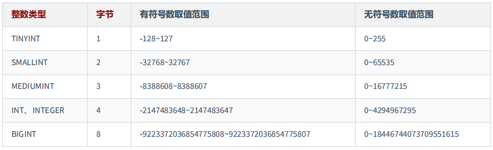
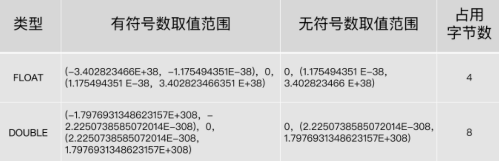
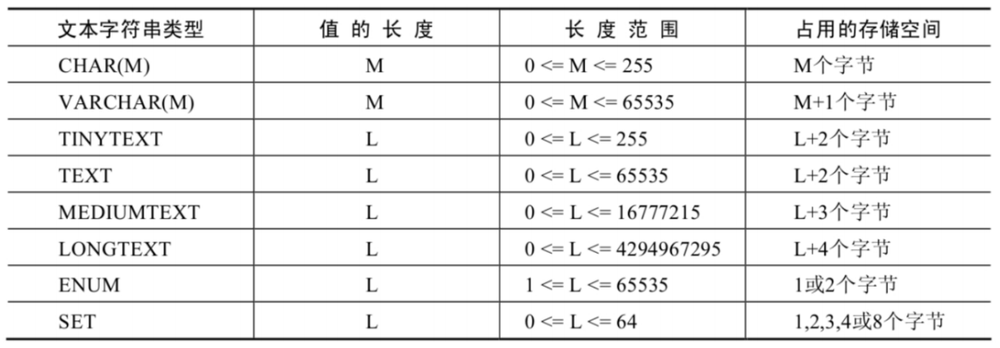
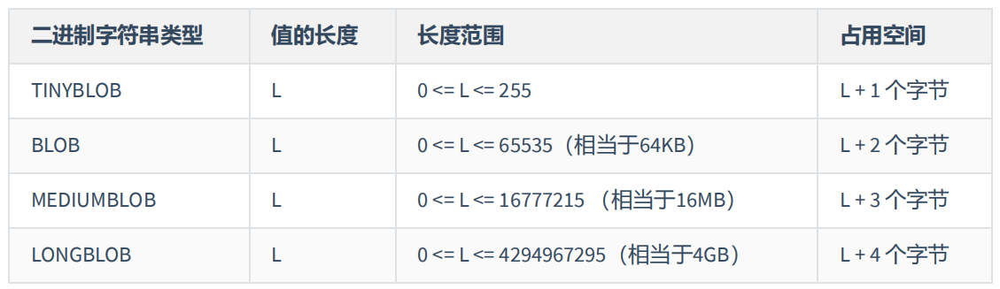

# 数据类型

**MySql 中的数据类型**

| 类型             | 类型举例                                                                                                        |
| :--------------- | --------------------------------------------------------------------------------------------------------------- |
| 整数类型         | TINYINT、SMALLINT、MEDIUMINT、INT(或 INTEGER)、BIGINT                                                           |
| 浮点类型         | FLOAT、DOUBLE                                                                                                   |
| 定点数类型       | DECIMAL                                                                                                         |
| 位类型           | BIT                                                                                                             |
| 日期时间类型     | YEAR、TIME、DATE、DATETIME、TIMESTAMP                                                                           |
| 文本字符串类型   | CHAR、VARCHAR、TINYTEXT、TEXT、MEDIUMTEXT、LONGTEXT                                                             |
| 枚举类型         | ENUM                                                                                                            |
| 集合类型         | SET                                                                                                             |
| 二进制字符串类型 | BINARY、VARBINARY、TINYBLOB、BLOB、MEDIUMBLOB、LONGBLOB                                                         |
| JSON 类型        | JSON 对象、JSON 数组                                                                                            |
| 空间数据类型     | 单值：GEOMETRY、POINT、LINESTRING、POLYGON；集合：MULTIPOINT、MULTILINESTRING、MULTIPOLYGON、GEOMETRYCOLLECTION |

**常用类型**

| 数据类型      | 描述                                                                               |
| :------------ | ---------------------------------------------------------------------------------- |
| INT           | 从-2^31 到 2^31-1 的整型数据。存储大小为 4 个字节                                  |
| CHAR(size)    | 定长字符数据。若未指定，默认为 1 个字符，最大长度 255                              |
| VARCHAR(size) | 可变长字符数据，根据字符串实际长度保存，必须指定长度                               |
| FLOAT(M,D)    | 单精度，占用 4 个字节，M=整数位+小数位，D=小数位。 D<=M<=255,0<=D<=30，默认 M+D<=6 |
| DOUBLE(M,D)   | 双精度，占用 8 个字节，D<=M<=255,0<=D<=30，默认 M+D<=15                            |
| DECIMAL(M,D)  | 高精度小数，占用 M+2 个字节，D<=M<=65，0<=D<=30，最大取值范围与 DOUBLE 相同。      |
| DATE          | 日期型数据，格式'YYYY-MM-DD'                                                       |
| BLOB          | 二进制形式的长文本数据，最大可达 4G                                                |
| TEXT          | 长文本数据，最大可达 4G                                                            |

**常见数据类型的属性**

| 关键字             | 含义                     |
| :----------------- | ------------------------ |
| NULL               | 数据列可包含 NULL 值     |
| NOT NULL           | 数据列不允许包含 NULL 值 |
| DEFAULT            | 默认值                   |
| PRIMARY KEY        | 主键                     |
| AUTO_INCREMENT     | 自动递增，适用于整数类型 |
| UNSIGNED           | 无符号                   |
| CHARACTER SET name | 指定一个字符集           |

## 选择建议

1. 任何字段如果为非负数，必须是 UNSIGNED

2. 小数类型为 DECIMAL，禁止使用 FLOAT 和 DOUBLE
3. 如果存储的字符串长度几乎相等，使用 CHAR 定长字符串类型
4. VARCHAR 是可变长字符串，不预先分配存储空间，长度不要超过 5000
   > 如果存储长度大于此值，定义字段类型为 TEXT，独立出来一张表，用主键来对应，避免影响其它字段索引效率

## 整数类型

::: danger
系统故障产生的成本远远超过增加几个字段存储空间所产生的成本

:::



### 可选属性

- M：表示显示宽度，范围（0, 255）
  > int(5)：当数据宽度小于 5 位的时候在数字前面需要用字符填满宽度。
  >
  > 该项功能需要配合“ ZEROFILL ”使用，表示用“0”填满宽度，否则指定显示宽度无效

显示宽度与类型可以存储的值范围无关，只是小于长度并且标注 ZEROFILL，会用 0 补充

整数数据类型可以在定义表结构时候指定所需要的显示宽度，如果不指定，则系统为每一种类型指定默认的宽度值

::: info
TINYINT 有符号数和无符号数的取值范围分别为-128~127 和 0~255，由于负号占了一个数字位，因此 TINYINT 默认的显示宽度为 4。

同理，其他整数类型的默认显示宽度与其有符号数的最小值的宽度相同。
:::

::: code-group

```sql [语法]
CREATE TABLE test_int1 ( x TINYINT, y SMALLINT, z MEDIUMINT, m INT, n BIGINT );
```

```sql [exam 1]
-- MySql 8 已经不再展示

mysql> desc test_int1;
+-------+-----------+------+-----+---------+-------+
| Field | Type      | Null | Key | Default | Extra |
+-------+-----------+------+-----+---------+-------+
| x     | tinyint   | YES  |     | NULL    |       |
| y     | smallint  | YES  |     | NULL    |       |
| z     | mediumint | YES  |     | NULL    |       |
| m     | int       | YES  |     | NULL    |       |
| n     | bigint    | YES  |     | NULL    |       |
+-------+-----------+------+-----+---------+-------+
5 rows in set (0.00 sec)

```

```sql [exam 2]
CREATE TABLE test_int2(
  f1 INT,
  f2 INT(5),
  f3 INT(5) ZEROFILL
)
```

```sql [插入数据]
INSERT INTO test_int2(f1,f2,f3)
VALUES(1,123,123);

INSERT INTO test_int2(f1,f2)
VALUES(123456,123456);

INSERT INTO test_int2(f1,f2,f3)
VALUES(123456,123456,123456);
```

```sql [查询]
mysql> SELECT * FROM test_int2;
+--------+--------+--------+
| f1     | f2     | f3     |
+--------+--------+--------+
|      1 |    123 |  00123 |
| 123456 | 123456 |   NULL |
| 123456 | 123456 | 123456 |
+--------+--------+--------+
3 rows in set (0.00 sec)

```

:::

**UNSIGNED**

所有的整数类型都有一个可选的属性 UNSIGNED（无符号属性），无符号整数类型的最小取值为 0

如果需要在 MySQL 数据库中保存非负整数值时，可以将整数类型设置为无符号类型

int 类型默认显示宽度为 int(11)，无符号 int 类型默认显示宽度为 int(10)

::: code-group

```sql [exam 1]
CREATE TABLE test_int3(
  f1 INT UNSIGNED
);
```

```sql [查看]
mysql> desc test_int3;
+-------+--------------+------+-----+---------+-------+
| Field | Type         | Null | Key | Default | Extra |
+-------+--------------+------+-----+---------+-------+
| f1    | int unsigned | YES  |     | NULL    |       |
+-------+--------------+------+-----+---------+-------+
1 row in set (0.01 sec)

```

:::

**ZEROFILL**

0 填充，如果某列是 ZEROFILL，那么 MySql 会自动为当前列添加 unsigned 属性

如果指定了 ZEROFILL 只是表示不够 M 位时，用 0 在左边填充，如果超过 M 位，只要不超过数据存储范围即可

## 浮点类型

浮点数和定点数类型的特点是可以 处理小数 ，你可以把整数看成小数的一个特例。因此，浮点数和定点数的使用场景，比整数大多了

- FLOAT 表示单精度浮点数
- DOUBLE 表示双精度浮点数
- REAL 默认就是 DOUBLE。如果你把 SQL 模式设定为启用“ REAL_AS_FLOAT ”，那 么，MySQL 就认为 REAL 是 FLOAT

```sql
SET sql_mode = “REAL_AS_FLOAT”;
```



**问题：** 为什么浮点数类型的无符号数取值范围，只相当于有符号数取值范围的一半，也就是只相当于有符号数取值范围大于等于零的部分呢？

MySQL 存储浮点数的格式为： 符号(S) 、 尾数(M) 和 阶码(E)

因此，无论有没有符号，MySQL 的浮点数都会存储表示符号的部分，所谓的无符号数取值范围，其实就是有符号数取值范围大于等于零的部分。

**数据精度说明**

`FLOAT(M,D)` 或 `DOUBLE(M,D)` 。这里，M 称为 精度 ，D 称为 `标度` 。

(M,D)中 M=整数位+小数位，D=小数位。 D<=M<=255，0<=D<=30

`FLOAT` 和 `DOUBLE` 类型在不指定(M,D)时，默认会按照实际的精度（由实际的硬件和操作系统决定）来显示

浮点类型，也可以加 UNSIGNED ，但是不会改变数据范围，例如：FLOAT(3,2) UNSIGNED 仍然只能表示 0-9.99 的范围

不管是否显式设置了精度(M,D)，这里 MySQL 的处理方案如下：

- 如果存储时，整数部分超出了范围，MySQL 就会报错，不允许存这样的值
- 小数点部分若超出范围： 四舍五入导致整数部分超出，则报错，否则警告并操作成功

::: code-group

```sql [exam]
CREATE TABLE test_double1(
  f1 FLOAT,
  f2 FLOAT(5,2),
  f3 DOUBLE,
  f4 DOUBLE(5,2)
);
```

```sql [查看]
mysql> DESC test_double1;
+-------+-------------+------+-----+---------+-------+
| Field | Type        | Null | Key | Default | Extra |
+-------+-------------+------+-----+---------+-------+
| f1    | float       | YES  |     | NULL    |       |
| f2    | float(5,2)  | YES  |     | NULL    |       |
| f3    | double      | YES  |     | NULL    |       |
| f4    | double(5,2) | YES  |     | NULL    |       |
+-------+-------------+------+-----+---------+-------+
4 rows in set (0.05 sec)
```

```sql [插入成功与失败]
mysql> INSERT INTO test_double1
    -> VALUES(123.456,123.456,123.4567,123.45);
Query OK, 1 row affected (0.01 sec)

mysql> INSERT INTO test_double1
    -> VALUES(123.456,1234.456,123.4567,123.45);
ERROR 1264 (22003): Out of range value for column 'f2' at row 1
```

```sql [查看数据]
mysql> SELECT * FROM test_double1;
+---------+--------+----------+--------+
| f1      | f2     | f3       | f4     |
+---------+--------+----------+--------+
| 123.456 | 123.46 | 123.4567 | 123.45 |
+---------+--------+----------+--------+
1 row in set (0.00 sec)
```

:::

**精度误差说明**

::: danger
因为浮点数是不准确的，所以要避免使用 '=' 来判断两个数是否相等

如果想用精准的数据类型，则使用定位数 `DECIMAL`

:::

**示例：** 设计一个表，有 f1 这个字段，插入值分别为 0.47,0.44,0.19，期待的运行结果是：0.47 + 0.44 + 0.19 =1.1

::: code-group

```sql [建表插入数据]
CREATE TABLE test_double2(
  f1 DOUBLE
);

INSERT INTO test_double2
VALUES(0.47),(0.44),(0.19);
```

```sql [查看数据]
mysql> SELECT SUM(f1) FROM test_double2;
+--------------------+
| SUM(f1)            |
+--------------------+
| 1.0999999999999999 |
+--------------------+
1 row in set (0.00 sec)
```

:::

## 定位数

| 数据类型     | 字节数   |          含义          |
| :----------- | -------- | :--------------------: |
| DECIMAL(M,D) | M+2 字节 | 有效范围由 M 和 D 决定 |

使用 DECIMAL(M,D) 的方式表示高精度小数。其中，M 被称为精度，D 被称为标度。

0<=M<=65，0<=D<=30，D<M

例如：定义 DECIMAL（5,2）的类型，表示该列取值范围是-999.99~999.99

DECIMAL(M,D)的最大取值范围与 DOUBLE 类型一样，但是有效的数据范围是由 M 和 D 决定的

> DECIMAL 的存储空间并不是固定的，由精度值 M 决定，总共占用的存储空间为 M+2 个字节。
>
> 也就是说，在一些对精度要求不高的场景下，比起占用同样字节长度的定点数，浮点数表达的数值范围可以更大一些。

定点数在 MySQL 内部是以 字符串 的形式进行存储，这就决定了它一定是精准的

当 DECIMAL 类型不指定精度和标度时，其默认为 DECIMAL(10,0)

> 当数据的精度超出了定点数类型的精度范围时，则 MySQL 同样会进行四舍五入处理

**浮点数 VS 定位数**

- 浮点数相对于定点数的优点是在长度一定的情况下，浮点类型取值范围大，但是不精准，适用于需要取值范围大，又可以容忍微小误差的科学计算场景（比如计算化学、分子建模、流体动力学等）

- 定点数类型取值范围相对小，但是精准，没有误差，适合于对精度要求极高的场景 （比如涉及金额计算的场景）

::: code-group

```sql [建表并看结构]
CREATE TABLE test_decimal1(
  f1 DECIMAL,
  f2 DECIMAL(5,2)
);

mysql> DESC test_decimal1;
+-------+---------------+------+-----+---------+-------+
| Field | Type          | Null | Key | Default | Extra |
+-------+---------------+------+-----+---------+-------+
| f1    | decimal(10,0) | YES  |     | NULL    |       |
| f2    | decimal(5,2)  | YES  |     | NULL    |       |
+-------+---------------+------+-----+---------+-------+
2 rows in set (0.00 sec)
```

```sql [插入成功与失败]
mysql> INSERT INTO test_decimal1(f1,f2)
    -> VALUES(123.123,123.456);
Query OK, 1 row affected, 2 warnings (0.01 sec)

mysql> SELECT * FROM test_decimal1;
+------+--------+
| f1   | f2     |
+------+--------+
|  123 | 123.46 |
+------+--------+
1 row in set (0.00 sec)

mysql> INSERT INTO test_decimal1(f2)
    -> VALUES(1234.34);
ERROR 1264 (22003): Out of range value for column 'f2' at row 1
mysql> SELECT * FROM test_decimal1;
+------+--------+
| f1   | f2     |
+------+--------+
|  123 | 123.46 |
+------+--------+
1 row in set (0.00 sec)

```

:::

**精度展示**

将 test_double2 表中字段“f1”的数据类型修改为 DECIMAL(5,2),然后重新求和展示：

::: code-group

```sql [修改类型]
ALTER TABLE test_double2
MODIFY f1 DECIMAL(5,2);

mysql> DESC test_double2;
+-------+--------------+------+-----+---------+-------+
| Field | Type         | Null | Key | Default | Extra |
+-------+--------------+------+-----+---------+-------+
| f1    | decimal(5,2) | YES  |     | NULL    |       |
+-------+--------------+------+-----+---------+-------+
1 row in set (0.00 sec)

```

```sql [求和]
mysql> SELECT SUM(f1) FROM test_double2;
+---------+
| SUM(f1) |
+---------+
|    1.10 |
+---------+
1 row in set (0.00 sec)

```

:::

## BIT 位类型

BIT 类型中存储的是二进制值，类似 010110

BIT 类型，如果没有指定(M)，默认是 1 位

> 这个 1 位，表示只能存 1 位的二进制值。这里(M)是表示二进制的位数，位数最小值为 1，最大值为 64。

::: code-group

```sql [建表查看结构]
mysql> CREATE TABLE test_bit1(
    -> f1 BIT,
    -> f2 BIT(5),
    -> f3 BIT(64)
    -> );
Query OK, 0 rows affected (0.05 sec)

mysql> desc test_bit1
    -> ;
+-------+---------+------+-----+---------+-------+
| Field | Type    | Null | Key | Default | Extra |
+-------+---------+------+-----+---------+-------+
| f1    | bit(1)  | YES  |     | NULL    |       |
| f2    | bit(5)  | YES  |     | NULL    |       |
| f3    | bit(64) | YES  |     | NULL    |       |
+-------+---------+------+-----+---------+-------+
3 rows in set (0.01 sec)

```

```sql [数据插入成功与失败]
mysql> INSERT INTO test_bit1(f1)
    -> VALUES(1);
Query OK, 1 row affected (0.02 sec)

mysql> INSERT INTO test_bit1(f1)
    -> VALUES(2);
ERROR 1406 (22001): Data too long for column 'f1' at row 1

mysql> INSERT INTO test_bit1(f2)
    -> VALUES(23);
Query OK, 1 row affected (0.01 sec)

```

```sql [查看数据配合函数读取]
mysql> SELECT * FROM test_bit1;
+------------+------------+------------+
| f1         | f2         | f3         |
+------------+------------+------------+
| 0x01       | NULL       | NULL       |
| NULL       | 0x17       | NULL       |
+------------+------------+------------+
2 rows in set (0.00 sec)

mysql> SELECT BIN(f2),HEX(f2) FROM test_bit1;
+---------+---------+
| BIN(f2) | HEX(f2) |
+---------+---------+
| NULL    | NULL    |
| 10111   | 17      |
+---------+---------+
2 rows in set (0.00 sec)

mysql> SELECT f2 + 0 FROM test_bit1;
+--------+
| f2 + 0 |
+--------+
|   NULL |
|     23 |
+--------+
2 rows in set (0.00 sec)

```

:::

## 日期与时间

| 类型      | 名称     | 字节 | 日期格式            | 最小值                  | 最大值                 |
| :-------- | -------- | ---: | ------------------- | ----------------------- | ---------------------- |
| YEAR      | 年       |    1 | YYYY 或 YY          | 1901                    | 2155                   |
| TIME      | 时间     |    3 | HH:MM:SS            | -838:59:59              | 838:59:59              |
| DATE      | 日期     |    3 | YYYY-MM-DD          | 1000-01-01              | 9999-12-03             |
| DATETIME  | 日期时间 |    8 | YYYY-MM-DD HH:MM:SS | 1000-01-01 00:00:00     | 9999-12-31 23:59:59    |
| TIMESTAMP | 日期时间 |    4 | YYYY-MM-DD HH:MM:SS | 1970-01-01 00:00:00 UTC | 2038-01-19 03:14:07UTC |

为什么时间类型 TIME 的取值范围不是 -23:59:59 ～ 23:59:59 呢？

> MySQL 设计的 TIME 类型，不光表示一天之内的时间，而且可以用来表示一个时间间隔，这个时间间隔可以超过 24 小时

### YEAR

在 MySQL 中，YEAR 有以下几种存储格式：

- 以 4 位字符串或数字格式表示 YEAR 类型，其格式为 YYYY，最小值为 1901，最大值为 2155
- 以 2 位字符串格式表示 YEAR 类型，最小值为 00，最大值为 99
  - 当取值为 01 到 69 时，表示 2001 到 2069
  - 当取值为 70 到 99 时，表示 1970 到 1999
  - 当取值整数的 0 或 00 添加的话，那么是 0000 年
  - 当取值是日期/字符串的'0'添加的话，是 2000 年

**2 位格式的 YEAR 已经不推荐使用，默认格式就是 `YYYY`**

::: code-group

```sql [创建表]
CREATE TABLE test_year(
  f1 YEAR,
  f2 YEAR(4)
);
```

```sql [查看表结构]
mysql> DESC test_year;
+-------+------+------+-----+---------+-------+
| Field | Type | Null | Key | Default | Extra |
+-------+------+------+-----+---------+-------+
| f1    | year | YES  |     | NULL    |       |
| f2    | year | YES  |     | NULL    |       |
+-------+------+------+-----+---------+-------+
2 rows in set (0.02 sec)

```

```bash [插入四位]
mysql> INSERT INTO test_year
    -> VALUES('2020','2021');
Query OK, 1 row affected (0.01 sec)

mysql> SELECT * FROM test_year;
+------+------+
| f1   | f2   |
+------+------+
| 2020 | 2021 |
+------+------+
1 row in set (0.00 sec)

```

```bash [插入两位]
mysql> INSERT INTO test_year
    -> VALUES('45','71');
Query OK, 1 row affected (0.02 sec)

mysql> INSERT INTO test_year
    -> VALUES(0,'0');
Query OK, 1 row affected (0.01 sec)

mysql> SELECT * FROM test_year;
+------+------+
| f1   | f2   |
+------+------+
| 2020 | 2021 |
| 2045 | 1971 |
| 0000 | 2000 |
+------+------+
3 rows in set (0.00 sec)

```

:::

### DATE

向 DATE 类型字段插入数据时，需要满足一定格式条件

- 以 YYYY-MM-DD 格式或者 YYYYMMDD 格式表示的字符串日期，其最小取值为 1000-01-01，最大取值为 9999-12-03。YYYYMMDD 格式会被转化为 YYYY-MM-DD 格式。
- 以 YY-MM-DD 格式或者 YYMMDD 格式表示的字符串日期，此格式中，年份为两位数值或字符串满足 YEAR 类型的格式条件为：当年份取值为 00 到 69 时，会被转化为 2000 到 2069；当年份取值为 70 到 99 时，会被转化为 1970 到 1999。
- 使用 CURRENT_DATE() 或者 NOW() 函数，会插入当前系统的日期

::: code-group

```sql [创建表]
CREATE TABLE test_date1(
  f1 DATE
);
```

```sql [插入数据]
INSERT INTO test_date1
VALUES ('2020-10-01'), ('20201001'),(20201001);


INSERT INTO test_date1
VALUES ('00-01-01'), ('000101'), ('69-10-01'), ('691001'), ('70-01-01'), ('700101'),
('99-01-01'), ('990101');

INSERT INTO test_date1
VALUES (000301), (690301), (700301), (990301);

INSERT INTO test_date1
VALUES (CURRENT_DATE()), (NOW());
```

```sql [查看结果]
mysql> SELECT *
    -> FROM test_date1;
+------------+
| f1         |
+------------+
| 2020-10-01 |
| 2020-10-01 |
| 2020-10-01 |
| 2000-01-01 |
| 2000-01-01 |
| 2069-10-01 |
| 2069-10-01 |
| 1970-01-01 |
| 1970-01-01 |
| 1999-01-01 |
| 1999-01-01 |
| 2000-03-01 |
| 2069-03-01 |
| 1970-03-01 |
| 1999-03-01 |
| 2024-06-07 |
| 2024-06-07 |
+------------+
17 rows in set (0.00 sec)
```

:::

### TIME

向 TIME 插入数据时，可以使用的格式：

- 可以使用带有冒号的字符串，比如' D HH:MM:SS' 、' HH:MM:SS '、' HH:MM '、' D HH:MM '、' D HH '或' SS '格式，都能被正确地插入 TIME 类型的字段中。其中 D 表示天，其最小值为 0，最大值为 34。如果使用带有 D 格式的字符串插入 TIME 类型的字段时，D 会被转化为小时，计算格式为 D\*24+HH。当使用带有冒号并且不带 D 的字符串表示时间时，表示当天的时间，比如 12:10 表示 12:10:00，而不是 00:12:10
- 可以使用不带有冒号的字符串或者数字，格式为' HHMMSS '或者 HHMMSS 。如果插入一个不合法的字符串或者数字，MySQL 在存储数据时，会将其自动转化为 00:00:00 进行存储。比如 1210，MySQL 会将最右边的两位解析成秒，表示 00:12:10，而不是 12:10:00
- 使用 CURRENT_TIME() 或者 NOW() ，会插入当前系统的时间

::: code-group

```sql [创建表]
CREATE TABLE test_time1(
  f1 TIME
);
```

```sql [插入数据]
INSERT INTO test_time1
VALUES('2 12:30:29'), ('12:35:29'), ('12:40'), ('2 12:40'),('1 05'), ('45');

INSERT INTO test_time1
VALUES ('123520'), (124011),(1210);

INSERT INTO test_time1
VALUES (NOW()), (CURRENT_TIME());
```

```sql [查询]
mysql> SELECT * FROM test_time1;
+----------+
| f1       |
+----------+
| 60:30:29 |
| 12:35:29 |
| 12:40:00 |
| 60:40:00 |
| 29:00:00 |
| 00:00:45 |
| 12:35:20 |
| 12:40:11 |
| 00:12:10 |
| 14:49:28 |
| 14:49:28 |
+----------+
11 rows in set (0.00 sec)

```

:::

### DATETIME

向 DATETIME 类型插入数据，需满足条件：

- 以 YYYY-MM-DD HH:MM:SS 格式或者 YYYYMMDDHHMMSS 格式的字符串插入 DATETIME 类型的字段时，最小值为 1000-01-01 00:00:00，最大值为 9999-12-03 23:59:59。

  > 以 YYYYMMDDHHMMSS 格式的数字插入 DATETIME 类型的字段时，会被转化为 YYYY-MM-DD HH:MM:SS 格式

- 以 YY-MM-DD HH:MM:SS 格式或者 YYMMDDHHMMSS 格式的字符串插入 DATETIME 类型的字段时，两位数的年份规则符合 YEAR 类型的规则，00 到 69 表示 2000 到 2069；70 到 99 表示 1970 到 1999。

- 使用函数 CURRENT_TIMESTAMP() 和 NOW() ，可以向 DATETIME 类型的字段插入系统的当前日期和时间

::: code-group

```sql [创建表]
CREATE TABLE test_datetime1(
  dt DATETIME
);
```

```sql [插入数据]
INSERT INTO test_datetime1
VALUES ('2021-01-01 06:50:30'), ('20210101065030');

INSERT INTO test_datetime1
VALUES ('99-01-01 00:00:00'), ('990101000000'), ('20-01-01 00:00:00'),
('200101000000');

INSERT INTO test_datetime1
VALUES (20200101000000), (200101000000), (19990101000000), (990101000000);

INSERT INTO test_datetime1
VALUES (CURRENT_TIMESTAMP()), (NOW());
```

```sql [查看]
mysql> SELECT * FROM test_datetime1;
+---------------------+
| dt                  |
+---------------------+
| 2021-01-01 06:50:30 |
| 2021-01-01 06:50:30 |
| 1999-01-01 00:00:00 |
| 1999-01-01 00:00:00 |
| 2020-01-01 00:00:00 |
| 2020-01-01 00:00:00 |
| 2020-01-01 00:00:00 |
| 2020-01-01 00:00:00 |
| 1999-01-01 00:00:00 |
| 1999-01-01 00:00:00 |
| 2024-06-07 15:02:20 |
| 2024-06-07 15:02:20 |
+---------------------+
12 rows in set (0.00 sec)
```

:::

### TIMESTAMP

::: warning
存储数据的时候需要对当前时间所在的时区进行转换，查询数据的时候再将时间转换回当前的时区。

因此，使用 TIMESTAMP 存储的同一个时间值，在不同的时区查询时会显示不同的时间。
:::

插入数据格式：

- 向 TIMESTAMP 类型的字段插入数据时，当插入的数据格式满足 YY-MM-DD HH:MM:SS 和 YYMMDDHHMMSS 时，两位数值的年份同样符合 YEAR 类型的规则条件，只不过表示的时间范围要小很多
- 如果向 TIMESTAMP 类型的字段插入的时间超出了 TIMESTAMP 类型的范围，则 MySQL 会抛出错误信息

::: code-group

```sql [创建表]
CREATE TABLE test_timestamp1(
  ts TIMESTAMP
);
```

```sql [插入数据]
INSERT INTO test_timestamp1
VALUES ('1999-01-01 03:04:50'), ('19990101030405'), ('99-01-01 03:04:05'),
('990101030405');

INSERT INTO test_timestamp1
VALUES ('2020@01@01@00@00@00'), ('20@01@01@00@00@00');

INSERT INTO test_timestamp1
VALUES (CURRENT_TIMESTAMP()), (NOW());
```

```sql [查看]
mysql> SELECT * FROM test_timestamp1;
+---------------------+
| ts                  |
+---------------------+
| 1999-01-01 03:04:50 |
| 1999-01-01 03:04:05 |
| 1999-01-01 03:04:05 |
| 1999-01-01 03:04:05 |
| 2020-01-01 00:00:00 |
| 2020-01-01 00:00:00 |
| 2024-06-07 15:17:59 |
| 2024-06-07 15:17:59 |
+---------------------+
8 rows in set (0.00 sec)

```

:::

**TIMESTAMP 和 DATETIME 的区别**

- TIMESTAMP 存储空间比较小，表示的日期时间范围也比较小
- 底层存储方式不同，TIMESTAMP 底层存储的是毫秒值，距离 1970-1-1 0:0:0 0 毫秒的毫秒值
- 两个日期比较大小或日期计算时，TIMESTAMP 更方便、更快
- TIMESTAMP 和时区有关。TIMESTAMP 会根据用户的时区不同，显示不同的结果。而 DATETIME 则只能反映出插入时当地的时区，其他时区的人查看数据必然会有误差的

::: info
修改当前时区：SET time_zone = '+9:00';
:::

::: code-group

```sql [创建表]
CREATE TABLE temp_time(
  d1 DATETIME,
  d2 TIMESTAMP
);
```

```sql [插入数据并查看]
INSERT INTO temp_time VALUES('2021-9-2 14:45:52','2021-9-2 14:45:52');
INSERT INTO temp_time VALUES(NOW(),NOW());

mysql> SELECT * FROM temp_time;
+---------------------+---------------------+
| d1                  | d2                  |
+---------------------+---------------------+
| 2021-09-02 14:45:52 | 2021-09-02 14:45:52 |
| 2024-06-07 15:34:22 | 2024-06-07 15:34:22 |
+---------------------+---------------------+
2 rows in set (0.00 sec)
```

:::

## 文本字符串



### CHAR 与 VARCHAR

::: warning
存储很短信息，固定长度的，用 char，比如门牌号

十分频繁改变的列，VARCHAR 每次都要频繁计算，而 CHAR 是不需要的
:::

| 类型       | 特点     | 长度 | 长度范围        | 占用存储空间          |
| :--------- | -------- | ---- | --------------- | --------------------- |
| CHAR(M)    | 固定长度 | M    | 0 <= M <= 255   | M 个字节              |
| VARCHAR(M) | 可变长度 | M    | 0 <= M <= 65535 | (实际长度 + 1) 个字节 |

**CHAR**

- CHAR(M) 类型一般需要预先定义字符串长度。如果不指定(M)，则表示长度默认是 1 个字符
- 如果保存时，数据的实际长度比 CHAR 类型声明的长度小，则会在 右侧填充 空格以达到指定的长度。当 MySQL 检索 CHAR 类型的数据时，CHAR 类型的字段会去除尾部的空格
- 定义 CHAR 类型字段时，声明的字段长度即为 CHAR 类型字段所占的存储空间的字节数

::: code-group

```sql [创建表、查询结构]
CREATE TABLE test_char1(
  c1 CHAR,
  c2 CHAR(5)
);

mysql> DESC test_char1;
+-------+---------+------+-----+---------+-------+
| Field | Type    | Null | Key | Default | Extra |
+-------+---------+------+-----+---------+-------+
| c1    | char(1) | YES  |     | NULL    |       |
| c2    | char(5) | YES  |     | NULL    |       |
+-------+---------+------+-----+---------+-------+
2 rows in set (0.07 sec)

```

```sql [插入并查找]
INSERT INTO test_char1
VALUES('a','Tom');

mysql> SELECT c1,CONCAT(c2,'***') FROM test_char1;
+------+------------------+
| c1   | CONCAT(c2,'***') |
+------+------------------+
| a    | Tom***           |
+------+------------------+
1 row in set (0.00 sec)
```

```sql [插入空格并查找]
INSERT INTO test_char1(c2)
VALUES('a ');

mysql> SELECT CHAR_LENGTH(c2)
    -> FROM test_char1;
+-----------------+
| CHAR_LENGTH(c2) |
+-----------------+
|               3 |
|               1 |
+-----------------+
2 rows in set (0.00 sec)

```

:::

**VARCHAR**

- VARCHAR(M) 定义时， 必须指定 长度 M，否则报错
- MySQL4.0 版本以下，varchar(20)：指的是 20 字节，如果存放 UTF8 汉字时，只能存 6 个（每个汉字 3 字节） ；MySQL5.0 版本以上，varchar(20)：指的是 20 字符
- 检索 VARCHAR 类型的字段数据时，会保留数据尾部的空格。VARCHAR 类型的字段所占用的存储空间为字符串实际长度加 1 个字节

::: code-group

```sql [建表]
CREATE TABLE test_varchar3(
  NAME VARCHAR(5)
);
```

```sql [插入并查看]
mysql> INSERT INTO test_varchar3 VALUES('陈伟 '),('123');
Query OK, 2 rows affected (0.01 sec)
Records: 2  Duplicates: 0  Warnings: 0

mysql> SELECT * FROM
    -> test_varchar3;
+-------+
| NAME  |
+-------+
| 陈伟  |
| 123   |
+-------+
2 rows in set (0.00 sec)

mysql> SELECT CHAR_LENGTH(NAME) from test_varchar3;
+-------------------+
| CHAR_LENGTH(NAME) |
+-------------------+
|                 3 |
|                 3 |
+-------------------+
2 rows in set (0.00 sec)
```

:::

### TEXT

::: danger
由于实际存储的长度不确定，MySQL 不允许 TEXT 类型的字段做主键

> 遇到这种情况，你只能采用 CHAR(M)，或者 VARCHAR(M)

:::

| 类型       | 特点               | 长度 | 长度范围                          | 占用存储空间 |
| :--------- | ------------------ | ---- | --------------------------------- | ------------ |
| TINYTEXT   | 小文本、可变长度   | L    | 0 <= L <= 255                     | L + 2 个字节 |
| TEXT       | 文本、可变长度     | L    | 0 <= L <= 65535                   | L + 2 个字节 |
| MEDIUMTEXT | 中等文本、可变长度 | L    | 0 <= L <= 16777215                | L + 3 个字节 |
| LONGTEXT   | 大文本、可变长度   | L    | 0 <= L<= 4294967295（相当于 4GB） | L + 4 个字节 |

在保存和查询数据时，并没有删除 TEXT 类型的数据尾部的空格

::: code-group

```sql [创建表]
CREATE TABLE test_text(
  tx TEXT
);
```

```sql [查看长度]
INSERT INTO test_text
VALUES('chenWei ');

mysql> SELECT CHAR_LENGTH(tx)
    -> FROM test_text;
+-----------------+
| CHAR_LENGTH(tx) |
+-----------------+
|               8 |
+-----------------+
1 row in set (0.00 sec)

```

:::

TEXT 文本类型，可以存比较大的文本段，搜索速度稍慢，因此如果不是特别大的内容，建议使用 CHAR，VARCHAR 来代替

TEXT 类型不用加默认值，加了也没用。而且 text 和 blob 类型的数据删除后容易导致“空洞”，使得文件碎片比较多，所以频繁使用的表不建议包含 TEXT 类型字段，建议单独分出去，单独用一个表

## ENUM

ENUM 类型也叫作枚举类型，ENUM 类型的取值范围需要在定义字段时进行指定

设置字段值时，ENUM 类型只允许从成员中选取单个值，不能一次选取多个值

| 类型 | 长度 | 长度范围        | 占用存储空间  |
| :--- | ---- | --------------- | ------------- |
| ENUM | L    | 1 <= L <= 65535 | 1 或 2 个字节 |

- 当 ENUM 类型包含 1 ～ 255 个成员时，需要 1 个字节的存储空间
- 当 ENUM 类型包含 256 ～ 65535 个成员时，需要 2 个字节的存储空间
- ENUM 类型的成员个数的上限为 65535 个
- 插入数据的时候忽略大小写
- 允许按照角标的方式获取指定索引位置的枚举值
- 当 ENUM 类型的字段没有声明为 NOT NULL 时，插入 NULL 也是有效的

::: code-group

```sql [建表、查看结构]
mysql> CREATE TABLE test_enum(
    -> season ENUM('春','夏','秋','冬','unknow')
    -> );
Query OK, 0 rows affected (0.05 sec)

mysql> DESC test_enum;
+--------+------------------------------------+------+-----+---------+-------+
| Field  | Type                               | Null | Key | Default | Extra |
+--------+------------------------------------+------+-----+---------+-------+
| season | enum('春','夏','秋','冬','unknow') | YES  |     | NULL    |       |
+--------+------------------------------------+------+-----+---------+-------+
1 row in set (0.01 sec)

```

```sql [插入数据并验证]
INSERT INTO test_enum
VALUES('春'),('秋');

-- 忽略大小写
INSERT INTO test_enum
VALUES('UNKNOW');

-- 允许按照角标的方式获取指定索引位置的枚举值
INSERT INTO test_enum
VALUES('1'),(3);

-- 当ENUM类型的字段没有声明为NOT NULL时，插入NULL也是有效的
INSERT INTO test_enum
VALUES(NULL);

mysql> SELECT * FROM test_enum;
+--------+
| season |
+--------+
| 春     |
| 秋     |
| unknow |
| 春     |
| 秋     |
| NULL   |
+--------+
6 rows in set (0.00 sec)

```

:::

## SET

::: warning
SET 类型在选取成员时，可以一次选择多个成员，这一点与 ENUM 类型不同

插入重复的 SET 类型成员时，MySQL 会自动删除重复的成员

:::

SET 表示一个字符串对象，可以包含 0 个或多个成员，但成员个数的上限为 64

设置字段值时，可以取取值范围内的 0 个或多个值

| 成员个数范围（L 表示实际成员个数） | 占用的存储空间 |
| :--------------------------------- | -------------- |
| 1 <= L <= 8                        | 1 个字节       |
| 9 <= L <= 16                       | 2 个字节       |
| 17 <= L <= 24                      | 3 个字节       |
| 25 <= L <= 32                      | 4 个字节       |
| 33 <= L <= 64                      | 8 个字节       |

::: code-group

```sql [创建、结构]
CREATE TABLE test_set ( s SET ( 'A', 'B', 'C' ) );

mysql> DESC test_set;
+-------+------------------+------+-----+---------+-------+
| Field | Type             | Null | Key | Default | Extra |
+-------+------------------+------+-----+---------+-------+
| s     | set('A','B','C') | YES  |     | NULL    |       |
+-------+------------------+------+-----+---------+-------+
1 row in set (0.00 sec)

```

```sql [插入、验证]
INSERT INTO test_set (s) VALUES ('A'), ('A,B');

-- 插入重复的SET类型成员时，MySQL会自动删除重复的成员
INSERT INTO test_set (s) VALUES ('A,B,C,A');

-- 向SET类型的字段插入SET成员中不存在的值时，MySQL会抛出错误。
INSERT INTO test_set (s) VALUES ('A,B,C,D');

mysql> SELECT *
    -> FROM test_set;
+-------+
| s     |
+-------+
| A     |
| A,B   |
| A,B,C |
+-------+
3 rows in set (0.00 sec)
```

:::

## 二进制字符串

### BINARY 与 VARBINARY

BINARY 和 VARBINARY 类似于 CHAR 和 VARCHAR，只是它们存储的是二进制字符串

**BINARY**

BINARY (M)为固定长度的二进制字符串，M 表示最多能存储的字节数，取值范围是 0~255 个字符。

如果未指定(M)，表示只能存储 1 个字节 。

例如 BINARY (8)，表示最多能存储 8 个字节，如果字段值不足(M)个字节，将在右边填充'\0'以补齐指定长度。

**VARBINARY**

VARBINARY (M)为可变长度的二进制字符串，M 表示最多能存储的字节数，总字节数不能超过行的字节长度限制 65535

另外还要考虑额外字节开销，VARBINARY 类型的数据除了存储数据本身外，还需要 1 或 2 个字节来存储数据的字节数。

VARBINARY 类型 必须指定(M) ，否则报错

| 类型         | 长度     | 长度范围             | 占用存储空间 |
| :----------- | -------- | -------------------- | ------------ |
| BINARY(M)    | 固定长度 | M （0 <= M <= 255）  | M 个字节     |
| VARBINARY(M) | 可变长度 | M（0 <= M <= 65535） | M+1 个字节   |

::: code-group

```sql [创建、结构]
CREATE TABLE test_binary1(
  f1 BINARY,
  f2 BINARY(3),
  f4 VARBINARY(10)
);

mysql> DESC test_binary1;
+-------+---------------+------+-----+---------+-------+
| Field | Type          | Null | Key | Default | Extra |
+-------+---------------+------+-----+---------+-------+
| f1    | binary(1)     | YES  |     | NULL    |       |
| f2    | binary(3)     | YES  |     | NULL    |       |
| f4    | varbinary(10) | YES  |     | NULL    |       |
+-------+---------------+------+-----+---------+-------+
3 rows in set (0.00 sec)

```

```sql [插入验证]
INSERT INTO test_binary1(f1,f2)
VALUES('a','a');

INSERT INTO test_binary1(f2,f4)
VALUES('ab','ab');

mysql> SELECT LENGTH(f2),LENGTH(f4) FROM test_binary1;
+------------+------------+
| LENGTH(f2) | LENGTH(f4) |
+------------+------------+
|          3 |       NULL |
|          3 |          2 |
+------------+------------+
2 rows in set (0.00 sec)


```

:::

## BLOB

BLOB 是一个 二进制大对象 ，可以容纳可变数量的数据

::: warning
在实际工作中，往往不会在 MySQL 数据库中使用 BLOB 类型存储大对象数据，通常会将图片、音频和视频文件存储到 服务器的磁盘上 ，并将图片、音频和视频的访问路径存储到 MySQL 中
:::



**TEXT 和 BLOB 的使用注意事项**

- BLOB 和 TEXT 值也会引起自己的一些问题，特别是执行了大量的删除或更新操作的时候。删除这种值会在数据表中留下很大的" 空洞 "，以后填入这些"空洞"的记录可能长度不同。为了提高性能，建议定期使用 OPTIMIZE TABLE 功能对这类表进行 碎片整理

- 如果需要对大文本字段进行模糊查询，MySQL 提供了 前缀索引 。但是仍然要在不必要的时候避免检索大型的 BLOB 或 TEXT 值。例如，SELECT \* 查询就不是很好的想法，除非你能够确定作为约束条件的 WHERE 子句只会找到所需要的数据行。否则，你可能毫无目的地在网络上传输大量的值

- 把 BLOB 或 TEXT 列 分离到单独的表 中。在某些环境中，如果把这些数据列移动到第二张数据表中，可以让你把原数据表中的数据列转换为固定长度的数据行格式，那么它就是有意义的。这会 减少主表中的碎片 ，使你得到固定长度数据行的性能优势。它还使你在主数据表上运行 SELECT \* 查询的时候不会通过网络传输大量的 BLOB 或 TEXT 值。

## JSON

::: code-group

```sql [创建、结构]
mysql> CREATE TABLE test_json(
    -> js json
    -> );
Query OK, 0 rows affected (0.08 sec)

mysql> DESC test_json;
+-------+------+------+-----+---------+-------+
| Field | Type | Null | Key | Default | Extra |
+-------+------+------+-----+---------+-------+
| js    | json | YES  |     | NULL    |       |
+-------+------+------+-----+---------+-------+
1 row in set (0.01 sec)

```

```sql [插入、验证]
mysql> INSERT INTO test_json (js)
    -> VALUES ('{"name":"songhk", "age":18, "address":{"province":"beijing",
    '> "city":"beijing"}}');
Query OK, 1 row affected (0.01 sec)

mysql> SELECT * FROM test_json;
+--------------------------------------------------------------------------------------+
| js                                                                                   |
+--------------------------------------------------------------------------------------+
| {"age": 18, "name": "songhk", "address": {"city": "beijing", "province": "beijing"}} |
+--------------------------------------------------------------------------------------+
1 row in set (0.00 sec)
```

```SQL [检索某个具体]
mysql> SELECT
    ->   js -> '$.name' AS NAME,
    ->   js -> '$.age' AS age,
    ->   js -> '$.address.province' AS province,
    ->   js -> '$.address.city' AS city
    -> FROM
    ->   test_json;
+----------+------+-----------+-----------+
| NAME     | age  | province  | city      |
+----------+------+-----------+-----------+
| "songhk" | 18   | "beijing" | "beijing" |
+----------+------+-----------+-----------+
1 row in set (0.00 sec)

```

:::

## 空间类型

::: info
还未有使用场景，后面遇到了再补齐
:::
