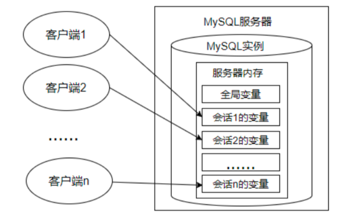

# 变量、流程控制与游标

## 变量

在 MySQL 数据库的存储过程和函数中，可以使用变量来存储查询或计算的中间结果数据，或者输出最终的结果数据

在 MySQL 数据库中，变量分为 系统变量 以及 用户自定义变量

### 系统变量

**系统变量分类**

变量由系统定义，不是用户定义，属于 服务器 层面

启动 MySQL 服务，生成 MySQL 服务实例期间，MySQL 将为 MySQL 服务器内存中的系统变量赋值，这些系统变量定义了当前 MySQL 服务实例的属性、特征

这些系统变量的值要么是 编译 MySQL 时参数 的默认值，要么是 配置文件 （例如 my.ini 等）中的参数值

系统变量分为全局系统变量（需要添加 global 关键字）以及会话系统变量（需要添加 session 关键字）

有时也把全局系统变量简称为全局变量，有时也把会话系统变量称为 local 变量

`如果不写，默认会话级别`

静态变量（在 MySQL 服务实例运行期间它们的值不能使用 set 动态修改）属于特殊的全局系统变量

每一个 MySQL 客户机成功连接 MySQL 服务器后，都会产生与之对应的会话。会话期间，MySQL 服务实例会在 MySQL 服务器内存中生成与该会话对应的会话系统变量，这些会话系统变量的初始值是全局系统变量值的复制。



- 全局变量针对所有会话有效，但不能跨重启
- 会话系统变量仅针对于当前会话（连接）有效。会话期间，当前会话对某个会话系统变量值的修改，不会影响其他会话同一个会话系统变量的值
- 会话 1 对某个全局系统变量值的修改会导致会话 2 中同一个全局系统变量值的修改

在 MySQL 中有些系统变量只能是全局的

> max_connections 用于限制服务器的最大连接数

有些系统变量作用域既可以是全局又可以是会话

> character_set_client 用于设置客户端的字符集

有些系统变量的作用域只能是当前会话

> pseudo_thread_id 用于标记当前会话的 MySQL 连接 ID

**查看系统变量**

- 查看所有或部分系统变量

::: code-group

```sql [语法]
-- 查看所有全局变量
SHOW GLOBAL VARIABLES;

-- 查看所有会话变量
SHOW SESSION VARIABLES;
或
SHOW VARIABLES;
```

```sql [查看部分]
-- 查看满足条件的部分系统变量。
SHOW GLOBAL VARIABLES LIKE '%标识符%';

-- 查看满足条件的部分会话变量
SHOW SESSION VARIABLES LIKE '%标识符%';
```

```sql [exam]
mysql> SHOW GLOBAL VARIABLES LIKE 'admin_%';
+------------------------+-------------------------------+
| Variable_name          | Value                         |
+------------------------+-------------------------------+
| admin_address          |                               |
| admin_port             | 33062                         |
| admin_ssl_ca           |                               |
| admin_ssl_capath       |                               |
| admin_ssl_cert         |                               |
| admin_ssl_cipher       |                               |
| admin_ssl_crl          |                               |
| admin_ssl_crlpath      |                               |
| admin_ssl_key          |                               |
| admin_tls_ciphersuites |                               |
| admin_tls_version      | TLSv1,TLSv1.1,TLSv1.2,TLSv1.3 |
+------------------------+-------------------------------+
11 rows in set (0.01 sec)
```

:::

- 查看指定系统变量

作为 MySQL 编码规范，MySQL 中的系统变量以 两个“@” 开头，其中“@@global”仅用于标记全局系统变量，“@@session”仅用于标记会话系统变量

“@@”首先标记会话系统变量，如果会话系统变量不存在，则标记全局系统变量

```sql
-- 查看指定的系统变量的值
SELECT @@global.变量名;

-- 查看指定的会话变量的值
SELECT @@session.变量名;
-- 或者
SELECT @@变量名;
```

- 修改系统变量的值

有些时候，数据库管理员需要修改系统变量的默认值，以便修改当前会话或者 MySQL 服务实例的属性、特征。具体方法：

1. 修改 MySQL 配置文件 ，继而修改 MySQL 系统变量的值（该方法需要重启 MySQL 服务）
2. 在 MySQL 服务运行期间，使用“set”命令重新设置系统变量的值

::: code-group

```sql [语法]
-- 为某个系统变量赋值
-- 方式1：
SET @@global.变量名=变量值;
-- 方式2：
SET GLOBAL 变量名=变量值;

-- 为某个会话变量赋值
-- 方式1：
SET @@session.变量名=变量值;
-- 方式2：
SET SESSION 变量名=变量值;
```

```sql [exam 1]
SELECT @@global.autocommit;
SET GLOBAL autocommit=0;
```

```sql [exam 2]
SELECT @@session.tx_isolation;
SET @@session.tx_isolation='read-uncommitted';
```

```sql [exam 3]
mysql> SET GLOBAL max_connections = 1000;
Query OK, 0 rows affected (0.00 sec)

mysql> SELECT @@global.max_connections;
+--------------------------+
| @@global.max_connections |
+--------------------------+
|                     1000 |
+--------------------------+
1 row in set (0.00 sec)
```

:::

### 用户变量

**分类**

用户变量是用户自己定义的，作为 MySQL 编码规范，MySQL 中的用户变量以 一个“@” 开头

根据作用范围不同，又分为 会话用户变量 和 局部变量

- 会话用户变量：作用域和会话变量一样，只对 当前连接会话有效
- 局部变量：只在 BEGIN 和 END 语句块中有效。局部变量只能在存储过程和函数中使用

**会话用户变量**

::: code-group

```sql [语法]
-- 方式1：“=”或“:=”
SET @用户变量 = 值;
SET @用户变量 := 值;

-- 方式2：“:=” 或 INTO关键字
SELECT @用户变量 := 表达式 [FROM 等子句];
SELECT 表达式 INTO @用户变量 [FROM 等子句];
```

```sql [查看]
SELECT @用户变量
```

```sql [普通赋值]
mysql> SET @a = 1;
Query OK, 0 rows affected (0.00 sec)

mysql> SELECT @a;
+------+
| @a   |
+------+
|    1 |
+------+
1 row in set (0.00 sec)
```

```sql [查询赋值]
mysql> SELECT @num := COUNT(*) FROM employees;
+------------------+
| @num := COUNT(*) |
+------------------+
|              107 |
+------------------+
1 row in set, 1 warning (0.00 sec)

mysql> SELECT @num;
+------+
| @num |
+------+
|  107 |
+------+
1 row in set (0.00 sec)
```

```sql [查询赋值]
mysql> SELECT AVG(salary) INTO @avgsalary FROM employees;
Query OK, 1 row affected (0.00 sec)

mysql> SELECT @avgsalary;
+-------------------+
| @avgsalary        |
+-------------------+
| 6461.682242990654 |
+-------------------+
1 row in set (0.00 sec)
```

```sql [查询未定义变量]
-- 会得到 null

mysql> SELECT @big;
+------------+
| @big       |
+------------+
| NULL       |
+------------+
1 row in set (0.00 sec)
```

:::

**局部变量**

定义：可以使用 declare 语句定义一个局部变量

作用域：仅仅在定义它的 BEGIN ... END 中有效

位置：只能放在 BEGIN ... END 中，而且只能放在第一句

::: code-group

```sql [语法]
BEGIN
  -- 声明局部变量
  DECLARE 变量名1 变量数据类型 [DEFAULT 变量默认值];
  DECLARE 变量名2,变量名3,... 变量数据类型 [DEFAULT 变量默认值];
  -- 为局部变量赋值
  SET 变量名1 = 值;
  SELECT 值 INTO 变量名2 [FROM 子句];
  -- 查看局部变量的值
  SELECT 变量1,变量2,变量3;
END
```

```sql [定义变量]
DECLARE 变量名 类型 [default 值]; -- 如果没有DEFAULT子句，初始值为NULL
```

```sql [变量赋值]
-- 简单赋值
SET 变量名=值;
SET 变量名:=值;

-- 赋表中的字段值
SELECT 字段名或表达式 INTO 变量名 FROM 表;
```

```sql [使用变量]
SELECT 局部变量名;
```

:::

**示例：**

::: code-group

```sql [exam 1]
-- 声明局部变量，并分别赋值为employees表中employee_id为102的last_name和salary
DELIMITER //
CREATE PROCEDURE set_value()
  BEGIN
    DECLARE emp_name VARCHAR(25);
    DECLARE sal DOUBLE(10,2);
    SELECT last_name,salary INTO emp_name,sal
    FROM employees
    WHERE employee_id = 102;
    SELECT emp_name,sal;
  END //
DELIMITER ;

mysql> call set_value();
+----------+----------+
| emp_name | sal      |
+----------+----------+
| De Haan  | 17000.00 |
+----------+----------+
1 row in set (0.00 sec)

Query OK, 0 rows affected (0.00 sec)

```

```sql [exam 2]
-- 声明两个变量，求和并打印 （分别使用会话用户变量、局部变量的方式实现）

SET @m=1;
SET @n=1;
SET @sum=@m+@n;
mysql> SELECT @sum;
+------+
| @sum |
+------+
|    2 |
+------+
1 row in set (0.00 sec)

DELIMITER //
CREATE PROCEDURE add_value()
  BEGIN
  -- 局部变量
  DECLARE m INT DEFAULT 1;
  DECLARE n INT DEFAULT 3;
  DECLARE SUM INT;
  SET SUM = m+n;
  SELECT SUM;
  END //
DELIMITER ;

mysql> call add_value();
+------+
| SUM  |
+------+
|    4 |
+------+
1 row in set (0.01 sec)

Query OK, 0 rows affected (0.01 sec)
```

```sql [exam 3]
DELIMITER //
CREATE PROCEDURE different_salary(IN emp_id INT,OUT dif_salary DOUBLE)
  BEGIN
    -- 声明局部变量
    DECLARE emp_sal,mgr_sal DOUBLE DEFAULT 0.0;
    DECLARE mgr_id INT;
    SELECT salary INTO emp_sal FROM employees WHERE employee_id = emp_id;
    SELECT manager_id INTO mgr_id FROM employees WHERE employee_id = emp_id;
    SELECT salary INTO mgr_sal FROM employees WHERE employee_id = mgr_id;
    SET dif_salary = mgr_sal - emp_sal;
  END //
DELIMITER ;

mysql> SET @emp_id = 102;
Query OK, 0 rows affected (0.00 sec)

mysql> CALL different_salary(@emp_id,@diff_sal);
Query OK, 1 row affected (0.00 sec)

mysql> SELECT @diff_sal;
+-----------+
| @diff_sal |
+-----------+
|      7000 |
+-----------+
1 row in set (0.00 sec)
```

:::

### 全局变量持久化

在 MySQL 数据库中，全局变量可以通过 SET GLOBAL 语句来设置。例如，设置服务器语句超时的限制，可以通过设置系统变量 max_execution_time 来实现

```sql
SET GLOBAL MAX_EXECUTION_TIME=2000;
```

使用 SET GLOBAL 语句设置的变量值只会 临时生效 。 数据库重启 后，服务器又会从 MySQL 配置文件中读取变量的默认值。 MySQL 8.0 版本新增了 SET PERSIST 命令。例如，设置服务器的最大连接数为 1000：

```sql
SET PERSIST global max_connections = 1000;
```

MySQL 会将该命令的配置保存到数据目录下的 mysqld-auto.cnf 文件中，下次启动时会读取该文件，用其中的配置来覆盖默认的配置文件。

## 定义变量与处理程序

**定义条件：** 是事先定义程序执行过程中可能遇到的问题

**处理程序：** 定义了在遇到问题时应当采取的处理方式，并且保证存储过程或函数在遇到警告或错误时能继续执行。这样可以增强存储程序处理问题的能力，避免程序异常停止运行

`定义条件和处理程序在存储过程、存储函数中都是支持的`

**案例分析**

在存储过程中未定义条件和处理程序，且当存储过程中执行的 sql 语句报错时，mysql 数据库会抛出错误，并退出当前 sql 逻辑，不再向下继续执行

::: code-group

```sql [存储过程建立]
DELIMITER //
CREATE PROCEDURE UpdateDataNoCondition()
  BEGIN
    SET @x = 1;
    UPDATE employees SET email = NULL WHERE last_name = 'Abel';
    SET @x = 2;
    UPDATE employees SET email = 'aabbel' WHERE last_name = 'Abel';
    SET @x = 3;
  END //
DELIMITER ;
```

```sql [调用]
mysql> call UpdateDataNoCondition();
ERROR 1048 (23000): Column 'email' cannot be null

mysql> SELECT @x;
+------+
| @x   |
+------+
|    1 |
+------+
1 row in set (0.00 sec)
```

:::

### 定义条件

定义条件就是给 MySQL 中的错误码命名，这有助于存储的程序代码更清晰

它将一个 错误名字和指定的错误条件关联起来。这个名字可以随后被用在定义处理程序的 DECLARE HANDLER 语句中

```sql
DECLARE 错误名称 CONDITION FOR 错误码（或错误条件）
```

**错误码说明**

- MySQL_error_code 和 sqlstate_value 都可以表示 MySQL 的错误
  - MySQL_error_code 是数值类型错误代码
  - sqlstate_value 是长度为 5 的字符串类型错误代码
- 例如，在 ERROR 1418 (HY000)中，1418 是 MySQL_error_code，'HY000'是 sqlstate_value
- 例如，在 ERROR 1142（42000）中，1142 是 MySQL_error_code，'42000'是 sqlstate_value

::: code-group

```sql [exam 1]
-- 定义“Field_Not_Be_NULL”错误名与MySQL中违反非空约束的错误类型是“ERROR 1048 (23000)”对应

-- 使用MySQL_error_code
DECLARE Field_Not_Be_NULL CONDITION FOR 1048;

-- 使用sqlstate_value
DECLARE Field_Not_Be_NULL CONDITION FOR SQLSTATE '23000';
```

```sql [exam 2]
-- 定义"ERROR 1148(42000)"错误，名称为command_not_allowed

-- 使用MySQL_error_code
DECLARE command_not_allowed CONDITION FOR 1148;

-- 使用sqlstate_value
DECLARE command_not_allowed CONDITION FOR SQLSTATE '42000';
```

:::

### 定义处理程序

可以为 SQL 执行过程中发生的某种类型的错误定义特殊的处理程序

```sql
DECLARE 处理方式 HANDLER FOR 错误类型 处理语句
```

**处理方式：** CONTINUE、EXIT、UNDO

1. CONTINUE ：表示遇到错误不处理，继续执行
2. EXIT ：表示遇到错误马上退出
3. UNDO ：表示遇到错误后撤回之前的操作。MySQL 中暂时不支持这样的操作

**错误类型：**

1. SQLSTATE '字符串错误码' ：表示长度为 5 的 sqlstate_value 类型的错误代码
2. MySQL_error_code ：匹配数值类型错误代码
3. 错误名称 ：表示 DECLARE ... CONDITION 定义的错误条件名称
4. SQLWARNING ：匹配所有以 01 开头的 SQLSTATE 错误代码
5. NOT FOUND ：匹配所有以 02 开头的 SQLSTATE 错误代码
6. SQLEXCEPTION ：匹配所有没有被 SQLWARNING 或 NOT FOUND 捕获的 SQLSTATE 错误代码

**处理语句；** 如果出现上述条件之一，则采用对应的处理方式，并执行指定的处理语句。语句可以是像“ SET 变量 = 值 ”这样的简单语句，也可以是使用 BEGIN ... END 编写的复合语句

示例：

::: code-group

```sql [sqlstate_value]
DECLARE CONTINUE HANDLER FOR SQLSTATE '42S02' SET @info = 'NO_SUCH_TABLE';
```

```sql [mysql_error_value]
DECLARE CONTINUE HANDLER FOR 1146 SET @info = 'NO_SUCH_TABLE';
```

```sql [先定义条件，再调用]
DECLARE no_such_table CONDITION FOR 1146;
DECLARE CONTINUE HANDLER FOR NO_SUCH_TABLE SET @info = 'NO_SUCH_TABLE';
```

```sql [使用SQLWARNING]
DECLARE EXIT HANDLER FOR SQLWARNING SET @info = 'ERROR';
```

```sql [使用NOT FOUND]
DECLARE EXIT HANDLER FOR NOT FOUND SET @info = 'NO_SUCH_TABLE';
```

```sql [使用SQLEXCEPTION]
DECLARE EXIT HANDLER FOR SQLEXCEPTION SET @info = 'ERROR';
```

:::

### 案例解决

在存储过程中，定义处理程序，捕获 sqlstate_value 值，当遇到 MySQL_error_code 值为 1048 时，执行 CONTINUE 操作，并且将@proc_value 的值设置为-1。

::: code-group

```sql [建立]
mysql> desc employees;
+----------------+-------------+------+-----+---------+-------+
| Field          | Type        | Null | Key | Default | Extra |
+----------------+-------------+------+-----+---------+-------+
| employee_id    | int         | NO   | PRI | 0       |       |
| first_name     | varchar(20) | YES  |     | NULL    |       |
| last_name      | varchar(25) | NO   |     | NULL    |       |
| email          | varchar(25) | NO   | UNI | NULL    |       |
| phone_number   | varchar(20) | YES  |     | NULL    |       |
| hire_date      | date        | NO   |     | NULL    |       |
| job_id         | varchar(10) | NO   | MUL | NULL    |       |
| salary         | double(8,2) | YES  |     | NULL    |       |
| commission_pct | double(2,2) | YES  |     | NULL    |       |
| manager_id     | int         | YES  | MUL | NULL    |       |
| department_id  | int         | YES  | MUL | NULL    |       |
+----------------+-------------+------+-----+---------+-------+
11 rows in set (0.00 sec)

DELIMITER //
CREATE PROCEDURE UpdateDataNoCondition01()
  BEGIN
    -- 定义处理程序
    DECLARE CONTINUE HANDLER FOR 1048 SET @proc_value = -1;
    SET @x = 1;
    UPDATE employees SET email = NULL WHERE last_name = 'Abel';
    SET @x = 2;
    UPDATE employees SET email = 'aabbel' WHERE last_name = 'Abel';
    SET @x = 3;
  END //
DELIMITER ;
```

```sql [调用验证]
mysql> call UpdateDataNoCondition01();
Query OK, 0 rows affected (0.00 sec)

mysql> SELECT @x,@proc_value;
+------+-------------+
| @x   | @proc_value |
+------+-------------+
|    3 |          -1 |
+------+-------------+
1 row in set (0.00 sec)
```

:::

在存储过程中，定义处理程序，捕获 sqlstate_value 值，当遇到 sqlstate_value 值为 23000 时，执行 EXIT 操作，并且将@proc_value 的值设置为-1

::: code-group

```sql [准备工作]
CREATE TABLE handle_departments
AS
SELECT * FROM `departments`;

ALTER TABLE handle_departments
ADD CONSTRAINT uk_dept_name UNIQUE(department_id);

DELIMITER //
CREATE PROCEDURE InsertDataWithCondition()
  BEGIN
    DECLARE duplicate_entry CONDITION FOR SQLSTATE '23000' ;
    DECLARE EXIT HANDLER FOR duplicate_entry SET @proc_value = -1;
    SET @x = 1;
    INSERT INTO handle_departments(department_name) VALUES('测试');
    SET @x = 2;
    INSERT INTO handle_departments(department_name) VALUES('测试');
    SET @x = 3;
  END //
DELIMITER ;
```

```sql [调用验证]
mysql> CALL InsertDataWithCondition();
Query OK, 0 rows affected (0.00 sec)

mysql> SELECT @x,@proc_value;
+------+-------------+
| @x   | @proc_value |
+------+-------------+
|    2 |          -1 |
+------+-------------+
1 row in set (0.00 sec)
```

:::

## 流程控制

只要是执行的程序，流程就分三大类：

- 顺序结构：程序从上往下依次执行
- 分支结构：程序按条件进行选择执行，从两条或多条路径中选择一条执行
- 循环结构：程序满足一定条件下，重复执行一组语句

针对 mysql 的流程控制语句主要有三类。`只能用于存储程序`

- 条件判断语句：if 语句和 case 语句
- 循环语句：loop、while、repeat
- 跳转语句：ITERATE 和 LEAVE 语句

### IF

::: code-group

```sql [语法]
IF 表达式1 THEN 操作1
[ELSEIF 表达式2 THEN 操作2]……
[ELSE 操作N]
END IF
```

```sql [exam]
IF val IS NULL
  THEN SELECT 'val is null';
  ELSE SELECT 'val is not null';
END IF;
```

:::

**示例：**

声明存储过程“update_salary_by_eid1”，定义 IN 参数 emp_id，输入员工编号。判断该员工薪资如果低于 8000 元并且入职时间超过 5 年，就涨薪 500 元；否则就不变

::: code-group

```sql [定义]
DELIMITER //
CREATE PROCEDURE update_salary_by_eid1(IN emp_id INT)
  BEGIN
    DECLARE emp_salary DOUBLE;
    DECLARE hire_year DOUBLE;
    SELECT salary INTO emp_salary FROM employees WHERE employee_id = emp_id;
    SELECT DATEDIFF(CURDATE(),hire_date)/365 INTO hire_year
      FROM employees WHERE employee_id = emp_id;
    IF emp_salary < 8000 AND hire_year > 5
      THEN UPDATE employees SET salary = salary + 500 WHERE employee_id = emp_id;
    END IF;
  END //
DELIMITER ;
```

:::

声明存储过程“update_salary_by_eid2”，定义 IN 参数 emp_id，输入员工编号。判断该员工薪资如果低于 9000 元并且入职时间超过 5 年，就涨薪 500 元；否则就涨薪 100 元

```sql
DELIMITER //
CREATE PROCEDURE update_salary_by_eid2(IN emp_id INT)
  BEGIN
    DECLARE emp_salary DOUBLE;
    DECLARE hire_year DOUBLE;
    SELECT salary INTO emp_salary FROM employees WHERE employee_id = emp_id;
    SELECT DATEDIFF(CURDATE(),hire_date)/365 INTO hire_year
      FROM employees WHERE employee_id = emp_id;
    IF emp_salary < 8000 AND hire_year > 5
      THEN UPDATE employees SET salary = salary + 500 WHERE employee_id =
      emp_id;
      ELSE
      UPDATE employees SET salary = salary + 100 WHERE employee_id = emp_id;
    END IF;
  END //
DELIMITER ;
```

声明存储过程“update_salary_by_eid3”，定义 IN 参数 emp_id，输入员工编号。判断该员工薪资如果低于 9000 元，就更新薪资为 9000 元；薪资如果大于等于 9000 元且低于 10000 的，但是奖金比例为 NULL 的，就更新奖金比例为 0.01；其他的涨薪 100 元

```sql
DELIMITER //
CREATE PROCEDURE update_salary_by_eid3(IN emp_id INT)
  BEGIN
    DECLARE emp_salary DOUBLE;
    DECLARE bonus DECIMAL(3,2);
    SELECT salary INTO emp_salary FROM employees WHERE employee_id = emp_id;
    SELECT commission_pct INTO bonus FROM employees WHERE employee_id = emp_id;
    IF emp_salary < 9000
      THEN UPDATE employees SET salary = 9000 WHERE employee_id = emp_id;
    ELSEIF emp_salary < 10000 AND bonus IS NULL
      THEN UPDATE employees SET commission_pct = 0.01 WHERE employee_id = emp_id;
    ELSE
      UPDATE employees SET salary = salary + 100 WHERE employee_id = emp_id;
    END IF;
  END //
DELIMITER ;
```

### CASE

::: code-group

```sql [语法 1]
-- 情况一：类似于switch
CASE 表达式
WHEN 值1 THEN 结果1或语句1(如果是语句，需要加分号)
WHEN 值2 THEN 结果2或语句2(如果是语句，需要加分号)
...
ELSE 结果n或语句n(如果是语句，需要加分号)
END [case]（如果是放在begin end中需要加上case，如果放在select后面不需要）
```

```sql [语法 2]
-- 情况二：类似于多重if
CASE
WHEN 条件1 THEN 结果1或语句1(如果是语句，需要加分号)
WHEN 条件2 THEN 结果2或语句2(如果是语句，需要加分号)
...
ELSE 结果n或语句n(如果是语句，需要加分号)
END [case]（如果是放在begin end中需要加上case，如果放在select后面不需要）
```

:::

**示例：**

使用 CASE 流程控制语句的第 1 种格式，判断 val 值等于 1、等于 2，或者两者都不等

```sql
CASE val
  WHEN 1 THEN SELECT 'val is 1';
  WHEN 2 THEN SELECT 'val is 2';
  ELSE SELECT 'val is not 1 or 2';
END CASE;
```

使用 CASE 流程控制语句的第 2 种格式，判断 val 是否为空、小于 0、大于 0 或者等于 0

```sql
CASE
  WHEN val IS NULL THEN SELECT 'val is null';
  WHEN val < 0 THEN SELECT 'val is less than 0';
  WHEN val > 0 THEN SELECT 'val is greater than 0';
  ELSE SELECT 'val is 0';
END CASE;
```

声明存储过程“update_salary_by_eid4”，定义 IN 参数 emp_id，输入员工编号。判断该员工薪资如果低于 9000 元，就更新薪资为 9000 元；薪资大于等于 9000 元且低于 10000 的，但是奖金比例为 NULL 的，就更新奖金比例为 0.01；其他的涨薪 100 元

```sql
DELIMITER //

CREATE PROCEDURE update_salary_by_eid4(IN emp_id INT)
  BEGIN
    DECLARE emp_sal DOUBLE;
    DECLARE bonus DECIMAL(3,2);
    SELECT salary INTO emp_sal FROM employees WHERE employee_id = emp_id;
    SELECT commission_pct INTO bonus FROM employees WHERE employee_id = emp_id;
    CASE
    WHEN emp_sal<9000
      THEN UPDATE employees SET salary=9000 WHERE employee_id = emp_id;
    WHEN emp_sal<10000 AND bonus IS NULL
      THEN UPDATE employees SET commission_pct=0.01 WHERE employee_id = emp_id;
    ELSE
      UPDATE employees SET salary=salary+100 WHERE employee_id = emp_id;
    END CASE;
  END //

DELIMITER ;
```

声明存储过程 update_salary_by_eid5，定义 IN 参数 emp_id，输入员工编号。判断该员工的入职年限，如果是 0 年，薪资涨 50；如果是 1 年，薪资涨 100；如果是 2 年，薪资涨 200；如果是 3 年，薪资涨 300；如果是 4 年，薪资涨 400；其他的涨薪 500

```sql
DELIMITER //
CREATE PROCEDURE update_salary_by_eid5(IN emp_id INT)
  BEGIN
    DECLARE emp_sal DOUBLE;
    DECLARE hire_year DOUBLE;
    SELECT salary INTO emp_sal FROM employees WHERE employee_id = emp_id;
    SELECT ROUND(DATEDIFF(CURDATE(),hire_date)/365) INTO hire_year FROM employees
    WHERE employee_id = emp_id;
    CASE hire_year
    WHEN 0 THEN UPDATE employees SET salary=salary+50 WHERE employee_id = emp_id;
    WHEN 1 THEN UPDATE employees SET salary=salary+100 WHERE employee_id = emp_id;
    WHEN 2 THEN UPDATE employees SET salary=salary+200 WHERE employee_id = emp_id;
    WHEN 3 THEN UPDATE employees SET salary=salary+300 WHERE employee_id = emp_id;
    WHEN 4 THEN UPDATE employees SET salary=salary+400 WHERE employee_id = emp_id;
    ELSE UPDATE employees SET salary=salary+500 WHERE employee_id = emp_id;
    END CASE;
  END //
DELIMITER ;
```

### LOOP

LOOP 循环语句用来重复执行某些语句。LOOP 内的语句一直重复执行直到循环被退出（使用 LEAVE 子句），跳出循环过程。

```sql
[loop_label:] LOOP
  循环执行的语句
END LOOP [loop_label]
```

**示例：**

使用 LOOP 语句进行循环操作，id 值小于 10 时将重复执行循环过程

```sql
DECLARE id INT DEFAULT 0;
add_loop:LOOP
  SET id = id +1;
  IF id >= 10 THEN LEAVE add_loop;
  END IF;
END LOOP add_loop;
```

当市场环境变好时，公司为了奖励大家，决定给大家涨工资。声明存储过程“update_salary_loop()”，声明 OUT 参数 num，输出循环次数。存储过程中实现循环给大家涨薪，薪资涨为原来的 1.1 倍。直到全公司的平均薪资达到 12000 结束。并统计循环次数

```sql
DELIMITER //
CREATE PROCEDURE update_salary_loop(OUT num INT)
BEGIN
  DECLARE avg_salary DOUBLE;
  DECLARE loop_count INT DEFAULT 0;
  SELECT AVG(salary) INTO avg_salary FROM employees;
  label_loop:LOOP
    IF avg_salary >= 12000 THEN LEAVE label_loop;
    END IF;
    UPDATE employees SET salary = salary * 1.1;
    SET loop_count = loop_count + 1;
    SELECT AVG(salary) INTO avg_salary FROM employees;
  END LOOP label_loop;
  SET num = loop_count;
END //
DELIMITER ;
```

### WHILE

```sql
[while_label:] WHILE 循环条件 DO
  循环体
END WHILE [while_label];
```

**示例：**

WHILE 语句示例，i 值小于 10 时，将重复执行循环过程，代码如下：

```sql
DELIMITER //
CREATE PROCEDURE test_while()
BEGIN
  DECLARE i INT DEFAULT 0;
  WHILE i < 10 DO
  SET i = i + 1;
  END WHILE;
  SELECT i;
END //
DELIMITER ;

mysql> call test_while;
+------+
| i    |
+------+
|   10 |
+------+
1 row in set (0.00 sec)

Query OK, 0 rows affected (0.00 sec)
```

市场环境不好时，公司为了渡过难关，决定暂时降低大家的薪资。声明存储过程“update_salary_while()”，声明 OUT 参数 num，输出循环次数。存储过程中实现循环给大家降薪，薪资降为原来的 90%。直到全公司的平均薪资达到 5000 结束。并统计循环次数

```sql
DELIMITER //
CREATE PROCEDURE update_salary_while(OUT num INT)
BEGIN
  DECLARE avg_sal DOUBLE ;
  DECLARE while_count INT DEFAULT 0;
  SELECT AVG(salary) INTO avg_sal FROM employees;
  WHILE avg_sal > 5000 DO
  UPDATE employees SET salary = salary * 0.9;
  SET while_count = while_count + 1;
  SELECT AVG(salary) INTO avg_sal FROM employees;
  END WHILE;
  SET num = while_count;
END //
DELIMITER ;

mysql> call update_salary_while(@num);
Query OK, 1 row affected (0.01 sec)

mysql> select @num;
+------+
| @num |
+------+
|    3 |
+------+
1 row in set (0.00 sec)
```

### REPEAT

REPEAT 语句创建一个带条件判断的循环过程。与 WHILE 循环不同的是，REPEAT 循环首先会执行一次循环，然后在 UNTIL 中进行表达式的判断，如果满足条件就退出，即 END REPEAT；如果条件不满足，则会就继续执行循环，直到满足退出条件为止。

```sql
[repeat_label:] REPEAT
  循环体的语句
UNTIL 结束循环的条件表达式
END REPEAT [repeat_label]
```

**示例：**

```sql
DELIMITER //
CREATE PROCEDURE test_repeat()
BEGIN
  DECLARE i INT DEFAULT 0;
  REPEAT
    SET i = i + 1;
    UNTIL i >= 10
  END REPEAT;
  SELECT i;
END //
DELIMITER ;
```

当市场环境变好时，公司为了奖励大家，决定给大家涨工资。声明存储过程“update_salary_repeat()”，声明 OUT 参数 num，输出循环次数。存储过程中实现循环给大家涨薪，薪资涨为原来的 1.15 倍。直到全公司的平均薪资达到 13000 结束。并统计循环次数

```sql
DELIMITER //
CREATE PROCEDURE update_salary_repeat(OUT num INT)
BEGIN
  DECLARE avg_sal DOUBLE ;
  DECLARE repeat_count INT DEFAULT 0;
  SELECT AVG(salary) INTO avg_sal FROM employees;
  REPEAT
    UPDATE employees SET salary = salary * 1.15;
    SET repeat_count = repeat_count + 1;
    SELECT AVG(salary) INTO avg_sal FROM employees;
    UNTIL avg_sal >= 13000
  END REPEAT;
  SET num = repeat_count;
END //
DELIMITER ;

mysql> call update_salary_repeat(@num);
Query OK, 1 row affected (0.02 sec)

mysql> select @num;
+------+
| @num |
+------+
|    8 |
+------+
1 row in set (0.00 sec)
```

### LEAVE

LEAVE 语句：可以用在循环语句内，或者以 BEGIN 和 END 包裹起来的程序体内，表示跳出循环或者跳出程序体的操作

```sql
LEAVE 标记名

label参数表示循环的标志。LEAVE和BEGIN ... END或循环一起被使用
```

**示例**

创建存储过程 “leave_begin()”，声明 INT 类型的 IN 参数 num。给 BEGIN...END 加标记名，并在 BEGIN...END 中使用 IF 语句判断 num 参数的值

```sql
DELIMITER //
CREATE PROCEDURE leave_begin(IN num INT)
  begin_label: BEGIN
    IF num<=0
      THEN LEAVE begin_label;
    ELSEIF num=1
      THEN SELECT AVG(salary) FROM employees;
    ELSEIF num=2
      THEN SELECT MIN(salary) FROM employees;
    ELSE
      SELECT MAX(salary) FROM employees;
    END IF;
      SELECT COUNT(*) FROM employees;
  END //
DELIMITER ;

mysql> call leave_begin(2);
+-------------+
| MIN(salary) |
+-------------+
|     4683.06 |
+-------------+
1 row in set (0.00 sec)

+----------+
| COUNT(*) |
+----------+
|      107 |
+----------+
1 row in set (0.00 sec)

Query OK, 0 rows affected (0.00 sec)
```

当市场环境不好时，公司为了渡过难关，决定暂时降低大家的薪资。声明存储过程“leave_while()”，声明 OUT 参数 num，输出循环次数，存储过程中使用 WHILE 循环给大家降低薪资为原来薪资的 90%，直到全公司的平均薪资小于等于 10000，并统计循环次数。

```sql
DELIMITER //
CREATE PROCEDURE leave_while(OUT num INT)
BEGIN
  DECLARE avg_sal DOUBLE; -- 记录平均工资
  DECLARE while_count INT DEFAULT 0; #记录循环次数
  SELECT AVG(salary) INTO avg_sal FROM employees; -- ① 初始化条件
  while_label:WHILE TRUE DO -- ② 循环条件
  -- ③ 循环体
  IF avg_sal <= 10000 THEN
    LEAVE while_label;
  END IF;
  UPDATE employees SET salary = salary * 0.9;
  SET while_count = while_count + 1;
  -- ④ 迭代条件
  SELECT AVG(salary) INTO avg_sal FROM employees;
  END WHILE;
  -- 赋值
  SET num = while_count;
END //
DELIMITER ;
```

### ITERATE

ITERATE 语句：只能用在循环语句（LOOP、REPEAT 和 WHILE 语句）内，表示重新开始循环，将执行顺序转到语句段开头处

```sql
ITERATE label

-- label参数表示循环的标志。ITERATE语句必须跟在循环标志前面
```

定义局部变量 num，初始值为 0。循环结构中执行 num + 1 操作

- 如果 num < 10，则继续执行循环
- 如果 num > 15，则退出循环结构

```sql
DELIMITER //
CREATE PROCEDURE test_iterate()
  BEGIN
    DECLARE num INT DEFAULT 0;
    my_loop:LOOP
    SET num = num + 1;
    IF num < 10
      THEN ITERATE my_loop;
    ELSEIF num > 15
      THEN LEAVE my_loop;
    END IF;
    SELECT '陈伟来咯～';
    END LOOP my_loop;
  END //
DELIMITER ;
```

## 游标

**场景：** 虽然我们也可以通过筛选条件 WHERE 和 HAVING，或者是限定返回记录的关键字 LIMIT 返回一条记录，但是，却无法在结果集中像指针一样，向前定位一条记录、向后定位一条记录，或者是 随意定位到某一条记录 ，并对记录的数据进行处理。

游标则提供了这个能力，能够对结果集中的每一条记录进行定位

游标充当了指针的作用，可以通过操作游标来对数据进行操作

`可以在存储过程和函数中使用`

**使用步骤**

::: danger
游标的查询结果集中的字段数，必须跟 INTO 后面的变量数一致，否则，在存储过程执行的时候，MySQL 会提示错误

当我们使用完游标后需要关闭掉该游标。因为游标会占用系统资源 ，如果不及时关闭，游标会一直保持到存储过程结束，影响系统运行的效率。而关闭游标的操作，会释放游标占用的系统资源。

关闭游标后，不能再检索游标内数据，如果需要检索需要再次打开游标

:::

::: code-group

```sql [声明游标]
-- 要使用 SELECT 语句来获取数据结果集，而此时还没有开始遍历数据，这里 select_statement 代表的是SELECT 语句，返回一个用于创建游标的结果集

DECLARE cursor_name CURSOR FOR select_statement;
```

```sql [打开游标]
-- 当我们定义好游标之后，如果想要使用游标，必须先打开游标。打开游标的时候 SELECT 语句的查询结果集就会送到游标工作区，为后面游标的 逐条读取 结果集中的记录做准备

OPEN cursor_name
```

```sql [使用游标]
FETCH cursor_name INTO var_name [, var_name] ...
```

```sql [关闭游标]
CLOSE cursor_name;
```

:::

**示例：**

创建存储过程“get_count_by_limit_total_salary()”，声明 IN 参数 limit_total_salary，DOUBLE 类型；声明 OUT 参数 total_count，INT 类型。函数的功能可以实现累加薪资最高的几个员工的薪资值，直到薪资总和达到 limit_total_salary 参数的值，返回累加的人数给 total_count

```sql
DELIMITER //
CREATE PROCEDURE get_count_by_limit_total_salary(IN limit_total_salary DOUBLE,OUT
total_count INT)
  BEGIN
    DECLARE sum_salary DOUBLE DEFAULT 0; -- 记录累加的总工资
    DECLARE cursor_salary DOUBLE DEFAULT 0; -- 记录某一个工资值
    DECLARE emp_count INT DEFAULT 0; -- 记录循环个数
    -- 定义游标
    DECLARE emp_cursor CURSOR FOR SELECT salary FROM employees ORDER BY salary DESC;
    -- 打开游标
    OPEN emp_cursor;
      REPEAT
        -- 使用游标（从游标中获取数据）
        FETCH emp_cursor INTO cursor_salary;
        SET sum_salary = sum_salary + cursor_salary;
        SET emp_count = emp_count + 1;
        UNTIL sum_salary >= limit_total_salary
      END REPEAT;
      SET total_count = emp_count;
    -- 关闭游标
    CLOSE emp_cursor;
  END //
DELIMITER ;

mysql> call get_count_by_limit_total_salary(20000, @num);
Query OK, 0 rows affected (0.00 sec)

mysql> select @num;
+------+
| @num |
+------+
|    1 |
+------+
1 row in set (0.00 sec)
```

::: info
游标是 MySQL 的一个重要的功能，为 逐条读取 结果集中的数据，提供了完美的解决方案。跟在应用层面实现相同的功能相比，游标可以在存储程序中使用，效率高，程序也更加简洁

但同时也会带来一些性能问题，比如在使用游标的过程中，会对数据行进行 加锁 ，这样在业务并发量大的时候，不仅会影响业务之间的效率，还会 消耗系统资源 ，造成内存不足，这是因为游标是在内存中进行的处理

:::
