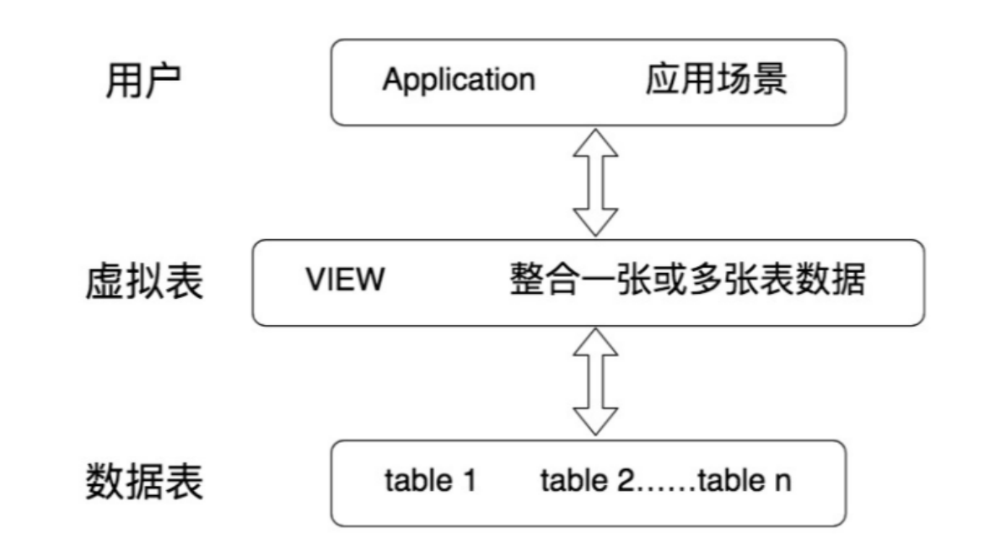

# 视图

视图一方面可以帮我们使用表的一部分而不是所有的表，另一方面也可以针对不同的用户制定不同的查询视图

**常见的数据库对象**

| 对象                | 描述                                                                                                 |
| :------------------ | ---------------------------------------------------------------------------------------------------- |
| 表(TABLE)           | 表是存储数据的逻辑单元，以行和列的形式存在，列就是字段，行就是记录                                   |
| 数据字典            | 就是系统表，存放数据库相关信息的表。系统表的数据通常由数据库系统维护，程序员通常不应该修改，只可查看 |
| 约束(CONSTRAINT)    | 执行数据校验的规则，用于保证数据完整性的规则                                                         |
| 视图(VIEW)          | 一个或者多个数据表里的数据的逻辑显示，视图并不存储数据                                               |
| 索引(INDEX)         | 用于提高查询性能，相当于书的目录                                                                     |
| 存储过程(PROCEDURE) | 用于完成一次完整的业务处理，没有返回值，但可通过传出参数将多个值传给调用环境                         |
| 存储函数(FUNCTION)  | 用于完成一次特定的计算，具有一个返回值                                                               |
| 触发器(TRIGGER)     | 相当于一个事件监听器，当数据库发生特定事件后，触发器被触发，完成相应的处理                           |

::: warning 总结

- 向视图提供数据内容的语句为 SELECT 语句, 可以将视图理解为存储起来的 SELECT 语句

- 在创建视图时，没有在视图名后面指定字段列表，则视图中字段列表默认和 SELECT 语句中的字段列表一致。如果 SELECT 语句中给字段取了别名，那么视图中的字段名和别名相同

- 可以在视图的基础上再建立视图

- 虽然可以更新视图数据，但总的来说，视图作为 虚拟表 ，主要用于 方便查询 ，不建议更新视图的数据。对视图数据的更改，都是通过对实际数据表里数据的操作来完成的。

:::

## 视图的理解

视图是一种虚拟表，本身是不具有数据的，占用很少的内存空间

视图建立在已有表的基础上，视图赖以建立的表成为基表



视图的创建和删除只影响视图本身，不影响对应的基表。但是当对视图中的数据进行增加、删除和修改操作时，数据表中的数据会相应地发生变化，反之亦然。

向视图提供数据内容的语句为 SELECT 语句, 可以将视图理解为存储起来的 SELECT 语句

- 视图不保存数据，数据真正保存在数据表中

视图，是向用户提供基表数据的另一种表现形式。通常情况下，小型项目的数据库可以不使用视图，但是在大型项目中，以及数据表比较复杂的情况下，视图的价值就凸显出来了，它可以帮助我们把经常查询的结果集放到虚拟表中，提升使用效率。理解和使用起来都非常方便

::: details 原理解释
::: code-group

```sql [原理分析]
-- 假设我们有一个视图定义如下：
CREATE VIEW employee_view AS
SELECT id, name, department
FROM employees;

-- 当我们查询这个视图时：
SELECT * FROM employee_view;

-- MySQL 实际上会执行定义中的 SELECT 语句：
SELECT id, name, department
FROM employees;
```

:::

## 创建视图

::: code-group

```sql [语法]
CREATE [OR REPLACE]
[ALGORITHM = {UNDEFINED | MERGE | TEMPTABLE}]
VIEW 视图名称 [(字段列表)]
AS 查询语句
[WITH [CASCADED|LOCAL] CHECK OPTION]
```

```sql [精简]
CREATE VIEW 视图名称
AS 查询语句
```

```sql [创建单视图表]
mysql> CREATE VIEW empvu80
    -> AS
    -> SELECT employee_id, last_name, salary
    -> FROM employees
    -> WHERE department_id = 80;
Query OK, 0 rows affected (0.00 sec)


mysql> SELECT * FROM empvu80;
+-------------+------------+----------+
| employee_id | last_name  | salary   |
+-------------+------------+----------+
|         145 | Russell    | 14000.00 |
|         146 | Partners   | 13500.00 |
。。。|
|         174 | Abel       | 11000.00 |
|         175 | Hutton     |  8800.00 |
|         176 | Taylor     |  8600.00 |
|         177 | Livingston |  8400.00 |
|         179 | Johnson    |  6200.00 |
+-------------+------------+----------+
34 rows in set (0.00 sec)

mysql> DESC employees;
+----------------+-------------+------+-----+---------+-------+
| Field          | Type        | Null | Key | Default | Extra |
+----------------+-------------+------+-----+---------+-------+
| employee_id    | int         | NO   | PRI | 0       |       |
| first_name     | varchar(20) | YES  |     | NULL    |       |
| last_name      | varchar(25) | NO   |     | NULL    |       |
| email          | varchar(25) | NO   | UNI | NULL    |       |
| phone_number   | varchar(20) | YES  |     | NULL    |       |
| hire_date      | date        | NO   |     | NULL    |       |
| job_id         | varchar(10) | NO   | MUL | NULL    |       |
| salary         | double(8,2) | YES  |     | NULL    |       |
| commission_pct | double(2,2) | YES  |     | NULL    |       |
| manager_id     | int         | YES  | MUL | NULL    |       |
| department_id  | int         | YES  | MUL | NULL    |       |
+----------------+-------------+------+-----+---------+-------+
11 rows in set (0.01 sec)

mysql> desc empvu80;
+-------------+-------------+------+-----+---------+-------+
| Field       | Type        | Null | Key | Default | Extra |
+-------------+-------------+------+-----+---------+-------+
| employee_id | int         | NO   |     | 0       |       |
| last_name   | varchar(25) | NO   |     | NULL    |       |
| salary      | double(8,2) | YES  |     | NULL    |       |
+-------------+-------------+------+-----+---------+-------+
3 rows in set (0.00 sec)
```

```sql [指定字段单表]
CREATE VIEW emp_year_salary (ename,year_salary)
AS
SELECT ename,salary*12*(1+IFNULL(commission_pct,0))
FROM t_employee;
```

```sql [创建联合表]
CREATE VIEW empview
AS
SELECT employee_id emp_id,last_name NAME,department_name
FROM employees e,departments d
WHERE e.department_id = d.department_id;

mysql> desc empview;
+-----------------+-------------+------+-----+---------+-------+
| Field           | Type        | Null | Key | Default | Extra |
+-----------------+-------------+------+-----+---------+-------+
| emp_id          | int         | NO   |     | 0       |       |
| NAME            | varchar(25) | NO   |     | NULL    |       |
| department_name | varchar(30) | NO   |     | NULL    |       |
+-----------------+-------------+------+-----+---------+-------+
3 rows in set (0.00 sec)

CREATE VIEW emp_dept
AS
SELECT ename,dname
FROM t_employee LEFT JOIN t_department
ON t_employee.did = t_department.did;

CREATE VIEW dept_sum_vu
(name, minsal, maxsal, avgsal)
AS
SELECT d.department_name, MIN(e.salary), MAX(e.salary),AVG(e.salary)
FROM employees e, departments d
WHERE e.department_id = d.department_id
GROUP BY d.department_name;
```

```sql [利用视图格式化]
mysql> CREATE VIEW emp_depart
    -> AS
    -> SELECT CONCAT(last_name,'(',department_name,')') AS emp_dept
    -> FROM employees e JOIN departments d
    -> WHERE e.department_id = d.department_id
    -> ;
Query OK, 0 rows affected (0.00 sec)

mysql> desc emp_depart;
+----------+-------------+------+-----+---------+-------+
| Field    | Type        | Null | Key | Default | Extra |
+----------+-------------+------+-----+---------+-------+
| emp_dept | varchar(57) | NO   |     |         |       |
+----------+-------------+------+-----+---------+-------+
1 row in set (0.00 sec)

mysql> desc employees;
+----------------+-------------+------+-----+---------+-------+
| Field          | Type        | Null | Key | Default | Extra |
+----------------+-------------+------+-----+---------+-------+
| employee_id    | int         | NO   | PRI | 0       |       |
| first_name     | varchar(20) | YES  |     | NULL    |       |
| last_name      | varchar(25) | NO   |     | NULL    |       |
| email          | varchar(25) | NO   | UNI | NULL    |       |
| phone_number   | varchar(20) | YES  |     | NULL    |       |
| hire_date      | date        | NO   |     | NULL    |       |
| job_id         | varchar(10) | NO   | MUL | NULL    |       |
| salary         | double(8,2) | YES  |     | NULL    |       |
| commission_pct | double(2,2) | YES  |     | NULL    |       |
| manager_id     | int         | YES  | MUL | NULL    |       |
| department_id  | int         | YES  | MUL | NULL    |       |
+----------------+-------------+------+-----+---------+-------+
11 rows in set (0.00 sec)

mysql> desc departments;
+-----------------+-------------+------+-----+---------+-------+
| Field           | Type        | Null | Key | Default | Extra |
+-----------------+-------------+------+-----+---------+-------+
| department_id   | int         | NO   | PRI | 0       |       |
| department_name | varchar(30) | NO   |     | NULL    |       |
| manager_id      | int         | YES  | MUL | NULL    |       |
| location_id     | int         | YES  | MUL | NULL    |       |
+-----------------+-------------+------+-----+---------+-------+
4 rows in set (0.00 sec)
```

:::

## 查看视图

::: code-group

```sql [查看数据库的表对象、视图对象]
mysql> SHOW TABLES;
+-------------------+
| Tables_in_chenwei |
+-------------------+
| countries         |
| departments       |
| emp_depart        |
| emp_details_view  |
| employees         |
| empview           |
| empvu80           |
| job_grades        |
| job_history       |
| jobs              |
| locations         |
| order             |
| regions           |
+-------------------+
13 rows in set (0.00 sec)
```

```sql [视图结构]
mysql> desc empvu80;
+-------------+-------------+------+-----+---------+-------+
| Field       | Type        | Null | Key | Default | Extra |
+-------------+-------------+------+-----+---------+-------+
| employee_id | int         | NO   |     | 0       |       |
| last_name   | varchar(25) | NO   |     | NULL    |       |
| salary      | double(8,2) | YES  |     | NULL    |       |
+-------------+-------------+------+-----+---------+-------+
3 rows in set (0.01 sec)
```

```sql [属性信息]
mysql> SHOW TABLE STATUS LIKE 'empvu80';
+---------+--------+---------+------------+------+----------------+-------------+-----------------+--------------+-----------+----------------+---------------------+-------------+------------+-----------+----------+----------------+---------+
| Name    | Engine | Version | Row_format | Rows | Avg_row_length | Data_length | Max_data_length | Index_length | Data_free | Auto_increment | Create_time         | Update_time | Check_time | Collation | Checksum | Create_options | Comment |
+---------+--------+---------+------------+------+----------------+-------------+-----------------+--------------+-----------+----------------+---------------------+-------------+------------+-----------+----------+----------------+---------+
| empvu80 | NULL   |    NULL | NULL       | NULL |           NULL |        NULL |            NULL |         NULL |      NULL |           NULL | 2024-06-13 15:14:10 | NULL        | NULL       | NULL      |     NULL | NULL           | VIEW    |
+---------+--------+---------+------------+------+----------------+-------------+-----------------+--------------+-----------+----------------+---------------------+-------------+------------+-----------+----------+----------------+---------+
1 row in set (0.01 sec)
```

```sql [查看视图定义详细信息]
mysql> SHOW CREATE VIEW empvu80;
+---------+----------------------------------------------------------------------------------------------------------------------------------------------------------------------------------------------------------------------------------------------------------------------------------+----------------------+----------------------+
| View    | Create View                                                                                                                                                                                                                                                                      | character_set_client | collation_connection |
+---------+----------------------------------------------------------------------------------------------------------------------------------------------------------------------------------------------------------------------------------------------------------------------------------+----------------------+----------------------+
| empvu80 | CREATE ALGORITHM=UNDEFINED DEFINER=`root`@`localhost` SQL SECURITY DEFINER VIEW `empvu80` AS select `employees`.`employee_id` AS `employee_id`,`employees`.`last_name` AS `last_name`,`employees`.`salary` AS `salary` from `employees` where (`employees`.`department_id` = 80) | utf8                 | utf8_general_ci      |
+---------+----------------------------------------------------------------------------------------------------------------------------------------------------------------------------------------------------------------------------------------------------------------------------------+----------------------+----------------------+
1 row in set (0.00 sec)


```

:::

## 更新视图

MySQL 支持使用 INSERT、UPDATE 和 DELETE 语句对视图中的数据进行插入、更新和删除操作。当视图中的数据发生变化时，数据表中的数据也会发生变化，反之亦然

**不可更新视图**

要使视图可更新，视图中的行和底层基本表中的行之间必须存在 一对一 的关系。另外当视图定义出现如下情况时，视图不支持更新操作：

- 在定义视图的时候指定了“ALGORITHM = TEMPTABLE”，视图将不支持 INSERT 和 DELETE 操作
- 视图中不包含基表中所有被定义为非空又未指定默认值的列，视图将不支持 INSERT 操作
- 在定义视图的 SELECT 语句中使用了 JOIN 联合查询 ，视图将不支持 INSERT 和 DELETE 操作
- 在定义视图的 SELECT 语句后的字段列表中使用了 数学表达式 或 子查询 ，视图将不支持 INSERT，也不支持 UPDATE 使用了数学表达式、子查询的字段值
- 在定义视图的 SELECT 语句后的字段列表中使用 DISTINCT 、 聚合函数 、 GROUP BY 、 HAVING 、UNION 等，视图将不支持 INSERT、UPDATE、DELETE
- 在定义视图的 SELECT 语句中包含了子查询，而子查询中引用了 FROM 后面的表，视图将不支持 INSERT、UPDATE、DELETE
- 视图定义基于一个 不可更新视图
- 常量视图

## 修改、删除视图

::: code-group

```sql [way 1]
mysql> CREATE OR REPLACE VIEW empvu80
    -> (id_number, name, sal, department_id)
    -> AS
    -> SELECT employee_id, first_name || ' ' || last_name, salary, department_id
    -> FROM employees
    -> WHERE department_id = 80;
Query OK, 0 rows affected, 2 warnings (0.00 sec)

mysql> desc empvu80;
+---------------+--------------+------+-----+---------+-------+
| Field         | Type         | Null | Key | Default | Extra |
+---------------+--------------+------+-----+---------+-------+
| id_number     | int          | NO   |     | 0       |       |
| name          | int unsigned | YES  |     | NULL    |       |
| sal           | double(8,2)  | YES  |     | NULL    |       |
| department_id | int          | YES  |     | NULL    |       |
+---------------+--------------+------+-----+---------+-------+
4 rows in set (0.00 sec)
```

```sql [way 2]
ALTER VIEW 视图名称
AS
查询语句
```

:::

## 删除视图

删除只是删除视图的定义，并不会删除基表的数据

::: code-group

```sql [语法]
DROP VIEW [IF EXISTS] 视图名称;
```

```sql [exam]
DROP VIEW empvu80;
```

:::

::: danger
基于视图 a、b 创建了新的视图 c，如果将视图 a 或者视图 b 删除，会导致视图 c 的查询失败。这样的视图 c 需要手动删除或修改，否则影响使用。
:::
