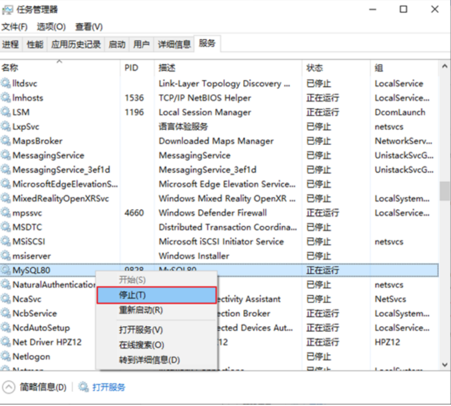
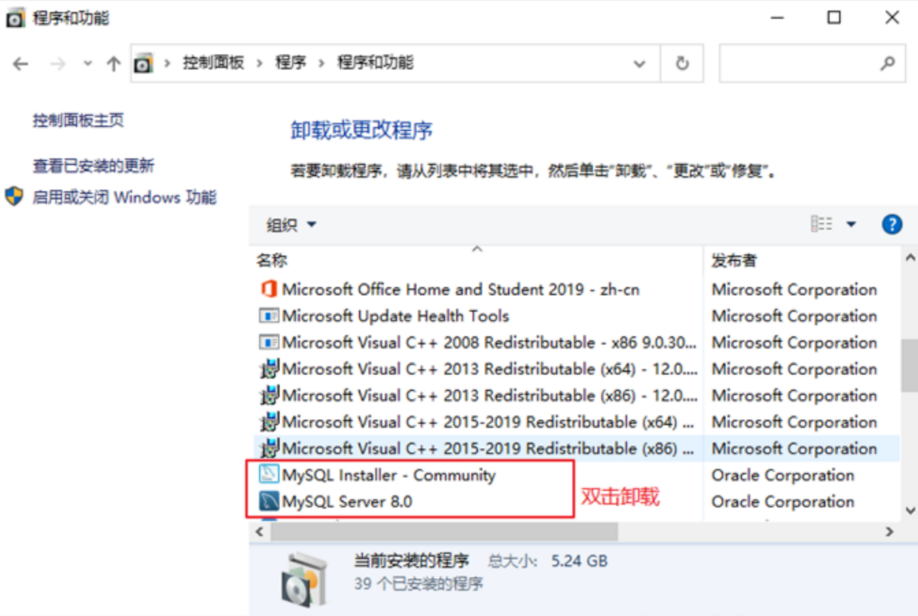
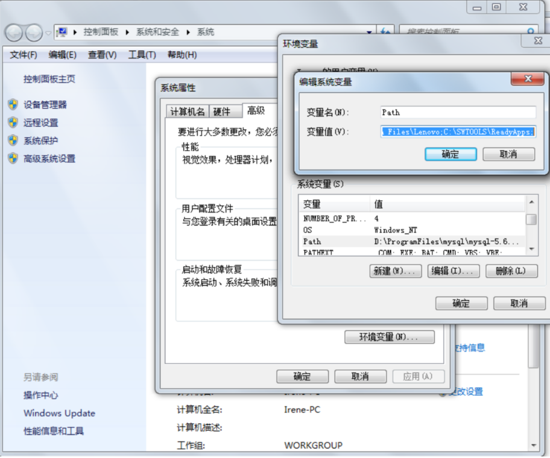
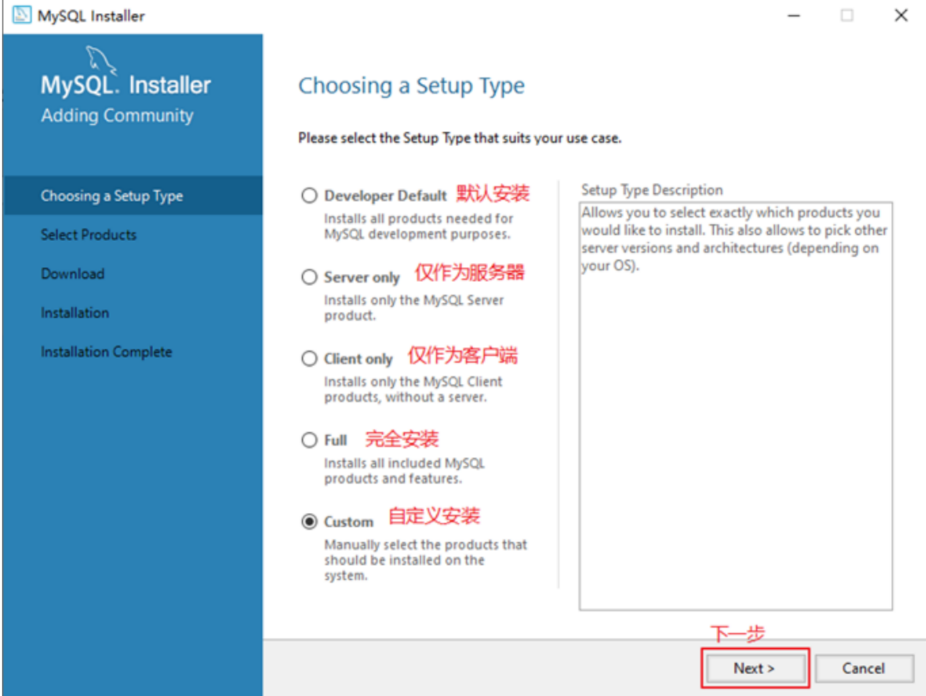
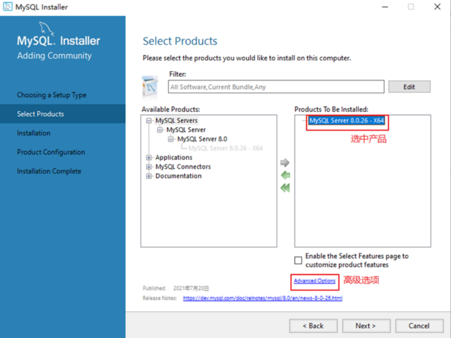
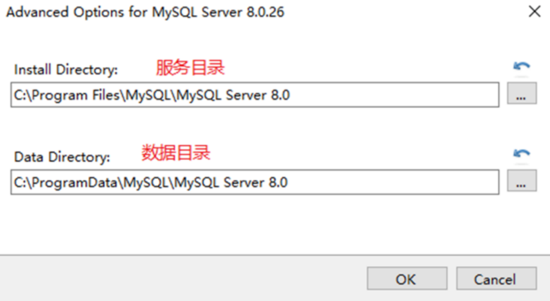
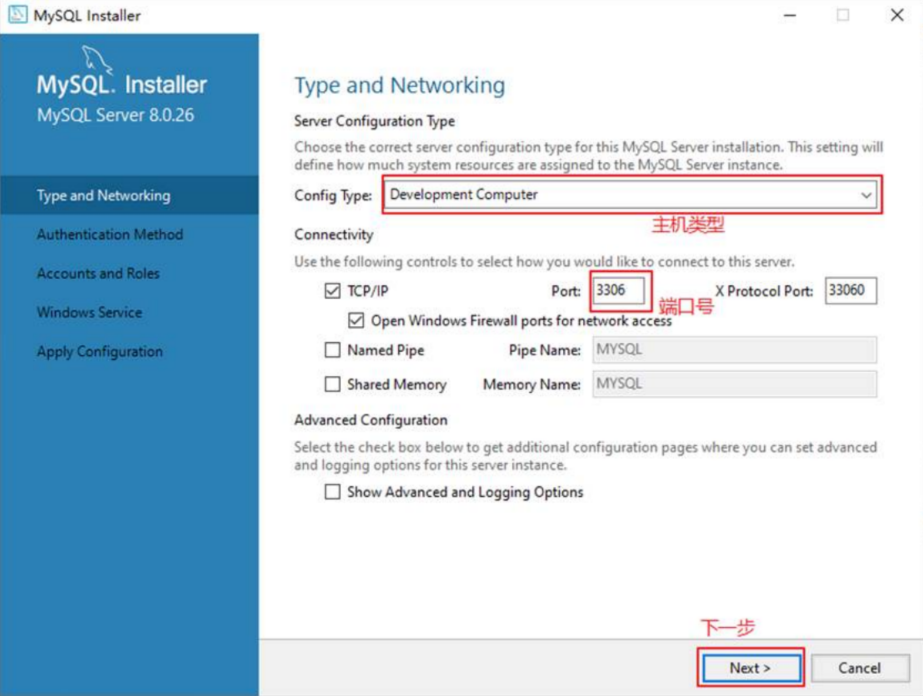
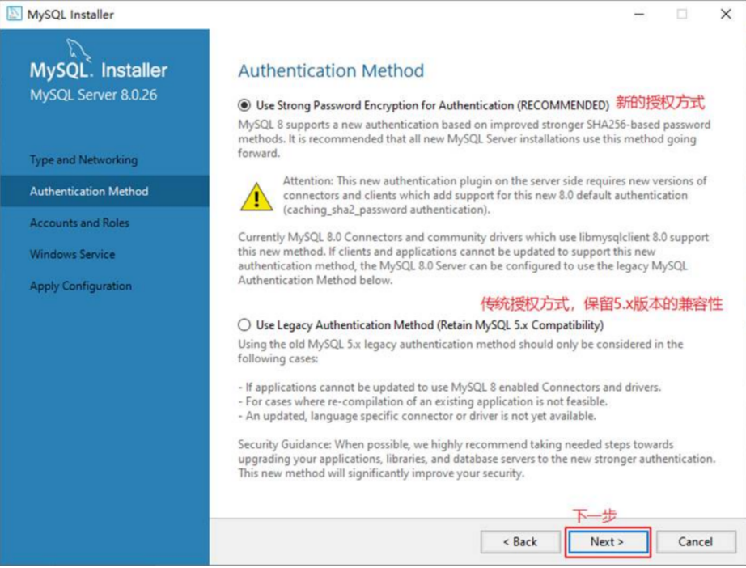
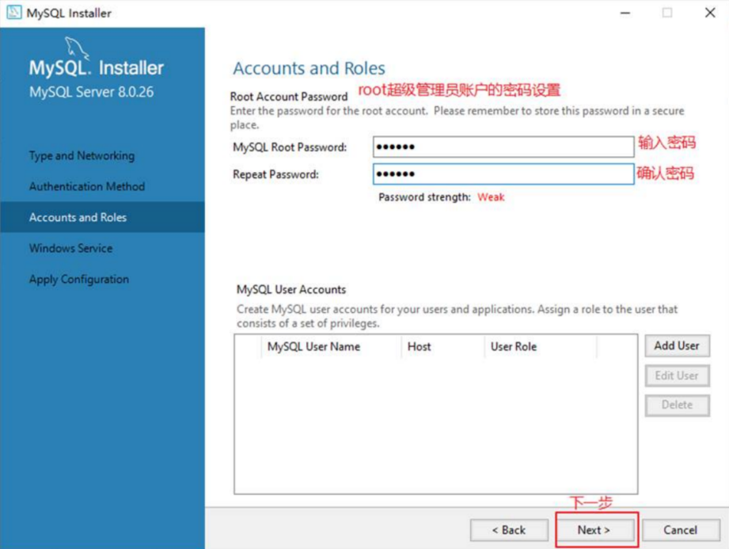
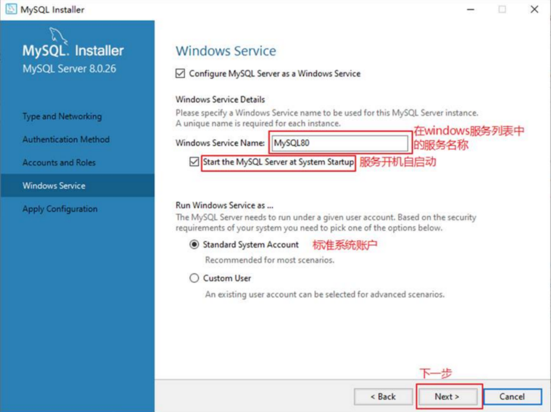

# 开始

::: danger 说明
此笔记记录的初衷是为了自己使用 node 操作 sql 的能力

每一处操作的笔记都将使用 navicat、mysql2、sequelize 操作 sql

学习笔记结合各自官网：

🥰 [mysql2](https://sidorares.github.io/node-mysql2/zh-CN/docs)

🥰 [sequelize](https://sequelize.nodejs.cn/#google_vignette)

🥰 [mysql 下载地址](https://dev.mysql.com/downloads/windows/installer/8.0.html)

与学习视频：

🥰 [尚硅谷 mysql](https://www.bilibili.com/video/BV1iq4y1u7vj/?p=141&spm_id_from=333.880.my_history.page.click)

当前主要环境：

sql：mysql_8.026

运行环境：win11、centos7

:::

## 规则与规范

**基本规范**

1. SQL 可以写在一行或者多行，为了提高可读性，各子句分行写，必要时使用缩进
2. 每条命令以 ; 或 \g 或 \G 结束
3. 关键字不能被缩写也不能分行
4. 关于标点符号
   - ()、''、""、是成对结束
   - 必须在英文状态的半角输入方式
   - 字符串型和日期时间类型可以使用单引号 '' 表示
   - 列的别名，尽量使用双引号 ""，而且不建议省略 as

**大小写规范**

`mysql` 在 `win` 环境下大小写不敏感

`mysql` 在 `linux` 环境下大小写敏感：

- 数据库名、表名、表的别名、变量名严格区分大小写

- 关键字、函数名、列名、列的别名（字段的别名）忽略大小写

推荐采用统一的书写规范：

- 数据库名、表名、表别名、字段名、字段别名都小写
- sql 关键字、函数名、标定变量等都大写

**注释**

```bash
单行注释：#注释文字(MySQL特有的方式)
单行注释：-- 注释文字(--后面必须包含一个空格。)
多行注释：/* 注释文字 */
```

**命名规则**

1. 数据库、表名不得超过 30 个字符，变量名限制为 29 个
2. 必须只能包含 A-Z,a-z,0-9,\_ 共 63 个字符
3. 数据库名、表名、字段名等对象中间不要包含括号
4. 同一个 mysql 软件中，数据库不能同名；同库中表不能重名；同表中，同字段不能同名
5. 必须保证字段没有和保留字、数据库系统或常用方法冲突。坚持使用则使用 `` 引起来
6. 保持字段名和类型的一致性，在命名字段并为其指定数据的时候一定要保持一致性
   > 假如数据类型在一个表里是整数，在另一个表中就变成字符串了

**字段命名**

表名、字段名必须使用小写字母或数字，禁止出现数字开头，禁止两个下划线中间只出现数字。数据库字段名的修改代价很大，因为无法进行预发布，所以字段名称需要慎重考虑

- 正例：aliyun_admin，rdc_config，level3_name
- 反例：AliyunAdmin，rdcConfig，level_3_name

禁用保留字，如 desc、range、match、delayed 等，请参考 MySQL 官方保留字

表必备三字段：id, gmt_create, gmt_modified

> 说明：其中 id 必为主键，类型为 BIGINT UNSIGNED、单表时自增、步长为 1。gmt_create,gmt_modified 的类型均为 DATETIME 类型，前者现在时表示主动式创建，后者过去分词表示被动式更新

表的命名最好是遵循 “业务名称\_表的作用”

- 正例：alipay_task 、 force_project、 trade_config

库名与应用名称尽量一致

**数据导入指令**

在命令行客户端登录 mysql，使用 source 指令导入

```shell
mysql> source d:\mysqldb.sql

mysql> use egg;
Database changed

mysql> desc employees;
+----------------+-------------+------+-----+---------+-------+
| Field          | Type        | Null | Key | Default | Extra |
+----------------+-------------+------+-----+---------+-------+
| employee_id    | int         | NO   | PRI | 0       |       |
| first_name     | varchar(20) | YES  |     | NULL    |       |
| last_name      | varchar(25) | NO   |     | NULL    |       |
| email          | varchar(25) | NO   | UNI | NULL    |       |
| phone_number   | varchar(20) | YES  |     | NULL    |       |
| hire_date      | date        | NO   |     | NULL    |       |
| job_id         | varchar(10) | NO   | MUL | NULL    |       |
| salary         | double(8,2) | YES  |     | NULL    |       |
| commission_pct | double(2,2) | YES  |     | NULL    |       |
| manager_id     | int         | YES  | MUL | NULL    |       |
| department_id  | int         | YES  | MUL | NULL    |       |
+----------------+-------------+------+-----+---------+-------+
11 rows in set (0.01 sec)
```

## 环境搭建

### 卸载 mysql

自己错误操作将系统文件删除了，所以自己删除了一遍又安装

故而记录此操作，避免二次采坑

**停止 sql 服务**

任务管理器 --> 服务 --> 找到 mysql8.0 服务 --> 右键选择停止服务



**软件卸载**

1. 控制面板中卸载程序



2. 残留文件清理

服务目录：默认在 C:\ProgramServer\MySQL

数据目录：默认在 C:\ProgramData\MySQL

::: tip
如果安装的时候自定义过，指定自定义指向的目录
:::

3. 清理注册表

如何打开注册表编辑器：在系统的搜索框中输入 regedit

```bash
HKEY_LOCAL_MACHINE\SYSTEM\ControlSet001\Services\Eventlog\Application\MySQL服务 目录删除
HKEY_LOCAL_MACHINE\SYSTEM\ControlSet001\Services\MySQL服务 目录删除
HKEY_LOCAL_MACHINE\SYSTEM\ControlSet002\Services\Eventlog\Application\MySQL服务 目录删除
HKEY_LOCAL_MACHINE\SYSTEM\ControlSet002\Services\MySQL服务 目录删除
HKEY_LOCAL_MACHINE\SYSTEM\CurrentControlSet\Services\Eventlog\Application\MySQL服务目录
删除
HKEY_LOCAL_MACHINE\SYSTEM\CurrentControlSet\Services\MySQL服务删除
```

::: tip
注册表中的 ControlSet001,ControlSet002,不一定是 001 和 002,可能是 ControlSet005、006 之类
:::

4. 删除环境变量

找到 path 环境变量，将其中关于 mysql 的环境变量删除，切记不要全部删除。

例如：删除 D:\develop_tools\mysql\MySQLServer8.0.26\bin; 这个部分



### 下载安装

1. 下载 mysql

地址：[sql 社区版下载](https://dev.mysql.com/downloads/windows/installer/8.0.html)

2. 找到下载文件双击安装



3. 选择要安装的服务，配置安装路径

> 我这里没有修改，直接安装的默认





然后一直点击下一步安装就好了

4. 进入 mysql 服务器类型配置窗口，端口一般默认 3306



5. 一直点击下一步，服务器类型选择 dev_computer

授权方式选择推荐的：新授权方式



6. 配置用户，此处没有配置用户

> 当前密码设置为： w19950806



7. 配置服务



8. 然后一直点击下一步完成安装就好了

## 登录服务

**命令行登录**

```bash
Microsoft Windows [版本 10.0.22000.2538]
(c) Microsoft Corporation。保留所有权利。

C:\Users\陈伟>mysql -hlocalhost -P3306 -uroot -p
Enter password: *********
Welcome to the MySQL monitor.  Commands end with ; or \g.
Your MySQL connection id is 14
Server version: 8.0.26 MySQL Community Server - GPL

Copyright (c) 2000, 2021, Oracle and/or its affiliates.

Oracle is a registered trademark of Oracle Corporation and/or its
affiliates. Other names may be trademarks of their respective
owners.

Type 'help;' or '\h' for help. Type '\c' to clear the current input statement.

mysql>
```

客服端和服务器在同一台机器上，所以输入 localhost 或者 IP 地址 127.0.0.1

同时，因为是连接本机： -hlocalhost 就可以省略，如果端口号没有修改：-P3306 也可以省略

```bash
C:\Users\陈伟>mysql -uroot -p
Enter password: *********
Welcome to the MySQL monitor.  Commands end with ; or \g.
Your MySQL connection id is 15
Server version: 8.0.26 MySQL Community Server - GPL

Copyright (c) 2000, 2021, Oracle and/or its affiliates.

Oracle is a registered trademark of Oracle Corporation and/or its
affiliates. Other names may be trademarks of their respective
owners.

Type 'help;' or '\h' for help. Type '\c' to clear the current input statement.

mysql>
```

**查看版本号**

::: code-group

```bash [mysql 指令查询]
mysql> select version();
+-----------+
| version() |
+-----------+
| 8.0.26    |
+-----------+
1 row in set (0.01 sec)
```

```bash [终端查询]
C:\Users\陈伟>mysql -V
mysql  Ver 8.0.26 for Win64 on x86_64 (MySQL Community Server - GPL)
```

:::

## 基本使用

### 基本信息介绍

**查看所有的数据库**

```bash
mysql> show databases;
+--------------------+
| Database           |
+--------------------+
| egg                |
| information_schema |
| mysql              |
| performance_schema |
| sys                |
+--------------------+
5 rows in set (0.01 sec)
```

::: info 介绍
information_schema：是 mysql 系统自带数据库，主要保存数据库服务器的系统信息

> 比如数据库的名称、数据表名称、字段名称、存取权限、数据文件所在的文件夹和系统使用的文件夹等等

performance_schema：是 mysql 系统自带的数据库，可以用来监控 mysql 的各类性能指标

sys：作用是一种更容易被理解的方式展示 mysql 数据库服务器的各类性能指标，帮助系统管理员和开发人员监控 mysql 的技术性能

mysql：保存了数据库服务器运行时需要的系统信息

> 比如数据文件夹、当前使用的字符集、约束检查信息等

:::

### 使用

1. 创建并使用数据库

如果没有使用 use 语句，后面针对数据库的操作也没有加“数据名”的限定，那么会报错

使用完 use 语句之后，如果接下来的 sql 都是针对一个数据库操作的，那就不用重复 use 了

如果要针对另一个数据库操作，那么就要重新 use 了

```bash
mysql> create database init_01_test;
Query OK, 1 row affected (0.01 sec)

mysql> use init_01_test;
Database changed
mysql> select database();
+--------------+
| database()   |
+--------------+
| init_01_test |
+--------------+
1 row in set (0.00 sec)
```

2. 查看某个库的所有表格

```bash
mysql> show tables;
Empty set (0.00 sec)

mysql> show tables from init_01_test;
Empty set (0.00 sec)
```

3. 创建新表格

```bash
mysql> create table init_01_table (
    -> id int,
    -> name varchar(20)
    -> );
Query OK, 0 rows affected (0.04 sec)

mysql> select * from init_01_table;
Empty set (0.00 sec)
```

4. 向数据插入并查找数据

```bash
mysql> insert into init_01_table values(1, "陈伟");
Query OK, 1 row affected (0.01 sec)

mysql> insert into init_01_table values(2, "栾奕");
Query OK, 1 row affected (0.01 sec)

mysql> select * from init_01_table;
+------+------+
| id   | name |
+------+------+
|    1 | 陈伟 |
|    2 | 栾奕 |
+------+------+
2 rows in set (0.01 sec)
```

5. 查看表的创建信息

```bash
mysql> show create table init_01_table;
+---------------+--------------------------------------------------------------------------------------------------------------------------------------------------------------+
| Table         | Create Table                                                                                                                                                 |
+---------------+--------------------------------------------------------------------------------------------------------------------------------------------------------------+
| init_01_table | CREATE TABLE `init_01_table` (
                    `id` int DEFAULT NULL,
                    `name` varchar(20) DEFAULT NULL
                  ) ENGINE=InnoDB DEFAULT CHARSET=utf8mb4 COLLATE=utf8mb4_0900_ai_ci |
+---------------+--------------------------------------------------------------------------------------------------------------------------------------------------------------+
1 row in set (0.01 sec)
```

6. 查看数据库的创建信息

```bash
mysql> show create database init_01_test;
+--------------+----------------------------------------------------------------------------------------------------------------------------------------+
| Database     | Create Database                                                                                                                        |
+--------------+----------------------------------------------------------------------------------------------------------------------------------------+
| init_01_test | CREATE DATABASE `init_01_test` /*!40100 DEFAULT CHARACTER SET utf8mb4 COLLATE utf8mb4_0900_ai_ci */ /*!80016 DEFAULT ENCRYPTION='N' */ |
+--------------+----------------------------------------------------------------------------------------------------------------------------------------+
1 row in set (0.00 sec)
```

7. 删除表格、删除数据库

::: code-group

```bash [删除表格]
mysql> drop table init_01_table;
Query OK, 0 rows affected (0.02 sec)

mysql> show tables;
Empty set (0.00 sec)
```

```bash [删除数据库]
mysql> drop database init_01_test;
Query OK, 0 rows affected (0.01 sec)

mysql> show databases;
+--------------------+
| Database           |
+--------------------+
| egg                |
| information_schema |
| mysql              |
| performance_schema |
| sys                |
+--------------------+
5 rows in set (0.00 sec)
```

:::

## 常见问题

### 字符集问题

mysql8.0 之前，默认字符集是 latin1，utf8 字符集指向的是 utf8mb3

网站开发人员在数据库设计的时候往往会将编码修改为 utf8 字符集

如果忘记修改默认的编码，就会出现乱码的问题

mysql8 开始，数据库的默认编码改为 utf8mb4，从而避免了上述乱码的问题

**8 之前字符集的修改**

1. 查看编码

```bash
mysql> show variables like 'character_%';
+--------------------------+---------------------------------------------------------+
| Variable_name            | Value                                                   |
+--------------------------+---------------------------------------------------------+
| character_set_client     | gbk                                                     |
| character_set_connection | gbk                                                     |
| character_set_database   | utf8mb4                                                 |
| character_set_filesystem | binary                                                  |
| character_set_results    | gbk                                                     |
| character_set_server     | utf8mb4                                                 |
| character_set_system     | utf8mb3                                                 |
| character_sets_dir       | C:\Program Files\MySQL\MySQL Server 8.0\share\charsets\ |
+--------------------------+---------------------------------------------------------+
8 rows in set, 6 warnings (0.01 sec)

mysql> show variables like 'collation_%';
+----------------------+--------------------+
| Variable_name        | Value              |
+----------------------+--------------------+
| collation_connection | gbk_chinese_ci     |
| collation_database   | utf8mb4_0900_ai_ci |
| collation_server     | utf8mb4_0900_ai_ci |
+----------------------+--------------------+
3 rows in set, 6 warnings (0.00 sec)
```

2. 修改 mysql 数据目录下的 my.ini 配置文件

```bash
[mysql] #大概在63行左右，在其下添加
...
default-character-set=utf8 #默认字符集
[mysqld] # 大概在76行左右，在其下添加
...
character-set-server=utf8
collation-server=utf8_general_ci
```

::: warning
使用记事本等软件打开修改后可能会导致文件编码修改为含 BOM 头的编码，从而服务启动失败
:::

3. 重启服务、再查看编码命令

### 图形化工具报错

有些图形界面工具，特别是旧版本的图形界面工具，在连接 MySQL8 时出现“Authentication plugin 'caching_sha2_password' cannot be loaded”错误。

出现这个原因是 MySQL8 之前的版本中加密规则是 mysql_native_password，而在 MySQL8 之后，加密规则是 caching_sha2_password。解决问题方法有两种，第一种是升级图形界面工具版本，第二种是把 MySQL8 用户登录密码加密规则还原成 mysql_native_password。

**修改密码**

```bash
#使用mysql数据库
USE mysql;
#修改'root'@'localhost'用户的密码规则和密码
ALTER USER 'root'@'localhost' IDENTIFIED WITH mysql_native_password BY 'abc123';
#刷新权限
FLUSH PRIVILEGES;
```

### root 密码忘记

1. 通过任务管理器关闭 mysqlid（服务进程）
2. 通过命令行 + 特殊参数开启 mysql

```bash
mysqld --defaults-file="D:\ProgramFiles\mysql\MySQLServer5.7Data\my.ini" --skip-grant-tables
```

3. 此时 mysql 服务进程已经打开，并且不需要权限检查
4. mysql -uroot 无密码登陆服务器。另启动一个客户端进行
5. 修改权限表

```bash
use mysql;

update user set authentication_string=password('新密码') where user='root' and Host='localhost';

flush privileges;
```

6. 再次任务管理器关掉进程，然后再打开
7. 用新密码登录即可

### 修改库、表、字段字符集

::: code-group

```bash [新建表数据]
mysql> create database 0728db charset Latin1;
Query OK, 1 row affected (0.00 sec)

mysql> use 0728db;
Database changed

mysql> create table student (id int , name varchar(20)) charset Latin1;
Query OK, 0 rows affected (0.02 sec)
mysql> show create table student\G
*************************** 1. row ***************************
Table: student
Create Table: CREATE TABLE `student` (
`id` int(11) NOT NULL,
`name` varchar(20) DEFAULT NULL,
PRIMARY KEY (`id`)
) ENGINE=InnoDB DEFAULT CHARSET=latin1
1 row in set (0.00 sec)
```

```bash [修改表字符集]
mysql> alter table student charset utf8; #修改表字符编码为UTF8
Query OK, 0 rows affected (0.01 sec)
Records: 0 Duplicates: 0 Warnings: 0
mysql> show create table student\G
*************************** 1. row ***************************
Table: student
Create Table: CREATE TABLE `student` (
  `id` int(11) NOT NULL,
  `name` varchar(20) CHARACTER SET latin1 DEFAULT NULL, #字段仍然是latin1编码
PRIMARY KEY (`id`)
) ENGINE=InnoDB DEFAULT CHARSET=utf8
1 row in set (0.00 sec)
```

```bash [修改字段]
mysql> alter table student modify name varchar(20) charset utf8; #修改字段字符编码为UTF8
Query OK, 0 rows affected (0.05 sec)
Records: 0 Duplicates: 0 Warnings: 0
mysql> show create table student\G
*************************** 1. row ***************************
Table: student
Create Table: CREATE TABLE `student` (
  `id` int(11) NOT NULL,
  `name` varchar(20) DEFAULT NULL,
  PRIMARY KEY (`id`)
) ENGINE=InnoDB DEFAULT CHARSET=utf8
1 row in set (0.00 sec)
```

```bash [修改库]
mysql> show create database 0728db;;
+--------+-----------------------------------------------------------------+
|Database| Create Database |
+------+-------------------------------------------------------------------+
|0728db| CREATE DATABASE `0728db` /*!40100 DEFAULT CHARACTER SET latin1 */ |
+------+-------------------------------------------------------------------+
1 row in set (0.00 sec)

mysql> alter database 0728db charset utf8; #修改数据库的字符编码为utf8
Query OK, 1 row affected (0.00 sec)

```

:::

## 目录结构与源码

| 目录结构                                     | 说明                                   |
| :------------------------------------------- | :------------------------------------- |
| bin 目录                                     | 所有 MySQL 的可执行文件。如：mysql.exe |
| MySQLInstanceConfig.exe                      | 数据库的配置向导，在安装时出现的内容   |
| data 目录                                    | 系统数据库所在的目录                   |
| my.ini 文件                                  | MySQL 的主要配置文件                   |
| c:\ProgramData\MySQL\MySQL Server 8.0\data\  | 用户创建的数据库所在的目录             |
