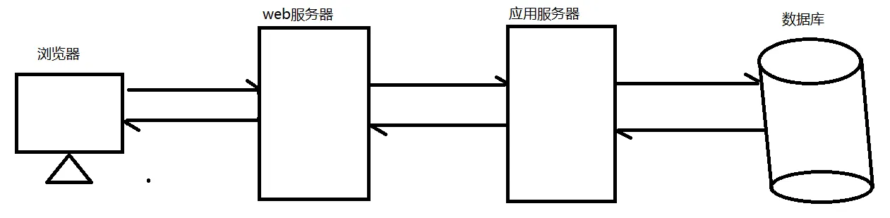

# 缓存

缓存就是数据交换的缓冲区(称作:Cache),当用户要获取数据的时候，会先从缓存中去查询获取数据，如果缓存中有就会直接返回给用户

如果缓存中没有，则会发请求从服务器重新查询数据，将数据返回给用户的同时将数据放入缓存，下次用户就会直接从缓存中获取数据

缓存用到的场景

| 场景             | 作用               |
| ---------------- | ------------------ |
| 操作系统磁盘缓存 | 减少磁盘机械操作   |
| 浏览器缓存       | 减少网络流量       |
| 代理服务器缓存   | 减少网络流量       |
| 分布式缓存       | 减少网络流量       |
| 应用程序缓存     | 减少对数据库的查询 |

缓存优点：

1. 减少数据传输，节省网络流量，加快响应速度，提升用户体验
2. 减轻服务器压力
3. 提供服务端的高可用性

缺点：

1. 数据的不一致
2. 增加成本

{width=90%}

这里主要讲解的是 nginx 作为 web 服务器缓存服务器，它介于客户端和应用服务器之间，当用户通过浏览器访问一个 url 时，web 缓存服务器会去应用服务器获取要展示给客户的内容，将内容缓存到自己的服务器上，当下一次请求到来时，如果访问的是同一个 url，web 缓存服务器就会直接将之前缓存的内容返回给客户端，而不是向应用服务器再次发送请求

web 缓存降低了应用服务器、数据库的负载，减少了网络延迟，提高了用户访问的响应速度，增强了用户体验

## 相关指令

Nginx 的 web 缓存服务主要是使用 ngx_http_proxy_module 模块相关指令集来完成

[文档](https://docshome.gitbook.io/nginx-docs/he-xin-gong-neng/http/ngx_http_proxy_module)

### proxy_cache_path

| 语法   | proxy_cache_path path [levels=1] keys_zone=name:size [inactive=time] [max_size=size] |
| ------ | ------------------------------------------------------------------------------------ |
| 默认   | -                                                                                    |
| 上下文 | http                                                                                 |

path: 缓存路径地址

```shell
/usr/local/proxy_cache
```

levels: 指定该缓存空间对应的目录，最多可以设置 3 层，每层取值为 1/2 如：

```bash
levels=1:2   # 缓存空间有两层目录，第一次是1个字母，第二次是2个字母
# 举例说明:
# itheima[key]通过MD5加密以后的值为 43c8233266edce38c2c9af0694e2107d
levels=1:2   # 最终的存储路径为/usr/local/proxy_cache/d/07
levels=2:1:2 # 最终的存储路径为/usr/local/proxy_cache/7d/0/21
levels=2:2:2 # 最终的存储路径为??/usr/local/proxy_cache/7d/10/e2
```

keys_zone:用于定义一个内存区域，专门存储缓存键和相关的元数据。它不存储实际的缓存内容，而是存储缓存条目的索引信息

```bash
keys_zone=itcast:200m  # 缓存区的名称是itcast,大小为200M,1M大概能存储8000个keys
```

inactive:指定缓存的数据多次时间未被访问就将被删除，如：

```bash
inactive=1d    # 缓存数据在1天内没有被访问就会被删除
```

max_size:设置最大缓存空间，如果缓存空间存满，默认会覆盖缓存时间最长的资源

```bash
max_size=20g
```

**配置实例**

```nginx
http{
	proxy_cache_path /usr/local/proxy_cache keys_zone=itcast:200m  levels=1:2:1 inactive=1d max_size=20g;
}
```

### proxy_cache

该指令用来开启或关闭代理缓存，如果是开启则自定使用哪个缓存区来进行缓存

**对应关系**

当你在配置中使用 proxy_cache itcast; 时，这里的 itcast 就是 keys_zone=itcast:200m 中定义的缓存区域名称

**是否可以配置多个缓存区域？**

```nginx
http {
    # 定义第一个缓存区域
    proxy_cache_path /usr/local/proxy_cache1 keys_zone=zone1:100m levels=1:2 inactive=1d max_size=10g;

    # 定义第二个缓存区域
    proxy_cache_path /usr/local/proxy_cache2 keys_zone=zone2:200m levels=1:2:1 inactive=2d max_size=20g;

    server {
        location /api {
            # 使用第一个缓存区域
            proxy_cache zone1;
            proxy_pass http://api_backend;
        }

        location /static {
            # 使用第二个缓存区域
            proxy_cache zone2;
            proxy_pass http://static_backend;
        }
    }
}
```

| 语法   | proxy_cache zone \| off |
| ------ | ----------------------- |
| 默认   | off                     |
| 上下文 | http 、server、location |

zone：指定缓存区的名称

### proxy_cache_key

该指令用来设置 web 缓存的 key 值，Nginx 会根据 key 值 MD5 哈希存缓存

| 语法   | proxy_cache_key string         |
| ------ | ------------------------------ |
| 默认   | $scheme$proxy_host$request_uri |
| 上下文 | http 、server、location        |

缓存区域定义：

proxy_cache_path 中的 keys_zone 用于定义一个缓存区域。这个区域在内存中存储缓存键（由 proxy_cache_key 生成）及其相关的元数据（如缓存条目的过期时间等）。它不存储实际的缓存内容，而是存储缓存条目的索引信息

缓存存储和查找：

当 Nginx 处理一个请求时，proxy_cache_key 生成的键会被存储在 keys_zone 定义的缓存区域中。这个键用于查找和管理缓存条目

当一个请求到来时，Nginx 使用 proxy_cache_key 生成的键在 keys_zone 中查找是否存在对应的缓存条目。如果找到，Nginx 会从磁盘或内存中读取缓存的响应

### proxy_cache_valid

该指令用来对不同返回状态码的 URL 设置不同的缓存时间

| 语法   | proxy_cache_valid [code ...] time |
| ------ | --------------------------------- |
| 默认   | -                                 |
| 上下文 | http 、server、location           |

```nginx
proxy_cache_valid 200 302 10m;
proxy_cache_valid 404 1m;
# 为200和302的响应URL设置10分钟缓存，为404的响应URL设置1分钟缓存
proxy_cache_valid any 1m;
# 对所有响应状态码的URL都设置1分钟缓存
```

### proxy_cache_min_uses

该指令用来设置资源被访问多少次后被缓存

| 语法   | proxy_cache_min_uses number |
| ------ | --------------------------- |
| 默认   | 1                           |
| 上下文 | http 、server、location     |

number: 指定资源被访问多少次后被缓存

### proxy_cache_methods

该指令用来设置缓存哪些请求方法

| 语法   | proxy_cache_methods [method ...] |
| ------ | -------------------------------- |
| 默认   | GET                              |
| 上下文 | http 、server、location          |

```nginx
http{
	proxy_cache_path /usr/local/proxy_cache levels=2:1 keys_zone=itcast:200m inactive=1d max_size=20g;
	proxy_cache_key $scheme$proxy_host$request_uri;
  proxy_cache_min_uses 5;
  proxy_cache_valid 200 5d;
  proxy_cache_valid 404 30s;
  proxy_cache_valid any 1m;

  upstream backend{
		server 192.168.200.146:8080;
	}
	server {
		listen       8080;
        server_name  localhost;
        location / {
        	proxy_cache itcast;

            add_header nginx-cache "$upstream_cache_status";
        	proxy_pass http://backend/js/;
        }
	}
}
```

## 缓存清除

### 手动清除

```shell
# 删除缓存
rm -rf /usr/local/proxy_cache/*
```

### 自动清除

下载 ngx_cache_purge 模块对应的资源包，并上传到服务器上

```bash
ngx_cache_purge-2.3.tar.gz

tar -zxf ngx_cache_purge-2.3.tar.gz

mv ngx_cache_purge-2.3 purge

```

升级 nginx

```bash
nginx -V

./configure --add-module=/opt/nginx/core/purge

...
```

配置

```nginx
    server {
        listen 80;
        server_name localhost;
        location / {
                add_header checkhead $scheme$host$request_uri;
                add_header nginx-cache "$upstream_cache_status";
                proxy_cache itcast;
                proxy_pass http://backend/js/;
        }
        location ~/purge(/.*) {
                proxy_cache_purge itcast $scheme$host$1;
                default_type text/plain;
                return 200 $scheme$host$1;
        }
    }
```

如果有 `test.css` 缓存， 请求 `http://localhost/purge/test.css` 会清除缓存

## 资源不缓存

不是所有的数据都适合进行缓存

比如说对于一些经常发生变化的数据。如果进行缓存的话，就很容易出现用户访问到的数据不是服务器真实的数据。所以对于这些资源我们在缓存的过程中就需要进行过滤，不进行缓存

### proxy_no_cache

| 语法   | proxy_no_cache string ... |
| ------ | ------------------------- |
| 默认值 | -                         |
| 位置   | http、server、location    |

```nginx
proxy_no_cache $cookie_nocache $arg_nocache $arg_comment;
```

### proxy_cache_bypass

该指令是用来设置不从缓存中获取数据的条件

| 语法   | proxy_cache_bypass string ... |
| ------ | ----------------------------- |
| 默认值 | -                             |
| 位置   | http、server、location        |

```nginx
proxy_cache_bypass $cookie_nocache $arg_nocache $arg_comment;
```

案例实现

```nginx
server{
	listen	8080;
	server_name localhost;
	location / {
		if ($request_uri ~ /.*\.js$){
           set $nocache 1;
        }
		proxy_no_cache $nocache $cookie_nocache $arg_nocache $arg_comment;
    proxy_cache_bypass $nocache $cookie_nocache $arg_nocache $arg_comment;

    # ...其余的 proxy 配置
	}
}
```
