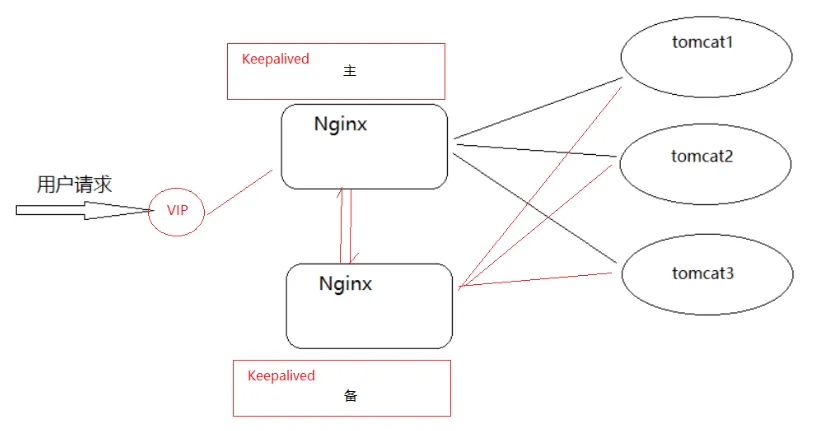

# 集群

## 环境准备

{width="90%"}

1. 准备 tomcat 环境，并在 tomcat 上部署一个 web 项目
2. 准备 nginx 环境，使用 nginx 接收请求，并把请求分发到 tomcat 上

静态资源： `http://192.168.200.146:8080/demo/index.html`

动态资源: `http://192.168.200.146:8080/demo/getAddress`

效果：

{width="90%"}

tomcat 作为后台 web 服务器，在 centos 上准备一个 tomcat

```bash
1.Tomcat官网地址:https://tomcat.apache.org/

2.下载tomcat,本次课程使用的是apache-tomcat-8.5.59.tar.gz

3.将tomcat进行解压缩
mkdir web_tomcat
tar -zxf apache-tomcat-8.5.59.tar.gz -C /web_tomcat

# 服务和页面都已经放在里面了， 直接使用就好了
```

准备一个 web 项目，将其打包为 war 包

```bash
1.将资料中的demo.war上传到tomcat8目录下的webapps包下


2.将tomcat进行启动，进入tomcat8的bin目录下
./startup.sh
```

{width="90%"}

启动 tomcat 进行访问测试

```bash
静态资源: http://192.168.200.146:8080/demo/index.html

动态资源: http://192.168.200.146:8080/demo/getAddress
```

使用 nginx 方向代理，将请求转给 tomcat 进行处理

```nginx
upstream webservice {
	server 192.168.200.146:8080;
}
server{
    listen		80;
    server_name localhost;
    location /demo {
    	proxy_pass http://webservice;
    }
}
```

启动测试

{width="90%"}

可以直接访问，为什么要多加一层

1. 使用 nginx 实现动静分离
2. 使用 nginx 搭建 tomcat 的集群

## 动静分离

动：后台应用程序的业务处理

静：网站的静态资源（html,javaScript,css,images 等文件）

分离：将两者进行分开部署访问，提供用户进行访问

- 静态内容交给 nginx 来处理
- 非静态则交给类似于 tomcat 服务器来部署访问

为什么要动静分离：

- 静态资源交给 nginx 后，可以减轻服务器的访问压力并提高静态资源的访问速度
- 动静分离以后，降低了动态资源和静态资源的耦合度。如果动态资源宕机了也不影响静态资源的展示

**需求分析**

{width="90%"}

配置 nginx 的静态资源与动态资源的访问

```nginx
upstream webservice{
   server 192.168.200.146:8080;
}
server {
        listen       80;
        server_name  localhost;

        #动态资源
        location /demo {
                proxy_pass http://webservice;
        }
        #静态资源
        location ~/.*\.(png|jpg|gif|js){
                root html/web;
                gzip on;
        }

        location / {
            root   html/web;
            index  index.html index.htm;
        }
}
```

## 集群搭建

使用 nginx 和 tomcat 部署项目的时候，使用的是一台 nginx 服务器和一台 tomcat 服务器

{width="90%"}

那么问题来了，如果 Tomcat 的真的宕机了，整个系统就会不完整，所以如何解决上述问题，一台服务器容易宕机，那就多搭建几台 Tomcat 服务器，这样的话就提升了后面的服务器的可用性。这也就是我们常说的集群，搭建 Tomcat 的集群需要用到了 Nginx 的反向代理和赋值均衡的知识，具体如何来实现?我们先来分析下原理

{width="90%"}

**环境准备**

准备三台 tomcat，使用端口进行区分（实际环境应该是三台服务器），修改 server.html，将端口分别修改为 8080,8180,8280

启动 tomcat 并访问测试

```bash
http://192.168.200.146:8080/demo/getAddress
```

{width="90%"}

```bash
http://192.168.200.146:8180/demo/getAddress
```

{width="90%"}

```bash
http://192.168.200.146:8280/demo/getAddress
```

{width="90%"}

在 nginx 对应的配置文件中添加如下内容：

```nginx
upstream webservice{
        server 192.168.200.146:8080;
        server 192.168.200.146:8180;
        server 192.168.200.146:8280;
    }
```

以上已经解决了 tomcat 的高可用性，一台服务器宕机，还有其他两条对外提供服务，同时也可以实现后台服务器的不间断更新。

但是如果 nginx 宕机了，那么整套系统都将停止对外服务，如何解决？

### 高可用方案

{width="90%"}

需要两台以上的 nginx 服务器对外提供服务，这样就能解决其中一台宕机了，另外一台还能对外提供服务

但是如果是两台 nginx 服务器的话，会有两个 ip 地址，用户该访问哪台服务器，用户怎么知道哪台是好的，哪台是宕机了的?

### keepalived

使用 Keepalived 来解决，Keepalived 软件由 C 编写的，最初是专为 LVS 负载均衡软件设计的，Keepalived 软件主要是通过 VRRP 协议实现高可用功能

**vrrp 介绍**

{width="90%"}

VRRP（Virtual Route Redundancy Protocol）协议，翻译过来为虚拟路由冗余协议

VRRP 协议将两台或多台路由器设备虚拟成一个设备，对外提供虚拟路由器 IP，而在路由器组内部，如果实际拥有这个对外的 IP 的路由器工作正常的话就是 MASTER，MASTER 实现只针对虚拟路由器 IP 的各种网络功能

其他设备不拥有该虚拟 IP，状态为 BACKUP，除了接收 MASTER 的 VRRP 状态通告信息以外，不执行对外的网络功能

当主机失效时，backup 将接管原先 master 的网络功能

**这个协议是做什么的**

选择协议

- VRRP 可以把一个虚拟路由器的责任动态分配到局域网上的 VRRP 路由器中的一台
- 其中的虚拟路由即 Virtual 路由是由 VRRP 路由群组创建的一个不真实存在的路由，这个虚拟路由也是有对应的 IP 地址
- 而且 VRRP 路由 1 和 VRRP 路由 2 之间会有竞争选择，通过选择会产生一个 Master 路由和一个 Backup 路由

路由容错协议

- Master 路由和 Backup 路由之间会有一个心跳检测，Master 会定时告知 Backup 自己的状态，如果在指定的时间内，Backup 没有接收到这个通知内容，Backup 就会替代 Master 成为新的 Master
- Master 路由有一个特权就是虚拟路由和后端服务器都是通过 Master 进行数据传递交互的，而备份节点则会直接丢弃这些请求和数据，不做处理，只是去监听 Master 的状态

**解决方案**

{width="90%"}

### 环境搭建

{width="90%"}

keepalived 的安装

::: info 安装
步骤 1:从官方网站下载 keepalived,官网地址https://keepalived.org/

步骤 2:将下载的资源上传到服务器
keepalived-2.0.20.tar.gz

步骤 3:创建 keepalived 目录，方便管理资源
mkdir keepalived

步骤 4:将压缩文件进行解压缩，解压缩到指定的目录
tar -zxf keepalived-2.0.20.tar.gz -C keepalived/

步骤 5:对 keepalived 进行配置，编译和安装
cd keepalived/keepalived-2.0.20
./configure --sysconf=/etc --prefix=/usr/local
make && make install
:::

两个关键文件

- `/etc/keepalived/keepalived.conf` (keepalived 的系统配置文件，我们主要操作的就是该文件)
- 一个是 /usr/local/sbin 目录下的 keepalived，是系统配置脚本，用来启动和关闭 keepalived

### 配置文件

三部分：

- 第一部分是 global 全局配置
- vrrp 相关配置
- lvs 相关配置

这里主要是使用高可用部署，没有用到 lvs

```conf
global全局部分：
global_defs {
   #通知邮件，当keepalived发送切换时需要发email给具体的邮箱地址
   notification_email {
     tom@itcast.cn
     jerry@itcast.cn
   }
   #设置发件人的邮箱信息
   notification_email_from zhaomin@itcast.cn
   #指定smpt服务地址
   smtp_server 192.168.200.1
   #指定smpt服务连接超时时间
   smtp_connect_timeout 30
   #运行keepalived服务器的一个标识，可以用作发送邮件的主题信息
   router_id LVS_DEVEL

   #默认是不跳过检查。检查收到的VRRP通告中的所有地址可能会比较耗时，设置此命令的意思是，如果通告与接收的上一个通告来自相同的master路由器，则不执行检查(跳过检查)
   vrrp_skip_check_adv_addr
   #严格遵守VRRP协议。
   vrrp_strict
   #在一个接口发送的两个免费ARP之间的延迟。可以精确到毫秒级。默认是0
   vrrp_garp_interval 0
   #在一个网卡上每组na消息之间的延迟时间，默认为0
   vrrp_gna_interval 0
}
```

```conf
VRRP部分，该部分可以包含以下四个子模块
1. vrrp_script
2. vrrp_sync_group
3. garp_group
4. vrrp_instance
我们会用到第一个和第四个，
#设置keepalived实例的相关信息，VI_1为VRRP实例名称
vrrp_instance VI_1 {
    state MASTER  		#有两个值可选MASTER主 BACKUP备
    interface ens33		#vrrp实例绑定的接口，用于发送VRRP包[当前服务器使用的网卡名称]
    virtual_router_id 51#指定VRRP实例ID，范围是0-255
    priority 100		#指定优先级，优先级高的将成为MASTER
    advert_int 1		#指定发送VRRP通告的间隔，单位是秒
    authentication {	#vrrp之间通信的认证信息
        auth_type PASS	#指定认证方式。PASS简单密码认证(推荐)
        auth_pass 1111	#指定认证使用的密码，最多8位
    }
    virtual_ipaddress { #虚拟IP地址设置虚拟IP地址，供用户访问使用，可设置多个，一行一个
        192.168.200.222
    }
}
```

**配置内容**

服务器 1：

```conf
global_defs {
   notification_email {
        tom@itcast.cn
        jerry@itcast.cn
   }
   notification_email_from zhaomin@itcast.cn
   smtp_server 192.168.200.1
   smtp_connect_timeout 30
   router_id keepalived1
   vrrp_skip_check_adv_addr
   vrrp_strict
   vrrp_garp_interval 0
   vrrp_gna_interval 0
}

vrrp_instance VI_1 {
    state MASTER
    interface ens33
    virtual_router_id 51
    priority 100
    advert_int 1
    authentication {
        auth_type PASS
        auth_pass 1111
    }
    virtual_ipaddress {
        192.168.200.222
    }
}
```

服务器 2

```conf
! Configuration File for keepalived

global_defs {
   notification_email {
        tom@itcast.cn
        jerry@itcast.cn
   }
   notification_email_from zhaomin@itcast.cn
   smtp_server 192.168.200.1
   smtp_connect_timeout 30
   router_id keepalived2
   vrrp_skip_check_adv_addr
   vrrp_strict
   vrrp_garp_interval 0
   vrrp_gna_interval 0
}

vrrp_instance VI_1 {
    state BACKUP
    interface ens33
    virtual_router_id 51
    priority 90
    advert_int 1
    authentication {
        auth_type PASS
        auth_pass 1111
    }
    virtual_ipaddress {
        192.168.200.222
    }
}ƒ
```

**访问测试**

启动 keepalived 之前，先使用命令 `ip a`, 查看 `192.168.200.133` 和 `192.168.200.122` 这两台服务器的 IP 情况

{width=90%}

分别启动两台服务器的 keepalived

```bash
cd /usr/local/sbin
./keepalived
```

再次通过 `ip a` 查看 ip

{width=90%}

当把`192.168.200.133`服务器上的 keepalived 关闭后，再次查看 ip

{width=90%}

{width=90%}

通过上述的测试，我们会发现，虚拟 IP(VIP) 会在 MASTER 节点上，当 MASTER 节点上的 keepalived 出问题以后，因为 BACKUP 无法收到 MASTER 发出的 VRRP 状态通过信息，就会直接升为 MASTER。VIP 也会"漂移"到新的 MASTER

访问地址 `http://192.168.200.222/`

{width=90%}

如果把`192.168.200.133`服务器的 keepalived 关闭掉，再次访问相同的地址

{width=90%}

效果实现了以后， 我们会发现要想让 vip 进行切换，就必须要把服务器上的 keepalived 进行关闭，而什么时候关闭 keepalived 呢?

应该是在 keepalived 所在服务器的 nginx 出现问题后，把 keepalived 关闭掉，就可以让 VIP 执行另外一台服务器，但是现在这所有的操作都是通过手动来完成的，我们如何能让系统自动判断当前服务器的 nginx 是否正确启动

如果没有，要能让 VIP 自动进行"漂移"，这个问题该如何解决?

### vrrp_script

keepalived 只能做到对网络故障和 keepalived 本身的监控，即当出现网络故障或者 keepalived 本身出现问题时，进行切换。

但是这些还不够，我们还需要监控 keepalived 所在服务器上的其他业务，比如 Nginx,如果 Nginx 出现异常了，仅仅 keepalived 保持正常，是无法完成系统的正常工作的，因此需要根据业务进程的运行状态决定是否需要进行主备切换

这个时候，我们可以通过编写脚本对业务进程进行检测监控

**实现步骤**

在 keepalived 配置文件中添加对应的配置

```conf
vrrp_script 脚本名称
{
    script "脚本位置"
    interval 3 #执行时间间隔
    weight -20 #动态调整vrrp_instance的优先级
}
```

编写脚本

```conf
#!/bin/bash
num=`ps -C nginx --no-header | wc -l`
if [ $num -eq 0 ];then
 /usr/local/nginx/sbin/nginx
 sleep 2
 if [ `ps -C nginx --no-header | wc -l` -eq 0 ]; then
  killall keepalived
 fi
fi

# Linux ps命令用于显示当前进程 (process) 的状态。

# -C(command) :指定命令的所有进程

# --no-header 排除标题
```

为脚本文件设置权限

```bash
chmod 755 ck_nginx.sh
```

将脚本添加到

```conf
vrrp_script ck_nginx {
   script "/etc/keepalived/ck_nginx.sh" #执行脚本的位置
   interval 2		#执行脚本的周期，秒为单位
   weight -20		#权重的计算方式
}
vrrp_instance VI_1 {
    state MASTER
    interface ens33
    virtual_router_id 10
    priority 100
    advert_int 1
    authentication {
        auth_type PASS
        auth_pass 1111
    }
    virtual_ipaddress {
        192.168.200.111
    }
    track_script {
      ck_nginx
    }
}
```

如果效果没有出来，可以使用 `tail -f /var/log/messages` 查看日志信息，找对应的错误信息

通常如果 master 服务死掉后 backup 会变成 master，但是当 master 服务又好了的时候 master 此时会抢占 VIP，这样就会发生两次切换对业务繁忙的网站来说是不好的

所以我们要在配置文件加入 nopreempt 非抢占，但是这个参数只能用于 state 为 backup，故我们在用 HA 的时候最好 master 和 backup 的 state 都设置成 backup 让其通过 priority 来竞争
