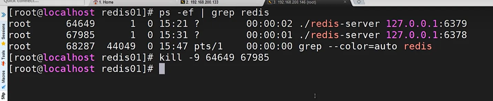

# 负载均衡

早期的网站流量和业务功能都比较简单，单台服务器足以满足基本的需求，但是随着互联网的发展，业务流量越来越大并且业务逻辑也跟着越来越复杂，单台服务器的性能及单点故障问题就凸显出来了，因此需要多台服务器进行性能的水平扩展及避免单点故障出现

{width="90%"}

## 原理与处理流程

系统的拓展可以分为纵向拓展和横向拓展

- 纵向拓展：从单机角度出发，通过增加系统的硬件处理能力来提升服务器的处理能力
- 横向拓展：通过添加机器来满足大型网站服务的处理能力

{width="90%"}

这里涉及到两个重要角色：

- 应用集群：将同一个应用部署到多台机器上，组成处理集群，接收负载均衡设备分发的请求，进行处理并返回响应的数据
- 负载均衡器：将用户访问的请求根据对应的负载均衡算法，分发到集群中的一台机器进行处理

**作用**

1. 解决服务器的高并发能力，提高应用程序的处理性能
2. 提供故障转移，实现高可用
3. 通过添加或减少服务器数量，增强网站的可拓展性
4. 在负载均衡器上进行过滤，可以提高系统的安全性

## 常用处理方式

### 手动选择

较为原始的方法，实现的方式是网站主页上提供不同线路、不同服务连接方式，让用户选择自己访问的具体服务器，来实现负载均衡

{width="50%"}

### dns 轮询

dns：域名系统（服务）协议（dns）是一种分布式网络目录服务，只要用于域名与 ip 地址的相互转换

大多域名注册商都支持对同一个主机名添加多条 A 记录，这就是 dns 轮询，dns 服务器将解析请求按照 A 记录的顺序，随机分配到不同的 IP 上，这样就能完成简单的负载均衡。dns 轮询的成本非常低，在一些不重要的服务器，经常被使用

{width="90%"}

如下是为某一个域名添加多条 A 记录的示例，用两台服务器做负载均衡

{width="90%"}

清空本地 dns 缓存，然后访问域名，可以看到每次访问的 ip 地址都在变化

```bash
ipconfig/flushdns
```

dns 来实现轮询，不需要投入过多的成本，虽然 dns 轮询的成本低，但是 dns 负载均衡存在明显的缺点：

- 可靠性

假设一个域名 dns 轮询多台服务器，如果其中一个服务器发生故障，那么所有访问该服务器的请求都会失败，导致整个服务不可用，即使将服务器的 ip 从 dns 中移除，但是由于各大带宽接入商将众多 dns 存放在缓存中，以节省访问时间，所以 dns 轮询上一定程度解决了负载均衡问题，但是却存在可靠性不高的问题

- 负载均衡不均衡

dns 负载均衡采用的是最简单的轮询负载算法，不能区分服务器的差异，不能反应服务器当前运行状态，不能做到为性能好的服务器多分配请求，另外本地计算机也会缓存已经解析的域名到 ip 地址的映射，这也会导致使用该 dns 服务器的用户在一定时间内访问的是同一台 web 服务器，从而引发负载不均衡

负载不均衡则会导致某几台服务器负载很低，而另外几台服务器负载却很高，处理请求的速度很慢，配置高的服务器分到的请求少，而配置低的服务器分配到的请求多

## 四\/七层负载均衡

了解一个概念，OSI(open system interconnection)，叫开放式系统互联模型，这个是由国际标准化组织 ISO 指定的一个不基于具体机型、操作系统或公司的网络体系结构。该模型将网络通信的工作分为七层

{width="90%"}

应用层：为应用程序提供网络服务

表示层：对数据进行格式化、编码、加密、压缩等

会话层：建立、维护、管理会话连接

传输层：建立、维护、管理端到端的连接，常见的有 tcp/udp

网络层：ip 寻址和路由选择

数据链路层：控制网络层和物理层之间的通信

物理层：比特流传输

所谓四层负载均衡指的是 osi 七层模型中的传输层，主要是基于 ip+port 的负载均衡

```bash
实现四层负载均衡的方式：
硬件：F5（成本高，无法横向扩展） BIG-IP、Radware等
软件：LVS、Nginx、Hayproxy等
```

所谓的七层负载均衡指的是在应用层，主要是基于虚拟的 url 或主机 ip 的负载均衡

```bash
实现七层负载均衡的方式：
软件：Nginx、Hayproxy等
```

两者区别

- 四层负载均衡数据包实在底层就进行了分发，而七层负载均衡数据包则在最顶端进行分发，所以四层负载均衡的效率比七层负载均衡的要高
- 四层负载均衡不识别域名，七层负载均衡识别域名

处理四层和七层负载其实还有二、三层负载均衡，二层实在数据链路层基于 mac 地址来实现负载均衡，三层是在网络层一般采用虚拟 ip 地址的方式实现负载均衡

实际环境采用的模式

```bash
四层负载(LVS)+七层负载(Nginx)
```

## 七层负载均衡

nginx 要实现七层负载均衡需要用到 proxy_pass 代理模块配置，nginx 默认安装支持这个模块，不需要额外的处理

nginx 的负载均衡是在 nginx 的反向代理基础上把用户的请求根据指定的算法分发到一组 `upstream` 虚拟服务池

### upstream 指令

[文档](https://docshome.gitbook.io/nginx-docs/he-xin-gong-neng/http/ngx_http_upstream_module#upstream)

| 语法   | upstream name { ... }; |
| ------ | ---------------------- |
| 默认   | —                      |
| 上下文 | http                   |

**server**

该指令用来指定后端服务器的名称和一些参数，可以使用域名、IP、端口或者 unix socket

| 语法   | server name [parameters]; |
| ------ | ------------------------- |
| 默认   | —                         |
| 上下文 | upstream                  |

{width="90%"}

服务配置

```nginx
server {
    listen   9001;
    server_name localhost;
    default_type text/html;
    location /{
    	return 200 '<h1>192.168.200.146:9001</h1>';
    }
}
server {
    listen   9002;
    server_name localhost;
    default_type text/html;
    location /{
    	return 200 '<h1>192.168.200.146:9002</h1>';
    }
}
server {
    listen   9003;
    server_name localhost;
    default_type text/html;
    location /{
    	return 200 '<h1>192.168.200.146:9003</h1>';
    }
}
```

负载均衡器设置

```nginx
upstream backend{ # 这里的 backend 要和下面的 backend 名字保持一致
	server 192.168.200.146:9091;
	server 192.168.200.146:9092;
	server 192.168.200.146:9093;
}
server {
	listen 8083;
	server_name localhost;
	location /{
		proxy_pass http://backend;
	}
}
```

## 负载均衡状态

| 状态         | 描述                                                                                 |
| ------------ | ------------------------------------------------------------------------------------ |
| down         | 当前的 server 不参与负载均衡                                                         |
| backup       | 当前的 server 作为备用服务器，仅当其他所有的非 backup 的 server 都不可用时，才会启用 |
| max_con      | 允许最大连接数                                                                       |
| max_fails    | 允许最大失败次数                                                                     |
| fail_timeout | 经过 max_fails 失败后，服务暂停时间                                                  |

- down

将该服务器标记为用不可用，那么该代理服务器将不参与负载均衡

```nginx
upstream backend{
	server 192.168.200.146:9001 down;
	server 192.168.200.146:9002
	server 192.168.200.146:9003;
}
server {
	listen 8083;
	server_name localhost;
	location /{
		proxy_pass http://backend;
	}
}
```

该状态一般会对需要停机维护的服务器进行设置

### backup

将该服务器标记为备用服务器，仅当其他所有的非 backup 的 server 都不可用时，才会启用

```nginx
upstream backend{
	server 192.168.200.146:9001 backup;
	server 192.168.200.146:9002
	server 192.168.200.146:9003;
}
```

### max_con

允许最大连接数，默认是 0，表示不限制

### max_fails

允许最大失败次数，默认是 1，表示一次失败后，该服务器将不可用

### fail_timeout

经过 max_fails 失败后，服务暂停时间，默认是 10 秒

```nginx
upstream backend{
	server 192.168.200.133:9001 down;
	server 192.168.200.133:9002 backup;
	server 192.168.200.133:9003 max_fails=3 fail_timeout=15;
}
server {
	listen 8083;
	server_name localhost;
	location /{
		proxy_pass http://backend;
	}
}
```

## 负载均衡策略

介绍完 Nginx 负载均衡的相关指令后，我们已经能实现将用户的请求分发到不同的服务器上，那么除了采用默认的分配方式以外，我们还能采用什么样的负载算法?

Nginx 支持多种负载均衡算法，默认是轮询，除此之外还有以下几种负载均衡算法

- 轮询
- 加权轮询
- ip_hash
- least_conn
- least_time
- hash
- fair

### 轮询

轮询是默认的负载均衡算法，轮询算法将请求按顺序依次分配到不同的服务器上，如果某一台服务器宕机，那么 nginx 会自动将该服务器标记为不可用，并将请求分配到其他可用的服务器上

```nginx
upstream backend{
	server 192.168.200.133:9001;
	server 192.168.200.133:9002;
	server 192.168.200.133:9003;
}
```

### 加权轮询

加权轮询算法是根据服务器的权重来分配请求，权重越大，分配到的请求越多，权重越小，分配到的请求越少

该权重值，主要是针对实际工作环境中不同的后端服务器硬件配置进行调整的，所有此策略比较适合服务器的硬件配置差别比较大的情况

```nginx
upstream backend{
	server 192.168.200.146:9001 weight=10;
	server 192.168.200.146:9002 weight=5;
	server 192.168.200.146:9003 weight=3;
}
server {
	listen 8083;
	server_name localhost;
	location /{
		proxy_pass http://backend;
	}
}
```

### ip_hash

ip_hash 算法是根据客户端的 ip 地址来分配请求，同一个客户端的请求总是被分配到同一台服务器上，这样可以保证同一个客户端的请求总是被分配到同一台服务器上，从而实现会话保持

```nginx
upstream backend{
	ip_hash;
	server 192.168.200.146:9001;
	server 192.168.200.146:9002;
	server 192.168.200.146:9003;
}
```

::: danger 注意
需要额外多说一点的是使用 ip_hash 指令无法保证后端服务器的负载均衡，可能导致有些后端服务器接收到的请求多，有些后端接收到的请求少，而且设置后端服务器权重等方法将不起作用
:::

### least_conn

least_conn 算法是根据后端服务器的连接数来分配请求，连接数越少，分配到的请求越多，连接数越多，分配到的请求越少

```nginx
upstream backend{
	least_conn;
	server 192.168.200.146:9001;
	server 192.168.200.146:9002;
	server 192.168.200.146:9003;
}
```

此负载均衡策略适合请求处理时长不一，造成服务过载的情况

{width="90%"}

### least_time

least_time 算法是根据后端服务器的响应时间来分配请求，响应时间越短，分配到的请求越多，响应时间越长，分配到的请求越少

```nginx
upstream backend{
	least_time;
	server 192.168.200.146:9001;
	server 192.168.200.146:9002;
	server 192.168.200.146:9003;
}
```

### url_hash

url_hash 算法是根据请求的 url 来分配请求，同一个 url 的请求总是被分配到同一台服务器上

同一个资源多次请求，可能会到达不同的服务器上，导致不必要的多次下载，缓存命中率不高，以及一些资源时间的浪费

```nginx
upstream backend{
	url_hash;
	server 192.168.200.146:9001;
	server 192.168.200.146:9002;
	server 192.168.200.146:9003;
}
```

{width="90%"}

### fair

fair 采用的不是内建负载均衡使用的轮换的均衡算法，而是可以根据页面大小、加载时间长短智能的进行负载均衡。那么如何使用第三方模块的 fair 负载均衡策略

```nginx
upstream backend{
	fair;
	server 192.168.200.146:9001;
	server 192.168.200.146:9002;
	server 192.168.200.146:9003;
}
server {
	listen 8083;
	server_name localhost;
	location /{
		proxy_pass http://backend;
	}
}
```

但是如何直接使用会报错，因为 fair 属于第三方模块实现的负载均衡。需要添加 nginx-upstream-fair

下载 nginx-upstream-fair

```bash
git clone https://github.com/gnosek/nginx-upstream-fair.git
```

编译安装

```bash
./configure --add-module=/path/to/nginx-upstream-fair
make
make install
```

编译可能会出现如下错误，ngx_http_upstream_srv_conf_t 结构中缺少 default_port

{width="90%"}

在 Nginx 的源码中 src/http/ngx_http_upstream.h,找到 ngx_http_upstream_srv_conf_s，在模块中添加添加 default_port 属性

{width="90%"}

然后在更新 sbin 文件， upgrade

::: warning 提示
具体使用哪一种需要根据实际的应用场景来决定
:::

## 案例

**一般轮询**

```nginx
upstream backend{
	server 192.168.200.146:9001;
	server 192.168.200.146:9002;
	server 192.168.200.146:9003;
}
server {
	listen 8083;
	server_name localhost;
	location /{
		proxy_pass http://backend;
	}
}
```

**加权轮询**

```nginx
upstream backend{
	server 192.168.200.146:9001 weight=7;
	server 192.168.200.146:9002 weight=5;
	server 192.168.200.146:9003 weight=3;
}
server {
	listen 8083;
	server_name localhost;
	location /{
		proxy_pass http://backend;
	}
}
```

**特定资源负载均衡**

```nginx
upstream videobackend{
	server 192.168.200.146:9001;
	server 192.168.200.146:9002;
}
upstream filebackend{
	server 192.168.200.146:9003;
	server 192.168.200.146:9004;
}
server {
	listen 8084;
	server_name localhost;
	location /video/ {
		proxy_pass http://videobackend;
	}
	location /file/ {
		proxy_pass http://filebackend;
	}
}
```

**不同域名实现负载均衡**

```nginx
upstream itcastbackend{
	server 192.168.200.146:9001;
	server 192.168.200.146:9002;
}
upstream itheimabackend{
	server 192.168.200.146:9003;
	server 192.168.200.146:9004;
}
server {
	listen	8085;
	server_name www.itcast.cn;
	location / {
		proxy_pass http://itcastbackend;
	}
}
server {
	listen	8086;
	server_name www.itheima.cn;
	location / {
		proxy_pass http://itheimabackend;
	}
}
```

**带有 url 重写的负载均衡**

```nginx
upstream backend{
	server 192.168.200.146:9001;
	server 192.168.200.146:9002;
	server 192.168.200.146:9003;
}
server {
	listen	80;
	server_name localhost;
	location /file/ {
		rewrite ^(/file/.*) /server/$1 last;
	}
	location /server {
		proxy_pass http://backend;
	}
}
```

## 四层负载均衡

nginx 在 1.9 之后，增加了一个 stream 模块，用来实现四层协议的转发、代理、负载均衡等

stream 模块的用法跟 http 的用法类似，允许我们配置一组 tcp 或者 udp 等协议的监听，然后通过 proxy_pass 来转发我们的请求，通过 upstream 添加多个后端服务，实现负载均衡

四层负载均衡的实现，一般都会用到 lvs、haproxy、f5 等，要么很贵要么配置很麻烦，而 nginx 的配置先对来说更简单，更能快速完成工作

### 添加 stream 支持

nginx 默认是没有编译这个模块的，需要用到 stream 模块，那么需要在编译的时候加上 --with-stream

完成步骤

1. 将原有/usr/local/nginx/sbin/nginx 进行备份
2. 拷贝 nginx 之前的配置信息
3. 在 nginx 的安装源码进行配置指定对应模块 ./configure --with-stream
4. 通过 make 模板进行编译
5. 将 objs 下面的 nginx 移动到/usr/local/nginx/sbin 下
6. 在源码目录下执行 make upgrade 进行升级，这个可以实现不停机添加新模块的功能

### stream 指令

该指令提供在其中指定流服务器指令的配置文件上下文，和 http 指令同级

| 语法   | stream { ... } |
| ------ | -------------- |
| 默认   | —              |
| 上下文 | main           |

**upstream 指令**

upstream 指令用于定义一组后端服务器，这些服务器将用于负载均衡, stream 里面的这个指令和 http 的 upstream 指令是类似的

| 语法   | upstream name { ... } |
| ------ | --------------------- |
| 默认   | —                     |
| 上下文 | stream                |

案例：

{width="90%"}

准备 redis 服务，在一条服务器上准备 2 个 redis，端口分别为 6379、6378

```bash
make PREFIX=/usr/local/redis/redis01 install
```

拷贝 redis 配置文件 redis.conf 到/usr/local/redis/redis01/bin 目录中

```bash
cp redis.conf	/usr/local/redis/redis01/bin
```

{width="90%"}

redis-cli：客户端可执行二进制文件

redis-server：服务端可执行二进制文件

修改 redis.conf 配置文件，以下两者都在配置文件内修改，然后启动 redis

```conf
port  6379      #redis的端口
daemonize yes   #后台启动redis
```

{width="90%"}

将 redis01 复制一份为 redis02

```bash
cd /usr/local/redis
cp -r redis01 redis02
```

将 redis02 文件文件夹中的 redis.conf 进行修改

```conf
port  6378      #redis的端口
daemonize yes   #后台启动redis
```

分别启动，即可获取两个 Redis, 并查看, 使用 Nginx 将请求分发到不同的 Redis 服务器上

```bash
ps -ef | grep redis
```

如果 win 上面连不上 linux 上的 redis 就设置，目前的 win 的 redis 安装在 tools 下面

{width="90%"}

修改配置文件，这里的意思是只允许 127.0.0.1 来访问，现在要进行修改

{width="90%"}

现在改成 0.0.0.0 就是允许其他服务访问 redis

{width="90%"}

关掉 redis

{width="90%"}

然后分别重启两台 redis

{width="90%"}

然后之前在 win 上面连接不成功的现在可以连接成功

{width="90%"}

在两个 redis 里面存两个值

{width="90%"}

配置 nginx

```nginx
stream {
        upstream redisbackend {
                server 192.168.200.146:6379;
                server 192.168.200.146:6378;
        }
        upstream tomcatbackend {
        		server 192.168.200.146:8080;
        }
        server {
                listen  81;
                proxy_pass redisbackend;
        }
        server {
        		listen	82;
        		proxy_pass tomcatbackend;
        }
}
```

{width="90%"}

可以看到访问 133 的时候，会随机访问到 6379 或者 6378

::: warning 提示
如果七层与四层都存在一个端口的监听，先执行哪一个呢

`四层`,因为四层在七层之前
:::
