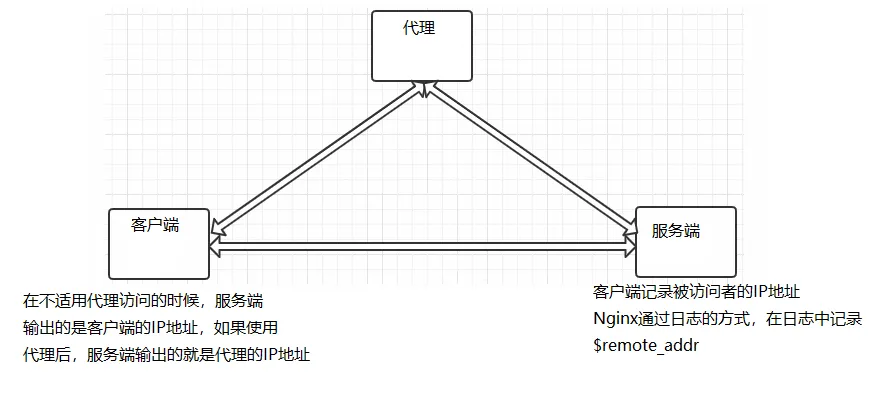
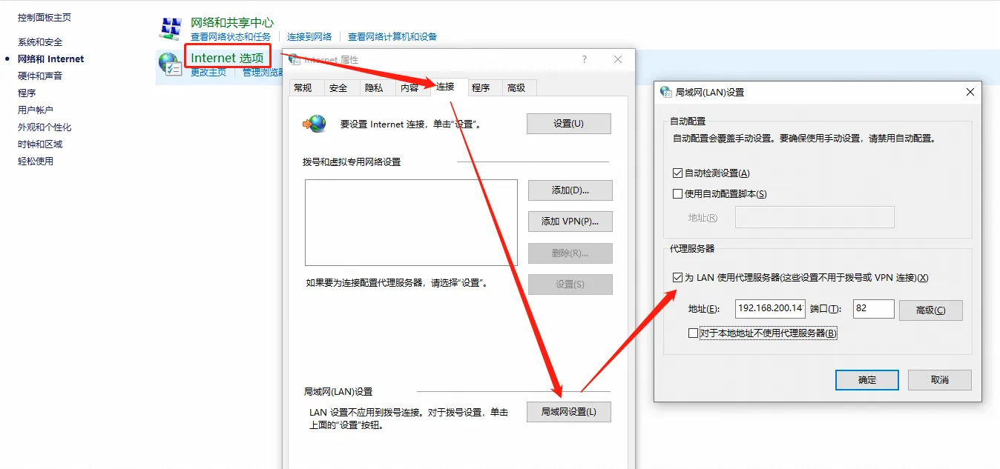
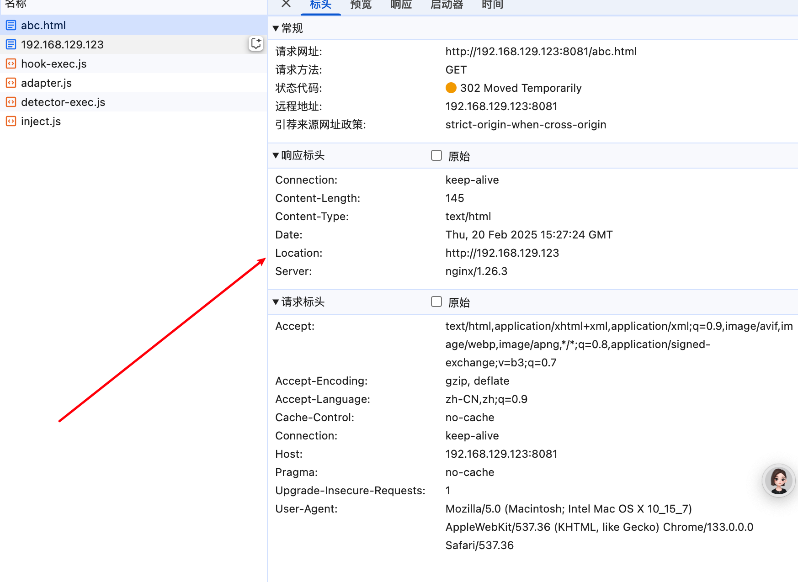
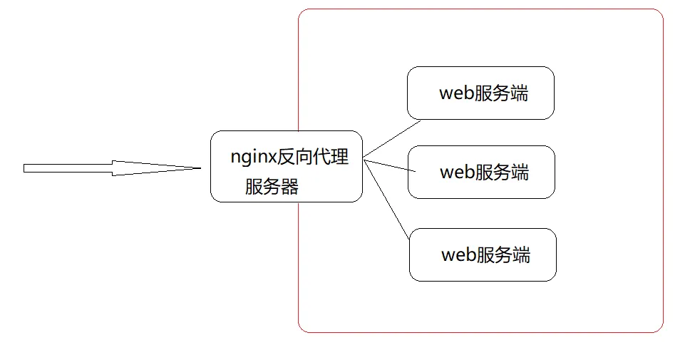
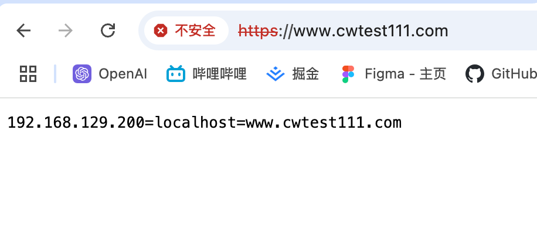

# 反向代理

正向代理代理的对象是客户端，反向代理代理的是服务端

nginx 即可实现正向代理，也可以实现反向代理

{width="90%"}

下面例子就是客户端在本地设置代理，都打到同一台代理服务器上面，访问服务器实际访问代理服务器，代理服务器再代理到真实服务器

服务端的设置

```nginx
http {
  log_format main 'client send request=>clientIp=$remote_addr serverIp=>$host';
	server{
		listen 80;
		server_name	localhost;
		access_log logs/access.log main;
		location {
			root html;
			index index.html index.htm;
		}
	}
}
```

使用客户端访问服务器，打开日志查看结果

{width="90%"}

代理服务器设置

```nginx
server {
        listen  82;
        resolver 8.8.8.8; # 设置 dns 中的 ip 用来解析 proxy_pass 中的域名
        location /{
                proxy_pass http://$host$request_uri;
        }
    }
```

查看代理服务器的 IP（192.168.200.146）和 nginx 配置监听的端口（82）

在客户端配置代理服务器

{width="90%"}

设置完成后，再次通过浏览器访问服务器

{width="90%"}

通过对比上下两次的日志记录，会发现虽然是客户端访问服务器，但使用了代理，那么服务端能看到的只是代理发过去的请求，这样的话就使用 nginx 实现了正向代理的设置

## 基础

nginx 方向代理模块的指令是由 `ngx_http_proxy_module` 模块提供的，该模块是 nginx 的核心模块，已经安装在内，常用指令：

- proxy_pass
- proxy_set_header
- proxy_redirect

### proxy_pass

[官网](https://nginx.org/en/docs/http/ngx_http_proxy_module.html#proxy_pass)

该指令用来设置被代理服务器地址，可以是一个域名，也可以是一个 IP 地址，还可以是一个 IP 地址和端口号的组合

| 语法   | proxy_pass URL; |
| ------ | --------------- |
| 默认   | —               |
| 上下文 | location        |

URL：为要设置的被代理服务器地址，包含传输协议（http、https）、主机名称或 ip 地址加端口号、uri 等要素

**编写 proxy_pass 的时候要不要加 / ？**

```nginx
server {
	listen 80;
	server_name localhost;
	location /{
		#proxy_pass http://192.168.200.146;
		proxy_pass http://192.168.200.146/;
	}
}
# 当客户端访问 http://localhost/index.html,效果是一样的

server{
	listen 80;
	server_name localhost;
	location /server{
		#proxy_pass http://192.168.200.146;
		proxy_pass http://192.168.200.146/;
	}
}
# 当客户端访问 http://localhost/server/index.html
# 这个时候，第一个proxy_pass就变成了http://localhost/server/index.html
# 第二个proxy_pass就变成了http://localhost/index.html效果就不一样了。

#就是如果加上/，请求里面会去掉 server
#比如 /server/in 会变成 //in
```

### proxy_set_header

[官网](https://nginx.org/en/docs/http/ngx_http_proxy_module.html#proxy_set_header)

🌹 [中文网 - 推荐](https://docshome.gitbook.io/nginx-docs/he-xin-gong-neng/http/ngx_http_proxy_module#proxy_set_header)

该指令用来设置被代理服务器请求头信息

| 语法   | proxy_set_header field value;                                            |
| ------ | ------------------------------------------------------------------------ |
| 默认   | proxy_set_header Host $proxy_host; \| proxy_set_header Connection close; |
| 上下文 | http, server, location                                                   |

准备两台虚拟机 `192.168.129.123` 和 `192.168.129.300`

在 `192.168.129.300`

```nginx {28-38}
worker_processes  1;

events {
    worker_connections  1024;
}

http {
    include       mime.types;
    default_type  application/octet-stream;
    sendfile        on;
    keepalive_timeout  65;
    gzip on;                      #开启gzip功能
    gzip_types *;                 #压缩源文件类型,根据具体的访问资源类型设定
    gzip_comp_level 6;    #gzip压缩级别
    gzip_min_length 1024; #进行压缩响应页面的最小长度,content-length
    gzip_buffers 4 16K;   #缓存空间大小
    gzip_http_version 1.1; #指定压缩响应所需要的最低HTTP请求版本
    gzip_vary  on;                #往头信息中添加压缩标识
    gzip_disable "MSIE [1-6]\."; #对IE6以下的版本都不进行压缩
    gzip_proxied  off;  #nginx作为反向代理压缩服务端返回数据的条件
    gzip_static always;

    log_format main '$remote_addr - $remote_user [$time_local] '
                    '"$request" -1- $status -2- $body_bytes_sent '
                    '"$http_referer" -3- "$http_user_agent"';
    access_log logs/access-nginx.log main;

    server {
        default_type text/plain;
        listen 80;
        server_name localhost;

        location /server {
            proxy_pass http://192.168.129.123:80/;
            proxy_set_header username 'TOM';
        }

    }
}
```

在 `192.168.129.123` 上

```nginx {28-37}
worker_processes  1;

events {
    worker_connections  1024;
}

http {
    include       mime.types;
    default_type  application/octet-stream;
    sendfile        on;
    keepalive_timeout  65;
    gzip on;                      #开启gzip功能
    gzip_types *;                 #压缩源文件类型,根据具体的访问资源类型设定
    gzip_comp_level 6;    #gzip压缩级别
    gzip_min_length 1024; #进行压缩响应页面的最小长度,content-length
    gzip_buffers 4 16K;   #缓存空间大小
    gzip_http_version 1.1; #指定压缩响应所需要的最低HTTP请求版本
    gzip_vary  on;                #往头信息中添加压缩标识
    gzip_disable "MSIE [1-6]\."; #对IE6以下的版本都不进行压缩
    gzip_proxied  off;  #nginx作为反向代理压缩服务端返回数据的条件
    gzip_static always;

    log_format main '$remote_addr - $remote_user [$time_local] '
                    '"$request" -1- $status -2- $body_bytes_sent '
                    '"$http_referer" -3- "$http_user_agent"';
    access_log logs/access-nginx.log main;

    server {
        default_type text/plain;
        listen 80;
        server_name localhost;

        location = / {
            return 200 $http_username;
        }

    }
}
```

### proxy_redirect

设置头信息中 `location` 和 `refresh` 的值

[语法](https://nginx.org/en/docs/http/ngx_http_proxy_module.html#proxy_redirect)

`123` 服务器上

```nginx
worker_processes  1;

events {
    worker_connections  1024;
}

http {
    include       mime.types;
    default_type  application/octet-stream;
    sendfile        on;
    keepalive_timeout  65;
    gzip on;                      #开启gzip功能
    gzip_types *;                 #压缩源文件类型,根据具体的访问资源类型设定
    gzip_comp_level 6;    #gzip压缩级别
    gzip_min_length 1024; #进行压缩响应页面的最小长度,content-length
    gzip_buffers 4 16K;   #缓存空间大小
    gzip_http_version 1.1; #指定压缩响应所需要的最低HTTP请求版本
    gzip_vary  on;                #往头信息中添加压缩标识
    gzip_disable "MSIE [1-6]\."; #对IE6以下的版本都不进行压缩
    gzip_proxied  off;  #nginx作为反向代理压缩服务端返回数据的条件
    gzip_static always;

    log_format main '$remote_addr - $remote_user [$time_local] '
                    '"$request" -1- $status -2- $body_bytes_sent '
                    '"$http_referer" -3- "$http_user_agent"';
    access_log logs/access-nginx.log main;

    server {
        listen 8081;
        server_name localhost;
        location / {
            proxy_pass http://192.168.129.200:8081/;
            proxy_redirect http://192.168.129.200 http://192.168.129.123;
        }

        location = /locaitontest.html {
            proxy_pass http://192.168.129.200:8081;
        }
    }

    server {
        listen 80;
        server_name localhost;

        location / {
            proxy_pass http://192.168.129.200/;
        }
    }
}
```

`200` 服务器上

```nginx
worker_processes  1;

events {
    worker_connections  1024;
}

http {
    include       mime.types;
    default_type  application/octet-stream;
    sendfile        on;
    keepalive_timeout  65;
    gzip on;                      #开启gzip功能
    gzip_types *;                 #压缩源文件类型,根据具体的访问资源类型设定
    gzip_comp_level 6;    #gzip压缩级别
    gzip_min_length 1024; #进行压缩响应页面的最小长度,content-length
    gzip_buffers 4 16K;   #缓存空间大小
    gzip_http_version 1.1; #指定压缩响应所需要的最低HTTP请求版本
    gzip_vary  on;                #往头信息中添加压缩标识
    gzip_disable "MSIE [1-6]\."; #对IE6以下的版本都不进行压缩
    gzip_proxied  off;  #nginx作为反向代理压缩服务端返回数据的条件
    gzip_static always;

    log_format main '$remote_addr - $remote_user [$time_local] '
                    '"$request" -1- $status -2- $body_bytes_sent '
                    '"$http_referer" -3- "$http_user_agent"';
    access_log logs/access-nginx.log main;

    server {
        listen 8081;
        server_name localhost;
        if (!-f $request_filename) {
            return 302 http://192.168.129.200;
        }
    }

    server {
        listen 80;
        server_name localhost;
        location / {
            root html;
            index index.html;
        }
    }
}
```

当请求打在 123 上的时候，不使用 `redirect`，会在 location 里面返回真实的服务 ip 地址

```shell
[chenwei@VIVIICHEN-MC1 ~]$ curl -I http://192.168.129.123:8081/locaitontest.html
HTTP/1.1 302 Moved Temporarily
Server: nginx/1.26.3
Date: Thu, 20 Feb 2025 15:22:08 GMT
Content-Type: text/html
Content-Length: 145
Connection: keep-alive
Location: http://192.168.129.200 # 会暴漏真实的地址
```

使用 `redirect` 以后， 会返回代理服务器的地址

比如浏览器输入 `192.168.129.123:8081/abc.html`, 在地址栏显示 `http://192.168.129.123/`

{width="90%"}

效果就是：

```bash
[chenwei@VIVIICHEN-MC1 ~]$ curl -I http://192.168.129.123:8081/test.html
HTTP/1.1 302 Moved Temporarily
Server: nginx/1.26.3
Date: Thu, 20 Feb 2025 15:30:27 GMT
Content-Type: text/html
Content-Length: 145
Connection: keep-alive
Location: http://192.168.129.123
```

## 安全控制

关于 web 服务器的安全是一个较大的话题，里面设计内容很多，nginx 反向代理是如何来提升 web 服务器的安全性呢 ？

### 安全隔离

通过代理分开了客户端到应用程序服务端的连接，实现了安全措施。在反向代理之前设置一个防火墙，仅留一个入口提供代理服务器访问



### ssl

将常用的 http 请求转变成 https 请求，那么这两个之间的区别简单的来说两个都是 http 协议，只不过 https 是身披 ssl 外壳的 http

https 是一种通过计算机网络进行安全通信的传输协议，它经由 http 进行通信，利用 ssl/tls 建立全通信，加密数据包，确保数据的安全性

SSL(Secure Sockets Layer)：安全套接层

TLS(Transport Layer Security)：传输层安全协议

上述这两个视为网络通信提供安全及数据完整性的一种安全协议，tls 和 ssl 在传输层和应用层对网络进行加密

::: warning 总结
http 协议是明文传输数据，存在安全问题，而 https 是加密传输，相当于 http+ssl，并且可以防止流量劫持
:::

### 环境配置

```shell
# 安装 openssl
yum install -y openssl openssl-devel
```

升级 nginx 模块：

```shell
./configure --with-http_ssl_module
make
make install
```

**openssl 生成证书**

先查看系统是否有安装 openssl

```shell
openssl version
```

```shell
mkdir /root/cert
cd /root/cert
openssl genrsa -des3 -out server.key 1024
openssl req -new -key server.key -out server.csr
cp server.key server.key.org
openssl rsa -in server.key.org -out server.key
openssl x509 -req -days 365 -in server.csr -signkey server.key -out server.crt
```

### 相关指令

[文档说明](https://docshome.gitbook.io/nginx-docs/he-xin-gong-neng/http/ngx_http_ssl_module#ssl)

ssl_certificate：为当前这个虚拟主机指定一个带有 PEM 格式证书的证书

ssl_certificate_key：该指令用来指定 PEM secret key 文件的路径

ssl_session_cache：该指令用来配置 SSL 会话的缓存

ssl_session_timeout: 指定客户端可以重用会话参数的时间。

ssl_ciphers：指出允许的密码，密码指定为 openssl 支持的格式

> 可以使用 openssl ciphers 查看 openssl 支持的格式

ssl_prefer_server_ciphers：该指令指定是否服务器密码优先客户端密码

配置

```nginx
server {
        listen 443 ssl;
        server_name localhost;
        ssl_certificate      /root/cert/server.crt;
        ssl_certificate_key  /root/cert/server.key;

        ssl_session_cache    shared:SSL:1m;
        ssl_session_timeout  5m;

        ssl_ciphers  HIGH:!aNULL:!MD5;
        ssl_prefer_server_ciphers  on;

        location / {
                # root   html;
                # index  index.html index.htm;
                default_type text/plain;
                return 200 $server_addr=$server_name=$host;
        }
}
```

网页上的展示

{width="90%"}

## 反向代理系统调优

反向代理值 buffer 和 cache

[文档说明](https://docshome.gitbook.io/nginx-docs/he-xin-gong-neng/http/ngx_http_proxy_module#proxy_buffering)

buffer 翻译过来就是缓冲，cache 翻译过来就是缓存


相同点

1. 两种方式都是用来提供 io 吞吐效率
2. 都是用来提升 nginx 代理的性能

不同点

1. 缓冲主要解决不同设备之间数据传递速度不一致导致的性能低问题，缓冲中的数据一旦此次操作完成后，就可以删除。当多个同样请求打过来，数据没有准备好的时候请求不会再次打入服务器，待数据准备好再统一返回
2. 缓存主要是备份，将代理服务器的数据缓存一份到代理服务器，这样的话客户端再次获取相同数据的时候，就只需要从代理服务器上获取，效率较高，缓存中的数据可以重复使用，缓存中的数据可以重复使用，只有满足特定条件才会删除

proxy_buffering: 用来开启或关闭代理服务器的缓冲区

proxy_buffers: 用来指定单个连接从代理服务器读取响应的缓存区的个数和大小。设置代理缓冲区的数量和大小

proxy_buffer_size: 设置代理缓冲区的大小，用于存储从后端服务器接收到的响应

proxy_busy_buffers_size：当所有缓冲区都被使用时，限制用于保存响应数据的缓冲区的大小，防止内存过度使用

proxy_temp_path：当缓冲区存满后，仍未被 Nginx 服务器完全接受，响应数据就会被临时存放在磁盘文件上，该指令设置文件路径，path 最多设置三层

proxy_temp_file_write_size：用来设置磁盘上缓冲文件的大小

proxy_max_temp_file_size：设置能够保存在临时文件中的响应的最大大小

通用设置：

```nginx
proxy_buffering on;
proxy_buffers 4 32k;
proxy_buffer_size 32k;
proxy_busy_buffers_size 32k;
proxy_temp_file_write_size 32k;
proxy_max_temp_file_size 1024m;
```
