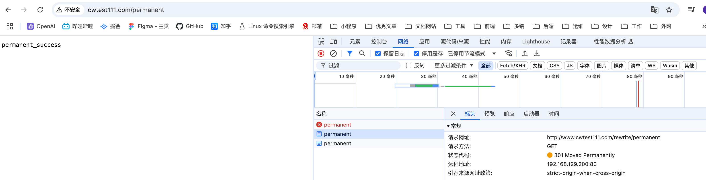

# rewrite

rewrite 是 nginx 服务器提供的一个重要基本功能，是 web 服务器产品中几乎必备功能，主要作用是用来实现 url 的重写

::: warning 说明
Nginx 服务器的 Rewrite 功能的实现依赖于 PCRE 的支持，因此在编译安装 Nginx 服务器之前，需要安装 PCRE 库。

Nginx 使用的是 ngx_http_rewrite_module 模块来解析和处理 Rewrite 功能的相关配置
:::

**重写与转发区别**

1. 地址重写浏览器地址会发生变化而地址转发则不变
2. 一次地址重写会产生两次请求而一次地址转发只会产生一次请求
3. 地址重写到的页面必须是一个完整的地址而地址转发则不需要
4. 地址重写因为是两次请求所以 request 范围内属性不能传递给新页面而地址转发因为是一次请求所以可以传递值

## set

指令用来设置一个新的变量

| 语法   | set $variable value;  |
| ------ | --------------------- |
| 默认值 | 无                    |
| 位置   | server、location 、if |

variable 变量的名称，该变量名称要用 $ 符号开头，不能与 nginx 服务预设的全局变量同名

value 变量的值，该值可以是文本、变量或者它们的组合

## 常用全局变量

| 变量               | 说明                                                                                                                                       |
| ------------------ | ------------------------------------------------------------------------------------------------------------------------------------------ |
| $args              | 变量中存放了请求 url 中的请求指令。比如：`http://www.test.com/index.html?a=1&b=2` ，则 $args 的值为 `a=1&b=2`。功能和 `$query_string` 相同 |
| $http_user_agent   | 变量存储的是用户访问服务的代理信息（如果通过浏览器访问，记录的是浏览器的相关版本信息）                                                     |
| $host              | 变量存储的是访问服务器的 server_name 值                                                                                                    |
| $document_root     | 变量存储的是当前访问地址的 uri，比如 `www.baidu.com/test?a=1` 中的 `/test`，功能和 `$uri` 一样                                             |
| $document_root     | 变量存储的是当前请求对应的 location 的 root 值，如果未设置，默认指向 nginx 自带 html 目录所在位置                                          |
| $content_length    | 变量存储的是请求头中 content_length 值                                                                                                     |
| $content_type      | 变量存储的是请求头中 content_type 值                                                                                                       |
| $http_cookie       | 变量存储的是客户端 cookie 信息，可以通过 add_header Set-Cookie 'xxx=xxx' 来添加 cookie 数据                                                |
| $limit_rate        | 变量中存储的是 nginx 服务器对网络连接速率的限制，也就是 nginx 配置中对 limit_rate 指令设置的值，默认是 0，不限制                           |
| $remote_addr       | 变量存储的是客户端 ip 地址                                                                                                                 |
| $remote_port       | 变量中存储了客户端与服务端建立连接的端口号                                                                                                 |
| $remote_user       | 变量中存储了客户端与服务端建立连接的远程用户名                                                                                             |
| $scheme            | 变量中存储了客户端请求的协议，比如 http、https                                                                                             |
| $request_method    | 变量中存储了客户端请求的 http 方法，比如 GET、POST 等                                                                                      |
| $request_uri       | 变量中存储了客户端请求的 uri 信息，比如 `http://www.test.com/index.html?a=1&b=2` ，则 $request_uri 的值为 `/index.html?a=1&b=2`            |
| $scheme            | 变量中存储了客户端请求的协议，比如 http、https                                                                                             |
| $server_addr       | 变量中存储了服务器的 ip 地址                                                                                                               |
| $server_name       | 变量中存储了服务器的 server_name 值                                                                                                        |
| $server_port       | 变量中存储了服务器的端口号                                                                                                                 |
| $server_protocol   | 变量中存储了服务器的协议，比如 http、https                                                                                                 |
| $request_body_file | 变量中存储了客户端请求的 body 文件，比如 `POST /index.html HTTP/1.1` ，则 $request_body_file 的值为 `/index.html`                          |
| $request_uri       | 变量中存储了客户端请求的 uri 信息，比如 `http://www.test.com/index.html?a=1&b=2` ，则 $request_uri 的值为 `/index.html?a=1&b=2`            |
| $request_filename  | 变量中存储了客户端请求的文件名，比如 `http://www.test.com/index.html?a=1&b=2` ，则 $request_filename 的值为 `/index.html`                  |

在日志中使用

```nginx{23-26}
worker_processes  1;

events {
    worker_connections  1024;
}

http {
    include       mime.types;
    default_type  application/octet-stream;
    sendfile        on;
    keepalive_timeout  65;
    gzip on;                      #开启gzip功能
    gzip_types *;                 #压缩源文件类型,根据具体的访问资源类型设定
    gzip_comp_level 6;    #gzip压缩级别
    gzip_min_length 1024; #进行压缩响应页面的最小长度,content-length
    gzip_buffers 4 16K;   #缓存空间大小
    gzip_http_version 1.1; #指定压缩响应所需要的最低HTTP请求版本
    gzip_vary  on;                #往头信息中添加压缩标识
    gzip_disable "MSIE [1-6]\."; #对IE6以下的版本都不进行压缩
    gzip_proxied  off;  #nginx作为反向代理压缩服务端返回数据的条件
    gzip_static always;

    log_format main '$remote_addr - $remote_user [$time_local] '
                    '"$request" -1- $status -2- $body_bytes_sent '
                    '"$http_referer" -3- "$http_user_agent"';
    access_log logs/access-nginx.log main;

    server{
        listen  8080;
        server_name localhost;
        location /getUser{
                add_header Access-Control-Allow-Origin *;
                add_header Access-Control-Allow-Methods GET,POST,PUT,DELETE;
                default_type application/json;
                return 200 '{"id":1,"name":"TOM","age":18}';
        }
    }
    server{
        listen  80;
        server_name localhost;
        location ~*\.(js|png|jpg|gif){
           valid_referers none blocked *.cwtest111.com  *.baidu.com;
           if ($invalid_referer){
                return 403;
           }
           root /usr/local/nginx/html;
        }
    }
}
```

日志详情

```bash
[root@localhost nginx]# cat logs/access-nginx.log
192.168.129.1 - - [11/Feb/2025:04:21:11 +0800] "GET / HTTP/1.1" -1- 200 -2- 615 "-" -3- "Mozilla/5.0 (Macintosh; Intel Mac OS X 10_15_7) AppleWebKit/537.36 (KHTML, like Gecko) Chrome/131.0.0.0 Safari/537.36"
```

**if**

[if 配置](https://docshome.gitbook.io/nginx-docs/he-xin-gong-neng/http/ngx_http_rewrite_module#if)

```nginx
worker_processes  1;

events {
    worker_connections  1024;
}

http {
    include       mime.types;
    default_type  application/octet-stream;
    sendfile        on;
    keepalive_timeout  65;
    gzip on;                      #开启gzip功能
    gzip_types *;                 #压缩源文件类型,根据具体的访问资源类型设定
    gzip_comp_level 6;    #gzip压缩级别
    gzip_min_length 1024; #进行压缩响应页面的最小长度,content-length
    gzip_buffers 4 16K;   #缓存空间大小
    gzip_http_version 1.1; #指定压缩响应所需要的最低HTTP请求版本
    gzip_vary  on;                #往头信息中添加压缩标识
    gzip_disable "MSIE [1-6]\."; #对IE6以下的版本都不进行压缩
    gzip_proxied  off;  #nginx作为反向代理压缩服务端返回数据的条件
    gzip_static always;

    log_format main '$remote_addr - $remote_user [$time_local] '
                    '"$request" -1- $status -2- $body_bytes_sent '
                    '"$http_referer" -3- "$http_user_agent"';
    access_log logs/access-nginx.log main;

    server {
        listen 80;
        server_name localhost;
        location /server {
            set $name chenwei;
            set $age 28;
            default_type text/plain;
            return 200 $name=$age=$args=$host;
        }

        location / {
            root html;
            default_type text_plain;
            if (!-f $request_filename) {
                return 200 $request_filename;
            }
        }
    }
}
```

当访问 server 的时候

{width="90%"}

当访问资源的时候

{width="90%"}

## if

该指令用来支持条件判断，并根据条件判断结果选择不同的 nginx 配置，if 后面一定要有空格

| 语法   | if (condition) { ... } |
| ------ | ---------------------- |
| 默认值 | 无                     |
| 位置   | server、location       |

condition 条件表达式，该表达式可以是一个变量，也可以是一个字符串，还可以是一个正则表达式

1. 变量名，如果变量名对应为空或者是 0，if 都判断为 false，其余为 true

```nginx
if ($param){
  # 执行的命令
}
```

2. 使用 `=` 和 `!=` 比较变量和字符串是否相等，满足条件为 true，不满足为 false

```nginx
if ($request_method = POST){
	return 405;
}
```

::: danger 注意
此处和 java 不太一样的地方是字符串不需要添加引号
:::

3. 使用正则表达式对变量进行匹配，匹配成功返回 true，不成功返回 false

变量正则表达式之间使用 `~` 或者 `~*` 连接，`~` 表示区分大小写，`~*` 表示不区分大小写

```nginx
if ($http_user_agent ~ MSIE){
  # $http_user_agent的值中是否包含MSIE字符串，如果包含返回true
}
```

::: danger 注意
正则表达式字符串一半不需要加引号，但是如果字符串包含 `}` 或者 `;` 等特殊符号，则需要加引号
:::

4. 使用 `-f` 和 `!-f` 判断文件是否存在，存在返回 true，不存在返回 false

5. 使用 `-d` 和 `!-d` 判断目录是否存在，存在返回 true，不存在返回 false

6. 使用 `-e` 和 `!-e` 判断文件或者目录是否存在，存在返回 true，不存在返回 false

7. 使用 `-x` 和 `!-x` 判断文件是否可执行，存在返回 true，不存在返回 false

## break

该指令用于中断当前相同作用域中的其他 nginx 配置

与该指令处于同一作用域的 nginx 配置中，位于它前面的指令配置生效

并且 break 还有另外一个功能就是终止当前的匹配并把当前的 uri 在本 location 进行重定向访问处理

| 语法   | break;               |
| ------ | -------------------- |
| 默认值 | 无                   |
| 位置   | server、location、if |

以下示例如果进入了 break 会中断这次请求，再次进入 location 走默认的 root 拿到 testbreak/index.html 如果没有这个文件就会报 404 错误

```nginx
worker_processes  1;

events {
    worker_connections  1024;
}

http {
    include       mime.types;
    default_type  application/octet-stream;
    sendfile        on;
    keepalive_timeout  65;
    gzip on;                      #开启gzip功能
    gzip_types *;                 #压缩源文件类型,根据具体的访问资源类型设定
    gzip_comp_level 6;    #gzip压缩级别
    gzip_min_length 1024; #进行压缩响应页面的最小长度,content-length
    gzip_buffers 4 16K;   #缓存空间大小
    gzip_http_version 1.1; #指定压缩响应所需要的最低HTTP请求版本
    gzip_vary  on;                #往头信息中添加压缩标识
    gzip_disable "MSIE [1-6]\."; #对IE6以下的版本都不进行压缩
    gzip_proxied  off;  #nginx作为反向代理压缩服务端返回数据的条件
    gzip_static always;

    log_format main '$remote_addr - $remote_user [$time_local] '
                    '"$request" -1- $status -2- $body_bytes_sent '
                    '"$http_referer" -3- "$http_user_agent"';
    access_log logs/access-nginx.log main;

    server {
        listen 80;
        server_name localhost;
        location /server {
            set $name chenwei;
            set $age 28;
            default_type text/plain;
            return 200 $name=$age=$args=$host;
        }

        location /testbreak {
            default_type text/plain;
            set $username Tom;
            if ($args) {
                set $username Jerry;
                break;
                set $username Rose;
            }
            add_header username $username;
            return 200 $username;
        }

        location / {
            root html;
            default_type text_plain;
            if (!-f $request_filename) {
                return 200 $request_filename;
            }
        }
    }
}
```

## return

该指令用于完成对请求的处理，直接向客户端返回响应状态代码，在 return 后的所有 nginx 配置都是无效的

| 语法   | return code [text]; \| return code URL; \| return URL; |
| ------ | ------------------------------------------------------ |
| 默认值 | 无                                                     |
| 位置   | server、location、if                                   |

code：为返回给客户端的 http 状态

text：为返回给客户端的响应体，支持变量的使用

URL：返回给客户端的 URL 地址，直接返回一个地址和返回 302 + 地址效果是一样的

## rewrite

该指令通过正则表达式的使用来改变 uri，可以同时存在一个或者多个指令，按照顺序依次对 url 进行匹配和处理

| 语法   | rewrite regex replacement [flag]; |
| ------ | --------------------------------- |
| 默认值 | 无                                |
| 位置   | server、location、if              |

regex：正则表达式，用于匹配 uri

replacement：匹配成功后，用于替换 uri 中被截取内容的字符串，如果字符串是以 `http[s]://` 开头，则表示返回给客户端的 url 地址

flag 标志位，用于指定 rewrite 的匹配模式

```nginx
server {
    default_type text/plain;
    listen 80;
    server_name localhost;

    location /rewrite {
        rewrite ^/rewrite/(url)\w*$ https://www.baidu.com;
        rewrite ^/rewrite/(test)\w*$ /$1 last;
        rewrite ^/rewrite/(val)\w*$ /$1 break;
        rewrite ^/rewrite/(redirect)\w*$ /$1 redirect;
        rewrite ^/rewrite/(permanent)\w*$ /$1 permanent;
    }

    location /test {
        return 200 test_success;
    }

    location /val {
        return 200 demo_success;
    }

    location /redirect {
        return 200 redirect_success;
    }

    location /permanent {
        return 200 permanent_success;
    }

}
```

1. last

作用：完成当前的重写操作后，停止在当前 location 内继续执行后续的 rewrite 规则，并重新在当前 server 块内按照其他 location 配置进行匹配和处理

当客户端请求 /rewrite/test 时，rewrite 规则会将其重写为 /test ，然后 Nginx 会停止当前 location 内的后续操作，并根据新的路径 /test 重新在这个 server 块内查找匹配的 location 进行处理


2. break

执行完当前的重写操作后，停止在当前 location 内继续执行后续的 rewrite 规则，但不会重新按照其他 location 配置进行匹配


当客户端请求 /rewrite/val ，重写为 /val 后，不会再执行当前 location 内的其他 rewrite 规则，但是也不会重新去匹配其他 location

3. redirect

执行重写操作后，向客户端返回 302 临时重定向响应，通知客户端使用新的 URL 重新发起请求


当客户端请求 /old/page 时，会收到 302 状态码，并被指示重新向 /new/page 发起请求

4. permanent

执行重写操作后，向客户端返回 301 永久重定向响应，告知客户端以后都使用新的 URL



当客户端请求 /old/page 时，会收到 301 状态码，并被通知以后都应使用 /new/page

## rewrite_log

该指令用于开启或者关闭 rewrite 的日志记录，默认是关闭的

| 语法   | rewrite_log on \| off;     |
| ------ | -------------------------- |
| 默认值 | off                        |
| 位置   | http、server、location、if |

开启后，url 重写的相关日志将以 notice 级别输出到 error_log 指令配置的日志文件汇总

## rewrite 案例

### 独立域名

一个完整的项目包含多个模块，比如购物网站有商品搜索模块、商品详情模块以及购物车模块等，如何为每一个模块设置独立域名？

```nginx
server{
  listen 80;
  server_name search.hm.com;
  rewrite ^(.*) http://www.hm.com/bbs$1 last;
}
server{
  listen 81;
  server_name item.hm.com;
  rewrite ^(.*) http://www.hm.com/item$1 last;
}
server{
  listen 82;
  server_name cart.hm.com;
  rewrite ^(.*) http://www.hm.com/cart$1 last;
}
```

### 目录自动添加/

```nginx
server {
	listen	80;
	server_name localhost;
	location / {
		root html;
		index index.html;
	}
}
```

要想访问上述资源，很简单，只需要通过http://192.168.200.133直接就能访问，地址后面不需要加/,但是如果将上述的配置修改为如下内容:

```nginx
server {
	listen	80;
	server_name localhost;
	location /hm {
		root html;
		index index.html;
	}
}
```

这个时候，要想访问上述资源，按照上述的访问方式，我们可以通过http://192.168.200.133/hm/来访问，但是如果地址后面不加斜杠，页面就会出问题。

如果不加斜杠，Nginx 服务器内部会自动做一个 301 的重定向

重定向的地址会有一个指令叫 server_name_in_redirect on|off; 来决定重定向的地址

1. 如果该指令为 on,重定向的地址为: `http://server_name/目录名/`
2. 如果为 off,重定向的地址为: `http://原URL中的域名/目录名/`

就拿刚才的地址来说，`http://192.168.200.133/hm` 如果不加斜杠，那么按照上述规则，如果指令 server_name_in_redirect 为 on，

则 301 重定向地址变为 `http://localhost/hm/`

如果为 off，则 301 重定向地址变为 `http://192.168.200.133/ht/`

后面这个是正常的，前面地址就有问题

::: danger 注意
注意 server_name_in_redirect 指令在 Nginx 的 0.8.48 版本之前默认都是 on

之后改成了 off，所以现在我们这个版本不需要考虑这个问题，但是如果是 0.8.48 以前的版本并且 server_name_in_redirect 设置为 on
:::

解决方案

```nginx
server {
	listen	80;
	server_name localhost;
	server_name_in_redirect on;
	location /hm {
		if (-d $request_filename){
			rewrite ^/(.*)([^/])$ http://$host/$1$2/ permanent;
		}
	}
}
```

### 防盗链优化

上面有防盗链相关的知识，在 rewrite 中的防盗链和之前讲的原理其实都是一样的，只不过通过 rewrite 可以将防盗链的功能完善下

当出现防盗链的情况，可以使用 rewrite 将请求转发到自定义的一张图片和页面，给用户比较好的提示信息

```nginx
server{
	listen 80;
	server_name www.web.com;
	locatin ~* ^.+\.(gif|jpg|png|swf|flv|rar|zip)${
		valid_referers none blocked server_names *.web.com;
		if ($invalid_referer){
			rewrite ^/ http://www.web.com/images/forbidden.png;
		}
	}
}
```

根据目录实现防盗链配置

```nginx
server{
	listen 80;
	server_name www.web.com;
	location /file/{
		root /server/file/;
		valid_referers none blocked server_names *.web.com;
		if ($invalid_referer){
			# rewrite ^/ http://www.web.com/images/forbidden.png;
			rewrite ^/ /images/forbidden.png;
		}
	}
}
```
