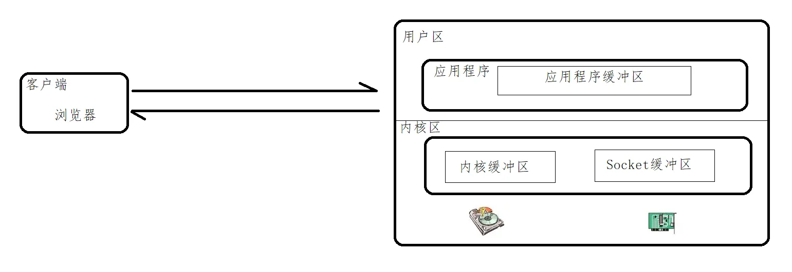
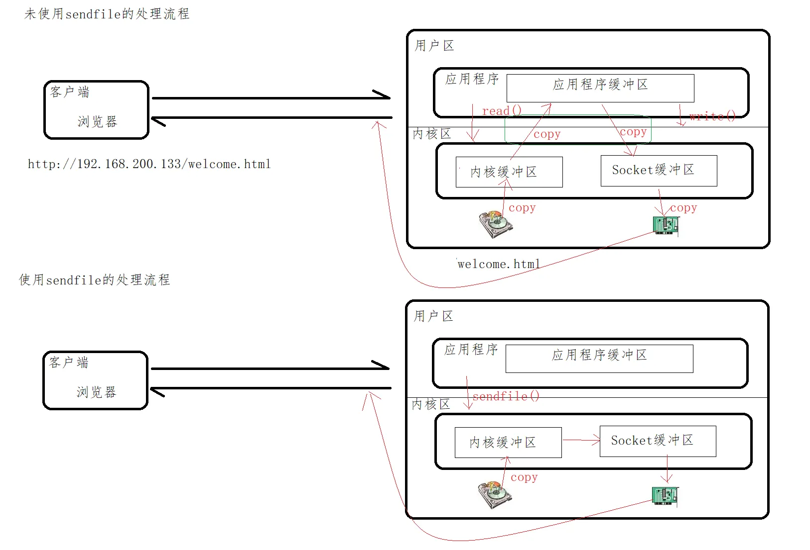
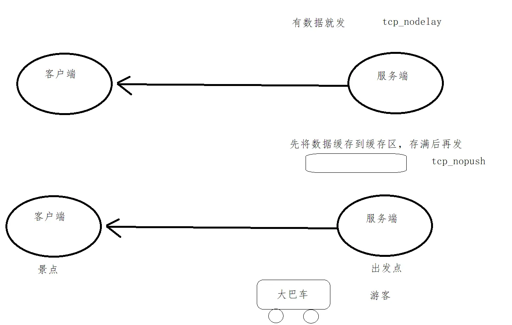
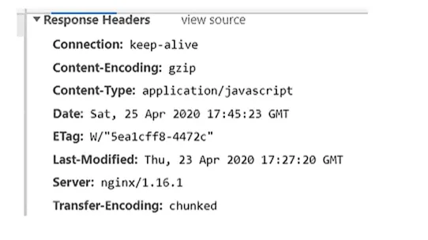
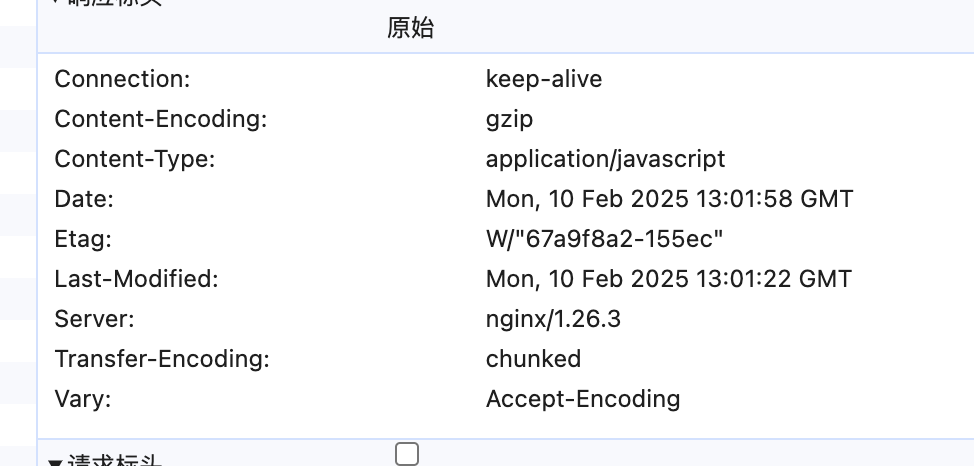
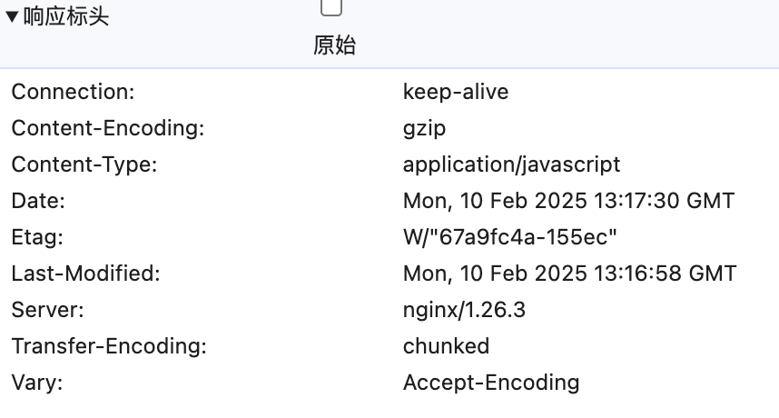
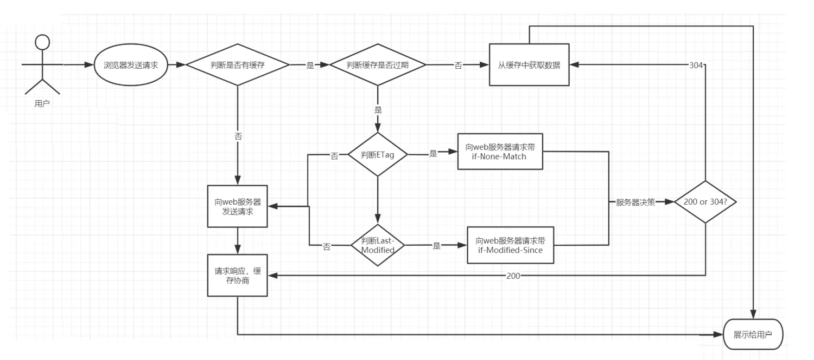
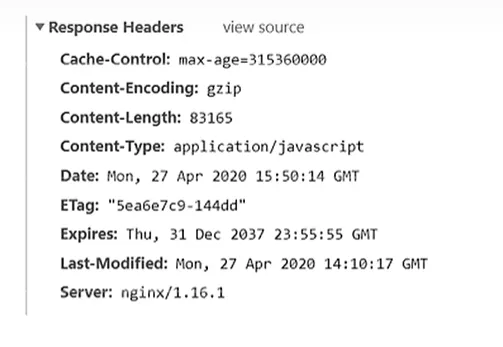
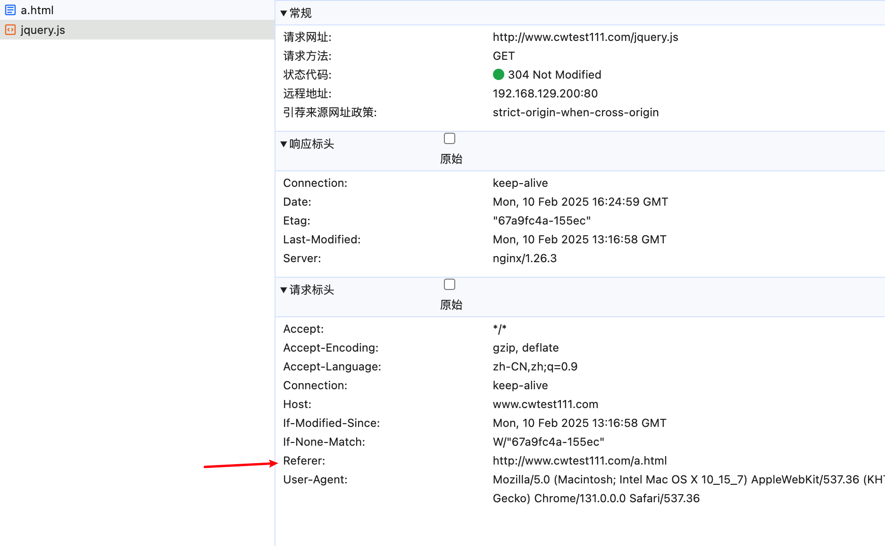

# 静态资源处理

静态资源：在服务器真实存在并且能直接拿来展示的一些文件，比如常见的 html、css、js、图片等。

动态资源：在服务器真是存在但是需要经过一定的业务逻辑处理，根据不同的条件展示在页面不同位置的资源。

nginx 处理静态资源的内容，需要考虑：

1. 静态资源的配置指令
2. 静态资源的配置优化
3. 静态资源的压缩配置指令
4. 静态资源的缓存处理
5. 静态资源的访问控制，包括跨域问题和防盗链问题

## 配置指令

### listen

listen 指令用于指定 nginx 监听的端口和地址。

```nginx
listen 80; # 监听所有IP地址的80端口

# 还可以有其余配置方式如下：

listen 127.0.0.1:80; # 仅监听本地回环地址的80端口
listen 8080; # 监听所有IP地址的8080端口
listen *:80; # 监听所有IP地址的80端口
listen *:8080; # 监听所有IP地址的8080端口
```

**default_server**

default_server 指令用于指定当没有匹配到其他 server 块时，使用当前 server 块作为默认服务器。

```nginx
listen 80 default_server;
# 这个配置的详细意思是：监听所有IP地址的80端口，并将当前server块作为默认服务器，当没有匹配到其他server块时使用。
```

修改本机 hosts 文件，添加如下内容：

```shell
[chenwei@VIVIICHEN-MC1 ~]$ cat /etc/hosts
##
# Host Database
#
# localhost is used to configure the loopback interface
# when the system is booting.  Do not change this entry.
##
127.0.0.1       localhost
255.255.255.255 broadcasthost
::1             localhost
192.168.129.200 cwtest111.com
```

修改 nginx 配置文件，添加如下内容：

```nginx
server{
  listen 8080;
  server_name cwtest111.com;
  location /{
    root html;
    index index.html;
  }
}
server{
  listen 80 default_server;
  default_type text/plain;
  return 444 'This is a error request';
}
```

访问 http://cwtest111.com:8080/ ，可以看到如下内容：

```html
This is a error request
```

访问 http://cwtest111.com:80/ ，可以看到如下内容：

```html
This is a error request
```

他的作用就相当于兜底作用，当没有匹配到其他 server 块时，使用当前 server 块作为默认服务器。

### server_name

server_name 指令用于指定 server 块的名称。

```nginx
server_name cwtest111.com;
```

server_name 指令可以有多个值，多个值之间用空格分隔。

```nginx
server_name cwtest111.com cwtest112.com;
```

配置方式：

1. 精确匹配
2. 通配符匹配
3. 正则表达式匹配

精准匹配详细介绍：

```nginx
server_name cwtest111.com;
```

通配符匹配详细介绍：

1. 星号（\*）：匹配任意字符，但只能匹配一个单词。
2. 点号（.）：匹配任意字符，可以匹配多个单词。
3. 波浪号（~）：匹配正则表达式。

使用通配符不能出现在域名的中间，只能出现在开头和结尾。

```nginx
server_name *.cwtest111.com www.cwtest111.*;
```

使用正则表达式

| 标识 | 说明               | 示例                                                     |
| ---- | ------------------ | -------------------------------------------------------- |
| ^    | 匹配前缀           | `^example` 匹配以 "example" 开头的字符串                 |
| $    | 匹配后缀           | `example$` 匹配以 "example" 结尾的字符串                 |
| ~    | 区分大小写         | `~example` 匹配包含 "example" 的字符串，区分大小写       |
| ~\*  | 不区分大小写       | `~*example` 匹配包含 "example" 的字符串，不区分大小写    |
| !~   | 区分大小写不匹配   | `!~example` 匹配不包含 "example" 的字符串，区分大小写    |
| !~\* | 不区分大小写不匹配 | `!~*example` 匹配不包含 "example" 的字符串，不区分大小写 |

等等.... 与常规的正则表达式一致。

例如以下配置：

```nginx
server{
        listen 80;
        server_name ~^www\.(\w+)\.com$;
        default_type text/plain;
        return 200 "$1  $2 ..";
}
```

访问 `http://www.cwtest111.com` ，可以看到如下内容：

```html
cwtest111 ..
```

**匹配顺序**

由于 server_name 指令可以有多个值，多个值之间用空格分隔，所以 nginx 会按照 server_name 指令的顺序进行匹配，一旦匹配成功，则停止匹配。

假设有如下配置

```nginx
server{
  listen 80;
  server_name ~^www\.\w+\.com$;
  default_type text/plain;
  return 200 'regex_success';
}

server{
  listen 80;
  server_name www.cwtest111.*;
  default_type text/plain;
  return 200 'wildcard_after_success';
}

server{
  listen 80;
  server_name *.cwtest111.com;
  default_type text/plain;
  return 200 'wildcard_before_success';
}

server{
  listen 80;
  server_name www.cwtest111.com;
  default_type text/plain;
  return 200 'exact_success';
}

server{
  listen 80 default_server;
  server_name _;
  default_type text/plain;
  return 444 'default_server not found server';
}
```

访问结果:

1. exact_success
2. wildcard_before_success
3. wildcard_after_success
4. regex_success
5. default_server not found server

因此匹配的顺序是：

1. 精确匹配
2. 通配符匹配:通配符在前面
3. 通配符匹配:通配符在后面
4. 正则表达式匹配
5. 默认服务器

### location

在 Nginx 中，`location` 指令用于根据请求的 URI 来匹配不同的处理规则。

以下是常见的 `location` 匹配模式：

| 模式                 | 含义                                                                               |
| -------------------- | ---------------------------------------------------------------------------------- |
| location = /uri      | = 表示精确匹配，只有完全匹配上才能生效                                             |
| location ^~ /uri     | ^~ 开头对 URL 路径进行前缀匹配，并且在正则之前                                     |
| location ~ pattern   | 开头表示区分大小写的正则匹配                                                       |
| location ~\* pattern | 开头表示不区分大小写的正则匹配                                                     |
| location /uri        | 不带任何修饰符，也表示前缀匹配，但是在正则匹配之后                                 |
| location /           | 通用匹配，任何未匹配到其它 location 的请求都会匹配到此，相当于 switch 中的 default |

前缀匹配时，Nginx 不对 url 做编码，因此请求为 /static/20%/aa，可以被规则 ^~ /static/ /aa 匹配到（注意是空格）

匹配顺序：

1. 精确匹配 =
2. 前缀匹配 ^~
3. 正则表达式匹配 ~
4. 然后不带任何修饰的前缀匹配
5. 通用匹配 /

当有匹配成功的时候，停止匹配，按当前匹配规则处理请求

::: danger 注意
注意：前缀匹配，如果有包含关系时，按最大匹配原则进行匹配。

比如在前缀匹配：location /dir01 与 location /dir01/dir02，

如有请求 `http://localhost/dir01/dir02/file`

将最终匹配到 location /dir01/dir02
:::

示例：

```nginx
[root@localhost nginx]# cat conf/nginx.conf
worker_processes  1;

events {
    worker_connections  1024;
}

http {
    charset utf-8;
    include       mime.types;
    default_type  application/octet-stream;
    sendfile        on;
    keepalive_timeout  65;

    server {
        listen       80;
        server_name  localhost;

        # 通用匹配
        location / {
          root   html;
          index  index.html index.htm;
        }

        # 精确匹配
        location =/test.html {
          root /usr/local/nginx/static/;
        }

        # 正则表达式匹配
        location ~* \.(gif|jpg|jpeg|png|css|js|ico)$ {
          root static/img/;
        }

        # 前缀匹配
        location ^~ /static/ {
          alias static/;
          index index.html inde.htm;
        }
        error_page   500 502 503 504  /50x.html;
        location = /50x.html {
          root   html;
        }
    }
}
```

上面改成这样也是可以的

```nginx
location ^~ /static {
        alias static;
        index index.html inde.htm;
}
```

### root

**环境配置**

目录结构

```shell
[root@localhost nginx]# tree html/ -I 'www'
html/
├── 50x.html
├── index.html
└── test.jpg

0 directories, 3 files
```

配置文件

```nginx
worker_processes  1;

events {
    worker_connections  1024;
}

http {
    include       mime.types;
    default_type  application/octet-stream;
    sendfile        on;
    keepalive_timeout  65;

    server {
        listen 80 default_server;


        server_name localhost;


        error_page 404 /404.html;

        root html;
        index index.html index.htm;

    }
}
```

指定项目根目录，使用 `http/server/location` 指令，可以指定多个，如果 location 没有指定，会往其外层 server、http 中寻找继承

访问 `http://192.168.129.200/test.jpg` 会发现图片已经返回，但是未配置 location

原因是 server 中指定了 root html，所以会去 html 目录下寻找 test.jpg 文件

替换规则：

```shell
http://192.168.129.200  /test.jpg

# 替换为：

/usr/local/nginx/html  /test.jpg
```

更改目录结构

```shell
[root@localhost html]# tree . -I 'www'
.
├── 50x.html
├── index.html
├── static
│   └── test.jpg
└── test.jpg

1 directory, 4 files
```

修改配置

```nginx
worker_processes  1;

events {
    worker_connections  1024;
}

http {
    include       mime.types;
    default_type  application/octet-stream;
    sendfile        on;
    keepalive_timeout  65;

    server {
        listen 80 default_server;


        server_name localhost;

        location ^~ /static {
            root html/static;
        }

        error_page 404 /404.html;

        root html;
        index index.html index.htm;

    }
}
```

当访问 `http://192.168.129.200/static/test.jpg` 时，会发现报错，查看日志发现

```shell
2025/02/10 14:38:10 [error] 13483#0: *207 open() "/usr/local/nginx/html/static/static/test.jpg" failed (2: No such file or directory), client: 192.168.129.1, server: localhost, request: "GET /static/test.jpg HTTP/1.1", host: "192.168.129.200"
```

发现多了一个 static

套用之前的规则

```shell
http://192.168.129.200  /static/test.jpg

# 替换为：

/usr/local/nginx/html/static  /static/test.jpg
```

所以就会多一个 static，导致找不到文件，解决方式是去掉 static,或者使用 alias 指令

```nginx
location ^~ /static {
            root html;
        }
```

**斜杠**

路径后面的 `/` 是否要添加？

location 中 static 后面的斜杠，和匹配后的 url 有关

root 后面的斜杠

```nginx
location ^~ /static {
    root html/;
}
```

访问 `http://192.168.129.200/static/test.jpg` 时，会匹配到 location ^~ /static，然后替换为 `/usr/local/nginx/html//static/test.jpg`

`发现还是可以正常的访问，所以 root 后面的斜杠可以不加`

### alias

对于 root，只要把 root 地址替换 host 后就是文件在硬盘地址(真实地址)

对于 alias，它并不是替换匹配后的 url 地址，而是替换部分的 url，alias 多书写位置是 `location` 中

比如上面的双 static 的配置，如果使用 alias 指令，则可以这样配置

```nginx
location ^~ /static {
    alias static;
}
```

整个过程解析

| 过程                                           | 模式                                           |
| ---------------------------------------------- | ---------------------------------------------- |
| 访问 `http://192.168.129.200/static/test.jpg`  | 匹配到 location ^~ /static                     |
| 替换为 `/usr/local/nginx/html/static/test.jpg` | 替换为 `/usr/local/nginx/html/static/test.jpg` |

是将 `/static` 替换为 `/usr/local/nginx/html/static`

而不是像 root 那样，将 `/static` 拼接为 `/usr/local/nginx/html/static/static`

如果配置是

```nginx
location ^~ /static/ {
    alias static;
}
```

访问 `http://192.168.129.200/static/test.jpg` 时，会匹配到 location ^~ /static/，然后替换为 `/usr/local/nginx/html/statictest.jpg`

导致访问不到，所以 alias 后面的斜杠不能像 root 那样省略

当配置是

```nginx
location ^~ /static {
    alias static/;
}
```

访问 `http://192.168.129.200/static/test.jpg` 时，会匹配到 location ^~ /static，然后替换为 `/usr/local/nginx/html/static//test.jpg`

可以访问， 所以最好是留下 alias 后面的斜杠

root 的规则如下

```shell
location /dir/
root root_path ->  http://host/dir/file.txt  -> root_path/dir/file.txt
```

alias 的规则如下

```shell
location /dir
alias alias_path ->  http://host /dir /file.txt  -> alias_path/file.txt

location /dir/
alias alias_path/ ->  http://host /dir/ file.txt  -> alias_path/file.txt
```

### index

[官方中文地址](https://docshome.gitbook.io/nginx-docs/he-xin-gong-neng/http/ngx_http_index_module#index)

index 后面可以指定多个设置，如果访问的时候没有指定具体访问的资源，则会依次查找，找到第一个为止

```nginx
location / {
  root /usr/local/nginx/html;
  index index.html index.htm;
}
```

访问该 location 的时候，可以通过 `http://ip:port/` ，地址后面如果不添加任何内容，则默认依次访问 index.html 和 index.htm，找到第一个来进行返回

### error_page

[官方中文地址](https://docshome.gitbook.io/nginx-docs/he-xin-gong-neng/http/ngx_http_core_module#error_page)

error_page 指令用于指定当出现错误时，返回的页面

```nginx
error_page 404 /404.html;
```

| 语法   | 说明                   |
| ------ | ---------------------- |
| 默认值 | 无                     |
| 位置   | http、server、location |

当出现对应的 code 后，如何来处理

1. 可以指定具体跳转的地址

```nginx {24}
worker_processes  1;

events {
    worker_connections  1024;
}

http {
    include       mime.types;
    default_type  application/octet-stream;
    sendfile        on;
    keepalive_timeout  65;

    server {
        listen 80 default_server;


        server_name localhost;

        location ^~ /static {
            root html;
        }


        error_page 404 https://www.baidu.com;

        root html;
        index index.html index.htm;

    }
}
```

404 的时候就会跳转到 https://www.baidu.com

2. 可以指定具体返回的网页

{width=90%}

```nginx
error_page 404 /404.html;
```

1. 使用 location 的 @ 符号完成符号信息展示

```nginx {24-28}
worker_processes  1;

events {
    worker_connections  1024;
}

http {
    include       mime.types;
    default_type  application/octet-stream;
    sendfile        on;
    keepalive_timeout  65;

    server {
        listen 80 default_server;


        server_name localhost;

        location ^~ /static {
            root html;
        }


        error_page 404 @jump_to_error;
        location @jump_to_error {
                default_type text/plain;
                return 404 'Not Found Page...';
        }

        root html;
        index index.html index.htm;

    }
}
```

4. 使用 location 的 @ 符号完成信息展示

```nginx
server{
 error_page 404 =200 /50x.html;
 location =/50x.html{
  root html;
 }
}
```

当返回 404 找不到对应的资源的时候，在浏览器上可以看到，最终返回的状态码是 200，这块需要注意下，编写 error_page 后面的内容

::: danger 提示
404 后面需要加空格，200 前面不能加空格
:::

## 静态资源优化配置

从三个属性配置进行优化

1. sendfile on
2. tcp_nopush on
3. tcp_nodelay on

### sendfile

| -      | 说明                                     |
| ------ | ---------------------------------------- |
| 默认值 | off                                      |
| 位置   | http、server、location、location 中的 if |

sendfile 指令用于将文件数据直接从磁盘传输到网络套接字，而不经过应用程序处理。

```nginx
sendfile on;
```

请求静态资源的过程：

1. 用户请求静态资源
2. 服务器接收到请求后，将静态资源从磁盘读取到内存
3. 将内存中的静态资源通过网络套接字发送给用户

{width="90%"}

{width="90%"}

### tcp_nopush

tcp_nopush 指令用于在发送响应头之前将多个小数据包合并为一个大的数据包，以减少网络开销。

必须在 sendfile 开启的情况下，才能使用 tcp_nopush

```nginx
tcp_nopush on;
```

| 属性   | 说明                   |
| ------ | ---------------------- |
| 语法   | tcp_nopush on \| off   |
| 默认值 | off                    |
| 位置   | http、server、location |

### tcp_nodelay

tcp_nodelay 指令用于在发送数据时，禁用 Nagle 算法，以减少延迟。

必须在 keep-alive 开启的情况下，才能使用 tcp_nodelay，来提高网络包传输的实时性

```nginx
tcp_nodelay on;
```

| 属性   | 说明                   |
| ------ | ---------------------- |
| 语法   | tcp_nodelay on \| off  |
| 默认值 | on                     |
| 位置   | http、server、location |

{width="90%"}

::: warning 说明
"tcp_nopush"和”tcp_nodelay“看起来是"互斥的"

那么为什么要将这两个值都打开？

需要知道的是在 linux2.5.9 以后的版本中两者是可以兼容的，三个指令都开启的好处是，sendfile 可以开启高效的文件传输模式，tcp_nopush 开启可以确保在发送到客户端之前数据包已经充分“填满”， 这大大减少了网络开销，并加快了文件发送的速度。

然后，当它到达最后一个可能因为没有“填满”而暂停的数据包时，Nginx 会忽略 tcp_nopush 参数

然后，tcp_nodelay 强制套接字发送数据。

由此可知，TCP_NOPUSH 可以与 TCP_NODELAY 一起设置，它比单独配置 TCP_NODELAY 具有更强的性能。

所以我们可以使用如下配置来优化 Nginx 静态资源的处理
:::

```nginx
sendfile on;
tcp_nopush on;
tcp_nodelay on;
```

## 静态资源压缩实战

在 nginx 的配置文件中可以通过配置 gzip 来对静态资源进行压缩，相关的指令可以配置在 http 块、server 块、location 块中

nginx 可以通过：

1. ngx_http_gzip_module 模块 [官方中文地址](https://docshome.gitbook.io/nginx-docs/he-xin-gong-neng/http/ngx_http_gzip_module#gzip)
2. ngx_http_gunzip_module 模块 [官方中文地址](https://docshome.gitbook.io/nginx-docs/he-xin-gong-neng/http/ngx_http_gunzip_module)
3. ngx_http_gzip_static_module 模块 [官方中文地址](https://docshome.gitbook.io/nginx-docs/he-xin-gong-neng/http/ngx_http_gzip_static_module)

### gzip

gzip 指令用于开启或关闭 gzip 压缩功能。

```nginx
gzip on;
```

| 属性   | 说明                   |
| ------ | ---------------------- |
| 语法   | gzip on \| off         |
| 默认值 | off                    |
| 位置   | http、server、location |

### gzip_types

所选择的值可以从 mime.type 文件中进行查找，也可以使用 \* 代表所有

```nginx
gzip_types text/plain text/css application/json application/x-javascript text/xml application/xml application/xml+rss text/javascript;
```

| 属性   | 说明                   |
| ------ | ---------------------- |
| 语法   | gzip_types mime-type   |
| 默认值 | gzip_types text/html   |
| 位置   | http、server、location |

### gzip_comp_level

gzip_comp_level 指令用于设置 gzip 压缩的级别，级别越高，压缩率越高，但同时也会消耗更多的 CPU 资源。

```nginx
gzip_comp_level 6;
```

| 属性   | 说明                   |
| ------ | ---------------------- |
| 语法   | gzip_comp_level number |
| 默认值 | 1                      |
| 位置   | http、server、location |

### gzip_vary

gzip_vary 指令用于在响应头中添加 Vary: Accept-Encoding 字段，以指示客户端可以使用不同的编码方式来接收资源。

```nginx
gzip_vary on;
```

| 属性   | 说明                   |
| ------ | ---------------------- |
| 语法   | gzip_vary on \| off    |
| 默认值 | off                    |
| 位置   | http、server、location |

不开启的时候



开启的时候


### gzip_buffers

处理请求压缩的缓存区数量和大小

```nginx
gzip_buffers 32 4k;
```

| 属性   | 说明                         |
| ------ | ---------------------------- |
| 语法   | gzip_buffers number size     |
| 默认值 | gzip_buffers 32 4k \| 16 8k; |
| 位置   | http、server、location       |

number：nginx 服务器向系统申请缓存空间个数

size：每个缓存空间的大小

主要实现的是申请 number 个 size 的内存空间

`这个值的设定和服务器的操作系统有关，所以建议此项不设置，使用默认值即可`

### gzip_disable

针对不同种类客户端发起的请求，可以选择性地开启和关闭 gzip 功能

| 属性   | 说明                   |
| ------ | ---------------------- |
| 语法   | gzip_disable regex     |
| 默认值 | 无                     |
| 位置   | http、server、location |

regex：根据客户端的浏览器标志(user-agent)来设置，支持使用正则表达式。指定的浏览器标志不使用 Gzip.该指令一般是用来排除一些明显不支持 Gzip 的浏览器

```nginx
gzip_disable "MSIE [1-6]\.";
# ie 6 以下
```

### gzip_http_version

针对不同的 http 协议版本，可以选择性的开启和关闭 gzip 功能

```nginx
gzip_http_version 1.0;
```

| 属性   | 说明                     |
| ------ | ------------------------ |
| 语法   | gzip_http_version number |
| 默认值 | 1.1                      |
| 位置   | http、server、location   |

`该指令是指定使用 gzip 的 http 最低版本，该指令一般采用默认值即可`

### gzip_min_length

指令针对传输数据的大小，可以选择性的开启和关闭 gzip 功能

gzip 压缩功能对大数据的压缩效果明显，但是如果要压缩的数据比较小的话，可能出现越压缩数据越大的情况

因此需要根据响应内容的大小来决定是否使用 gzip 功能，响应页面的大小可以通过头信息中的 `Content-Length` 来获取

但是如果使用了 chunk 编码动态压缩，该指令将被忽略

建议设置为 1K 或以上

```nginx
gzip_min_length 1000;
```

| 属性   | 说明                   |
| ------ | ---------------------- |
| 语法   | gzip_min_length number |
| 默认值 | 20                     |
| 位置   | http、server、location |

### gzip_proxied

```nginx
gzip_proxied any;
```

| 属性   | 说明                   |
| ------ | ---------------------- |
| 语法   | gzip_proxied string    |
| 默认值 | off                    |
| 位置   | http、server、location |

根据请求和响应，启用或禁用针对代理请求的响应的 gzip。事实上请求被代理取决于 Via 请求头字段是否存在。该指令接受多个参数：

1. off：禁用
2. expired：如果响应头中包含 Expires 字段，则启用
3. no-cache：如果响应头中包含 Cache-Control: no-cache 字段，则启用
4. no-store：如果响应头中包含 Cache-Control: no-store 字段，则启用
5. private：如果响应头中包含 Cache-Control: private 字段，则启用
6. no_last_modified：如果响应头中包含 Last-Modified 字段，则启用
7. no_etag：如果响应头中包含 ETag 字段，则启用
8. auth：如果响应头中包含 Authorization 字段，则启用
9. any：启用

## gzip、senfile 共存问题

开启 sendfile 以后，在读磁盘上的静态资源文件的时候，可以减少拷贝的次数，可以不经过用户进程将静态文件通过网络设备发送出去

但是 gzip 压缩的时候，需要经过用户进程，所以 sendfile 和 gzip 不能共存

可以使用 ngx_http_gzip_static_module 模块的 gzip_static 指令来解决

方案就是始终发送带有 zip 后缀的文件，如果实在没有就用户进程里面压缩

### gzip_static

检查与访问资源同名的 .gz 文件时，response 中以 gzip 相关的 header 返回 .gz 文件的内容

```nginx
gzip_static on;
```

| 属性   | 说明                   |
| ------ | ---------------------- |
| 语法   | gzip_static on \| off  |
| 默认值 | off                    |
| 位置   | http、server、location |

直接配置会报错，`unknown directive "gzip_static"` 主要的原因是 Nginx 默认是没有添加 ngx_http_gzip_static_module 模块

### 手动添加模块

查询当前 nginx 的配置参数，将之前的配置拷贝下来

```bash
[root@localhost nginx]# nginx -V
nginx version: nginx/1.26.3
built by gcc 4.8.5 20150623 (Red Hat 4.8.5-44) (GCC)
configure arguments:
```

将 nginx 安装目录下 sbin 目录中的 nginx 二进制文件进行更名

```bash
cd /usr/local/nginx/sbin
mv nginx nginxold
```

进入 nginx 安装目录

```bash
[root@localhost nginx-1.26.3]# pwd
/opt/nginx/core/nginx-1.26.3
```

执行 make clean 命令，清理之前的编译结果

```bash
make clean
```

使用 configure 来配置参数，将之前的拷贝拼接在这个配置前面

```bash
./configure --with-http_gzip_static_module
```

然后使用 make 命令进行编译

```bash
make
```

将 objs 目录下的 nginx 二进制执行文件移动到 nginx 安装目录下的 sbin 目录中

```bash
mv objs/nginx /usr/local/nginx/sbin/
```

执行更新命令

```bash
make upgrade
```

配置如下

```nginx
worker_processes  1;

events {
    worker_connections  1024;
}

http {
    include       mime.types;
    default_type  application/octet-stream;
    sendfile        on;
    keepalive_timeout  65;
    gzip on;                      #开启gzip功能
    gzip_types *;                 #压缩源文件类型,根据具体的访问资源类型设定
    gzip_comp_level 6;    #gzip压缩级别
    gzip_min_length 1024; #进行压缩响应页面的最小长度,content-length
    gzip_buffers 4 16K;   #缓存空间大小
    gzip_http_version 1.1; #指定压缩响应所需要的最低HTTP请求版本
    gzip_vary  on;                #往头信息中添加压缩标识
    gzip_disable "MSIE [1-6]\."; #对IE6以下的版本都不进行压缩
    gzip_proxied  off;  #nginx作为反向代理压缩服务端返回数据的条件
    gzip_static always;

    server {
        listen 80 default_server;
        server_name localhost;
        root html;
        index index.html index.htm;
    }
}
```

当有 zip 文件的时候返回

{width="90%"}

没有 zip 文件的时候，就自行压缩

{width="90%"}

## 缓存

缓存（cache），原始意义是指访问速度比一般随机存取存储器（RAM）快的一种高速存储器，通常它不像系统主存那样使用 DRAM 技术，而使用昂贵但较快速的 SRAM 技术。

缓存的设置是所有现代计算机系统发挥高性能的重要因素之一

在 Nginx 中，缓存可以分为两种：

1. 客户端缓存：客户端缓存是指浏览器缓存，它可以将静态资源文件缓存到客户端，当客户端再次请求相同的资源时，可以直接从缓存中获取，而不需要从服务器重新下载
2. 代理缓存：代理缓存是指 Nginx 缓存，它可以将静态资源文件缓存到 Nginx 服务器，当客户端请求相同的资源时，可以直接从 Nginx 缓存中获取，而不需要从服务器重新下载

为什么要使用浏览器缓存

1. 成本最低
2. 减少网络贷款消耗
3. 降低服务器压力
4. 加快页面打开速度

http 协议中和页面缓存相关的字段

| header        | 说明                 |
| ------------- | -------------------- |
| Cache-Control | 控制缓存行为         |
| Expires       | 指定缓存过期时间     |
| Last-Modified | 指定资源最后修改时间 |
| Etag          | 指定资源的唯一标识   |

{width="90%"}

### expires

该指令用来控制页面缓存的作用，可以通过该指令控制 http 应答中的 expires 和 cache-control

| 语法   | expires [modified] time; expires epoch \|max \| off; |
| ------ | ---------------------------------------------------- |
| 默认值 | off                                                  |
| 位置   | http、server                                         |

1. expires time; ：设置一个绝对时间，指定资源在客户端缓存中过期的时间。例如，expires 3600; 表示资源在 1 小时后过期。
2. expires modified time; ：根据资源的最后修改时间来计算过期时间。
3. expires epoch; ：设置 Expires 头为 Thu, 01 Jan 1970 00:00:00 GMT ，表示不缓存。
4. expires max; ：设置 Expires 头为 Sun, 17 Jan 2038 19:14:07 GMT ，表示缓存很长时间（通常被解释为 “30 年后”）。
5. expires off; ：不设置 Expires 头和 Cache-Control 头，让客户端自行决定是否缓存

不设置的时候



设置了以后


### add_header

用来添加指定的响应头和响应值

| 语法   | add_header name value; |
| ------ | ---------------------- |
| 默认值 | 无                     |
| 位置   | http、server、location |

如果指定了 always 参数（1.7.5），则无论响应代码为何值，头字段都将被添加

cache-control 作为响应头信息，可以设置如下值

```bash
Cache-control: must-revalidate # 可缓存但必须再向源服务器进行确认

Cache-control: no-cache # 缓存前必须确认其有效性

Cache-control: no-store # 不缓存请求或响应的任何内容

Cache-control: no-transform # 代理不可更改媒体类型

Cache-control: public # 可向任意方提供响应的缓存

Cache-control: private # 仅向特定用户返回响应

Cache-control: proxy-revalidate # 要求中间缓存服务器对缓存的响应有效性再进行确认

Cache-Control: max-age=<seconds> # 响应最大Age值，单位秒

Cache-control: s-maxage=<seconds> # 公共缓存服务器响应的最大Age值，单位秒
```

## 跨域问题解决

同源：协议、域名、端口相同即为同源

创建 html

```bash
[root@localhost html]# cat a.html
<html>
  <head>
        <meta charset="utf-8">
        <title>跨域问题演示</title>
        <script src="jquery.js"></script>
        <script>
            $(function(){
                $("#btn").click(function(){
                        $.get('http://www.cwtest111.com:8080/getUser',function(data){
                                alert(JSON.stringify(data));
                        });
                });
            });
        </script>
  </head>
  <body>
        <input type="button" value="获取数据" id="btn"/>
  </body>
</html>
```

修改配置文件

```nginx{27-28}
worker_processes  1;

events {
    worker_connections  1024;
}

http {
    include       mime.types;
    default_type  application/octet-stream;
    sendfile        on;
    keepalive_timeout  65;
    gzip on;                      #开启gzip功能
    gzip_types *;                 #压缩源文件类型,根据具体的访问资源类型设定
    gzip_comp_level 6;    #gzip压缩级别
    gzip_min_length 1024; #进行压缩响应页面的最小长度,content-length
    gzip_buffers 4 16K;   #缓存空间大小
    gzip_http_version 1.1; #指定压缩响应所需要的最低HTTP请求版本
    gzip_vary  on;                #往头信息中添加压缩标识
    gzip_disable "MSIE [1-6]\."; #对IE6以下的版本都不进行压缩
    gzip_proxied  off;  #nginx作为反向代理压缩服务端返回数据的条件
    gzip_static always;

    server{
        listen  8080;
        server_name localhost;
        location /getUser{
                add_header Access-Control-Allow-Origin *;
                add_header Access-Control-Allow-Methods GET,POST,PUT,DELETE;
                default_type application/json;
                return 200 '{"id":1,"name":"TOM","age":18}';
        }
    }
    server{
        listen  80;
        server_name localhost;
        location /{
                root html;
                index index.html;
        }
    }
}
```

## 静态资源防盗链

资源防盗链指的是内容不在自己服务器上，而是通过技术手段，绕过别人的限制将别人的内容放在自己的页面最终展示给客户

以此盗取大量网站的空间和流量，简而言之就是使用别人的资源，而不用付出相应的成本

**原理**

referer 是 http 请求头中的一个字段，用于指示请求的来源页面

{width="90%"}

后台服务器可以根据取到的这个 referer 信息来判断是否为自己的网站地址

如果不是则返回 403 （服务器拒绝访问）的状态

{width="90%"}

**具体实现**

valid_reffers: nginx 会通过查看 referer 自动和 valid_reffers 后面的内容进行匹配，如果匹配到了就将 $invalid_reffer 变量置 0，如果没有匹配到，则将 $invallid_reffer 变量 置为 1，匹配过程不区分大小写

| 语法   | valid_reffers none\|blocked\|server_names\|string... |
| ------ | ---------------------------------------------------- |
| 默认值 | 无                                                   |
| 位置   | server、location                                     |

none: 如果 header 中没有 referer 字段，则 $invalid_reffer 变量置 0

blocked: 如果 header 中没有 referer 字段，则 $invalid_reffer 变量置 1

server_names: 如果 header 中 referer 字段匹配 server_names 后面的内容，则 $invalid_reffer 变量置 0

string: 如果 header 中 referer 字段匹配 string 后面的内容，则 $invalid_reffer 变量置 0

```nginx
worker_processes  1;

events {
    worker_connections  1024;
}

http {
    include       mime.types;
    default_type  application/octet-stream;
    sendfile        on;
    keepalive_timeout  65;
    gzip on;                      #开启gzip功能
    gzip_types *;                 #压缩源文件类型,根据具体的访问资源类型设定
    gzip_comp_level 6;    #gzip压缩级别
    gzip_min_length 1024; #进行压缩响应页面的最小长度,content-length
    gzip_buffers 4 16K;   #缓存空间大小
    gzip_http_version 1.1; #指定压缩响应所需要的最低HTTP请求版本
    gzip_vary  on;                #往头信息中添加压缩标识
    gzip_disable "MSIE [1-6]\."; #对IE6以下的版本都不进行压缩
    gzip_proxied  off;  #nginx作为反向代理压缩服务端返回数据的条件
    gzip_static always;

    server{
        listen  8080;
        server_name localhost;
        location /getUser{
                add_header Access-Control-Allow-Origin *;
                add_header Access-Control-Allow-Methods GET,POST,PUT,DELETE;
                default_type application/json;
                return 200 '{"id":1,"name":"TOM","age":18}';
        }
    }
    server{
        listen  80;
        server_name localhost;
        location ~*\.(js|png|jpg|gif){
           valid_referers none blocked *.cwtest111.com  *.baidu.com;
           if ($invalid_referer){
                return 403;
           }
           root /usr/local/nginx/html;
        }
    }
}
```

当没有配置 `*.cwtest111.com` 的时候， 访问 `a.html` , `a.html` 再调用 jQuery.js 的时候， 会返回 403 状态码

{width="90%"}

当配置了 `*.cwtest111.com` 的时候， 访问 `a.html` , `a.html` 再调用 jQuery.js 的时候， 会返回 200 状态码

{width="90%"}
