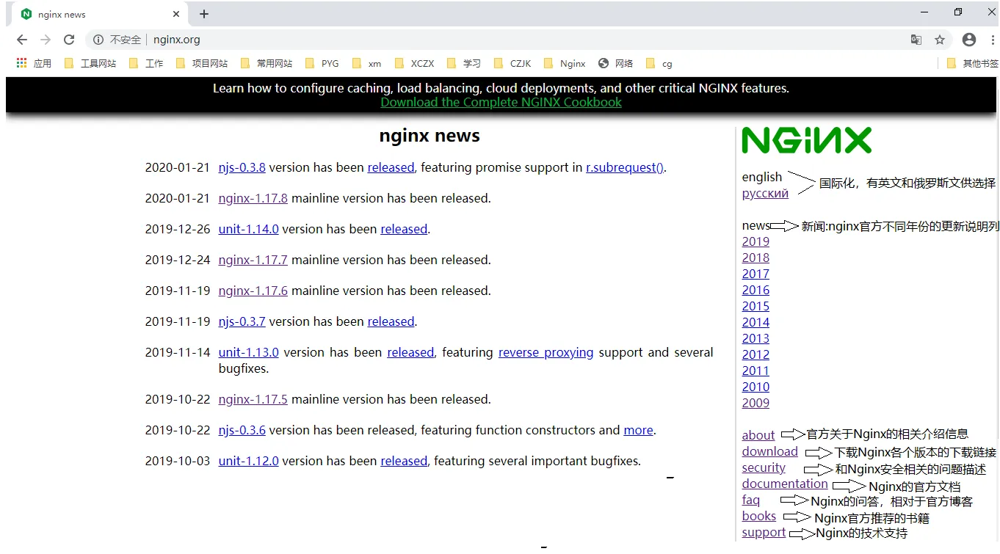
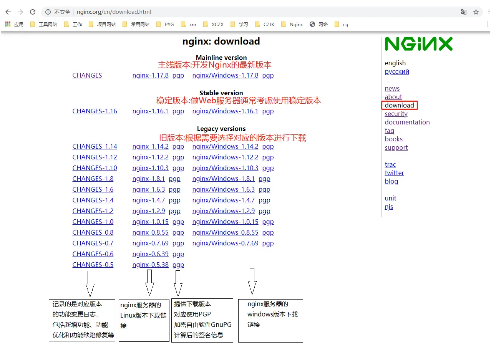
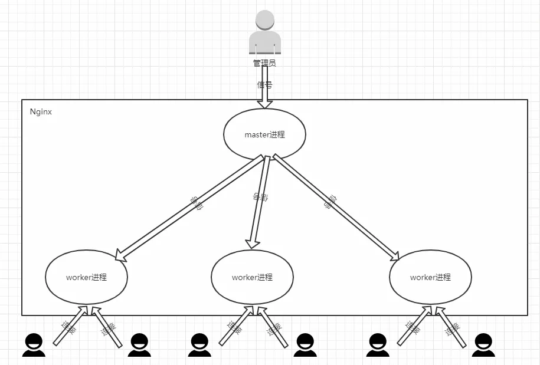

# 开始

- 地址

[nginx 官网](https://nginx.org/)

{width="90%"}

- 下载

[下载](https://nginx.org/en/download.html)

{width="90%"}

[所有版本的下载地址](https://nginx.org/download/)

## 服务器准备

使用 VMware 创建三台虚拟机，并安装 CentOS 7 系统

每台服务器修改 ip 地址

```shell
vim /etc/sysconfig/network-scripts/ifcfg-ens16
```

重启网络

```shell
service network restart
```

查看防火墙规则

```shell
firewall-cmd --list-all
```

如果没有放开 tcp 端口就放开，例如放开 80 端口

```shell
firewall-cmd --zone=public --add-port=80/tcp --permanent
```

重启防火墙

```shell
firewall-cmd --reload
```

## nginx 安装

**安装前准备**

```shell
yum install -y gcc pcre pcre-devel zlib zlib-devel openssl openssl-devel
```

- gcc 是编译器: Nginx 是使用 C 语言编写的程序，因此想要运行 Nginx 就需要安装一个编译工具。GCC 就是一个开源的编译器集合，用于处理各种各样的语言，其中就包含了 C 语言
- pcre 是正则表达式库： Nginx 在编译过程中需要使用到 PCRE 库（perl Compatible Regular Expressoin 兼容正则表达式库)，因为在 Nginx 的 Rewrite 模块和 http 核心模块都会使用到 PCRE 正则表达式语法
- zlib 是压缩库：zlib 库提供了开发人员的压缩算法，在 Nginx 的各个模块中需要使用 gzip 压缩，所以我们也需要提前安装其库及源代码 zlib 和 zlib-devel
- openssl 是加密库：OpenSSL 是一个开放源代码的软件库包，应用程序可以使用这个包进行安全通信，并且避免被窃听

### 源码简单安装

下载

> 目前安装于: /opt/nginx/core

```shell
wget http://nginx.org/download/nginx-1.16.1.tar.gz
```

解压

```shell
tar -zxvf nginx-1.16.1.tar.gz

[root@localhost nginx-1.16.1]# tree -L 1
.
├── auto  # 自动配置脚本， 编译相关脚本
├── CHANGES  # 变更日志
├── CHANGES.ru  # 变更日志
├── conf  # 配置文件
├── configure  # 配置脚本：1. 检测环境及根据环境生成 C 代码 2. 生成编译代码需要的 makefile 文件
├── contrib  # 第三方模块
├── html  # 默认网站目录
├── LICENSE  # 许可证
├── man  # 帮助文档
├── README  # 说明文件
└── src  # 源码
```

然后进行安装

```shell
./configure
# ./configure：这个命令用于配置 Nginx 的编译环境。它会检查系统环境，生成适合当前系统的 Makefile 文件，并根据用户的配置选项决定哪些模块需要编译。通过这个命令，你可以指定 Nginx 的安装路径、启用或禁用某些模块等
make
# make：这个命令用于编译 Nginx 源代码。它会根据上一步生成的 Makefile 文件，使用 gcc 编译器将源代码编译成可执行文件。编译完成后，会生成 Nginx 的可执行文件，通常位于 objs 目录下
make install
# make install：这个命令用于安装 Nginx。它会根据上一步生成的 Makefile 文件，将 Nginx 的可执行文件安装到指定目录，通常是 /usr/local/nginx/sbin 目录下。安装完成后，你就可以通过这个路径来启动和停止 Nginx 服务了
```

### yum 简单安装

安装 yum-utils

```shell
yum install -y yum-utils
```

安装 nginx

```shell
yum install -y nginx
```

查看 nginx 的安装位置

```shell
whereis nginx

# 它会查找特定程序（在这里是 nginx）的可执行文件、源码文件以及手册页面的安装路径
```

如果查找所有文件，如配置文件地址

```shell
sudo find / -name "*nginx*"
```

### 源码复杂安装

将参数附加到执行 ./configure 命令中

- PATH: 路径相关的配置信息
- with: 指定编译哪些模块
- without: 指定不编译哪些模块

配置：

--prefix=PATH 指向 nginx 的安装目录，默认值: /usr/local/nginx

--sbin-path=PATH 指向 nginx 的可执行文件，默认值: `<prefix>/sbin/nginx`

--conf-path=PATH 指向 nginx 的配置文件，默认值: `<prefix>/conf/nginx.conf`

--modules-path=PATH 指向 nginx 的模块文件，默认值: `<prefix>/modules`

--pid-path=PATH 指向 nginx 的 pid 文件，默认值: `<prefix>/logs/nginx.pid`

--error-log-path=PATH 指向 nginx 的错误日志文件，默认值: `<prefix>/logs/error.log`

--http-log-path=PATH 指向 nginx 的访问日志文件，默认值: `<prefix>/logs/access.log`

--lock-path=PATH 指向 nginx 的锁文件，默认值: `<prefix>/logs/nginx.lock`

--with-http_ssl_module 启用 SSL 模块，支持 HTTPS 协议

--with-http_sub_module 启用子请求模块，支持反向代理

--with-http_gzip_static_module 启用 gzip 静态压缩模块，支持静态文件压缩

--with-http_stub_status_module 启用状态模块，支持监控 Nginx 状态

--with-pcre 启用 PCRE 库，支持正则表达式

可以通过以下指令安装：

```shell
./configure --prefix=/usr/local/nginx \
--sbin-path=/usr/local/nginx/sbin/nginx \
--modules-path=/usr/local/nginx/modules \
--conf-path=/usr/local/nginx/conf/nginx.conf \
--error-log-path=/usr/local/nginx/logs/error.log \
--http-log-path=/usr/local/nginx/logs/access.log \
--pid-path=/usr/local/nginx/logs/nginx.pid \
--lock-path=/usr/local/nginx/logs/nginx.lock
```

## 卸载

关闭进程

```shell
nginx -s stop
```

删除安装目录

```shell
rm -rf /usr/local/nginx
```

清除编译环境

```shell
make clean

# 相当于移除 Makefile objs 目录
```

## 目录结构分析

以下是源码简单安装的目录结构

```shell
[root@localhost nginx]# pwd
/usr/local/nginx
[root@localhost nginx]# tree
.
├── conf
│   ├── fastcgi.conf # FastCGI 配置文件，定义了与 FastCGI 服务器通信时使用的参数
│   ├── fastcgi.conf.default # fastcgi.conf的备份文件
│   ├── fastcgi_params # FastCGI 参数配置文件，定义了与 FastCGI 服务器通信时使用的参数
│   ├── fastcgi_params.default # fastcgi_params的备份文件
│   ├── koi-utf # 字符编码转换配置文件，用于将 UTF-8 编码转换为日语编码
│   ├── koi-win # 字符编码转换配置文件，用于将 UTF-8 编码转换为日语编码
│   ├── mime.types # 定义了不同 MIME 类型与文件扩展名之间的映射关系
│   ├── mime.types.default # mime.types的备份文件
│   ├── nginx.conf # 主配置文件，定义了 Nginx 的运行参数和模块配置
│   ├── nginx.conf.default # nginx.conf的备份文件
│   ├── scgi_params # SCGI 参数配置文件，定义了与 SCGI 服务器通信时使用的参数
│   ├── scgi_params.default # scgi_params的备份文件
│   ├── uwsgi_params # uWSGI 参数配置文件，定义了与 uWSGI 服务器通信时使用的参数
│   ├── uwsgi_params.default # uwsgi_params的备份文件
│   └── win-utf # 字符编码转换配置文件，用于将 UTF-8 编码转换为 Windows 编码
├── html # 默认网站目录，存放 Nginx 的默认网页文件
│   ├── 50x.html # 50x.html 文件，用于显示 Nginx 的错误页面
│   └── index.html # index.html 文件，用于显示 Nginx 的默认网页
├── logs # 日志目录，存放 Nginx 的日志文件
│   ├── access.log # 访问日志文件，记录了 Nginx 的访问日志
│   └── error.log # 错误日志文件，记录了 Nginx 的错误日志
│   └── index.html # 默认的主页文件，当访问根目录时显示
├── logs # 用于存储 Nginx 的日志文件，包括访问日志和错误日志
└── sbin # nginx: Nginx 的可执行文件，用于启动、停止和管理 Nginx 服务
    └── nginx

4 directories, 18 files
```

## nginx 启停命令

nginx 默认采用的是多进程的方式来工作，当将 nginx 启动后，可以通过 `ps -ef | grep nginx` 查看进程,要想操作 nginx 的 master 进程，就需要获取到 master 进程号的 id

> 比如 2812 就是 master 进程的 id

```shell
[root@linux_review sbin]# ps -ef | grep nginx
root       2812      1  0 22:50 ?        00:00:00 nginx: master process ./nginx
nobody     2813   2812  0 22:50 ?        00:00:00 nginx: worker process
root       2816   2450  0 22:50 pts/0    00:00:00 grep --color=auto nginx
```

nginx 后台进程中包含一个 master 进程和多个 worker 进程，master 进程用于管理 worker 进程，worker 进程用于处理具体的请求。

master 用于管理 worker 进程，包括接受外界的信息，并将接受到的信号发送给各个 worker 进程，监控 worker 进程的状态，当 worker 进程出现异常退出后，会自动重新启动新的 worker 进程

worker 进程用于处理具体的请求，worker 进程是单线程的，每个 worker 进程只有一个线程，所以 worker 进程之间是独立的，互不干扰，当一个 worker 进程出现异常退出后，会自动重新启动新的 worker 进程

{width="90%"}

还有另一种查看 master 进程 id

```shell
cat /usr/local/nginx/logs/nginx.pid
```

### 信号控制

信号列表

| 信号  | 描述                                                           |
| ----- | -------------------------------------------------------------- |
| HUP   | 重新配置文件并使用服务对新配置项生效                           |
| QUIT  | 优雅关闭整个服务                                               |
| TERM  | 快速关闭                                                       |
| INT   | 快速关闭                                                       |
| USR1  | 重新打开日志文件,可以用来进行日志切割                          |
| USR2  | 平滑升级到最新版的 nginx                                       |
| WINCH | 所有子进程不再接收处理新连接，相当于给 work 进程发送 QUIT 指令 |

调用命令为：

```shell
kill -signal master_pid
```

- 发送 TERM/INT 信号给 master 进程，会将 nginx 服务立即关闭

```shell
kill -TERM 2812  or kill -TERM `cat /usr/local/nginx/logs/nginx.pid`
kill -INT 2812  or kill -INT `cat /usr/local/nginx/logs/nginx.pid`
```

- 发送 QUIT 信号给 master 进程，会将 nginx 服务优雅关闭, master 会控制所有 worker 不在接收新的请求,并等待所有子进程处理完当前请求后关闭

```shell
kill -QUIT 2812  or kill -QUIT `cat /usr/local/nginx/logs/nginx.pid`
```

- 发送 HUP 信号给 master 进程，会将 nginx 服务重新加载配置文件, 并使用服务对新配置项生效

```shell
kill -HUP 2812  or kill -HUP `cat /usr/local/nginx/logs/nginx.pid`
```

- 发送 USR1 信号给 master 进程，会将 nginx 服务重新打开日志文件, 可以用来进行日志切割

```shell
kill -USR1 2812  or kill -USR1 `cat /usr/local/nginx/logs/nginx.pid`
```

- 发送 USR2 信号给 master 进程，告诉 master 进程要平滑升级，这个时候，会重新开启对应的 master 进程和 work 进程，整个系统中将会有两个 master 进程，并且新的 master 进程的 PID 会被记录在/usr/local/nginx/logs/nginx.pid 而之前的旧的 master 进程 PID 会被记录在/usr/local/nginx/logs/nginx.pid.oldbin 文件中，接着再次发送 QUIT 信号给旧的 master 进程，让其处理完请求后再进行关闭

```shell
kill -USR2 2812  or kill -USR2 `cat /usr/local/nginx/logs/nginx.pid`
```

- 发送 WINCH 信号给 master 进程,让 master 进程控制不让所有的 work 进程在接收新的请求了，请求处理完后关闭 work 进程。注意 master 进程不会被关闭掉

```shell
kill -WINCH 2812  or kill -WINCH `cat /usr/local/nginx/logs/nginx.pid`
```

### 命令行控制

此方式是通过 Nginx 安装目录下的 sbin 下的可执行文件 nginx 来进行 Nginx 状态的控制

可以通过 nginx -h 来查看都有哪些参数可以用

```shell
[root@linux_review sbin]# ./nginx -h
nginx version: nginx/1.16.1
Usage: nginx [-?hvVtTq] [-s signal] [-c filename] [-p prefix] [-g directives]

Options:
  -?,-h         : this help
  # 显示帮助信息

  -v            : show version and exit
  # 打印版本号信息并退出

  -V            : show version and configure options then exit
  # 打印版本号信息和配置信息并退出

  -t            : test configuration and exit
  # 测试nginx的配置文件语法是否正确并退出

  -T            : test configuration, dump it and exit
  # 测试nginx的配置文件语法是否正确并列出用到的配置文件信息然后退出

  -q            : suppress non-error messages during configuration testing
  # 在配置测试期间禁止显示非错误消息

  -s signal     : send signal to a master process: stop, quit, reopen, reload
  # signal信号，后面可以跟 ：
    # stop[快速关闭，类似于TERM/INT信号的作用]
    # quit[优雅的关闭，类似于QUIT信号的作用]
    # reopen[重新打开日志文件类似于USR1信号的作用]
    # reload[类似于HUP信号的作用]

  -p prefix     : set prefix path (default: /usr/local/nginx/)
  # prefix，指定Nginx的prefix路径，(默认为: /usr/local/nginx/)

  -c filename   : set configuration file (default: /usr/local/nginx/conf/nginx.conf)
  # filename,指定Nginx的配置文件路径,(默认为: conf/nginx.conf)

  -g directives : set global directives out of configuration file
  # 用来补充Nginx配置文件，向Nginx服务指定启动时应用全局的配置

```

## 版本升级与模块新增

如果想对 Nginx 的版本进行更新，或者要应用一些新的模块，最简单的做法就是停止当前的 Nginx 服务，然后开启新的 Nginx 服务。但是这样会导致在一段时间内，用户是无法访问服务器。为了解决这个问题，我们就需要用到 Nginx 服务器提供的平滑升级功能。这个也是 Nginx 的一大特点，使用这种方式，就可以使 Nginx 在 7\*24 小时不间断的提供服务了

::: warning 场景
需求：Nginx 的版本最开始使用的是 Nginx-1.14.2

由于服务升级，需要将 Nginx 的版本升级到 Nginx-1.16.1,

要求 Nginx 不能中断提供服务。
:::

两种方案：

1. 使用 nginx 服务信号完成 nginx 升级
2. 使用 nginx 安装目录的 make 命令完成升级

**环境准备**

准备两个版本安装

使用 nginx 源码安装的方式将前一个安装成功并正确访问

```shell
# 进入安装目录
./configure
make && make install
```

将后一个进行参数配置和编译，不需要进行安装

```shell
进入安装目录
./configure
make
```

### 服务信号升级

将 sbin 下的 nginx 进行备份

```shell
cd /usr/local/nginx/sbin
mv nginx nginxold
```

将 Nginx1.16.1 安装目录编译后的 objs 目录下的 nginx 文件，拷贝到原来/usr/local/nginx/sbin 目录下

```shell
cd ~/nginx/core/nginx-1.16.1/objs
cp nginx /usr/local/nginx/sbin
```

发送信号 USR2 给 Nginx 的 1.14.2 版本对应的 master 进程

```shell
kill -USR2 `more /usr/local/logs/nginx.pid`
```

发送信号 QUIT 给 Nginx 的 1.14.2 版本对应的 master 进程（给旧版本）

```shell
kill -QUIT `more /usr/local/logs/nginx.pid.oldbin`
```

## make 命令升级

将 1.14.2 版本的 sbin 目录下的 nginx 进行备份

```shell
cd /usr/local/nginx/sbin
mv nginx nginxold
```

将 Nginx1.16.1 安装目录编译后的 objs 目录下的 nginx 文件，拷贝到原来/usr/local/nginx/sbin 目录下

进入到安装目录，执行 make upgrade

查看是否更新成功

::: info
在整个过程中，其实 Nginx 是一直对外提供服务的。并且当 Nginx 的服务器启动成功后，我们是可以通过浏览器进行直接访问的，同时我们可以通过更改 html 目录下的页面来修改我们在页面上所看到的内容
:::

## 系统配置

### 配置成系统服务

在`/usr/lib/systemd/system` 目录下添加 nginx.service

```shell
vim /usr/lib/systemd/system/nginx.service
```

```shell
[Unit]
Description=nginx web service
# 服务的简短描述，用于标识服务的目的。在这个例子中，描述为 "nginx web service"，表示这是一个用于运行 Nginx 的 web 服务

Documentation=http://nginx.org/en/docs/
# 提供服务相关文档的链接，通常是官方文档的网址。在这个例子中，指向了 Nginx 的英文文档

After=network.target
# 定义服务依赖的其他服务或单元，在这里指定在 network.target 启动之后再启动这个服务

[Service]
Type=forking
# 指定服务的启动类型。在这里是 forking，表示服务将会以 fork 的方式运行。通常用于那些会以后台守护进程方式运行的服务。

PIDFile=/usr/local/nginx/logs/nginx.pid
# 指定保存主进程的 PID（进程标识符）的文件路径。在这个例子中，指定为 Nginx 的 PID 文件路径。

ExecStartPre=/usr/local/nginx/sbin/nginx -t -c /usr/local/nginx/conf/nginx.conf
# 在实际启动服务之前执行的命令。在这里是运行 Nginx 的测试命令，检查配置文件的语法是否正确

ExecStart=/usr/local/nginx/sbin/nginx
# 启动服务时执行的命令。在这里是直接运行 Nginx。

ExecReload=/usr/local/nginx/sbin/nginx -s reload
# 当执行 systemctl reload 命令时，执行的重新加载配置的命令

ExecStop=/usr/local/nginx/sbin/nginx -s stop
# 停止服务时执行的命令。在这里是通过发送 stop 信号来停止 Nginx

PrivateTmp=true
# 如果设置为 true，表示服务将会在一个独立的临时文件系统中运行，提高安全性。

[Install]
WantedBy=default.target
# 指定服务应该安装到哪个目标中。在这里是 default.target，表示服务会在默认目标启动
```

添加完成后如果权限有问题需要进行权限设置

```shell
chmod 755 /usr/lib/systemd/system/nginx.service
```

使用系统命令操作 nginx

```shell
启动: systemctl start nginx
停止: systemctl stop nginx
重启: systemctl restart nginx
重新加载配置文件: systemctl reload nginx
查看nginx状态: systemctl status nginx
开机启动: systemctl enable nginx
```

### 配置成环境变量

修改 /etc/profile 文件

```shell
vim /etc/profile

# 在最后一行添加
export PATH=$PATH:/usr/local/nginx/sbin
```

执行

```shell
source /etc/profile
```
