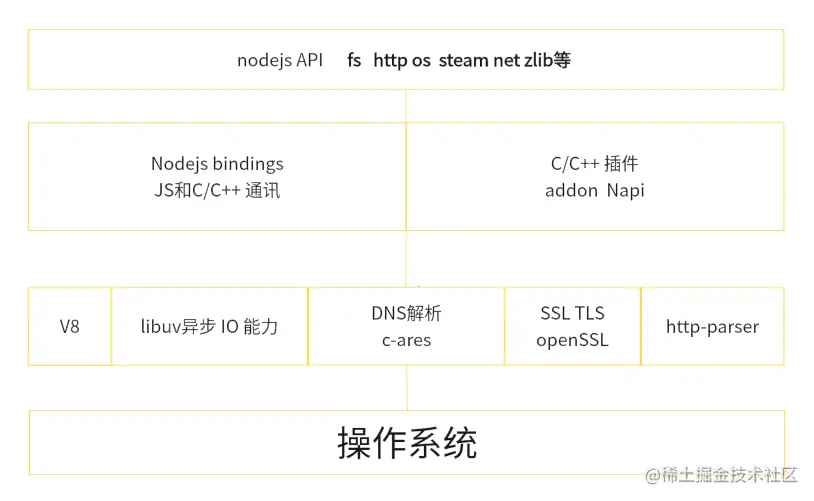
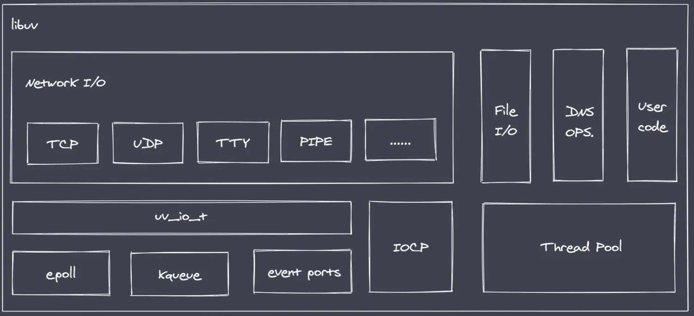

# 简介

::: info
代码位置：codes/node_base/1_info
:::

## 概述

nodejs 并不是 JavaScript 应用，也不是编程语言，因为编程语言使用的 JavaScript,Nodejs 是 JavaScript 的运行时

Nodejs 是构建在 V8 引擎之上的，V8 引擎是由 C/C++编写的，因此我们的 JavaSCript 代码需要由 C/C++转化后再执行

NodeJs 使用异步 I/O 和事件驱动的设计理念，可以高效地处理大量并发请求，提供了非阻塞式 I/O 接口和事件循环机制，使得开发人员可以编写高性能、可扩展的应用程序,异步 I/O 最终都是由 libuv 事件循环库去实现的

nodejs 适合干一些 IO 密集型应用，不适合 CPU 密集型应用，nodejsIO 依靠 libuv 有很强的处理能力，而 CPU 因为 nodejs 单线程原因，容易造成 CPU 占用率高，如果非要做 CPU 密集型应用，可以使用 C++插件编写 或者 nodejs 提供的 cluster。(CPU 密集型指的是图像的处理 或者音频处理需要大量数据结构 + 算法)

- 架构图：



---



## 事件驱动

```javascript
const EventEmitter = require('events')

const myEvent = new EventEmitter()

myEvent.on('event1', () => {
	console.log('event1 被执行了') // 此处会打印
})

myEvent.on('event1', () => {
	console.log('event1 也被执行了') // 此处会打印
})

myEvent.emit('event1')
```

## 单线程

```javascript
// 阻塞 Node 进程，过了4 秒以后才开启服务

const http = require('http')

function sleepTime(time) {
	const sleep = Date.now() + time * 1000
	console.log(1111, sleep)
	while (Date.now() < sleep) {
		console.log(222222)
	}
	return
}
sleepTime(4)

const server = http.createServer((req, res) => {
	res.end('server')
})

server.listen(8080, () => {
	console.log('服务器已经启动')
})
```

## 安装

下载：

```shell
# 下载
curl -o- https://raw.githubusercontent.com/nvm-sh/nvm/v0.38.0/install.sh | bash

# 然后写入环境
source ~/.bashrc
```
