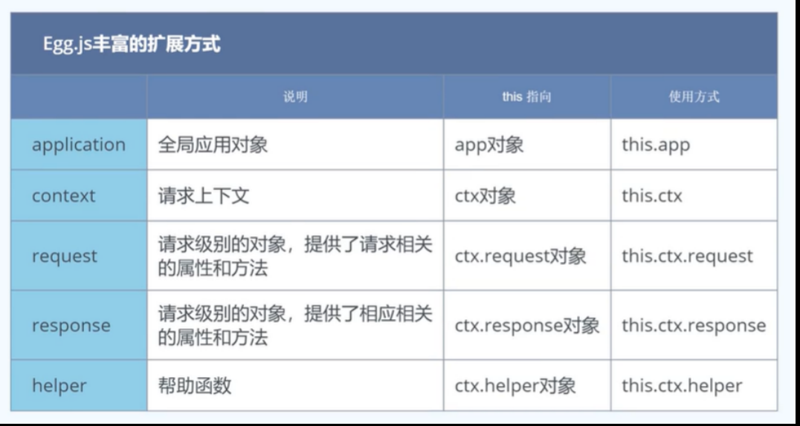
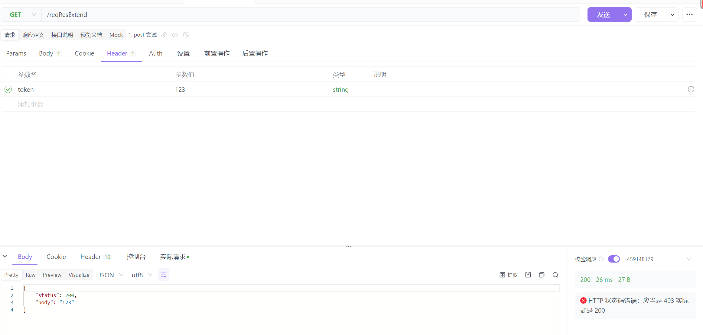

# extend

::: danger 说明
egg 可以对内部的五种对象进行扩展，下图是对 this 执行与挂载位置的整理


:::

## application

此处介绍方法与属性扩展

示例的是当前方法都能获取到当前的时间

::: code-group

```js [application]
// code\egg\app\extend\application.js

module.exports = {
  // 方法扩展
  currentTime() {
    return getTime()
  },

  // 属性扩展
  get timeProp() {
    return getTime()
  },
}

function getTime() {
  const now = new Date()
  const year = now.getFullYear()
  const month = now.getMonth() + 1
  const date = now.getDate()
  const hour = now.getHours()
  const minute = now.getMinutes()
  const second = now.getSeconds()
  const nowTime = `${year}年${month}月${date}日${hour}时${minute}分${second}秒`
  return nowTime
}
```

```js [chen] {14-18}
// code\egg\app\controller\chen.js

const { Controller } = require('egg')

class ChenController extends Controller {
  async index() {
    const { ctx, app } = this
    // ctx.body = '你好，我是陈伟'
    const username = ctx.session.username

    console.log(ctx.session.counter)

    await ctx.render('chen.html', {
      // 方法扩展的调用
      // nowTime: app.currentTime(),

      // 属性扩展的调用
      nowTime: app.timeProp,
      id: 123,
      username,
    })
  }

  async chenTest() {
    const { ctx } = this
    await new Promise(resolve => {
      setTimeout(() => {
        resolve((ctx.body = 'chenTest'))
      }, 5000)
    })
  }

  // 自由传参模式
  async testQuery() {
    const { ctx } = this
    // ctx.body = ctx.query
    const res = await ctx.service.chen.getChen('123') // ctx.service.文件名.class里面的方法
    ctx.body = res
  }

  // 严格传参模式
  async testParams() {
    const { ctx } = this
    ctx.body = `你好，${ctx.params.name}, 你今年 ${ctx.params.age} 岁吗`
  }

  async testPost() {
    const { ctx } = this
    ctx.body = {
      status: 200,
      data: ctx.request.body,
    }
  }

  async add() {
    const { ctx } = this
    // ctx.cookies.set('user', '陈伟', {
    //   maxAge: 1000 * 60,
    //   httpOnly: true, // 浏览器不能访问与修改
    //   encrypt: true, // 加密（加密之前不允许设置成中文的 cookie，但是加密后查看 cookie 打印是 undefined）
    // })
    ctx.session.username = 'chenwei'

    ctx.body = {
      status: 200,
      data: 'Cookie 添加成功',
    }
  }

  async del() {
    const { ctx } = this
    ctx.cookies.set('user', null)
    ctx.session = null

    ctx.body = {
      status: 200,
      data: 'Cookie 删除成功',
    }
  }

  async edit() {
    const { ctx } = this
    // ctx.cookies.set('user', 'chenEdit', {
    //   maxAge: 1000 * 60,
    //   httpOnly: true, // 浏览器不能访问与修改
    //   encrypt: true, // 加密（加密之前不允许设置成中文的 cookie，但是加密后查看 cookie 打印是 undefined）
    // })
    ctx.session.username = 'chenwei1'
    ctx.body = {
      status: 200,
      data: 'Cookie 修改成功',
    }
  }

  async show() {
    const { ctx } = this

    console.log(
      '取到的 cookie：',
      ctx.cookies.get(
        'user',
        { encrypt: true } // 加了这个以后，就可以解密加密后的cookie 能在控制台正常打印中文的 cookie了
      )
    )
    ctx.body = {
      status: 200,
      data: 'Cookie 查看成功',
    }
  }
}

module.exports = ChenController
```

:::

## context

此处介绍的是上下文的扩展

举例是在 ctx 上新增了一个 params 方法

当 GET 请求的时候，拿到 query 上面的内容

当 POST 请求，拿到 body 上面的内容

::: code-group

```js [context]
// code\egg\app\extend\context.js

module.exports = {
  params(key) {
    const method = this.request.method

    if (method === 'GET') {
      return key ? this.query[key] : this.query
    }

    return key ? this.request.body[key] : this.request.body
  },
}
```

```js [chen] {111-116}
// code\egg\app\controller\chen.js

const { Controller } = require('egg')

class ChenController extends Controller {
  async index() {
    const { ctx, app } = this
    // ctx.body = '你好，我是陈伟'
    const username = ctx.session.username

    console.log(ctx.session.counter)

    await ctx.render('chen.html', {
      // 方法扩展的调用
      // nowTime: app.currentTime(),

      // 属性扩展的调用
      nowTime: app.timeProp,
      id: 123,
      username,
    })
  }

  async chenTest() {
    const { ctx } = this
    await new Promise(resolve => {
      setTimeout(() => {
        resolve((ctx.body = 'chenTest'))
      }, 5000)
    })
  }

  // 自由传参模式
  async testQuery() {
    const { ctx } = this
    // ctx.body = ctx.query
    const res = await ctx.service.chen.getChen('123') // ctx.service.文件名.class里面的方法
    ctx.body = res
  }

  // 严格传参模式
  async testParams() {
    const { ctx } = this
    ctx.body = `你好，${ctx.params.name}, 你今年 ${ctx.params.age} 岁吗`
  }

  async testPost() {
    const { ctx } = this
    ctx.body = {
      status: 200,
      data: ctx.request.body,
    }
  }

  async add() {
    const { ctx } = this
    // ctx.cookies.set('user', '陈伟', {
    //   maxAge: 1000 * 60,
    //   httpOnly: true, // 浏览器不能访问与修改
    //   encrypt: true, // 加密（加密之前不允许设置成中文的 cookie，但是加密后查看 cookie 打印是 undefined）
    // })
    ctx.session.username = 'chenwei'

    ctx.body = {
      status: 200,
      data: 'Cookie 添加成功',
    }
  }

  async del() {
    const { ctx } = this
    ctx.cookies.set('user', null)
    ctx.session = null

    ctx.body = {
      status: 200,
      data: 'Cookie 删除成功',
    }
  }

  async edit() {
    const { ctx } = this
    // ctx.cookies.set('user', 'chenEdit', {
    //   maxAge: 1000 * 60,
    //   httpOnly: true, // 浏览器不能访问与修改
    //   encrypt: true, // 加密（加密之前不允许设置成中文的 cookie，但是加密后查看 cookie 打印是 undefined）
    // })
    ctx.session.username = 'chenwei1'
    ctx.body = {
      status: 200,
      data: 'Cookie 修改成功',
    }
  }

  async show() {
    const { ctx } = this

    console.log(
      '取到的 cookie：',
      ctx.cookies.get(
        'user',
        { encrypt: true } // 加了这个以后，就可以解密加密后的cookie 能在控制台正常打印中文的 cookie了
      )
    )
    ctx.body = {
      status: 200,
      data: 'Cookie 查看成功',
    }
  }

  async newContext() {
    const { ctx } = this
    const params = ctx.params('a') // get 打印 query 对象，post 打印 body
    console.log('params:', params)
    ctx.body = 'newContext'
  }
}

module.exports = ChenController
```

```js [router] {28}
// code\egg\app\router.js

/**
 * @param {Egg.Application} app - egg application
 */
module.exports = app => {
  const counter = app.middleware.counter()
  const { router, controller } = app
  router.get('/', controller.home.index)
  router.get('/chenWei', controller.home.chenWei)

  // 新增的控制器
  router.get('/chen', counter, controller.chen.index)
  router.get('/test', controller.chen.chenTest)

  // 传参模式
  router.get('/testQuery', controller.chen.testQuery) // 打印： {"age":"123"}
  router.get('/testParams/:name/:age', controller.chen.testParams) // 如果不传递其中一个，那么就会返回 404 页面

  router.post('/testPost', controller.chen.testPost)

  // cookie 学习
  router.post('/add', controller.chen.add)
  router.post('/del', controller.chen.del)
  router.post('/edit', controller.chen.edit)
  router.post('/show', controller.chen.show)

  router.post('/newContext', controller.chen.newContext)
}
```

:::

如果此处发出 POST 请求，且 params() 里面的参数为 'a'，请求的 body 内容如下：

> 则此处打印： params: 1

```json
{
  "a": 1
}
```

如果此处发出 GET 请求，且 params() 里面的参数为空，请求的地址如下：

`http://127.0.0.1:7001/newContext?name=chenwei`

则此处打印：

```text
params: { name: 'chenwei' }
```

## request

示例是拓展 request 对象，在其上面添加 token 的取值

::: code-group

```js [request]
// code\egg\app\extend\request.js

module.exports = {
  get token() {
    console.log('token', this.get('token'))
    return this.get('token')
  },
}
```

```js [test1]
// code\egg\app\controller\test1.js

const { Controller } = require('egg')

class Test2Controller extends Controller {
  async index() {
    const { ctx, app } = this
    const token = ctx.request.token

    ctx.body = {
      status: 200,
      body: token,
      req: ctx.request,
    }
  }
}

module.exports = Test2Controller
```

```js [router] {30-31}
// code\egg\app\router.js

/**
 * @param {Egg.Application} app - egg application
 */
module.exports = app => {
  const counter = app.middleware.counter()
  const { router, controller } = app
  router.get('/', controller.home.index)
  router.get('/chenWei', controller.home.chenWei)

  // 新增的控制器
  router.get('/chen', counter, controller.chen.index)
  router.get('/test', controller.chen.chenTest)

  // 传参模式
  router.get('/testQuery', controller.chen.testQuery) // 打印： {"age":"123"}
  router.get('/testParams/:name/:age', controller.chen.testParams) // 如果不传递其中一个，那么就会返回 404 页面

  router.post('/testPost', controller.chen.testPost)

  // cookie 学习
  router.post('/add', controller.chen.add)
  router.post('/del', controller.chen.del)
  router.post('/edit', controller.chen.edit)
  router.post('/show', controller.chen.show)

  router.get('/newContext', controller.chen.newContext)

  // res req 的扩展
  router.get('/reqResExtend', controller.test1.index)
}
```

当发送请求的时候，header 里面包含请求头，就会打印出来这个请求头并且返回



:::

## response

这里的示例是：在 response 添加 token 的时候，将这个值添加到响应头上面

::: code-group

```js [response]
// code\egg\app\extend\response.js
module.exports = {
  set token(token) {
    this.set('token', token)
  }
}
```

```js [controller] {17-22}
// code\egg\app\controller\test1.js

const { Controller } = require('egg')

class Test2Controller extends Controller {
  async index() {
    const { ctx, app } = this
    const token = ctx.request.token

    ctx.body = {
      status: 200,
      body: token,
      req: ctx.request,
    }
  }

  async newResponse() {
    const { ctx} = this
    ctx.response.token = 'chenWei0806'
    ctx.body = 'newResponse'
  }
}

module.exports = Test2Controller
```

```js [router] {30}
/**
 * @param {Egg.Application} app - egg application
 */
module.exports = app => {
  const counter = app.middleware.counter()
  const { router, controller } = app
  router.get('/', controller.home.index)
  router.get('/chenWei', controller.home.chenWei)

  // 新增的控制器
  router.get('/chen', counter, controller.chen.index)
  router.get('/test', controller.chen.chenTest)

  // 传参模式
  router.get('/testQuery', controller.chen.testQuery) // 打印： {"age":"123"}
  router.get('/testParams/:name/:age', controller.chen.testParams) // 如果不传递其中一个，那么就会返回 404 页面

  router.post('/testPost', controller.chen.testPost)

  // cookie 学习
  router.post('/add', controller.chen.add)
  router.post('/del', controller.chen.del)
  router.post('/edit', controller.chen.edit)
  router.post('/show', controller.chen.show)

  router.get('/newContext', controller.chen.newContext)

  // res req 的扩展
  router.post('/reqResExtend', controller.test1.index)
  router.post('/resExtend', controller.test1.newResponse)
}

```

:::

然后这样写了以后，发起请求得到的 header 里面会有 token

## helper

这里配置的是一个 str2base64 的方法

::: code-group

```js [helper]
// code\egg\app\extend\helper.js

module.exports = {
  base64Encode(str = '') {
    return new Buffer(str).toString('base64')
  }
}
```

```js [controller]
// code\egg\app\controller\test1.js
// 这里的 controller 还是用的 response 里面的，所以 router 就省略不写了

const { Controller } = require('egg')

class Test2Controller extends Controller {
  async index() {
    const { ctx, app } = this
    const token = ctx.request.token

    ctx.body = {
      status: 200,
      body: token,
      req: ctx.request,
    }
  }

  async newResponse() {
    const { ctx} = this
    ctx.response.token = 'chenWei0806'

    const testBase64 = ctx.helper.base64Encode('chenW') // [!code highlight]
    ctx.body = testBase64
  }
}

module.exports = Test2Controller

```

:::
