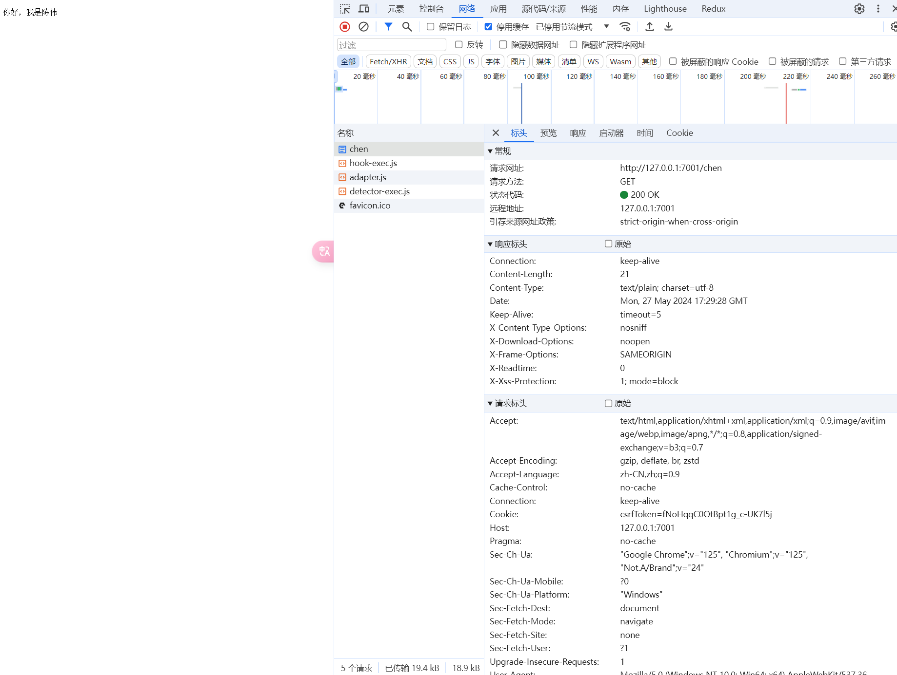

# 控制器与单元测试

::: danger 介绍
😍 常规而言，控制器一般做三件事

1. RESTful controller
2. HTML URL HTML
3. 代理服务器（服务代理到别处，再将内容返回）

   :::

## 添加一个控制器模块

写一个正常接口与一个异步接口

```js
// code\egg\app\controller\chen.js
const { Controller } = require('egg')

class ChenController extends Controller {
  async index() {
    const { ctx } = this
    ctx.body = '你好，我是陈伟'
  }

  async chenTest() {
    const { ctx } = this
    await new Promise(resolve => {
      setTimeout(() => {
        resolve((ctx.body = 'chenTest'))
      }, 5000)
    })
  }
}

module.exports = ChenController
```

写完了以后要去配置路由

```js {9-11}
/**
 * @param {Egg.Application} app - egg application
 */
module.exports = app => {
  const { router, controller } = app
  router.get('/', controller.home.index)
  router.get('/chenWei', controller.home.chenWei)

  // 新增的控制器
  router.get('/chen', controller.chen.index)
  router.get('/test', controller.chen.chenTest)
}
```

然后请求，就会返回



## 单元测试

跑单元测试的时候一定要将 dev 服务关闭，否则会打印超长一段

```js
// code\egg\test\app\controller\chen.test.js

const { app } = require('egg-mock/bootstrap')

describe('chen - index', () => {
  it('chen index page', () => {
    return app.httpRequest().get('/chen').expect(200).expect('你好，我是陈伟')
  })

  // 异步单元测试其实就是多了一个 async
  it('chen test', async () => {
    return app.httpRequest().get('/test').expect(200).expect('chenTest')
  })
})

// 做测试的时候要关闭服务
```

单元测试通过：

```bash
chen - index
  ✔ chen index page
  ✔ chen test (5013ms)

test/app/controller/home.test.js
  ✔ should assert
  ✔ should typings exists
  ✔ should GET /

5 passing (8s)
```
