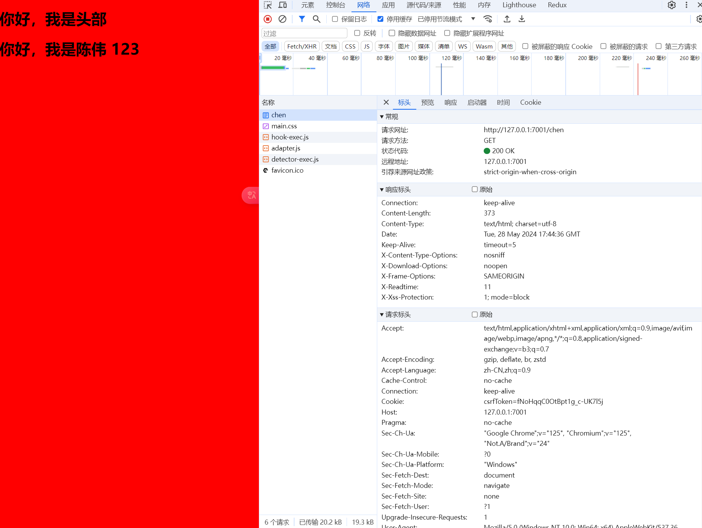

# 服务端渲染

::: danger
😍 这里介绍的是 egg-view-ejs

在官方仓库搜索这个库就可以了 [ejs](https://github.com/eggjs/egg-view-ejs)

[官方仓库](https://github.com/eggjs)
:::

## 安装配置与使用

```js
npm i egg-view-ejs --save
```

配置

```js
// {app_root}/config/plugin.js
exports.ejs = {
  enable: true,
  package: 'egg-view-ejs',
}

// {app_root}/config/config.default.js
exports.view = {
  mapping: {
    '.ejs': 'ejs',
  },
}
```

使用，注意一定要使用 await

```js {8-10}
// code\egg\app\controller\chen.js

const { Controller } = require('egg')

class ChenController extends Controller {
  async index() {
    const { ctx } = this
    // ctx.body = '你好，我是陈伟'

    await ctx.render('chen.html', {
      id: 123,
    })
  }

  async chenTest() {
    const { ctx } = this
    await new Promise(resolve => {
      setTimeout(() => {
        resolve((ctx.body = 'chenTest'))
      }, 5000)
    })
  }

  // 自由传参模式
  async testQuery() {
    const { ctx } = this
    // ctx.body = ctx.query
    const res = await ctx.service.chen.getChen('123') // ctx.service.文件名.class里面的方法
    ctx.body = res
  }

  // 严格传参模式
  async testParams() {
    const { ctx } = this
    ctx.body = `你好，${ctx.params.name}, 你今年 ${ctx.params.age} 岁吗`
  }

  async testPost() {
    const { ctx } = this
    ctx.body = {
      status: 200,
      data: ctx.request.body,
    }
  }
}

module.exports = ChenController
```

html 文件的配置

::: code-group

```html [chen.html]
<!-- code\egg\app\view\chen.html -->

<!DOCTYPE html>
<html lang="en">
  <head>
    <meta charset="UTF-8" />
    <meta name="viewport" content="width=device-width, initial-scale=1.0" />
    <link rel="stylesheet" href="main.css" />
    <title>Document</title>
  </head>
  <body>
    <!-- 引用别的 html 文件 -->
    <%- include ('header.html')%>
    <h1>你好，我是陈伟 <%= id%></h1>
  </body>
</html>
```

```html [header.html]
<h1>你好，我是头部</h1>
```

```css [main.css]
body {
  background-color: red;
}
```

:::

```bash
my-project/
├── public/
│ ├── index.html
│ ├── main.css
│ ├── header.html
│ └── subpage/
│ ├── index.html
│ └── main.css
```

::: danger 提示
在 HTML 文件中引用的相对路径资源（如 CSS 文件）是相对于 HTML 文件本身的路径

假设有如下路径：

当你访问 `http://localhost:8080/index.html` 时，浏览器会请求 `http://localhost:8080/main.css`

当你访问 `http://localhost:8080/subpage/index.html` 时，浏览器会请求 `http://localhost:8080/subpage/main.css`
:::

浏览器访问： `http://127.0.0.1:7001/chen`，显示：


