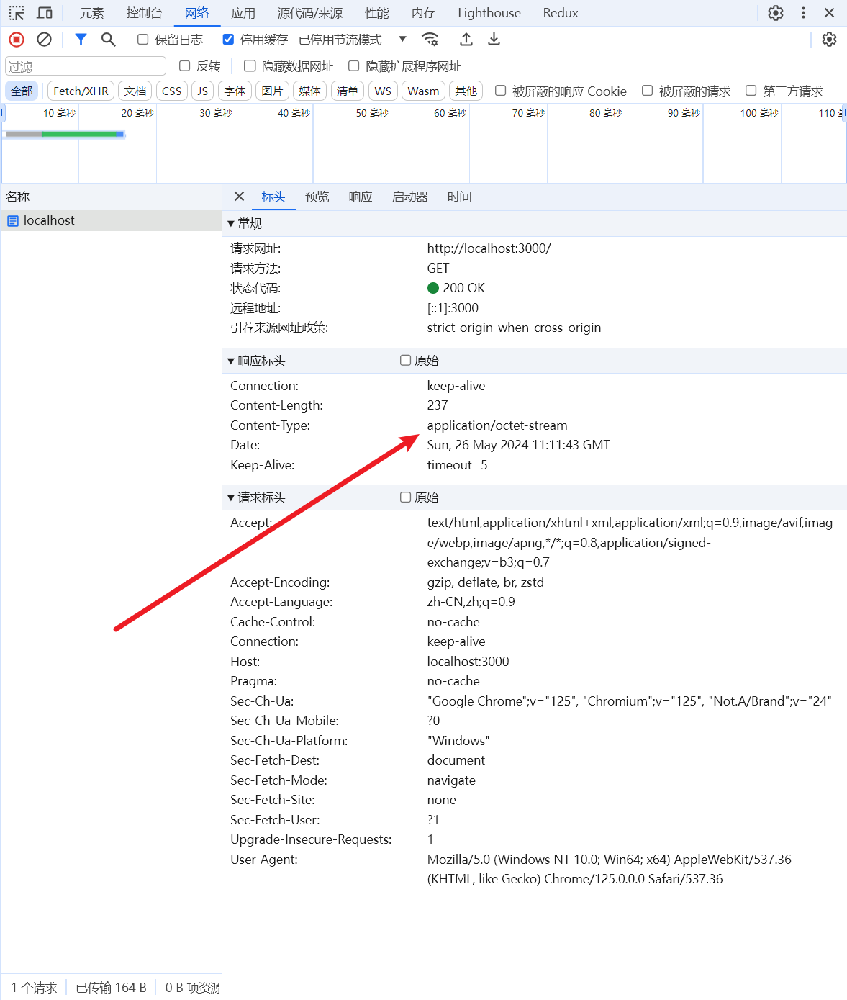
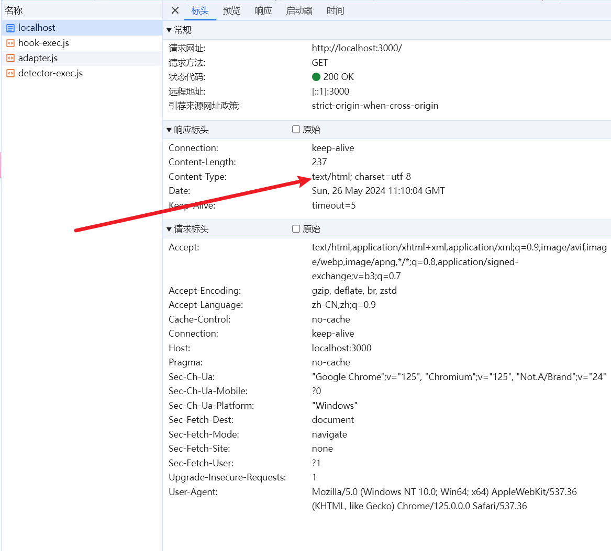

# 中间件

::: danger 涉及到的插件
😋 中间件合并插件：[koa-compose](https://github.com/koajs/compose)

> 作用：多个中间件合并称为同一个

:::

::: info

执行栈结构：

1.  多个中间件会形成一个栈结构，以先进后出的顺序执行
2.  最外层的中间件首先执行
3.  调用 next 函数，把执行权交给下一个中间件
4.  最内层的中间件最后执行
5.  执行结束后，把执行权交回上一层的中间件
6.  最外层的中间件收回执行权之后，执行 next 函数后面的代码

:::

## 执行流程

**同步执行**

> 理解洋葱模型

```js
/**
 *  - Koa 基础学习
 *
 *  - 中间件
 */
const Koa = require('koa')
const app = new Koa()

const one = (ctx, next) => {
  console.log('1 -- one')
  next() // 如果注释掉这里的 next 不会进入到后面的中间件，控制台也只会打印： 1 2 one
  console.log('2 -- one')
}

const two = (ctx, next) => {
  console.log('1 -- two')
  next()
  console.log('2 -- two')
}

const three = (ctx, next) => {
  console.log('1 -- three')
  next()
  console.log('2 -- three')
}

app.use(one).use(two).use(three)

app.listen(3000, () => {
  console.log('http://localhost:3000')
})

/* 
执行结果：
  1 -- one
  1 -- two
  1 -- three
  2 -- three
  2 -- two
  2 -- one
*/
```

**异步执行**

```js
/**
 *  - Koa 基础学习
 *
 *  - 中间件
 */
const Koa = require('koa')
const fs = require('fs')
const utils = require('util')
const app = new Koa()

app.use(async (ctx, next) => {
  const data = await utils.promisify(fs.readFile)('./views/index.html')
  ctx.type = 'html' // 不写这一行，浏览器会当做下载内容
  ctx.body = data
  next()
})

const one = (ctx, next) => {
  console.log('1 -- one')
  next() // 如果注释掉这里的 next 不会进入到后面的中间件，控制台也只会打印： 1 2 one
  console.log('2 -- one')
}

const two = (ctx, next) => {
  console.log('1 -- two')
  next()
  console.log('2 -- two')
}

const three = (ctx, next) => {
  console.log('1 -- three')
  next()
  console.log('2 -- three')
}

app.use(one).use(two).use(three)

app.listen(3000, () => {
  console.log('http://localhost:3000')
})

/* 
执行结果：
  1 -- one
  1 -- two
  1 -- three
  2 -- three
  2 -- two
  2 -- one
*/
```

以上内容中，如果不设置 ctx.type 就会触发下载，默认为二进制数据



当加上了`type = 'html'` 以后，浏览器检测到是这个格式就会进行渲染，而不会触发下载操作



## 中间件的合并

> 功能类似于 express 中 [] 里面放多个中间件

```js
/**
 *  - Koa 基础学习
 *
 *  - 中间件 - compose
 */
const Koa = require('koa')
const compose = require('koa-compose')
const app = new Koa()

const a1 = (ctx, next) => {
  console.log('a1')
  next()
}

const a2 = (ctx, next) => {
  console.log('a2')
  next()
}

const a3 = (ctx, next) => {
  console.log('a3')
  next()
}

app.use(compose([a1, a2, a3]))

app.listen(3000, () => {
  console.log('http://localhost:3000')
})

/* 
控制台打印：

  a1
  a2
  a3

*/
```
