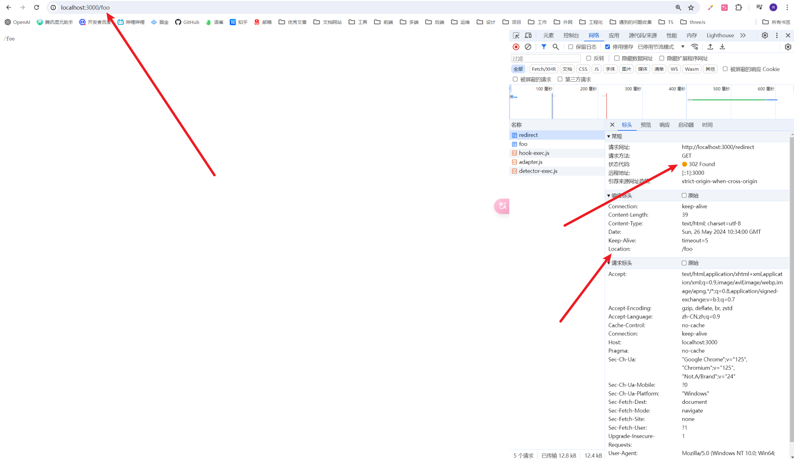

# 重定向

::: info
访问请求 A 的时候会重定向到 B 请求
:::

以下代码，当在浏览器地址栏输入： http://localhost:3000/redirect

会返回 302，并且 location 到 /foo



foo 里面的请求一切就正常了

```js
/**
 *  - Koa 基础学习
 *
 *  - 静态资源托管
 */
const Koa = require('koa')
const Router = require('@koa/router')

const app = new Koa()
const router = new Router()

router.get('/foo', ctx => (ctx.body = '/foo'))

router.get('/redirect', ctx => ctx.redirect('/foo'))

app.use(router.routes()).use(router.allowedMethods())

app.listen(3000, () => {
  console.log('http://localhost:3000')
})
```
