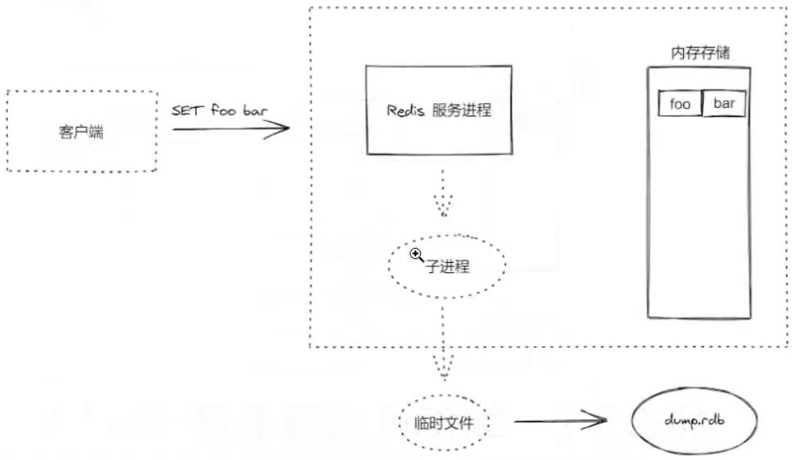

# 持久化

redis 的强劲很大程度上是由于将其所有数据都存在内存中，然而当 redis 重启或宕机后，所有存储在内存中的数据就会丢失，在某些情况下，希望 redis 重启后能保证数据不丢失

这是希望 redis 能将数据从内存中以某种形式同步到硬盘中，使得重启后可以根据硬盘中的记录恢复数据，这一过程就是持久化

两种持久化方案：

- RDB 持久化：根据指定的规则“定时”将内存中的数据存储在硬盘上，在重启之后读取硬盘上的 .rdb 快照文件将数据恢复到内存中
- AOF 持久化：AOF 持久化记录服务器执行的所有操作写命令形成 .AOF 日志文件保存到硬盘中，并在服务器启动时，通过重新执行这些命令来还原数据库

## RDB

RDB 方式的持久化是通过快照完成的，当符合一定条件时 redis 会自动将内存中的所有数据生成一份副本并存储在硬盘上，这个过程即为快照

redis 允许用户自定义快照条件，当符合快照条件时，redis 会自动执行快照操作。

进行快照的条件可以由用户在配置文件中自定义，由两个参数构成：时间窗口 M 和改动的键的个数 N

每当时间 M 内被更改的键个数大于 N 时，即符合自动快照条件

**配置规则如下：**

::: code-group

```conf [语法]
save 900 1 ;每900秒至少有一个key变化了，则写入快照

save 300 10 ;每300秒至少有10个key变化了，则写入快照

save 60 10000 ;每60秒有10000个key变化了，则写入快照

dbfilename dump.rdb ;快照保存的文件名称

dir ./ ;快照文件保存路径
```

```bash [示例]
[chenwei@VIVIICHEN-MC0 redis]$ cat 6379.conf
port 6379
daemonize yes
save 90 1

dbfilename dump.rdb
dir ./pkg

[chenwei@VIVIICHEN-MC0 redis]$ ps -ef | grep -i redis
  501 74794     1   0  3:49PM ??         0:05.13 redis-server *:6379
  501 80318 40545   0  4:01PM ttys000    0:00.00 grep -i redis
[chenwei@VIVIICHEN-MC0 redis]$ kill -9 74794

[chenwei@VIVIICHEN-MC0 redis]$ redis-server 6379.conf
[chenwei@VIVIICHEN-MC0 redis]$ ls pkg
[chenwei@VIVIICHEN-MC0 redis]$ redis-cli
127.0.0.1:6379> SET chen wei
OK
127.0.0.1:6379> GET chen
"wei"
127.0.0.1:6379> exit

[chenwei@VIVIICHEN-MC0 redis]$ ls pkg
dump.rdb
[chenwei@VIVIICHEN-MC0 redis]$ pwd
/etc/redis
```

```bash [重启验证]
# 之前重启server会发现存储在缓存的数据不在了，现在因为持久化处理，所以数据还在

[chenwei@VIVIICHEN-MC0 redis]$ redis-cli
127.0.0.1:6379> KEYS *
1) "chen"
127.0.0.1:6379> exit
[chenwei@VIVIICHEN-MC0 redis]$ ps -ef | grep -i redis
  501 80454     1   0  4:01PM ??         0:03.44 redis-server *:6379
  501 85162 40545   0  4:11PM ttys000    0:00.00 grep -i redis
[chenwei@VIVIICHEN-MC0 redis]$ kill -9 80454
[chenwei@VIVIICHEN-MC0 redis]$ redis-server 6379.conf
[chenwei@VIVIICHEN-MC0 redis]$ redis-cli
127.0.0.1:6379> KEYS *
1) "chen"
127.0.0.1:6379>
```

:::

::: details 遇到的一个权限问题
当前 macos 是 chenwei 身份登陆安装的 redis，因此 redis 拥有的是用户权限，sudo 创建 pkg 文件，写权限是 root 才有的

需要 sudo chmod -R 770 pkg 才能拥有读写能力，否则这个持久文件不会写入

```bash
[chenwei@VIVIICHEN-MC0 redis]$ ls -ld pkg
drwxrwxrwx  3 root  wheel  96 Jun 21 16:03 pkg
```

:::

redis 快照的运行方式是异步进行的，在保存快照期间依然能提供客户端请求



1. redis 调用 fork() 创建一个紫进程
2. 使用子进程将数据集写入到一个临时 RDB 文件中
3. 当子进程完成对新 RDB 文件的写入时，redis 用新 RDB 文件替换原来的文件

## AOF 持久化

快照功能并不是非常持久（durable）：

如果 redis 因为某些原因而造成故障停机，那么服务器将丢失最近写入、且仍未保存到快照中的那些数据

对于追求完全持久化（full durability）的要求来说，快照功能就不太适用了

AOF 将 redis 执行的每一条写命令操作日志存储到硬盘文件中，这一过程显然会降低 redis 性能，但是大部分情况下这个影响是可以接受的，另外较快的硬盘可以提供 AOF 性能

AOF 机制对于日志的写入操作采用的是 append 模式，就是追加模式，因此在写入过程中如果出现宕机问题，也不会破坏已经写入的日志

默认情况下，redis 没有开启 AOF 方式的持久化，可以通过 appendonly 参数启动

```conf
appendonly yes
```

AOF 文件的保存位置和 RDB 文件的位置相同，都是 dir 参数设置的，默认的文件名是：appendonly.aof,修改：

```conf
appendfilename "xxx.aof"
```

AOF 有三种同步策略

```bash
# 修改同步，每一次发送数据变化都会被立即同步到磁盘中，效率比较低，但是数据安全
appendfsync always

# 默认值，每秒同步，异步完成，同步效率非常高，缺点是一旦系统宕机，这一秒内操作的数据就会丢失
appendfsync everysec

# 不同步
appendfsync no
```

::: warning
一般而言 everysec 就够了，既兼顾了性能又保证了安全
:::

**示例**

```bash
[chenwei@VIVIICHEN-MC0 redis]$ cat 6379.conf
port 6379
daemonize yes
save 90 1

dbfilename dump.rdb
dir ./pkg

appendonly yes
appendfilename "chen.aof"
appendfsync everysec

[chenwei@VIVIICHEN-MC0 redis]$ ps -ef | grep -i redis
  501 85285     1   0  4:11PM ??         0:10.63 redis-server *:6379
  501 98873 40545   0  4:39PM ttys000    0:00.01 grep -i redis
[chenwei@VIVIICHEN-MC0 redis]$ kill -9 85285
[chenwei@VIVIICHEN-MC0 redis]$ redis-server 6379.conf
[chenwei@VIVIICHEN-MC0 redis]$ redis-cli
127.0.0.1:6379> KEYS *
(empty array)
127.0.0.1:6379> SET chen wei
OK
127.0.0.1:6379> exit

[chenwei@VIVIICHEN-MC0 redis]$ ls pkg
chen.aof        dump.rdb

[chenwei@VIVIICHEN-MC0 redis]$ ps -ef | grep -i redis
  501 99021     1   0  4:39PM ??         0:00.54 redis-server *:6379
  501   734 40545   0  4:41PM ttys000    0:00.01 grep -i redis

[chenwei@VIVIICHEN-MC0 redis]$ kill -9 99021
[chenwei@VIVIICHEN-MC0 redis]$ redis-server 6379.conf
[chenwei@VIVIICHEN-MC0 redis]$ redis-cli
127.0.0.1:6379> keys *
1) "chen"
```

## 两者对比

| 方式 | 优点                                                | 缺点                                                                        |
| :--- | --------------------------------------------------- | --------------------------------------------------------------------------- |
| RDB  | 文件小，异步数据，性能好，恢复大数据集速度比 AOF 块 | 数据安全性低，容易丢失数据。数据量比较大时备份速度慢                        |
| AOF  | 数据安全性高，有利于开发分析                        | 相同数据集比 RDB 文件大，根据所使用的 FSYNC 策略，AOF 速度可能会慢于 RDB ｜ |

一般来说，如果想达到足以媲美关系性数据库的安全性，应该同时使用两种持久化功能
